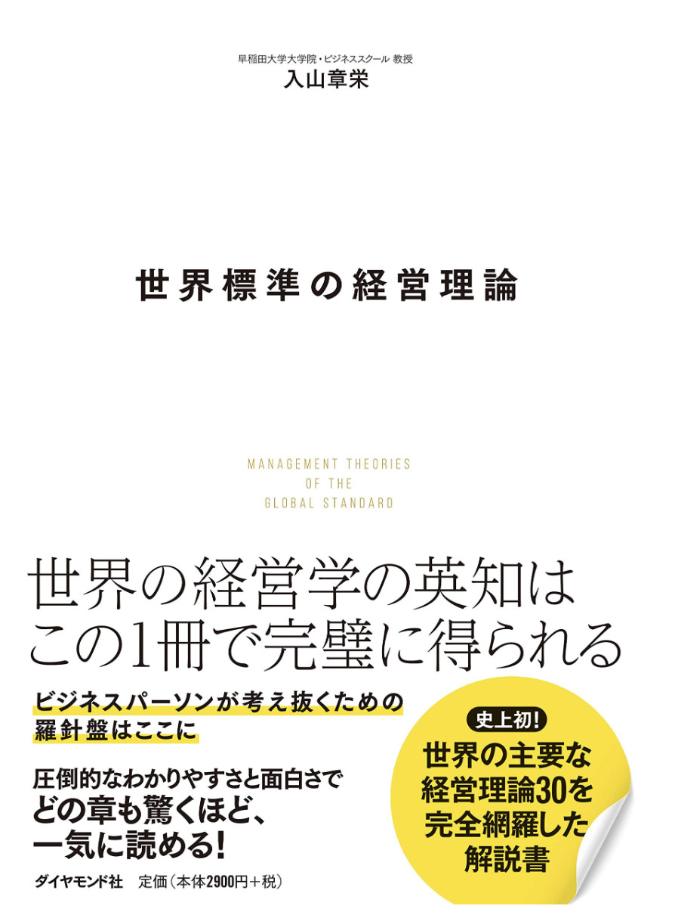

+++
author = "girigiribauer"
draft = false
date = "2020-01-30T02:57:31+09:00"
title = "読書メモ: 世界標準の経営理論 - 第1章 SCP理論"
+++
最近、技術系以外の書籍を多く読むようになって、一応業務日誌的なものをメモったりする中に、非技術系の書籍の読書メモなどを書いてはいるのですが、
「うーん、これって業務日誌に書くことか・・・？普通にアウトプットしちゃえばいいのでは？？」
と思うことが昨年から多々あれど、このブログにそういうスペースが元々ありませんでした。

2020年になって個人ブログの整理を少し行い、 [Biz](https://girigiribauer.com/biz/) のカテゴリーを新たに新設しました。

これから経営・ビジネス系のあれこれも、気軽にアウトプットしていこうと思った次第です。

ちなみに、私はそこそこ最近まで経済と経営の違いすら分かっていなかったポンコツです。
経営については完全にど素人と言っても差し支えないレベルで、恥を忍んでじゃないですが、
分からないなりにきちんと読んでまとめてアウトプットして、理解を深めていこうと思います。

もしよろしければ **「ここの理解少し間違ってるよ」などあれば、どしどしご指摘いただければと思います。**
よろしくお願いします。

## 世界標準の経営理論（著: 入山章栄）

2020年に最初に買った本です。

超分厚かったんですけど、もともとこの著者の方が WBS （ワールドビジネスサテライト）に出演されていて、
いつも解説分かりやすいなあと思いながら見てたので、書店で見かけたときは思わず手にとってしまいました。

### 超分厚い・・・

800ページ以上あるっぽいです。

目次の手前にも少し書いてあるように、たぶんこれ経営学とか大学がそっちの専攻の方にとって、教科書として使えるような書籍なんですよね。
いわゆる経営学の専門書、とでもいうのでしょうか？

普段は技術系の書籍しか買わないので、技術系の書籍の相場はわかるのですが、
だいたい3,000円〜4,000円程度が多いのではないかと思います。

それに比べると、この分厚さで専門書なのに、税抜2,900円で売っていたので、
「もしかしてこれはコスパ高いやつなのでは・・・？」と思い、それも手にとってしまった理由です。
（たぶんこのページ数の技術書だと、4,000円オーバーするレベルですよね）

### 章ごとに読める形式になってるっぽい

とりあえず今回は第1章を読みました。

章ごとにどこからでも読める形になっているようなので、気が向いた時にでも1章ずつ読んでいこうと思っています。

## 『第1章 SCP理論』の概要

第1章はまとめるとこんな感じの内容でした。

- SCP とは Structure Conduct Perform の略で、 **その業界が構造的に儲かるかどうかを体系化** したもの
- **完全競争** となる3つの条件を満たすと全く儲からない
    1. 市場に無数の小さな企業がいて、どの企業も市場価格に影響を与えられない
    1. 参入（撤退）コストがない
    1. 製品・サービスの質が他社と同質で、差別化されていない
- 逆に3つの条件の真逆を満たすと **完全独占** となる、多くの国では法律（独占禁止法など）で禁止されているが、独占に近い産業は存在する
- 自分の業界が、 **完全競争と完全独占の間のどのあたりにあるかを知ることは重要**

ちゃんと経営知らない前提で書いてくれてて、読んでる方も分かりやすくてありがたい・・・！

## その業界が構造的に儲かるかどうか

業界によって上記の3つの条件は様々なので、それにより構造的に儲かるかどうかが決まってくるらしい。

この条件に当てはまってしまう代表例として、アメリカの国内線航空事業が例に挙げられていたが、

- いまでも100以上の航空会社がひしめき合って競争
- 企業の参入が相次いだ
- ビジネスモデルの抜本的な差別化が難しい

といったように、概ね当てはまってしまうと **完全競争** の状態に近くなり、
利益率が慢性的に低くなる、という流れ。

この辺は自分の業界や、これから関わろうとしている会社の業界がどうなっているかを、この条件を元に見ていくのも面白いかなと思ったり。

## プラットフォーマーは概ね完全独占に近い

上記3つの条件に当てはまらない、その逆に当てはまるのがプラットフォーマーで、

- それぞれの分野で独占的な地位がある
- ネットワーク効果により、他に多くの人が使えば使うほど、自身もそれを使う効果が高まる

などにより **完全独占** の状態に近くなってしまう。

いかにして独占に近づけているかなどを分かりやすく説明されていて、「なるほど、独占強い・・・」と思いながら読み進めたのでした。

## その他

他にもいろいろ興味深い話題が書いてあります。見出しだけ。

- 寡占はなぜ儲かるのか
- ベインの参入障壁の視点
- ケイブスとポーターの「企業グループ」の視点
    - 自動車メーカーでもラグジュアリー車と大衆車で違う、とか

詳しくは読んでみたらいいと思います。 https://www.amazon.co.jp/gp/product/4478109575

## まとめ

- 構造的に儲かる業界・儲からない業界がある
- 完全競争・完全独占の間で、その業界がどの辺にあるかを知る

また少しずつ読み進めていって、気が向いたら記事にまとめようと思います。

余談ですけど、第1章は一定分かりやすかったんですが、その手前の序章はすごく難しかった感あるんですよねw
あれは経営学専攻の大学生向けのあれこれだったんだろうか。
