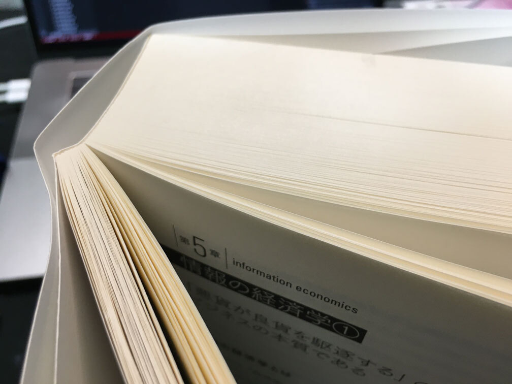

+++
title = "読書メモ: 世界標準の経営理論 - 第5章 情報の経済学1"
date = "2020-02-07T00:00:00+0900"
draft = false
+++
前回の [読書メモ: 世界標準の経営理論 - 第4章 SCP対RBV、および競争の型](/biz/20200206/) の続きを読んでいきます。

この本、章単位で重くなくさくっと読めるので、
その分野の素人でも楽しく読み進められています。

ただ、やはり買うときにも思ったんですけど、
かなり分厚いです・・・。

今この辺です・・・。

今まで触れてこなかった分野で、必ず毎日読まないといけないものでもないので、
気軽に不定期で読んでいこうと思います。
**「ここの理解少し間違ってるよ」などあれば、どしどしご指摘いただければと思います。**

## 『第5章 情報の経済学1』の概要

第5章はまとめるとこんな感じの内容でした。

- 『ある企業の製品・サービスの完全な情報を、顧客・同業他社が持っている』は、 **完備情報** と呼ばれ、完全競争に近づく5つ目の条件
    - 例: 値段やスペックがすべて分かっている2つのテレビを比較するケース
    - 完全競争に近づくので、価格競争に陥りやすい
- **アドバース・セレクション（逆淘汰）** によって起きる問題
    - アカロフのレモン市場を例にした、悪貨が良貨を駆逐する的な話
    - アドバース・セレクションへの対処法、 **スクリーニング** と **シグナリング**
- **情報の非対称性をうまく活用する** という話

## 完備情報とは

完全競争に近づく条件が順に増えていってる感があるので（実際には第1章で全部触れつつ、3つに着目しただけっぽかったのだが）、
ここで改めてまとめてみます。

1. 市場に無数の小さな企業がいて、どの企業も市場価格に影響を与えられない
1. 参入（撤退）コストがない
1. 製品・サービスの質が他社と同質で、差別化されていない
1. 経営資源（リソース）が他企業にコストなく移動できる
1. **ある企業の製品・サービスの完全な情報を、顧客・同業他社が持っている**

完全競争になる条件は全部でこの5つあって（第1章で上3つ、第3章で4番目を触れたのでした）、
この5つ目の条件、完備情報も大事だよって話です。

## アドバース・セレクション (adverse selection) とは

上の5つ目の条件である、完備情報を崩す方向に持っていくと、よろしくないことが起きるよの例として、
アカロフのレモン市場という具体例が紹介されています。

ちなみにアカロフさんが論文で紹介した、中古車市場に関する例えで、英語でレモンの俗称が中古車らしく、実際はレモンの話ではなく中古車市場の話です。

- 中古車は、その正確な品質情報が買う側に分からない
- 中古車ディーラーの営業マンは、その中古車の本当の価値を知っている
- つまり **売り手だけが特定の情報を持っている** ケース

これらの前提で考えていきます。
ちなみに一方だけが特定の情報を持つケースを **情報の非対称性** と呼んでいます。

以下、時系列で紹介します。

1. 売り手（の片方）が虚偽表示する
1. 売り手が値下げする
1. 虚偽表示した売り手だけが残る

### 売り手（の片方）が虚偽表示する

正直な営業マンは150万円のものをそのまま売り、
嘘つき営業マンは100万円のものを150万円で高く売り付けようとします。

- 正直な営業マン
    - 中古車の本当の価値: 150万円
    - 実際の売値: 150万円
- 嘘つき営業マン
    - 中古車の本当の価値: **100万円**
    - 実際の売値: **150万円**

### 売り手が値下げする

買い手の値下げ要求により、それぞれ150万円を120万円に値下げするのですが、
正直な営業マンは赤字となってしまいます。
一方で嘘つき営業マンは元々100万円だったので、120万円に値下げしてもまだまだやっていけます。

- 正直な営業マン
    - 120万円まで値下げしたら赤字（実際150万円）
- 嘘つき営業マン
    - 120万円まで値下げしても黒字（本当は100万円）

### 虚偽表示した売り手だけが残る

正直な営業マンは赤字となってしまうのを避けるため撤退してしまいます。
嘘つき営業マンはまだ黒字なので売り続けます。

- 正直な営業マン
    - 撤退しちゃう
- 嘘つき営業マン
    - 嘘ついたのでまだ黒字、売り続ける

・・・このような流れで、質の悪い車を虚偽表示する売り手だけが残りがちになっちゃうよ、という具体事例です。

このため、完全競争を崩そうとして先ほどの条件5を崩す、
つまりは『みんなが同じ情報を知っている』から『片方だけが情報を知っている』に持ってきてしまうと、
**嘘つきが得をする方にインセンティブが働いてしまい、このような逆淘汰が起きてしまう** という話、
これが **アドバース・セレクション** です。

買い手に取っては『 **悪貨が良貨を駆逐する** 』状態になって、高かろう悪かろうの最悪な状態になってしまいますし、
売り手にとっても『 **正直者が馬鹿を見る** 』的な話になってしまい、 **結果多くの人が不利益を被ってしまいます。**

### アドバース・セレクションの具体例

4つほど例が紹介されてます。

- 就職市場
- 保険など、買い手が私的情報を持つ場合
- 融資・投資
- 企業買収 (M&A)

あー、これはだいたい想像つきますねw 詳しくは書籍読んでみてくださいw

### アドバース・セレクションをどのように解消するか？

私的情報を持たない方の対処法として、 **スクリーニング** という理論の話と、
私的情報を持つ方の対処法として、 **シグナリング** の話がそれぞれ紹介されてます。

それぞれ端的にまとめると以下のような感じです。

#### スクリーニング

- 顧客（買い手）に選択肢を与えることで、顧客側が持っている私的情報を元に、勝手に適切な方を選ぶ
    - 例: 複数種類の商品を掲示する
    - 例: クーポン券を提供する
- 特定の情報を持っている人を相手にする側、私的情報を持っていない側に有効なメカニズム

クーポンの例では、少しでも安く食べたい層と、クーポンなど気にせずにハンバーガー食べたい層がいるものの、
売り手からはその情報は分からない。
だったら両方の選択肢（クーポン使ってもいいし使わなくてもいい）を提供すればいいんじゃない？というものですね。

ちなみに経営学の範疇ではあまり応用が進んでないとのこと。

#### シグナリング

- 伝わりにくい自分の情報の代わりに、分かりやすく顕在化したシグナルを外部に送る
    - 例: 外部認証（ ISO 取得など）
    - 例: スタートアップの企業がベンチャーキャピタルの企業から投資をしてもらうことで安心材料になる
- 特定の情報を持った人自体を対象とした、私的情報を持っている側に有効なメカニズム

シグナルによって私的情報の裏付けを行うことで、「ああ、この人の持ってる情報は確かだな」と判断できたりする的な話ですね。

## 情報の非対称性は必ずしも悪ではない話

アドバース・セレクションは情報の非対称性によって逆淘汰が起こってしまう良くない例ですが、
情報の非対称性が必ずしも悪ではないよ、むしろチャンスもあるよ、という話も併せて紹介されています。

日本電産の永守さんという方の、企業買収の事例が紹介されているのですが、
規模が小さくて業績も悪い会社であっても、実際に現場に行って社風などの外から見えない情報（上でいう私的情報）を掴み、
本当の価値を見抜いて企業買収を次々と成功させてきたそうです。

## まとめ

- アドバース・セレクションこわい
- 情報の非対称性はチャンスにもなりうるので活用できるといいよね

アドバース・セレクション、怖いですねー。得してるのが嘘つきの売り手だけってのがダメですねー。

この章、他と比べても面白かったなあ。

ちなみに上の流れで紹介してないのですが、メルカリもこのアドバース・セレクションを解消する仕組みがうまいこと導入されてますよねーみたいな話が紹介されていて、
売る側買う側が互いに評価し合うことで情報の非対称性を解消していて、
ネット技術を使って如何にアドバース・セレクションを解消していくかが成功のカギなんじゃないの？って話が書かれています。
詳しくは自分で読んでね。

## 参考 URL {#refs}

- https://www.amazon.co.jp/gp/product/4478109575
