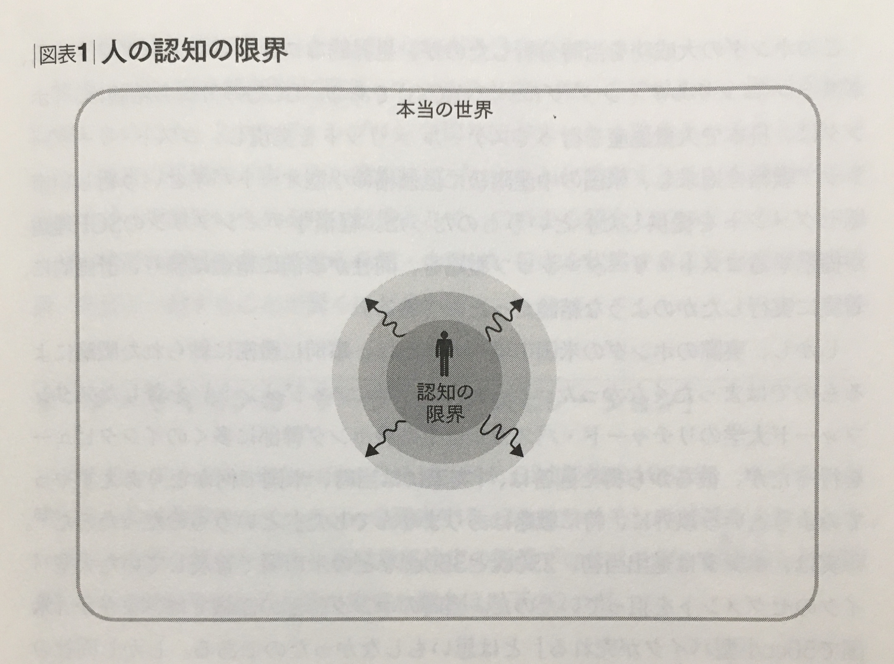

+++
title = "読書メモ: 世界標準の経営理論 - 第11章 カーネギー学派の企業行動理論（BTF）"
date = "2020-02-15T00:00:00+0900"
draft = false
+++
前回の [読書メモ: 世界標準の経営理論 - 第10章 リアル・オプション理論](/biz/20200213/) の続きを読んでいきます。

第1部が前回までで終了したのですが、その一番最後に
**次の第2部では、『組織学習』『知識経営』『イノベーション』等の本質に切り込む** と書いてありました。

これはちょっと楽しみかもしれませんね。

本章にて読み進めていく中で、途中に出てきたこの図、めっちゃ好きです。

同じように1章ずつ読み進めていくので、
**「ここの理解少し間違ってるよ」などあれば、どしどしご指摘いただければと思います。**

## 『第11章 カーネギー学派の企業行動理論（BTF）』の概要

第11章はまとめるとこんな感じの内容でした。

- 意思決定の特性を以下の前提で考えていく
    - 合理的だが **人の認知には限界があり、行動すると認知できる範囲が広がり** 、さらに行動の幅が広がる
- **企業行動理論（Behavioral Theory of Firm: BTF）** とは、 **組織意思決定の循環プロセスモデル** のこと
    - **サーチ**
        - 自身の認知の範囲を広げ、新たな選択肢を探す行動
        - 自分の認知は狭く、この世にはもっと自分を満足させてくれる選択肢があるのでは？と探す
    - **アスピレーション** （目線、目標）
        - 自社を評価する基準、目線の高さ
        - 周りにできる人が多かったりすると、自分ももっとやれるはずと考えて目線が高くなるなど
    - **企業は現状に満足してしまうほど、サーチしない方が合理的と考え停滞してしまう**
        - 一見精神論のような『目線の高さ』も、循環プロセスとして説明できちゃう
        - 著名経営者の教訓にも通ずるところがある

## 認知心理学の視点

タイトルに『カーネギー学派』とあるのですが、もちろん僕は全然知りません。

どうやら人間、認知は無限に可能じゃないっぽいぞ？ってところから、
以下の限定された合理性を前提にして考えようぜ、って集まりの人たちらしいです。

- 合理性
    - 与えられた条件下で自身にとって最適な選択肢を求める
- 認知の限界性
    - **人の認知には限界がある** 、選択肢が100あっても10くらいしか認知できないなど
- サティスファイシング（満足すること）
    - 最大化ではないが、とりあえず認知できる範囲で満足できるものを選ぶ
- プロセスの重視
    - **行動すると認知できる範囲が広がる**
    - 新しい選択肢が見えてきて、そちらが今より満足できるなら移る

## 意思決定の循環プロセス

**企業行動理論（Behavioral Theory of Firm: BTF）** とは、 **組織意思決定の循環プロセスモデル** のことで、
ざっくり言ってしまうと、認知には限界があるので、その中で満足できる選択肢を選んで、認知を広げて、
また同じように満足できる選択肢を選ぶのをサイクル回そうぜ、みたいな感じですかね。

ここではその循環プロセスで重要な概念が2つ紹介されています。

### サーチ

自分の認知は限界があり狭いので、
この世にはもっと自分を満足させてくれる選択肢があるのでは？と考えて探しにいく行為です。

これ自体はどうやら掘り下げ甲斐があるようなので、別の章でたっぷり紹介されているようです。
ここでは概念だけ把握しておきます。

### アスピレーション（目線、目標）

目の前の目標、といってもいいかもしれません。

経営学では、アスピレーションは以下から計算されることが多いとされています。

- 企業の過去の業績の加重平均
- 同業他社の平均業績

確かにこれらがよければ、自分は自社はもっとできるはず、って考えますね。

### 循環プロセスから、満足度が高まればサーチしなくなることが言える

満足度が低ければサーチする傾向がある、ということの逆として、
満足度が高まればサーチしなくなる、ということも循環プロセスの図から紹介されています。

- サーチ行動はコストも時間も認知的負担もかかる
- 現状に満足してしまうほど、サーチは行わない方が合理的と考えてしまう（限定された合理性から）
- つまりは **成功体験による慢心**

著名経営者の中にも、成功体験こそ最大のリスク、と言っている方は多く、
そういった教訓のようなものも、この企業行動理論から説明できるよ、と紹介されています。

また、循環プロセスの派生版みたいなものや、企業行動理論の中心的なものの紹介など、
著名経営者の言葉とともにいくつか紹介されていますが、
ここでは省略したいと思います。面白いのでご自身で読んでみるのも良いかと思います。

## まとめ

- 人間の認知には限界がある、それを前提とした企業行動理論で認知を広げていく
- アスピレーションを高く保つことでサーチ行動を促す

一見すると経営者が経験から学んだような言葉も、
ちゃんと認知心理学に基づいて経営学として理論で説明できているのが面白いなあと思います。

サイバーエージェントの藤田氏の例が挙げられていたのですが、
目線を上げるために、目線もパフォーマンスも自分より高い人たちと交流することで、
自身のアスピレーションを引き上げているのでは？と触れられています。

アスピレーションは『自分のパフォーマンスが他社よりも悪い』時に上がるので、
そういった状況を意識的に取り入れることで、自身のサーチ行動を促しているのかもしれません。なるほど。

周りの IT エンジニアさんもたまに言ってるんですけど、
会社の中で自分が一番できない状況に常に身を置け、みたいなことを話されている方もいらっしゃいますね。
これは決して精神論ではなく、自身のサーチ行動を広げるために仕組み化していった結果かもしれませんね。
