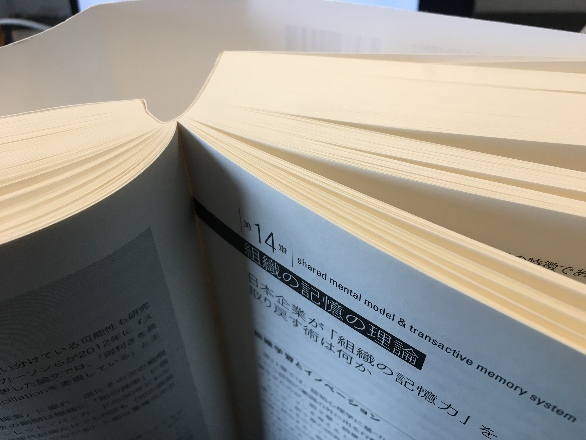

+++
title = "読書メモ: 世界標準の経営理論 - 第14章 組織の記憶の理論"
date = "2020-02-20T00:00:00+0900"
draft = false
+++
前回の [読書メモ: 世界標準の経営理論 - 第13章 知の探索・知の深化の理論2](/biz/20200219/) の続きを読んでいきます。

全体の1/3に近づきつつあるところまで読み進めてきたのですが、
現在の本の状態がこちらです。

まだまだ分厚いですね・・・。

とはいえ、作業の休憩がてら章単位で気軽に読めているので、まだまだ継続できそうです。

**「ここの理解少し間違ってるよ」などあれば、どしどしご指摘いただければと思います。**

## 『第14章 組織の記憶の理論』の概要

第14章はまとめるとこんな感じの内容でした。

- 第12章の組織学習の循環プロセスのうち、最後のサブプロセスの記憶に関する話（前章までは最初のプロセスのサーチの話）
- 組織の記憶プロセスは大きく2つある
    - **知の保存** 、大きく3つの手段がある
        - 個々の脳内で記憶
        - モノ・ツールに保存（文書やコンピュータなど）
        - 習慣に落とし込み、ルーティン（詳しくは16章）
    - **知の引き出し** 、効果的に引き出すための理論2つ
        - **シェアード・メンタル・モデル（SMM）**
        - **トランザクティブ・メモリー・システム（TMS）**
        - 要するに、知を引き出すための知なので、メタ知と呼ばれる
- シェアード・メンタル・モデル（SMM）とは、 **仕事に関するいろんな情報がをメンバー間で揃えるためのメタ知**
    - さらに **タスク SMM** と **チーム SMM** に分かれ、前者が **メンバー間の共通認識** 、後者が **メンバー同士の役割分担・強み弱みをお互い分かる的な認識**
- トランザクティブ・メモリー・システム（TMS）とは、 **組織内で『誰が何を知っているか？』を知っている、組織内の知の分布に関するメタ知**
    - TMS のような **誰が何を知っている的な情報は、少数個人で独占した方が効率的** 、これが俗にいう社内を歩き回るブラブラおじさん

## 組織の記憶プロセス

組織学習の循環プロセス、もう一度持ってきて貼り付けてしまいます。

- 組織学習は、循環プロセスとして以下の流れで説明される
    - サブプロセス1: **組織や人** が **行動** することで **経験** を得る
    - サブプロセス2: 得られた **経験** を通じて、新たな **知を獲得** する
    - サブプロセス3: 生み出された **知** は、 **組織・人** に **記憶** される

今回はこれのサブプロセス3に相当する記憶に関する話で、
そのプロセスには2つあるとされています。

- 知の保存
- 知の引き出し

まあ、これに関してはデータベースと同じで、 `insert` や `update` などで新たな情報を保存しつつ、
`select` などで既存の情報を問い合わせて（引き出して）使うのと大差ないですね。

また、保存についても個々で記憶したり、ツール使ったり、習慣に落とし込んだりと、概ね予想できるものです。
最後のルーティンに関しては別の掘り下げがあるようなので楽しみにしておきます。

知の引き出しについては、効果的に引き出すための理論が2つほどあるようです。

- シェアード・メンタル・モデル（SMM）
- トランザクティブ・メモリー・システム（TMS）

ちなみにこれらは、知を引き出すための知なので、メタ知（ metaknowledge ）と呼ばれるそうな。

##  シェアード・メンタル・モデル（SMM）とは

なんだかカタカナ続きでよく分からない感もなくはないですが、
チーム・メンタル・モデルとも呼ばれるそうです。

さらに、

- チーム内で、『作業の目的は何か？』『この基幹システムを使う手順は？』などの **行動・技術・設備などに関する共通認識を持っている（タスク SMM ）**
- チーム内で、『トラブルがあったら彼はこうして私はこうする』などの **役割分担に関する共通認識を持っている（チーム SMM ）**

と分けることができるとあります。

### 現場のオペレーションに関する事例

トヨタの生産方式に関する具体例が挙げられています。

この辺は概ね想像がつきますね。
チームとして自動車生産に関する考え方を全員に浸透させることで、
チームに所属するメンバー全員が、知の引き出しをスムーズに行えるようにする、ということですね。

### クリエイティブな現場での事例

IDEO 社に関する事例が紹介されています。

有名な7つのルールがあるのですが、ちなみに僕は初耳でした。

1. トピックに忠実であれ
2. ぶっ飛んでよし
3. すぐに判断・否定するなかれ
4. 会話は一人ずつ
5. 質より量を
6. 描け、視覚的であれ
7. 他者のアイデアに乗っかれ

このように、新しいアイデアを出すためのメンタルモデルに共通認識があるので、
チームとしてアイデアを出しやすくなっている面はありそうですね。

## トランザクティブ・メモリー・システム（TMS）とは

一方こちら、先ほどのメンバー間の共通認識とは異なる視点で、
**組織内で『誰が何を知っているか？』を知っている、組織内の知の分布に関するメタ知** のことを言っています。

人の認知には限界があるので、蓄積すべき知の総量が多くなってしまうと、
それを全員が把握しておくことは困難となってしまうので、
『誰が知っているか？』を把握するだけで、あとはその人に聞けばいいじゃん、と認知の負担を軽くしていく的な理論です。

筆者はこれのことを『知のインデックス・カード』と呼んでいるそうなんですが、すごく分かりやすくて良いですね。

この TMS を実現する、規定する条件として、以下の2つが挙げられてます。

- 専門性
- 正確性

これらを保つことができれば、組織内で分業することができ、それぞれ知の専門性が高められるよ、と紹介されてます。

確かに個人でやってるのと比較して、組織でやるメリットってそこが大きいですよね。
特定の分野の話で、この部分だったらこいつに聞けば間違いない、みたいなのって、
やはり組織じゃないと活かせない面も大きいんじゃないかなーと思う次第です。

### TMS の効果をより高める方法

他にも色々な話が紹介されているのですが（詳しくは各々で読んだらいいんですけども）、
『誰が何を知っているか？』という情報を、全員が互いに知っている必要があるの？どうなの？って話の紹介だけしておきます。

実際に組織が極端に大きくなると、全員が互いに何を知っているか？を把握するのは難しいです。

IBM の事例が併せて紹介されていて、
**少数の人に TMS を独占させて、その人に社内をグルグルと歩き回らせる方が、
全員に『誰が何を知っているか？』情報を頑張って浸透させるよりも効率的** だよ、というのが研究成果とともに紹介されてます。

なるほどー、これが『一見、何をしているかよくわからないブラブラおじさん』なのかあ。

ただ、最近は効率化の波でこういったおじさんは見かけなくなってるよ、とも紹介されてました。へー。

## まとめ

- 組織として知の引き出しが上手くされていないことが多い
- その際に SMM や TMS を思考の軸として使うと良い

僕個人の感想として、今までもこれからも大人数の組織にお世話になることはない（そもそも人が多いところは好きではない）と思うので、
社内ブラブラおじさんみたいな役割の人は不要だとは思うんですが、
一方で SMM や TMS を活用しつつ、組織・チームとして共通認識をしっかり持っていって、知を取り出す、力を発揮できるようにするっていうのは、
今後もどこかで活かしていきたいなという気持ちです。
