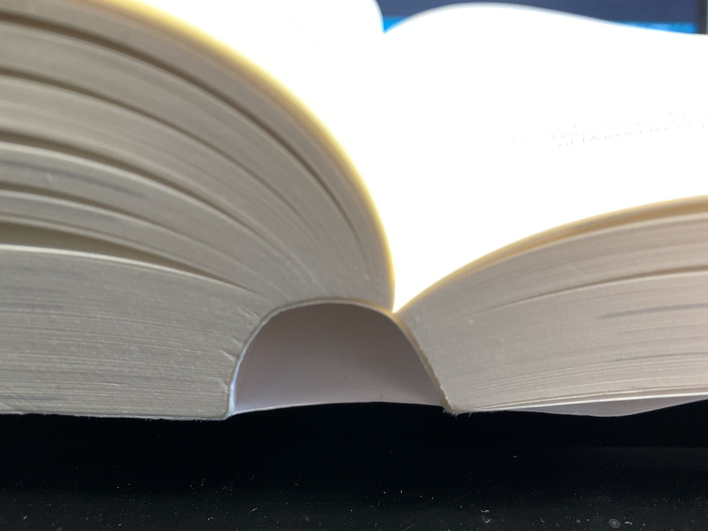
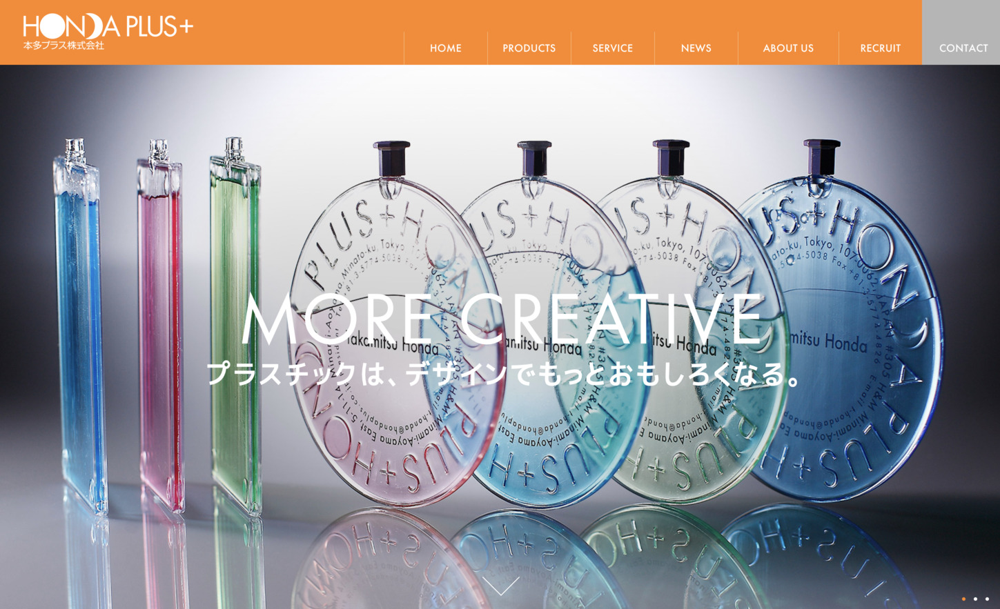

+++
title = "読書メモ: 世界標準の経営理論 - 第29章 資源依存理論"
date = "2020-03-15T00:00:00+0900"
draft = false
+++

前回の [読書メモ: 世界標準の経営理論 - 第28章 社会学ベースの制度理論](/biz/20200314/) の続きを読んでいきます。

2/3 のところまで読めました！どやー。

非技術書でこんな分厚い本を読むのはある意味初めてなので、
続くか不安でしたが、楽しくやれれば意外と続くものですね。

さてさて続きを読んでいきます。
**「ここの理解少し間違ってるよ」などあれば、どしどしご指摘いただければと思います。**

## 『第29章 資源依存理論』の概要

第29章はまとめるとこんな感じの内容でした。

- **資源依存理論（ Resource Dependence Theory, RDT ）** とは、 **モノ、カネなどの資源（リソース）の依存関係が、相対的な力関係を生む** 、企業・組織が持つパワーの話
    - パワーが弱い企業は思うような交渉ができない、これを **外部抑圧** と呼ぶ
- 企業同士が交換するリソースにはこんなものがある
    - **材料・部品・技術などのリソース** 、材料など外部から調達する類のもの、依存度が高くなれば依存先のパワーが増す
    - **金銭的リソース** 、対価として金銭報酬をもらっていて、売り先が特定の顧客に限定される場合、その顧客のパワーが増す
    - **情報リソース** 、情報を特定プレーヤーに依存すれば、依存先の相手のパワーは強まり、相対的に依存する側は弱くなる
    - **正当性リソース** 、制度理論（ from 第28章）における正当性もリソースとなりうる、スタートアップ企業などが大企業と取引すると、その名前を通じて社会的な正当性が得られるなど
- **資源依存は双方向性がある**
    - B社は、A社からのみリチウムイオン電池を購入していれば、B社はA社への依存度が高い
    - A社は、B社へのみリチウムイオン電池を供給していれば、A社はB社への依存度が高い
    - **両方向に依存度が高ければ（ミューチュアル・ディペンデンス、MD） M&A が多くなり、単方向にのみ依存度が高ければ（パワー・インバランス、PI）むしろ M&A がは少なくなる**
- 資源依存理論（RDT）は、大企業が小企業を抑圧する話だけではなく、 **小さな企業が大企業からの外部抑圧をいかに避けるか？** に深い示唆を与える
    - 外部抑圧は、様々な戦術でそれを抑制しうる、 **抑圧の低減、抑圧の取り込み、抑圧の吸収** の3つ
    - 日本の中小下請け企業にも、外部抑圧を巧みに軽減させて飛躍している企業が出てきている

## 資源依存の話

確か資源、リソースに関して競争が優位になるかどうかの話が、第3章にありましたね。

from [読書メモ: 世界標準の経営理論 - 第3章 リソース・ベースド・ビュー (RBV)](/biz/20200203/)

リソースを独占しちゃえばいいじゃんという経済学視点の話と、
リソースの依存という関係性に着目した社会学視点の話は、もしかすると言ってることは近いのかもしれません。

今回はリソースに対する話ではありますが、 **モノ、カネなどの資源（リソース）の依存関係が、相対的な力関係を生む** という社会学の視点に立った話ですね。

### リソースこんなものあるよ

第3章でもリソースの話自体は出てきてるので、重複する部分はあると思いますが改めて。

- 材料・部品・技術などのリソース
    - 材料など外部から調達する類のもの、依存度が高くなれば依存先のパワーが増す
    - 例: 鉄鋼産業、鉄鉱石が原料になるが、鉄鉱石産業は3社で市場の6割を押さえていて、鉄鉱石3社のパワーが強い
- 金銭的リソース
    - 対価として金銭報酬をもらっていて、売り先が特定の顧客に限定される場合、その顧客のパワーが増す
- 情報リソース
    - 情報を特定プレーヤーに依存すれば、依存先の相手のパワーは強まり、相対的に依存する側は弱くなる
    - 例: 商社、広告代理店
- 正当性リソース
    - 制度理論（ from 第28章）における正当性もリソースとなりうる
    - スタートアップ企業などが大企業と取引すると、その名前を通じて社会的な正当性が得られるなど

最後の正当性についてもリソースになりうるんですね、ちょっと意外でした。

ただまあ、サービスリリース直後のスタートアップ企業って、取引先企業に有名どころを入れがち、っていうのは確かにあるあるですね。
なるほど、こういうのを正当性リソースって言うんですか。

なお、こういった相手が有利な状況で、交渉で理不尽な要求をしてきたり、こちらに不利な契約条項を盛り込まれたりと、
様々な圧力をかけてきたりします。これを **外部抑圧** というそうです。

最後の例にも出てきますが、日本の部品提供をしている会社って、大なり小なりこういう外部抑圧を受けてそうなイメージがありますね・・・。

## 資源依存は双方向性があるという話

この資源依存理論（RDT）、一時期使えねえなー、みたいな流れになったらしいのですが、
その理由の1つに依存関係が双方向で起こりうる、というのが踏まえられていなかったのでは？という主張があったようです。

例として章の最初の方にリチウムイオン電池の例が出ています。

- B社は、A社からのみリチウムイオン電池を購入していれば、B社はA社への依存度が高い
- A社は、B社へのみリチウムイオン電池を供給していれば、A社はB社への依存度が高い

この場合、供給先が複数あれば、リチウムイオン電池を作っているA社だけが強いと言えるかもしれませんが、
売る側がA社のみ、買う側もB社のみ、という状況であれば、互いが互いに強く依存し合う関係になるので、
前者は M&A 少ない、後者は M&A が行われやすくなりますよ、という、 M&A の行われやすさに関する話が紹介されています。

A社からの依存度をX、B社からの依存度をYとして、以下の概念で説明されてます。

- ミューチュアル・ディペンデンス、MD = `| X + Y |`
    - MD が高い、互いが互いを必要とする、相思相愛
- パワー・インバランス、PI = `| X - Y |`
    - PI が高い、片方向にのみ依存度が高い、いわゆる片思い

## 外部抑圧との戦い方の話

なんというか、経済学視点のリソースの話っていかにして独占するかの話だったと思うので、
弱者視点でどう大企業と戦っていくか、みたいな話は面白いですね。

まず外部抑圧の抑制の仕方として3つ紹介されています。

- 抑圧の低減
    - 一番単純な手段、特定企業からの依存度を下げる
    - 例: 複数の坂路を開拓する、会社の規模を大きくして、相手に自社への依存度を高くする
- 抑圧の取り込み
    - 外部抑圧となる相手を自分側に引き入れる
    - 例: フェイスブックでの政府出身者の登用、日本企業の天下り（法的・倫理的な話は考えない）
- 抑圧の吸収
    - 企業を買収しちゃう、パワーごと吸収しちゃう

**抑圧の低減** についてはだいたい想像つきますね。
ある意味リスク分散そのものだと思います。

**抑圧の取り込み** については、前章で似たような話がありましたね。
アイソモーフィズム、同質化の圧力の中で強制的圧力って話がありましたが、
それに対して非市場戦略でロビー活動とかして中の人を取り込んで、みたいな話でした。

非市場戦略も、抑圧の取り込みも、結局のところは敵となりうるものに対して、その一部を味方に引き込んでしまうということなんでしょうかね。

**抑圧の吸収** は、これもある意味シンプルで、相手ごと取り込んでしまおうという話ですね。
こっちはこっちで会社の枠ってどこからどこまでなの？って話が第7章の取引費用理論で触れられてました。

from [読書メモ: 世界標準の経営理論 - 第7章 取引費用理論（TCE）](/biz/20200209/)

取引費用理論においては、取引コストの高いか低いかで、内製するか外注するかを決めればいいよ、的な話だったかと思いますが、
関係性における依存が高いかどうかについても、おそらく似たようなことが言えるんじゃないのかなと読んでて思いました。
（もしかすると、経済学、社会学で一定同じことを別の視点で言ってるだけなのかもしれませんね）

とまあ、こんな感じで、外部抑圧の抑制については3種類あるよ、という紹介がされています。

### 外部抑圧を抑えながら飛躍している企業いろいろ

一方で、実際にその辺りを実践して、パワーを回復して飛躍している日本の下請け企業もあるよ、ということで、
いくつか事例交えて紹介されています。

3つほど紹介されていたのですが、中でも愛知県新城市の本多プラスさんの事例が面白いなと思いました。

https://www.hondaplus.co.jp/

- 元々はプラスチック成形の下請け業者
- 下請けを脱却するにはデザインが必要、東京の青山にデザインセンターを設立
- 大企業の購買部門とやりとりするのではなく、マーケティング担当者と親しくなり、企画を直接持ち込む
- 購買部門が提示するものと『桁が1つ違った』金額の契約が次々と決まる

ここのマーケティング担当者と親しくなり、というのがまさに抑圧の取り込みだよ、と筆者は言っています。

桁が1つ違うってやばいですね・・・。

## まとめ

- 資源依存理論（RDT）は、外部抑圧を避けて戦っていく上での、考え方のとっかかりになる

最後の事例なんかまさに面白いですよね。よく経済番組で特集やってそうな感じの話です。

仮に活用できなかったとしても、こういう理論を把握しているだけで、
今自分の会社がどういうリソースがあって、どこに依存していて、みたいに客観的に考えられるようになるだけでもメリットあるかもです。

どうやって闘うかの戦術は、会社の状況によって全然違うので一概にどうすべきとは言えないでしょうけど、
外部抑圧の抑制の仕方が3つあるので、その3つのどれかで戦えないかな？と考え方のとっかかりになると良いのかもです。
