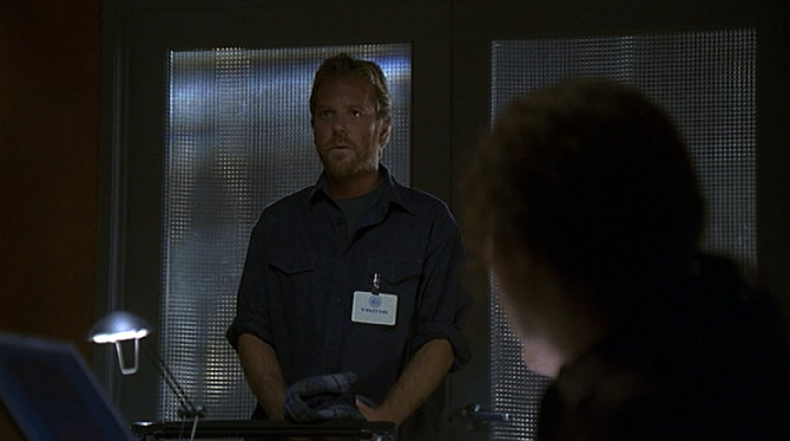
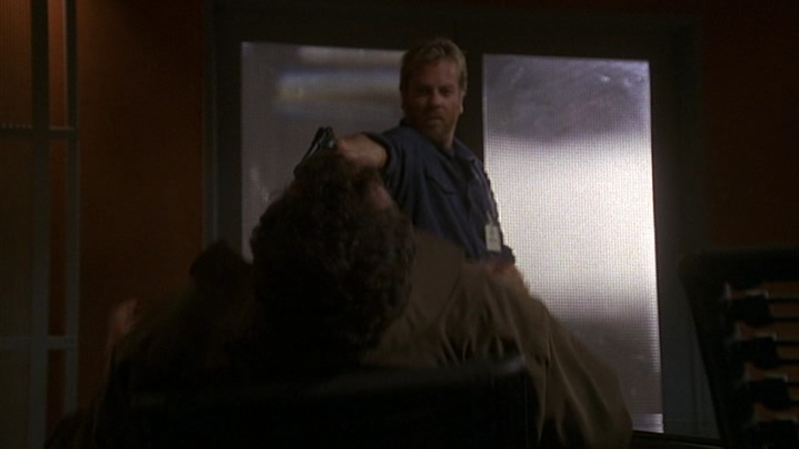

## ジャックバウアーの名言 Advent Calendar について

ジャックバウアーの名言 Advent Calendar なるものをやることになりました。 techではないっぽいのに、なぜかgihyoに載っていて ちょっとやばいだろと思いながらも、気にせずやっていきたいと思います。

[ジャックバウアーの名言 Advent Calendar](http://www.adventar.org/calendars/44)

ジャックバウアーのディレクション能力はピカイチです。 Web制作に参考になるところも大いにあることでしょう！ という謳い文句で、むりやりWeb制作に紐付けられるところは紐付けつつ、 おもしろおかしく書いていきます。

※ちなみに、もうドラマは終わってしまっているので、ネタバレ全開でいきます。

---

## シーズン2 午前8時から9時の出来事

シーズン1にて、テロリストとの戦いで最後の最後に奥さんを殺されてしまい、 ぶっちゃけプー太郎な状態からシーズン2が始まるのですが、 やはりそこはCTU（テロ対策ユニット）や大統領からヘルプの要請が入ってきます。

**CTUスタッフ「テロの脅威まじやべえ。。。しかも時間ねえし。。。」**

**大統領「なんか方法ないん？」**

**CTUスタッフ「じゃっくばうあーならなんとかしてくれる・・・！！」**

一度出来るところを見せつけてしまうと、「こいつならなんとかしてくれる・・・！」と、 ついつい考えてしまうのが世の常です。

そこでジャックバウアーがCTUに出頭すると、 今日ロスで核爆弾が爆発する！とのこと。 ピンチで炎上しているのが分かっているなら、もっと早くに相談すべきだったと言えるでしょう。

なぜピンチになってからしか相談できないのか。

そこで言い放ったのが以下の台詞。

**ジャックバウアー「おれに何をさせる気だ・・・！」**

**当然です。**

まだプロジェクトにアサインされていないのに、お願いする側はもうやってもらう気満々です。

そこでジャックバウアーは、お願いされても断ってしまい、大事な娘に電話して避難しろと言いつつ、 自分もすたこらさっさと帰ろうとします。 まじ地雷探知能力半端ないです。

その後紆余曲折あり、最終的にやると決めてからのジャックバウアーの行動力が半端ないです。

通常、数週間かかる潜入捜査を1日でやれとか土台無茶な話なので、 もう片っ端から法律無視して、裁判の証人を無理矢理呼び出して殺してしまいます。

そのときに言い放った台詞が以下。

**ジャックバウアー「やるときはとことんやるしかないんだ！」**

・・・プロジェクトが炎上しているとき、既存のルールや手順を遵守していては解決できないことが多いです。

このように、きちんとゴール（≒1日でどこにあるか分からない核爆弾の確保）を見据えたうえで、 それに似合う方法を考えていかなければなりませんね。 さすがジャックバウアー。

## まとめ

- スイッチが入ったときのジャックバウアーの行動力、半端ない
- やるときはとことんやるしかない

