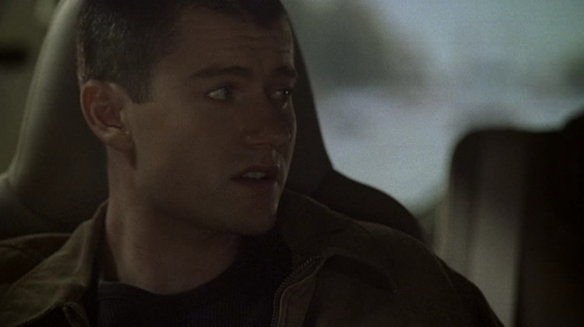
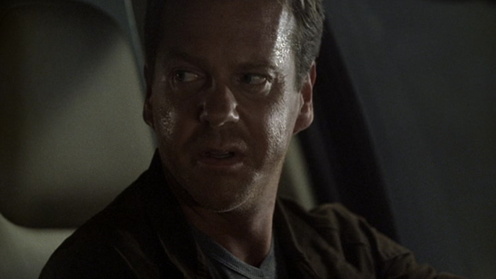

## シーズン2 午後2時から3時の出来事

ジャックバウアーは、テロを防ぐためならなんでもする、と思われがちですが、 実はそんなことはありません。

**テロを防ぐ ＜ 家族を守る**

完全に家族優先です。

仕事をするのを目的にしてないところが、プロフェッショナルなのかもしれません。

シーズン3にて、若い後輩くんが娘と交際してます宣言しちゃうのですが、 それに対してジャックバウアーは猛反対します。

**「この仕事してるとどうなるか考えてみろ！」**

**「おれが良い例だ、おかげでまともな関係も築けないんだぞ！」**

**「娘を守るためならおれはどんなことでもする、何でもだ！」**

ジャックバウアーの場合、何でも、というのは本当に何でもやります。

きちんとタスクの優先順位が明確化されており、 後輩くんに対してOJT（On the Job Training）で身につけさせているというわけですね。さすがジャックバウアー。

## まとめ

- タスクの優先順位が明確化できている
- 仕事よりも家族を守るのがジャックバウアー
