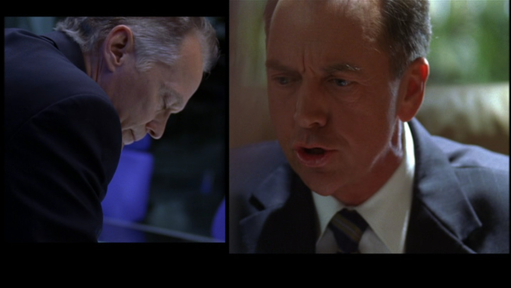
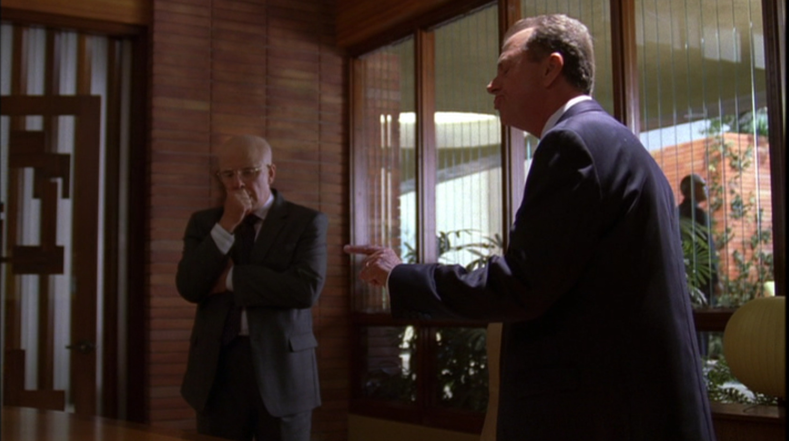

## シーズン5 午前9時から10時の出来事

TwentyFourの世界には、当然のごとくダメ上司やリーダーシップのない大統領など、ありとあらゆるダメキャラが出てきます。彼らなくては、ジャックバウアーの良さは際立ちません。

ということで、今回は **マネジメントの重要性** を反面教師的に見ていきたいと思います。

ちなみにシーズン5の3話目にあたります。ちなみに流れはこんな感じ。

**テロリスト「空港占拠しちゃったもんねー、ロシアとの調印やめてくれたら人質解放するよー」**

**ローガン大統領「そんな、、この政権の目玉だったのに。。。よぉーし、こうなったらCTUに早期解決してもらうしか！」**

(PPP...)

**ローガン大統領「1時間半以内に人質を救出しろ！」**

**CTU支部長「その方針で動いてます。民間人の犠牲者が出ることが予想され・・・」**

**ローガン大統領「全員を救出しろ！」**

**CTU支部長「突入すれば自爆すると・・・」**

**ローガン大統領「とにかく期限までにかたをつけろ！」**

これではリーダーシップが全く取れておらず、大統領も要求しか出してません。テロリストと同レベルですね。

何が足らなかったのでしょうか。シーズン初期から出ているパーマー大統領は、「部下を信じて求めれば、必ず結果はついてくる」と言っています。任せてフォローするという体制が取れていないのに加えて、責任だけが部下へと委譲されていますね。これでは下に付く人間も苦労が絶えません。

ちなみに、彼の捨て台詞はかなり面白いです。参考までにこの後の流れもご紹介しておきます。

**ローガン大統領「洗いざらい報告しろ、何を優先するかは私が決める！」**

**CTU支部長「お言葉ですが時間がありません」**

**ローガン大統領「なら早口で言え！」**

時間がないから早口という論理だと、常に時間が差し迫っているTwentyFourでは、常に1.5倍速で再生しろ！と言っているに等しく、それくらいありえない発言です。

もし、あなたの会社に同じようなマネジメントをしてしまうダメ上司がいれば、この事例を交えて説得すれば、マネジメントの重要性を理解してくれるのではないでしょうか。きっとそうに違いありません。ぜひとも試してみてください！

## まとめ

- 丸投げではなく、ちゃんと任せてフォローするというマネジメント
- 早口で言っても解決しない
