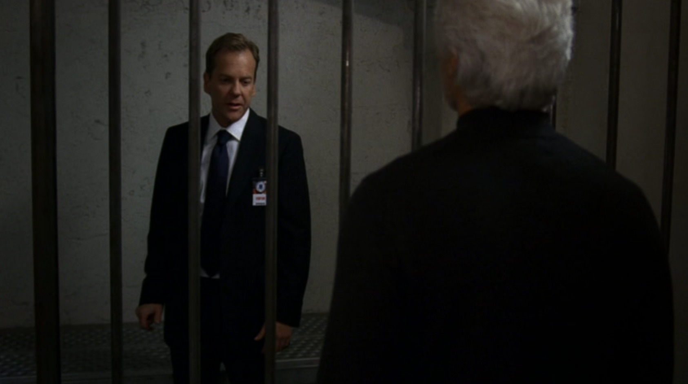
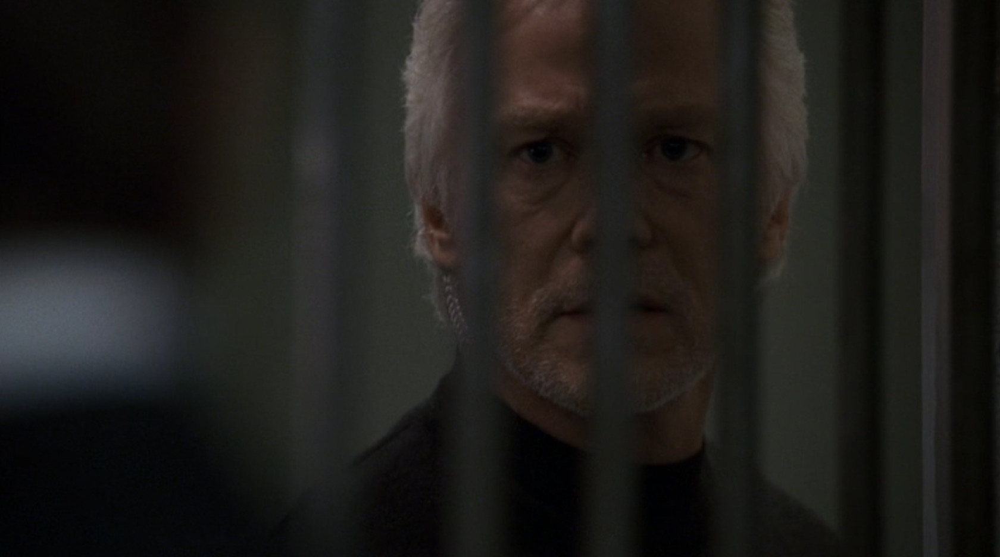
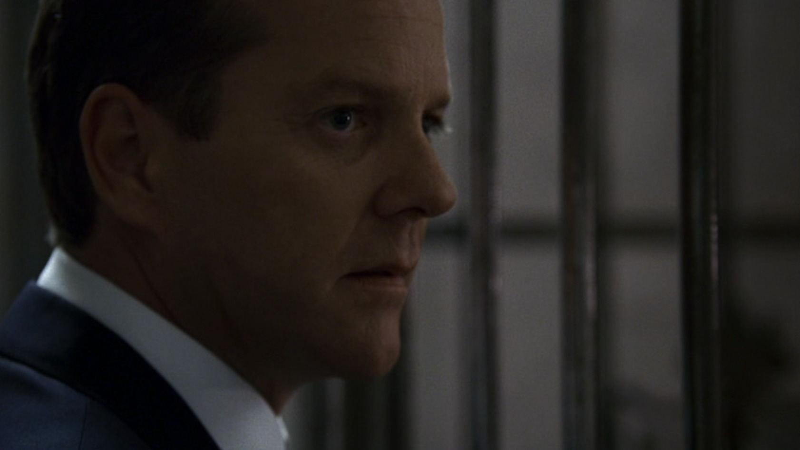

いよいよAdvent Calendarも12話目となってきており、24時間のうち半分が過ぎようとしています。

ちなみにTwentyFourでは、大抵のシリーズでは、12時間前後が一番熱い山場になっています。急展開が多くなるに伴って、名言も多く出ています。これは期待できますね！

---

## シーズン7 午後7時から8時の出来事

実業務で足りないスキルがあれば、その都度追っていって身につけるくらいの気迫がないと、この先やっていけないのでは？という話です。

今回のシーンは、シーズン7にてジャックバウアーがテロリストと内通していた議員秘書を、ホワイトハウスで部屋に籠って ~~拷問~~ 尋問していたところ、大統領の命令で後一歩のところで止められてしまったというところです。元CTUのトップである協力者、ビル・ブキャナンとの会話のシーンからです。

あ、ちなみに暴走バウアーは檻に入れられてます。シークレットサービスは **妥当な判断** だと思います。

**ジャックバウアー「尋問中、標的を吐こうとしていた」**

**ビル・ブキャナン「（やつは）保護された、近づくことができない。」**

**ジャックバウアー「あんたがやればいい！」**

**ビル・ブキャナン「強制的な尋問は専門外だ。。」**

そうですかー。専門外ですかー。

2人とも、やつがテロに関する情報を持っているという認識は一致しています。ですがこのビル・ブキャナン。CTUで一緒に働いていた頃はかなり優秀なディレクションを披露していたのですが、いかんせん実業務のスキルが足りていないようです。

**ジャックバウアー「やつはクロだ！」**

**ビル・ブキャナン「必要性は分かっているが無理だ」**

**ジャックバウアー「理由になってない！」「ダメだ理由になってない！！」**

**必要なことなので2回言いました。** 確かに、目的を達するにはその方法しかないのですが、自分にはスキルがないとのこと。そんな悠長なことを言っている余裕はないはずです。

そこでジャックバウアーは言い放ちます。

**ジャックバウアー「俺に言ったろ、黙って見ているやつは爆弾犯に手を貸したも同然だ、と」**

**ビル・ブキャナン「・・・無理だ。」**

うわぁ、ジャックバウアーって他人にまでその鬼畜っぷりを押し付けちゃってまじ怖い、と思われるかもしれませんが、 **ポイントはそこではありません。**

チーム内でゴールの共有が出来ているのにも関わらず、それに対するスキルがないというのは問題です。そこはその場その場で身につけてやる、というくらいの気負いが無ければ、自分自身も成長しないのではないでしょうか。

特にWeb業界は、新しいことがどんどん出て来る世界です。現時点でスキルが足らないといって、めげているほど時間に余裕はないはずです。 ビル・ブキャナンも、足りないスキルがあれば身につける努力をすべきではないでしょうか。

ちなみに、この後断られたジャックバウアーは、

**ジャックバウアー「しょぼーん(´・ω・｀)」**

しょぼーんとしちゃってます。

だがしかし、それでも戦い続けるジャックバウアー。さすがジャックバウアー。

## まとめ

- 黙って見ているやつは爆弾犯に手を貸したも同然だ
- 足りないスキルは都度身につける
