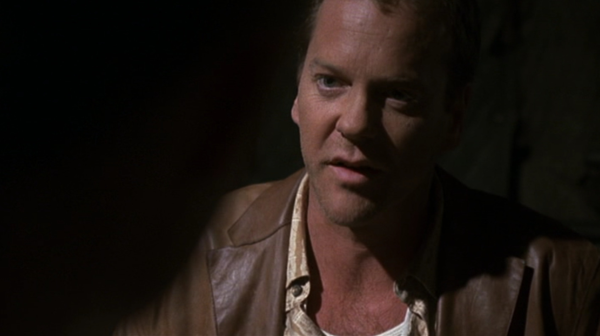
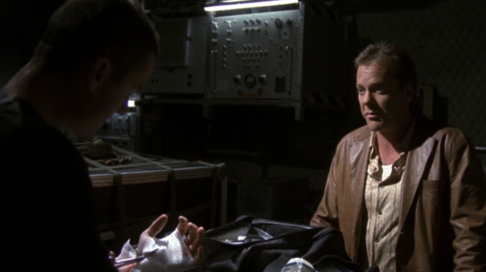

## シーズン3 午前1時から2時の出来事

今日は、同僚との仕事の進め方において、お互いに相違が出て来てしまった時に生まれた名言をご紹介します。

ジャックバウアーが潜入捜査にてテロの情報を探ろうとしていたとき、それを知らない同僚チェイスくんが、暴走して一人で突っ込んできたときのことを2人で話し合っているシーンです。

ちなみにどんなことがあったのかは概要でどうぞ。

**テロリスト「あ？こいつなんだよ、CTUのやつなの？仲間なんじゃねーの？」**

**悪バウアー「おれは知らん、勝手に暴走して突っ込んできただけだろ」**

**チェイス「え、あんた何言ってんの？寝返っちゃったの？」**

**テロリスト「よし、殺そうか」**

**悪バウアー「いやいや、仲間が来てないか吐かせるべきだろー」**

**テロリスト「あ？この銃でこいつ撃たねえとおまえもCTUの仲間だろーが」**

**悪バウアー「・・・。」**

(...Bang!)

**テロリスト「へへー、空砲でしたー（ぺろーん(๑╹ڡ╹๑)」**

**チェイス「・・・。」**

この同僚チェイスくん。暴走して1人で潜入したあげく、ジャックバウアーにマジ SA・TSU・GA・I されるとこだったのですが、一通り片付いた後でジャックバウアーから声をかけます。

**ジャックバウアー「なあチェイス、今日はいろいろあったが大人になって仕事に専念しよう」**

**チェイス「もし（弾が）入ってたら？」**

**ジャックバウアー「任務を遂行していた。」**

はい出ました。オブラートに包んだ言い方出ました。

そうです応用編ですね！まだ見てない方は復習しましょう！ [ジャックバウアーの名言 #11](/misc/20121211/)

だがしかし、これは軽いジャブ程度です。本当の（真面目な）名言はこの後のシーンからです。

**「よく聞け、チェイス。この仕事は決断を下せないとやっていけない。それが正しかったかどうかは、すべて終わるまで分からないものだ。」**

そうです。結果というのは、決断をいくつも下した先にあるものです。 **まさに「人事を尽くして天命を待つ」を、リアルタイムに実践** している男です。自分の全力をかけて努力した後は、天命に任せるしかないんだ、あそこで引き金を引いたのは俺の全力だったんだ、と言いたいのです。

こうやって同僚を ~~洗脳~~ 教育し、 **ジャックバウアー化** していくわけですね。さすがジャックバウアー。

## まとめ

- それが正しかったかどうかは、すべて終わるまで分からない
- ~~洗脳~~ 教育によってジャックバウアーを増やす
