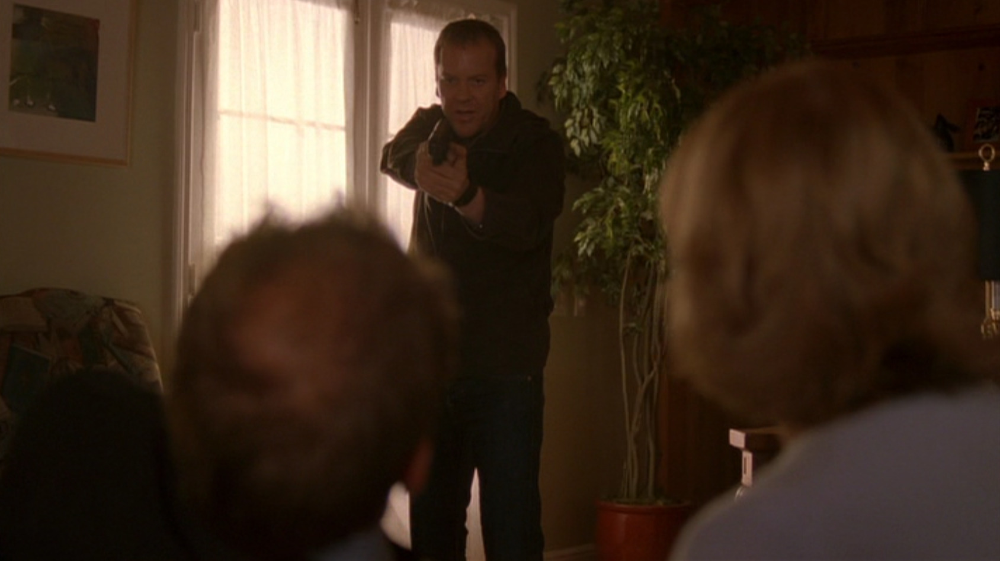
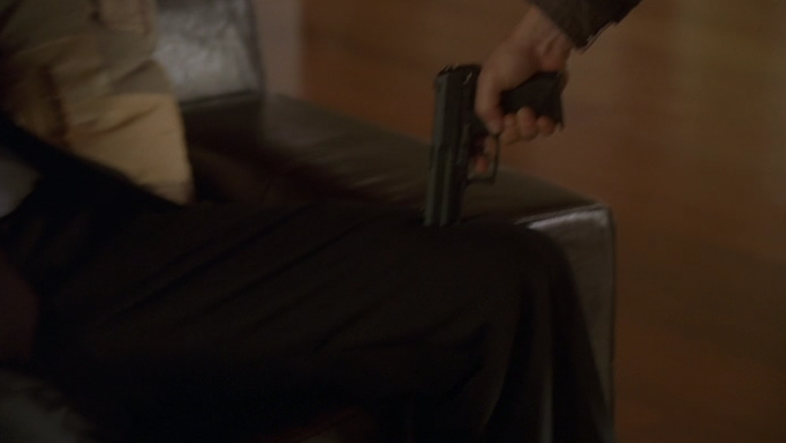

さて、もうそろそろ「JackBauerテクニックバイブル本」か「パーフェクトJackBauer本」の執筆依頼が来る頃ではないかと思います。気長に待ちます。

## シーズン5 午後5時から6時の出来事

鬼畜バウアーに圧倒された登場人物には、幾度となく触れてきましたが、もし **相手側も鬼畜だった場合** 、ジャックバウアーはどう対応するのでしょうか？

自分の意見をはっきりと相手に伝えたとき、相手側が噛み付いてきたときなどに流用出来るかもしれません！早速見ていきましょう！

元CTU上司であるクリストファー・ヘンダーソンが、どうやらテロに関与してるっぽく、家に忍び込んで奥さんを尋問しているところです。そこへヘンダーソンがやってきました。

さっそくジャックバウアーは、元上司であろうと関係なく、尋問を進めます。

**ジャックバウアー「神経ガスはどこにある！？」**

**ヘンダーソン「膝からやれ、私の教えた通りに」**

なんとびっくり。この人、 **尋問され始めるのと同時に後進の育成に手をかけ始めました。本物です。**

ヘンダーソンさん、この後立て続けにジャックバウアーを追い込み続けます。さすが鬼畜師匠です。。。

**ヘンダーソン「やるならやれよ、さっさと撃て！」**

**ヘンダーソン「どうした、早く撃て！」**

**ヘンダーソン「さあ撃て！」**

元上司、手加減なしに元後輩を追い込みます。ジャックバウアーがゴール、目的のために全力を尽くせるようになったのも、彼のおかげなのかもしれません。

だがしかし！

この元上司の予想を上回るスピードで、後輩であるジャックバウアーは成長していたのでした。

なんと、横にいる奥さんの足を銃で撃ちます。

(Bang!)

**ヘンダーソン「・・・！？」**

**ジャックバウアー「撃ったのは膝頭の上だ！神経ガスはどこにある！！」**

**ヘンダーソン「何をするんだ、この人でなし！」「・・・なんて奴だ！」**

一見すると、お前は鬼畜だと言っているように見えるかもしれません。 **いいえ間違っています。**

ヘンダーソンは、 **もうお前に教えることはない** 、と言っているのです。

ヘンダーソンは、目的意識を持ってやることが大事だと常日頃から教えることで、ジャックバウアーにもその考え方が染み渡ってきたようです。彼の努力もあり、師匠を超え、今後の活躍がより一層楽しみなジャックバウアーです。さすがジャックバウアー。

## まとめ

- 実践的な教育のモデルケース
- 目には目を
