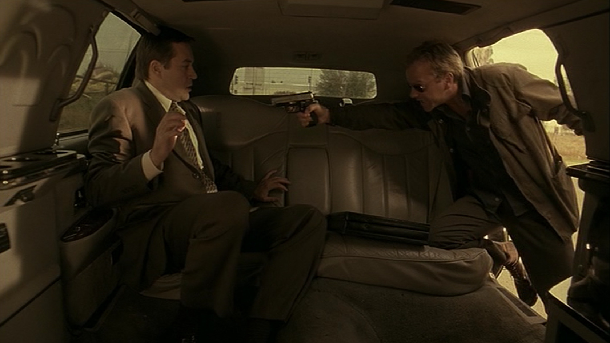
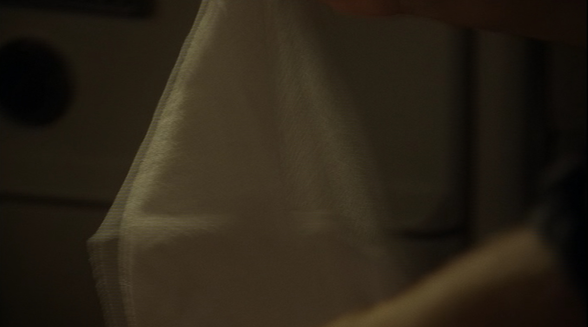
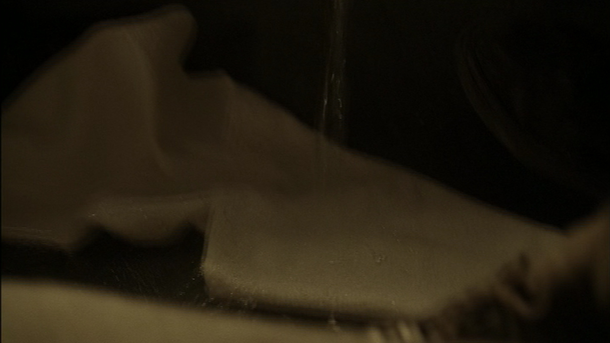
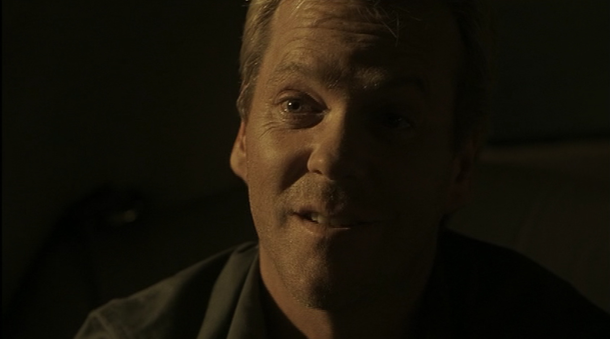

## シーズン1 午前10時から11時の出来事

業務フローの見える化は **とてもとても** 大事です。

ツールだけに頼っていても業務フローの見える化は出来ないんだ、大事なのはツールじゃなくて、イメージの共有なんだということが、とてもよくわかるシーンがあったので紹介します。

テロの手がかりを追ってようやくたどりついたのが、よくいそうなビジネスマン、コフェルさんでした。ただ、ジャックバウアーの長年の勘から、こいつは間違いなくテロリストとつながりがあるだろうと感じてます。

**ジャックバウアー「ドアに背を向けろ、両手は足の下だ。」**

**コフェルさん「私はビジネスマンだ！」**

**ジャックバウアー「へーー、ただのビジネスマンが防弾のリムジン使ってるのか！」**

**コフェルさん「そうだ、身を守る・・・！」**

**ジャックバウアー「何から？」**

**コフェルさん「・・・君みたいな奴だ。」**

そうですね。コフェルさん、 **あなたはとても正しいです。**

その後、一通りコフェルさんに質問をした後、ジャックバウアーは早速尋問し始めます。

**ジャックバウアー「いいか、黙って見てろよ。」**

そうです、手順なんて口頭で説明する必要ありません。一目瞭然なのです。

ジャックバウアーはおもむろにタオルを取り出します。

そのタオルを広げた状態にした後で、今度はペットボトルのキャップを空け、中に入っている水を上からタオルに向かって注いでいきます。

**コフェルさん（彼は何をしてるんだ・・・？？）**

その後、コフェルさんに向かってこんなことを言い放ちます。

**ジャックバウアー「タオルをのどに突っ込むなんて無理だと思うだろ？ だが出来るんだよ。」**

どうです、このジャックバウアーの **嬉しそうな顔！** 念のため断っておきますが、彼は決して拷問を楽しんでいるわけではありません。手順の見える化が出来て喜んでいるのです。

高価なツールなんて買わなくても、身近なものでも業務フローの見える化は出来るのです。そんな一例を分かりやすく示してくれたジャックバウアー。さすがジャックバウアー。

## まとめ

- 徹底的な業務フローの見える化
- 見える化出来ると楽しい
