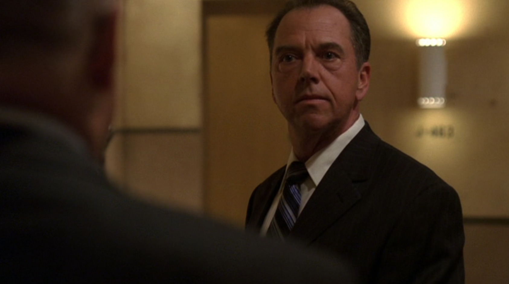
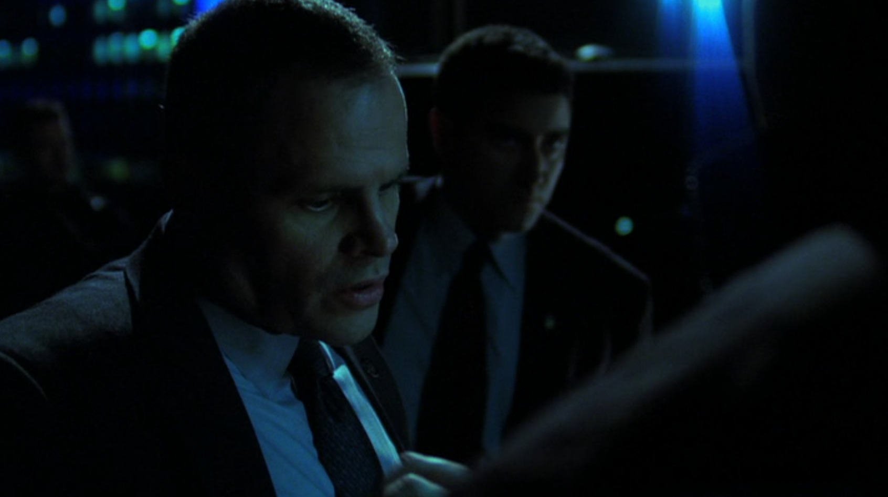
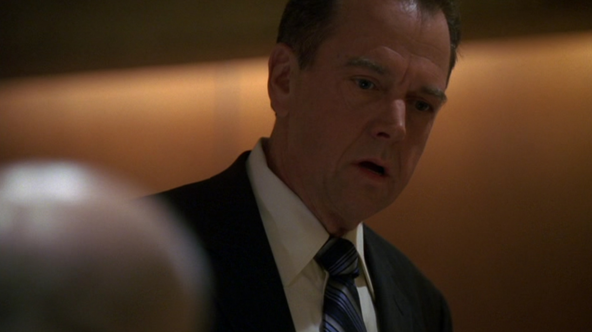
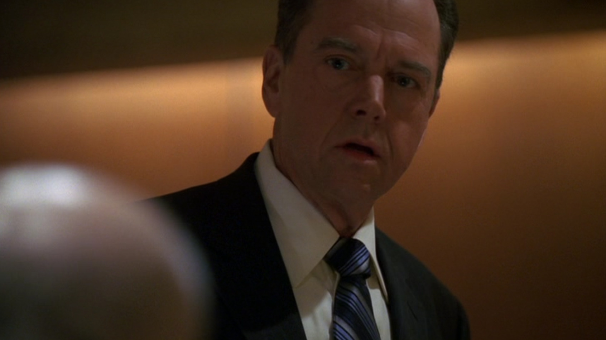

## シーズン4 午前1時から2時の出来事

リーダーが細かな作業レベルまで口を出すとろくにならないという事例を、[ジャックバウアーの名言 #8](/misc/20121208/)にも出てきたローガン大統領に学んでみます。

シーンとしては、テロリストとつながってそうなチンピラに優秀な弁護士がついてしまって、尋問したいけどできない、大統領も弁護士にびびって尋問の許可しない、みたいな状況で、ジャックバウアーがいつものごとく暴走して締め上げて情報を得て、いざテロリストのアジトに潜入するというシーンからです。

このローガン大統領、自ら出した大統領命令を無視されてかなりご立腹のようです。

**ローガン大統領「いや待てん、即刻彼を逮捕しろ！」**

彼はシークレットサービスに命令を出して、潜入中のジャックバウアーに逮捕命令を出してしまいます。

シークレットサービスとごたごたやっているうちに、テロリストたちに気づかれてしまいます。

**ジャックバウアー「くそっ、ばれてる！全員突入しろ！」**

(テロリストたちに逃げられる）

**ジャックバウアー「台無しにしてくれたな・・・」**

**シークレットサービス「私は命令に従ってるだけです」**

テロリストの捕獲に失敗した報告は、大統領のところにも上がって行き、大統領はなんで失敗したんだ、ということを聞きます。

**CTU支部長「作戦中のバウアーを拘束しようとして敵に気づかれたんです」**

**ローガン大統領「（はっ・・・！）」**

**ローガン大統領「私は・・・そんなことをしろとは言ってない。」**

ダメですねーダメダメリーダーですねー。

その後シークレットサービスから解放されたジャックバウアーは、「あとちょっとだった！！」と発狂するのですが、こんな現場の一判断にいちいち口を出すリーダーは、ろくな結果が出せないことでしょう。

ちなみにこの後、元大統領のデイビッド・パーマーさんが呼ばれて、「部下を信じれば、ちゃんと応えてくれる」と熱いことを言ってくれるのですが、こういうダメリーダーから学ぶべきことも多いでしょう。

## まとめ

- いちいち口を出さずにはいられないダメリーダー
- 部下を信頼するとちゃんと答えてくれる
