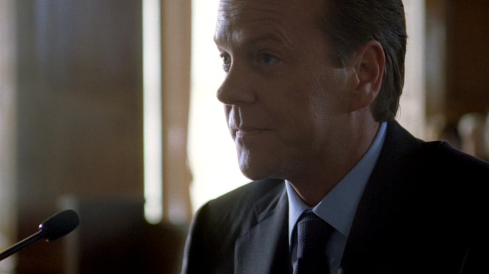
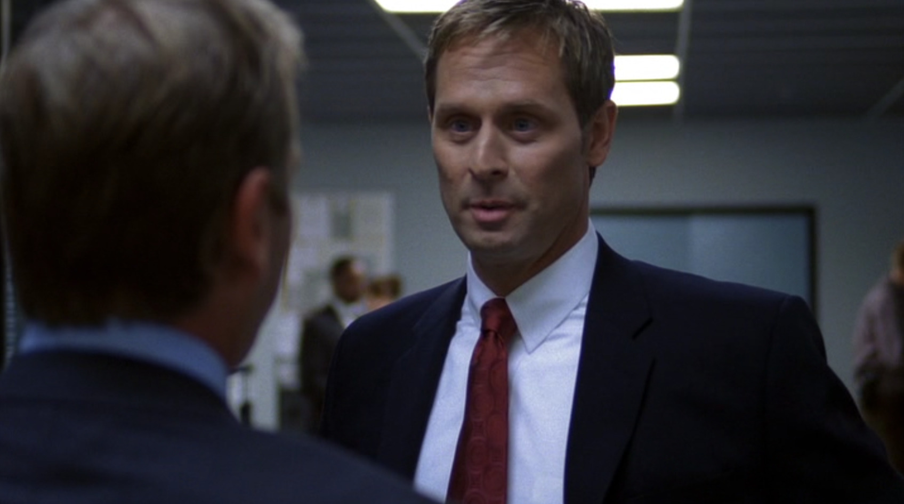
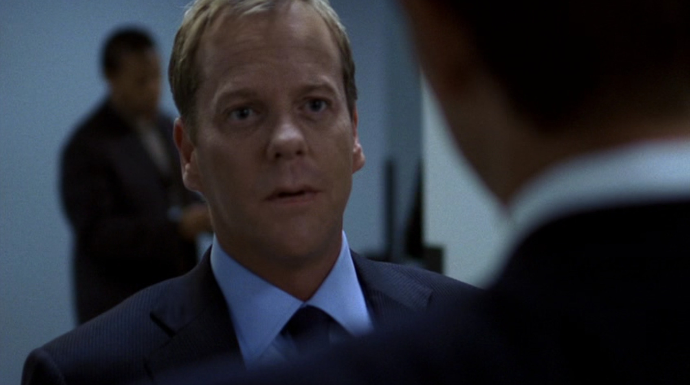

## シーズン7 午前8時から9時の出来事

プロジェクトにおける作業スコープの明確化は、プロジェクトを成功に導くための第一歩と言えるのではないでしょうか。

皆さんは、ジャックバウアーについてなんでもかんでも首突っ込んで暴走しまくってるというイメージをお持ちかもしれませんが、意外にもそんなことありません。

そんなところがよく分かる事例を、シーズン7の最初の1時間からご紹介します。

各シーズンにて暴走しまくって違法な~~拷問~~尋問をした結果、裁判を受けることになってしまったジャックバウアーから始まります。

**裁判してる人「（テロリストの）ハダド氏を拷問しましたか？」**

**ジャックバウアー「はい、しました。」**

**ジャックバウアー「幼い子供含めてテロから救ったので後悔してません。」**

**FBI「ちょっとジャックバウアー貸してほしいんだけど。」**

**裁判してる人「むむむ。。。」**

こんな感じで裁判が開かれていたところに、FBIの人からちょっとジャックバウアー貸してほしいという話が割り込んできます。例によってアレですね。 **ジャックバウアーじゃないと解決できない系** の事件です。

FBIの人たちは、ジャックバウアーをつれて裁判所を出ると、そのままFBIへ向かいます。そして、FBIのボスのラリー・モス捜査官は、そのまま事件の詳細についての説明をし始めるのですが・・・。

**ラリー・モス捜査官「ウォーカー捜査官が、君が捜査の役に立てるというので来てもらった」**

**ラリー・モス捜査官「良い意味で予想を裏切ってもらいたい」**

そうとう難しいプロジェクトのようですね。こういった場合には、その道専門のスペシャリストが必要な場合が多いかもしれません。

それに対してジャックバウアーは、、、

**ジャックバウアー「俺はここに就職活動に来た訳じゃない。」**

**さすがジャックバウアー、さすがぶれない。** 向こうは仕事を頼む気満々でいますが、こっちからしてみればどこからどこまでなのか、何をどうするのか全く見えてない中で、勝手にやることにされているわけです。

こういう時こそ、 **作業スコープの明確化** をすべきなのです。ましてや別の会社同士が合同でプロジェクトに参画するなんてときには、尚更どこからどこまでなのか？をきちんと共有していかねばなりません。

ジャックバウアーは、別の会社同士なのに部下のようにお願いされた仕事を、ほいほい片付けるだけの関係ではないんだよ、ということを声を大にして言いたいはずです。この暗喩あってこその『就職活動に来た訳じゃない』発言なのです。

スコープが明確になっていない状態でのやります宣言を、きちんとわきまえるジャックバウアー。さすがジャックバウアー。

## まとめ

- 作業スコープが明確になるまでは、安易に『やります！』と言わない
