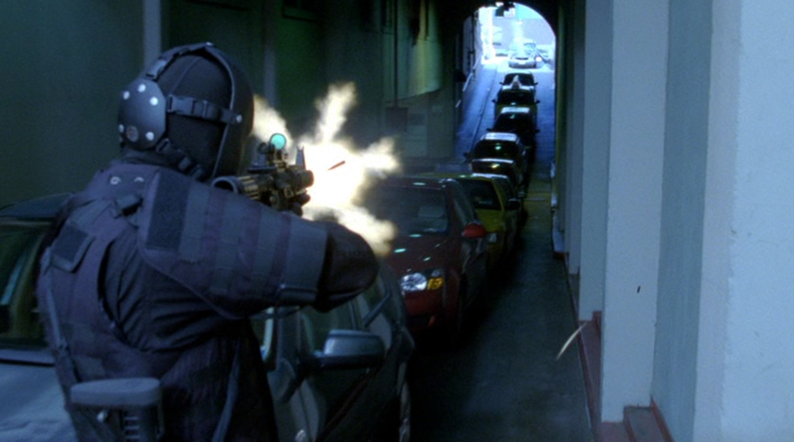
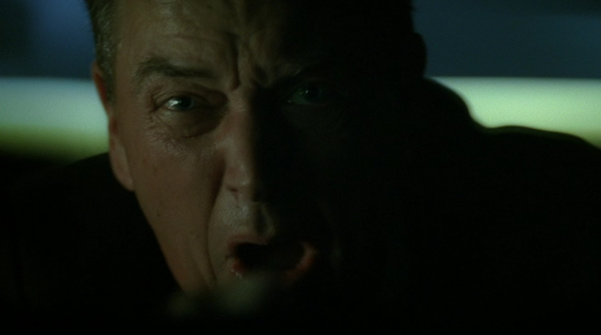
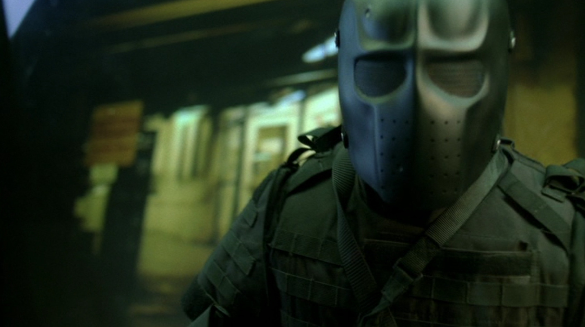
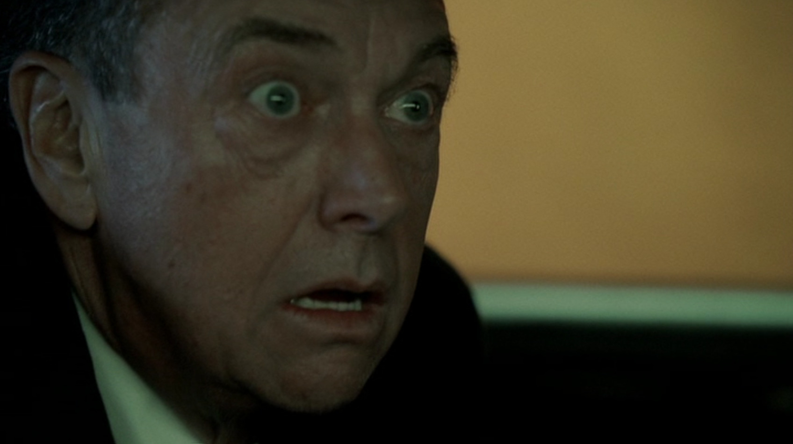

## シーズン8 午後1時から2時の出来事

相手に **『こいつは口だけじゃなく実際にやるやつだ』** と思わせられれば、もうこちらのペースでやれると言ってもいいと思います。いわば口だけではなく **実行力がある** ことを示す方法ともいえると思います。

また、実際に最終成果物を見せる前の段階で、デモとしてこんな感じになりますよーと **先行して分かりやすい形で見せる** ことで、お客さんに対して『このまま進めていっても問題なさそうだな』と思ってくれやすくなると思います。

今日は、実行力があることをどのように見せていくと効果的なのか、僕が全シーズン通しておすすめシーンのトップ3に入るであろう場面からご紹介します。

このAdventCalendarで何度も出て来ているジャックバウアーとローガン（元）大統領は、立場的に正反対に居るといってもいいかもしれません。この2人がとうとうファイナルシーズンの最終局面でぶちあたります。

これまでのあらすじを簡単にご紹介します。

**ジャックバウアー「ああ、愛するルネ・ウォーカーが殺されてしまった、黒幕は誰なんだ・・・！」**

**ローガン大統領「なぜバウアーに手を出したんだ、あいつはやばいんだぞ。」**

**黒幕さん「なあに大丈夫、手は打ってあります。」**

いいえ、大丈夫ではありません。ジャックバウアーは地の果てまでも追いかける男です。

彼はローガン大統領の関与を知ってから、仮面をつけた上で大統領を襲います。

(BangBangBang...!)

まず、細道のトンネルで迂回できないようなところを襲撃地に決め、後続している車がある程度入って来てバックできないタイミングを見計らい、先行している車のタイヤをパンクさせて前に進めないようにし、ずんずんと大統領が乗っている車に近づいていきます。

**ローガン大統領「あれは・・・ジャックバウアーだ・・・間違いない・・・！」**

**ローガン大統領「奴だ！ジャックバウアーだ！！」「私を殺しに来る！！」**

正解です。覆面をしているので本来誰かは分からないはずですが、ローガン大統領は直感的に『あいつしかいない！』と考えます。ジャックバウアーの **ブランディング半端ない** ですね！

シークレットサービスが車の外に出て大統領を守るのですが、次々にやられてとうとう車の目の前までやってきます。

**（ずんっ！）**

**（ひぃっ！！）**

**とても分かりやすい恐怖の形です。** このような形で、ジャックバウアーはローガン大統領を襲撃するんだ、と見える形で分かりやすく訴えかけてくれています。ジャックバウアーは **『デモとしてこんな感じになりますよー』** ととても分かりやすい形で見せてくれています。

この後、車の中からローガン大統領を引きずり出し、場所を変えて ~~拷問~~ 尋問を行います。実際にどうなるかは、もう説明せずとも想像しやすいのではないでしょうか？もし、いきなり捕まえて ~~拷問~~ 尋問していたら、ここまで簡単には情報を吐かなかったかもしれません。そういった意味で、 **先行してデモとして見せる** 手法はとても大事だと思います！

誰でも一目瞭然でこいつはやばいと思わせる手法を取ることができるジャックバウアー。さすがジャックバウアー。

## まとめ

- 『デモとしてこんな感じになりますよー』
- 口だけでなく実行力を見せる
