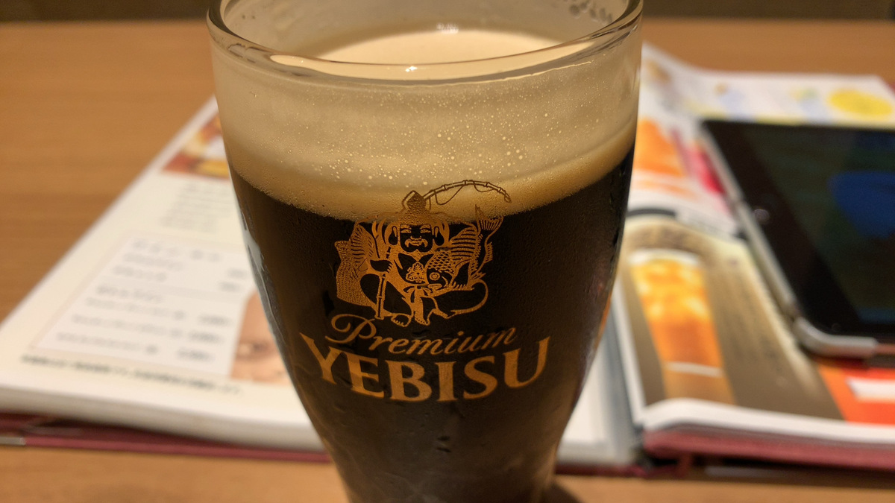
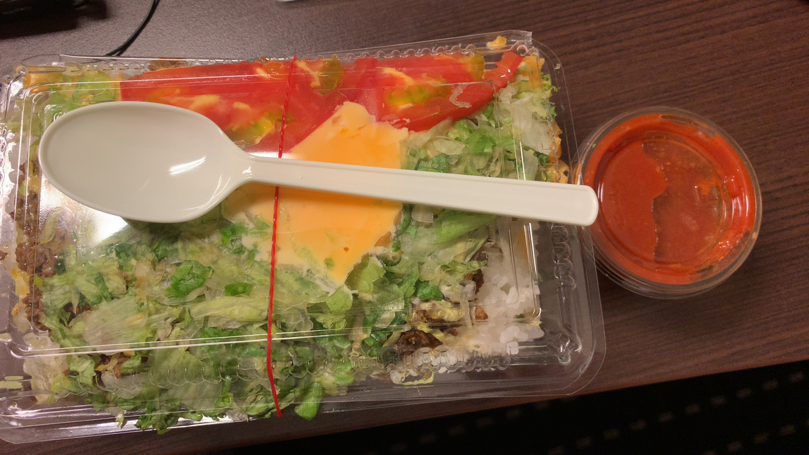
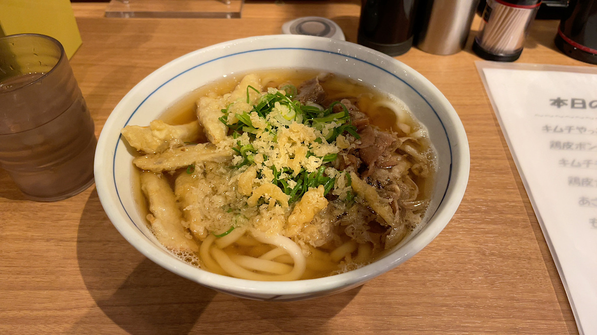

+++
title = "住み心地は実際に住んでみないと分からない話"
date = "2020-12-24T21:00:00+0900"
lastmod = ""
draft = false
+++

[今年やってよかったこと Advent Calendar 2020](https://adventar.org/calendars/4936) の24日目の記事です。

<blockquote class="twitter-tweet">
いつも1年の目標とか立てる方ではないんですけど、 今年に限っては年始に立てていてですね 今年の目標は『生きる』です、どうぞよろしくお願いします
&mdash; ばうあー (@girigiribauer) <a href="https://twitter.com/girigiribauer/status/1277582931951681537?ref_src=twsrc%5Etfw">June 29, 2020</a></blockquote> 

今年の目標は **『生きる』** です。

残り1週間、なんとか2020年を生き抜けそうで良かったです・・・。

そんな中、今年やってよかった **一人合宿** に関することを、
ブログに取りまとめていこうと思います。

ちなみに今年の Advent Calendar はもう1つ書いていたのですが、
勉強会やらなかった熱量（？）が一人合宿に向いてしまっているのかもしれません。

[地方の勉強会コミュニティは、何もしてないとすぐに死ぬ - ばうあーろぐ](/tech/20201208)

ということで今回は『今年やってよかったこと』 = 『一人合宿』についてです。

## 一人合宿をやろうと思ったきっかけ

- 結局打ち合わせも **全部リモート** 、物理的に人と会うことはない
- ずっと家からリモート打ち合わせ、来る日も来る日も・・・
- また今日も家から・・・
- さすがに **家での作業に飽きた・・・！**

運動でもすれば良かったのかもしれませんが、
それにしても **外部からの物理的な刺激がなさすぎる** んですよ。

徐々に作業効率が下がってきてることは自覚できていたので、
「ああ、このままじゃダメだ・・・環境変えないと・・・」となって、
**試しに場所を変えてみた** というのが一人合宿のきっかけです。

## 今年後半にやった合宿

- 場所・環境を大きく変えて、そこに数日滞在する
- 位置付けとしてはワーケーション
    - 仕事はガッツリ普通にする
    - **現地の飯を食うことで短時間で効率良く観光する**
- 地方都市で、駅前など電波が確実に良いと思われる場所にする
- お酒は1〜2日程度

こんな感じのルールで概ねやっています。

ちなみに Go To トラベル利用については、
2020/11/6 予約分から会社の出張利用、つまりは会社名義で領収書を切ることが出来なくなっています。

つまり個人利用のワーケーションなら OK

https://www.mlit.go.jp/kankocho/content/001358665.pdf#page=7 （観光庁 Go To トラベル事業の資料より）

### 第1弾 岐阜（大垣）合宿

- 10月前半
- 駅前のアパホテル、テレワーク応援プラン
- 名古屋に住んでいるので、お試しで近くから
- 大浴場がついている宿が最高
- 飯の時間が楽しみ

12時13時にランチとか行ったら混むので、
朝昼兼ねてちょっと早めの昼食と、晩ご飯の2食を日々の楽しみにして、
あとはひたすら PC に向かって作業です。

もう飯の時間が楽しみでしょうがない！

### 第2弾 新潟合宿

- 10月後半
- 同じくアパホテルのテレワーク応援プラン
- とにかく飯が美味い、飯が美味いのがこんなにも重要だったのかと自覚

作業のターンではリモートで打ち合わせなどすることもあるでしょうが、
食事のターンでは **一人でじっくり考え事ができる時間** でもあります。

自分と向き合う時間は大事ではあるものの、なかなかそういう時間は普段取りづらいです。
一人で飯を食べる以外することがないと、自然と考え事もはかどります。

本当に飯が楽しみ・・・！

### 第3弾 沖縄合宿

- 11月中旬
- 宿と飛行機代がセットになってるやつ（チートだなw）
- 厳密に言うと一人合宿ではない、他の人の合宿に相乗りしただけ

宿に缶詰になって一人作業してたのは間違いないです。

ただ、やはり複数人でいくと飯どうするだの、そういう話になってしまうので、
さっと飯食いに行って作業の続きする、みたいなのがけっこうやりづらいですね。
（それはそれでコロナ落ち着いてからじっくりやりたいところ・・・）

それにしても飯が楽しみすぎる・・・！

### 第4弾 福岡合宿

- 12月前半
- 同じところにばかり泊まっても良くないので、東横インも泊まってみる
- 名物があるところは強い、毎日ラーメン食べてしまう
- ついでにスタートアップが熱いので、サービスを体験してみるなど

飯ついでに、その土地で頑張っている方々がやっているサービスを体験するのも、
合宿ならではの体験だと思います。

具体的には・・・

- TiNK Desk https://deskservice.tinklock.com/
- charichari https://charichari.bike/

あたりのサービスを福岡で体験してきました。
いずれも東京でもサービス展開されてますが、どちらもスタートアップ熱の高い福岡発のサービスなので、
利用しない手はないでしょう。

宿の清掃日に TiNK Desk を利用してみたり、
飯の帰り際に charichari を利用してみたりと、
作業時間の確保と両立しつつも現地を満喫することは可能です。

スタートアップの息吹を感じつつも、やはり飯がうまい・・・！！

## 場所を変えることによる気づき

昨年・一昨年は半分近く名古屋にいなかったのもあって、
場所を変えることによる気づきがありました。

- 住む場所も、本来 **実際に住んでからじゃないと良し悪しなんて分からない** のでは？
- 最低2週間滞在しないと見えてこないものがある
    - 洗濯機を回してみる
    - スーパーへ買い出しに行く
    - 現地でしかやっていないテレビ CM やチラシ広告を見る
- 自宅にいると優先度下げて後回しにしちゃいがちな事柄に、ちゃんと時間を割り当てられる
    - いつも移動中にやろうと思っている読書
    - 振り返りの時間（他にやれることがあるとやらない）

### 住み心地について

最近、採用周りでも少しの期間一緒に働いてみてからの方が、
採用の確度が上がるよね、みたいな話もちらほら見受けられます。

それに近いかなと思っていて、
**住み心地についても実際に住んでみないと分からない** 部分が多いと思っています。

家を買ったり1〜2回不動産会社に通うだけで引越し先を決めてしまうのではなく、
もっと実際に短期でマンスリーアパートを借りるなりして、
試しに住んでみるというのも一定必要なんじゃないかと。

<blockquote class="twitter-tweet">
僕は『住めば都』という言葉を信じてません
&mdash; ばうあー (@girigiribauer) <a href="https://twitter.com/girigiribauer/status/1339548828190429184?ref_src=twsrc%5Etfw">December 17, 2020</a></blockquote> 

住めば都という言葉、もしかすると選択したあとで『自分の選択で損はしていなかった』と思い込みたいだけなんじゃないか疑惑・・・。

ちゃんと比較検討して自分にあった場所かどうか考えてみると良いですね。

### 時間配分について

**何にどれだけ時間を割り当てるか？** はとても難しいです。

結局のところ、人には等しく時間の総量が割り当てられているので、
時間は本来作る・生み出すものではなく、配分をコントロールするものだと思っています。

普段から通勤していて、急にリモートワークになった方なら経験あるかもしれませんが、
人は時間の仕切りを適切に入れてもらわないと、適切に時間配分できないケースが多いです。

例として通勤時間のちょっとした学習などが挙げられます。
時間割のようなものですね。

家に居ては出来ないことに時間を割り当てるチャンスです。
振り返りとか普段中々家だと出来ないなーという方は、ぜひとも一人合宿で場所を変えて、
振り返りの時間を確保すると良いですよ。

## まとめ

- リモートワークできる人、一人合宿おすすめ
- 住み心地を客観視するために実際に住んでみる
- 時間の配分を見直してみる

これ、2020年10月末の写真なんですけど、そのちょうど1年前もたまたま夕陽見てたんですよね。

1年前は『自分何やってるんだろう』と思ったんですけど、この時は『もう少し頑張ろう』と思えてて良かったです。

2021年頑張ります。
