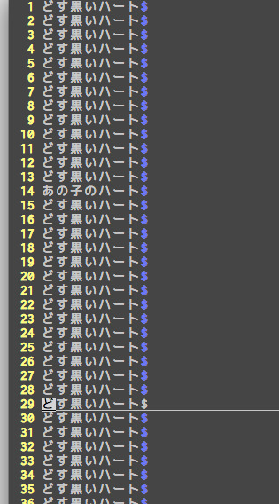
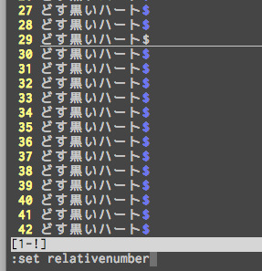
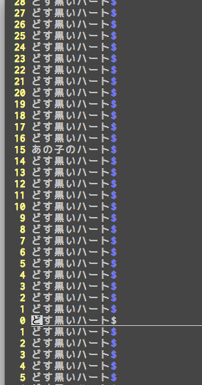
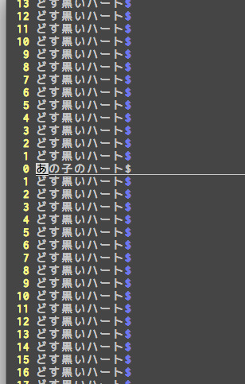

今日、Vimでとてもいい設定項目を知って、とても嬉しかったのでブログに残しておきます。

**set relativenumberやばい！**

## set relativenumberとは

何がどうやばいかというと、10行分上移動とか13行分下移動とかのときに、Vimだと `10k` とか `13j` とか打ちますが、そんなときに、

**『この行だいたい10行ぐらい上にあるんだけどなー』**

と思って `10k` と打つと、

**『あ、ちょっとずれちゃったよ・・・（数えるのめんどい・・・）』**

って感じで、特定の行が今よりちょうど何行あるのかが分かりづらかったので、毎回ずれちゃってました。

そんな悩みも `set relativenumber` で全て解決！

## 設定方法

お使いの `.vimrc` に以下の行を入れるだけ！

```
set relativenumber
```


## どう変わるの？

さくっとキャプチャとったので順にご覧ください。



うーん、これだとあの子のハートは狙い撃ちできませんねー。数えないと難しい・・・。



ここで set relativenumber を設定します。



**ドン！**

すると、今居る行が 0 になって、上下に 1, 2, 3... と並ぶので、あの子のハートが15行上にあることが分かります！



`15k` と打って、**あの子のハートを狙い撃ち！**
