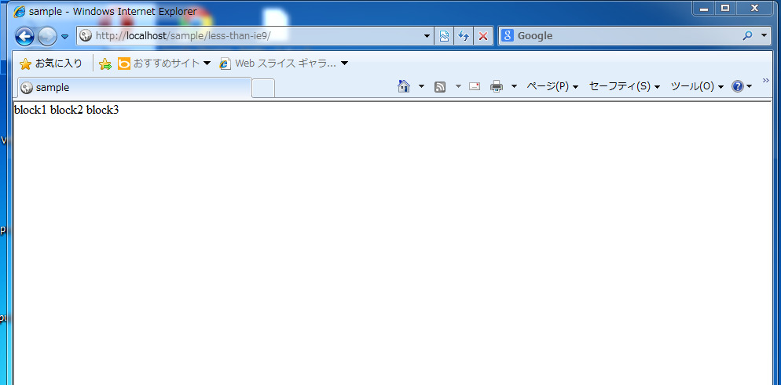
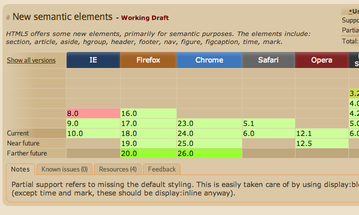

個人的には、

1. **IE8以前** のブラウザが対応ブラウザに入っていて、
2. かなり公共性の高いと思われる（≒ **JavaScriptの動作によらず閲覧できる** 必要あり）

というケースでは、 **HTML5の新しいタグは使ってはいけない** と思っています。

実際に書いてみて考えてみようと思います。

## 試しにHTML書いてみる {#try}

こんな感じのものを書いてみました。

```html
<!doctype html>
<html lang="ja">
  <head>
    <meta charset="utf-8">
    <title>sample</title>
    <link rel="stylesheet" href="index.css">
  </head>
  <body>
    <header class="block1">
      block1
    </header>
    <section class="block2">
      block2
    </section>
    <footer class="block3">
      block3
    </footer>
  </body>
</html>
```

スタイルシートは省略しますが、実際に表示するとこんな感じになりました。


さて、これをIE8で見てみます。わくわく。



**これはひどい。**

崩れというか、もうスタイルがあたってないです。 スタイルがあたってないせいで、ブロックの大きさも判別できず、色もついていないです。

## 古いブラウザでのHTML5のタグの解釈について {#parse}

IE8以前と書きましたが、そもそもHTML5の新しいタグは、どのブラウザで解釈ができるのかをまず調べてみます。



http://caniuse.com/#feat=html5semantic

こちらのサイトに各種ブラウザのサポート具合がまとめてあるのですが、その中の『New semantic elements』がそれにあたります。

これによると、HTML5の新しいセマンティックな要素はIE8以前じゃ効きませんよー、とあります。

こういうときは、html5shiv.jsを読み込んで、対応してないブラウザで未知の要素として扱われてしまうsection, headerなどの要素を、きちんと解釈させる必要が出てきます。（html5shiv.jsの話は、また別の機会に書けたらいいな）

```html
<!doctype html>
<html lang="ja">
  <head>
    <meta charset="utf-8">
    <title>sample</title>
    <link rel="stylesheet" href="index.css">
    <!–[if lt IE 9]>
      <script src="html5shiv.js"></script>
    <![endif]–>
  </head>
  <body>
    <header class="block1">
      block1
    </header>
    <section class="block2">
      block2
    </section>
    <footer class="block3">
      block3
    </footer>
  </body>
</html>
```

IEで有効となる条件付きコメントではさみつつ、html5shiv.jsを読み込む記述を入れてます。

このスクリプトを読み込むことで、HTML5の新しいタグで書かれたページを上手く意図通りに表示することができます。

逆に言うと、JavaScriptが動作していない場合にHTML5の新しいタグを読み込むと、上記のキャプチャのような大幅に崩れた意味をなさないページになってしまうため、

1. **IE8以前** のブラウザが対応ブラウザに入っていて、
2. かなり公共性の高いと思われる（≒ **JavaScriptの動作によらず閲覧できる** 必要あり）

というケースでは、新しいタグを使わずに書いた方が良いと思います。

## じゃあ、新しいdoctype宣言も使ったらダメなんじゃないの？

ちなみに、一番上にあるdoctype宣言については、元々は `で考えられていたのですが、古いIEなどでもきちんと標準準拠モードで解釈されつつ、極力シンプルになるように` に結局落ち着いたという経緯があるようです。

一般的な用語として、今正しく動くものが将来出て来るであろう新しいバージョンで動くことが予想されるものを **前方互換性(forward compatibility)** 、その逆に今正しく動くものが、過去のバージョンで動くことが予想されるものを **後方互換性(backward compatibility)** と言います。

それとは別に、ブラウザのレンダリングモードには、 **後方互換モード** と **標準準拠モード** があり、最近では **標準準拠モード** でのレンダリングが求められます。（ここでいう後方というのは、IE6よりも前の話ですね。）

つまり、新しい書き方をしつつ、古いIEなどで標準準拠モードでレンダリングさせるためには、後方互換性を持たせた記述の仕方が必要となり、&#8220; となった、という話です。ちょっとややこしいですね。

なので、レアケースであったとしても、新しいタグさえ使わなければ新しいdoctype宣言の書き方でも問題ないようなので、 **今すぐにでも使って良さそうです。** ただし、先ほども言ったようなレアケースも頭の片隅に入れつつ、積極的にHTML5を取り入れていけるといいのではないでしょうか。

## 条件付きコメントの書き方（おまけ）

ちなみに、条件付きコメントにある `lt IE 9` というのは、 **less than IE 9** のことで、IE9未満という意味になります。

```html
<!--[if lt IE 9]>
  <script src="html5shiv.js"></script>
<![endif]-->
```

IE8以下、という意味合いで書きたいのなら、

```html
<!--[if lte IE 8]>
  <script src="html5shiv.js"></script>
<![endif]-->
```

`lte IE 8`のように書くと、**less than equal IE 8** になるので、IE8未満と、IE8、つまりIE8以下という意味になりますね。

どちらも結局IE8以下のものを指します。

## 参考URL {#ref}

- [html5shiv.js](http://code.google.com/p/html5shiv/)
- [DOCTYPE of HTML5（HTML5でのdoctype宣言についての経緯など）](http://annevankesteren.nl/2005/07/html5-doctype)
