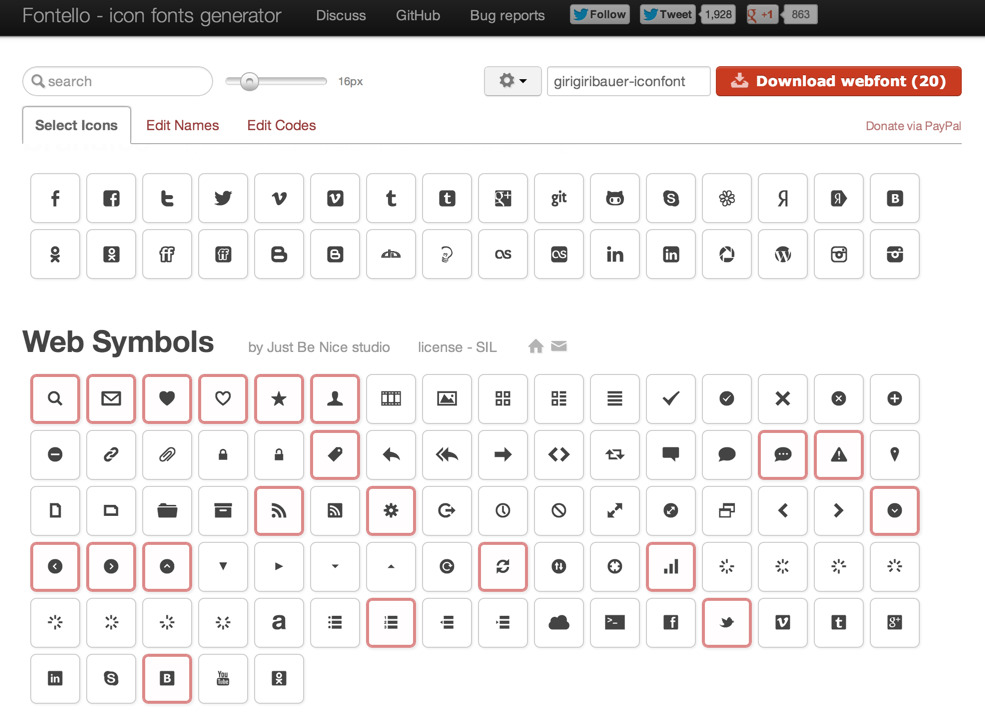
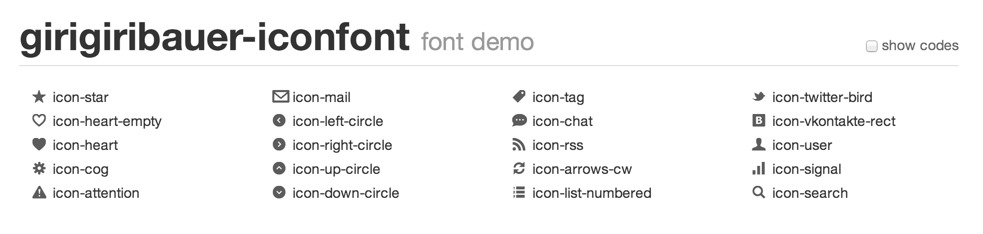

表示スピードを速くするために、ベクターデータであるSVGを用いるのは、最近よく見られる手法だと思います。

ただ、特に古いIEなどでは、SVGはサポートが十分ではない側面があると思います。 そのデメリットを解消する方法の1つとして、**アイコンフォント**という手法が挙げられます。

気になっていたので、このブログに導入しつつどんな感じか検証してみました。

## アイコンフォントとは

ヘッダーのアイコンがそれになってます。

拡大しても綺麗に表示されていますね！

こちらは、『Fontello &#8211; icon fonts generator』というのを利用させていただいて、 必要なアイコンのみを選択し、それをダウンロードして埋め込む形で導入しています。

[Fontello &#8211; icon fonts generator][3]

Webサービスを利用すれば、導入するだけならとてもシンプルです。 こちらをダウンロードすると、以下の形式のフォントデータが生成されます。

  * EOT形式（Embedded OpenType fonts）
  * WOFF形式（Web Open Font Format）
  * TTF形式（TrueType font）
  * SVG形式

**EOT形式**は、主にIEでサポートされているフォント形式です。 **WOFF形式**は、IE9+とそれ以外のモダンブラウザでサポートされています。 **TTF形式**は、IE9+で条件付き、とそれ以外のモダンブラウザでサポートされています。 最後に**SVG形式**は、フォントとしてもサポートされています。今現在では（古くなっているかもしれませんが）IEとFirefox以外で概ねサポートされています。

サポート具合の詳細に関しては、『Can I use』をご覧いただくと細かく分かるのではないかと思います。

<http://caniuse.com/#search=font>

ダウンロードファイルの中には demo.html も含まれており、組み込み例が掲載されていますので、そちらを参考にすると実装も素早くできると思います。

これを比較的そのまま持ってきています。**楽チンですね！**

各種ブラウザで、それに対応したフォントを使ってくれるので、実装する側も非常に楽です。

## アイコンフォントを使うメリット

アイコンフォントを使うメリットは何が挙げられるかというと、

  1. IE6からでも使える
  2. SVGとは異なり、一般的な方法で対応が出来る
  3. ベクターデータなので、拡大縮小に強い
  4. フォントなので、テキストに対するスタイルが一通り適用出来る

あたりではないかと思います。

**IE6から使える**というのは、先ほどの通りEOT形式でカバー出来ています。 EOT形式であれば、Webフォントとしての利用がIEでも可能であるため、 やっていることは単にテキストデータを表示するだけです。いわば**一般的な方法での対応**ですね。

**ベクターデータ**というのも、テキストデータであれば当たり前ですね。 自由にフォントサイズが変えられるのと同様に、アイコンフォントであってもフォントサイズが自由に変えることができ、 大きく表示したとしても綺麗に表示することが、上の画像の通り分かると思います。

**テキストに対するスタイルが一通り適用出来る**というのは、副次的効果として出てきます。 最近ではCSS3を用いたグラデーションであったり、影をつけたりも出来ちゃったりするので、 これも同様にアイコンフォントへの適用も可能です。

このあたりはKAYACさんのブログに綺麗にまとまっているので、そちらを参考になさると良いかと思います。

[意外と知らない？アイコンはWebフォントでつくるとこんなに便利！][5]

## アイコンフォントのデメリット

やってみて実感したのですが、逆にデメリットもあります。

上記の通り、フォントファイルは各種ブラウザに応じて複数用意してやる必要が出てきます。 仮に独自のアイコンを複数作って、それをアイコンフォント化しようとした場合、 まず自分でフォントファイルを作る必要があります。

上記の例では、外部のWebサービスを利用したため、かなりの面倒くさい部分を自動的にやってくれていたわけですが、 この**フォントを作る**という工程はかなり時間がかかると思います。大変ですね・・・。 （おまけに作ったフォントを複数種類に変換してやる必要も出てきます・・・。）

## アイコンフォントの使いどころ

この手間を考えると、場合によっては**導入すべき、導入すべきでないケース**が出てくると思います。

例えば、2〜3のアイコンをそのまま表示するだけなら、**スプライト画像なりbase64でHTML・CSSに埋め込む**などした方が良さそうです。 アイコンの大きさがそれほどでもなく、拡大もする必要がないのなら、ラスターデータとして持っておいて、リクエストを減らす方向へ考えた方が、**制作時間と表示時間を踏まえて考えると導入しない方が良い？**のではないかと思います。

逆に、アイコンをふんだんに使い、拡大縮小の表現を多く含み、かつアイコンがCSSのスタイルでカバーできる範囲のカラーリングで収まるようなコンテンツであれば、ある程度の手間をかけて導入するのはありかなーと思います。

以上を踏まえて、現状だとWebサービスを利用して導入するのが妥当で、それ以上は規模によっては割に合わないかも？という印象です。

## まとめ

さっと利用するだけならお手軽なのでおすすめですが、コンテンツの要素としてある程度多く用いるときは、**制作時間と表示時間との兼ね合いで検討すべき**かなーと思いました。

## 参考URL {#ref}

  * [Webフォントを分割、というか削りたい][6]
  * [Fontello &#8211; icon fonts generator][3]
  * <http://caniuse.com/#search=font>
  * [意外と知らない？アイコンはWebフォントでつくるとこんなに便利！][5]

 [3]: https://fontello.com/
 [5]: http://design.kayac.com/topics/2012/02/webFontIcons.php
 [6]: http://archiva.jp/web/html-css/webfont-trimed.html

