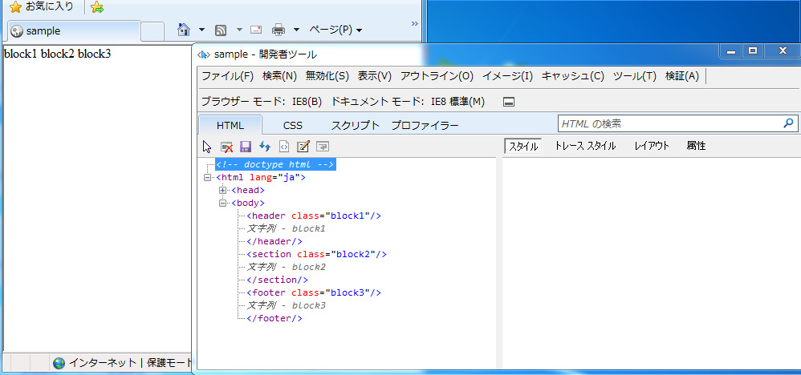
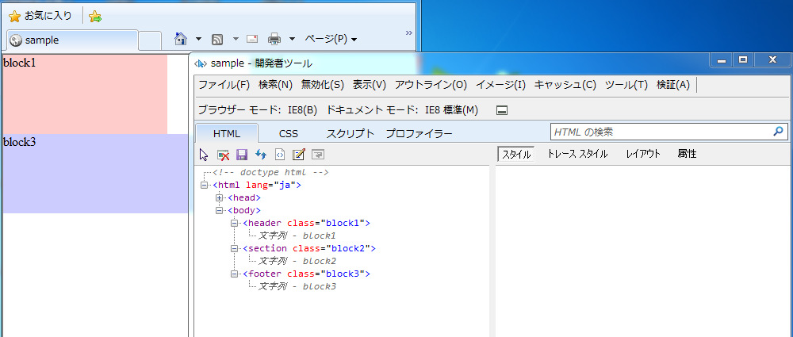

[HTML5のタグで書いてはいけないレアケース][1] にて、『html5shiv.jsを読み込んで・・・』みたいな記事を書いたのですが、そもそも html5shiv.js とは何でしょうか。

似たようなものの中に、html5.js, html5shim.js, html5shiv.js などが見られますが、これらの違いについても調べてみたいと思います。


## html5shiv.jsってなに？

html5shiv.js が読み込まれなかったとき、oldIEではどうなってしまうのかを、もう少し詳細に見てみたいと思います。



これは [HTML5のタグで書いてはいけないレアケース][1] で書いたサンプルページを、IE8の開発者ツールで見てみた時のスクリーンショットです。

```html
<!-- doctype html -->
<html lang="ja">
  <body>
    <header class="block1"/>
    文字列 - block1
    </header/>
    <section class="block2"/>
    文字列 - block2
    </section/>
    <footer class="block3"/>
    文字列 - block3
    </footer/>
```

DOMツリーを見てみると分かるように、oldIEから見ると未知の要素である header などが上手く解釈されず、 **header と /header の別要素だと解釈されてしまっています。** 閉じタグも1つの要素として解釈されてしまっていますね。

html5shiv.js では、 **基本的に読み込むだけ** で自動的に要素の解釈を行ってくれます。

1. 古いIEでのセクショニングコンテンツの認識
2. IE6-9（及びその他レガシーブラウザ）のベースのスタイル付与

1.に関しては、そもそも未知の要素なので、要素としての認識が上手く行われていません。これをDOMツリーの構築前に内部で `document.createElement('header')` などを呼ぶことで、要素として認識させることができます。 このあたりの話は、[The Story of the HTML5 Shiv][3] という形でまとまっています。

また、未知の要素であるため、デフォルトのスタイルもあたっていません。 こちらに関しては、IE9も含めてデフォルトのスタイルがあたってない場合がありますので、header, sectionなどの未知の要素に `display: block` をあてて、他にスタイルがあたってない状態でも、崩れがおきないようにしてくれます。

ついでに html5shiv.js を適用した後でDOMツリーがどうなっているかも見ておきます。



きちんとDOMツリーが正しく構築され、描画も意図通りに行われています。


## html5.js と html5shiv.js の違い

一言でいうと、html5shiv.js のが新しいのでこちらを使うべきです。

詳しい話は、 [IE対応でよく利用するhtml5shivの使用方法変更について](http://www.skyward-design.net/blog/archives/000134.html) に、もうそのまんま掲載されているので、こちらとこちらの記事内で紹介されているリンク先を参考にされると良いかと思います。

こちらが、そのさらに参照先ですね。[html5shiv and Serving Content From Code Repositories](http://zoompf.com/2012/05/html5shiv-and-serving-content-from-code-repositories)

最新じゃないし、キャッシュもされないし、圧縮もされてないし・・・などの点がもろもろまとめられています。


## html5shiv と html5shim の違い

shiv と shim の違いは v と m の違いでしかないですよー、それ以外は全部一緒ですよーと言われています。

[html5shiv &#8211; shiv or shim?](http://code.google.com/p/html5shiv/#shiv_or_shim?)

ただ、**shiv のがかっこいい** らしいです。

## まとめ

仮に上記の話が難しくて良く分からなかったとしても、結局のところ **html5.js よりは html5shiv.js のが新しくて素敵なので、こっちを使ってね** 、ということですね。

IE6-8では基本読み込むだけで利用できますし、IE9でもベースのスタイルがあたるので読み込んでおくと良いかもしれません。

## 参考URL {#ref}

- [html5shiv](https://github.com/aFarkas/html5shiv)
- [IE対応でよく利用するhtml5shivの使用方法変更について](http://www.skyward-design.net/blog/archives/000134.html)
- [html5shiv and Serving Content From Code Repositories](http://zoompf.com/2012/05/html5shiv-and-serving-content-from-code-repositories)

 [1]: /archives/690/
 [3]: http://paulirish.com/2011/the-history-of-the-html5-shiv/
