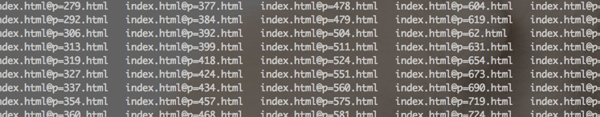
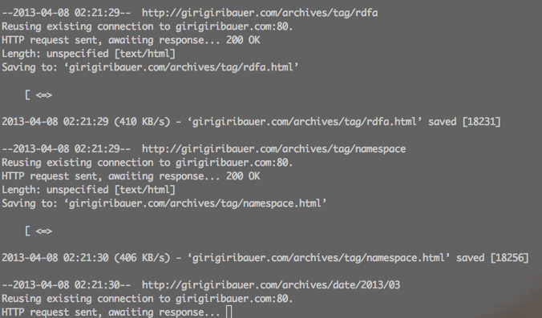

**ええ、知りませんでした。無知もいいところです・・・。**

webコンテンツをざっくりローカルで見られるようにしたいなー。と思って、いろいろぐぐってました。

基点のURLからリンクやらリソースやらを辿って、それらをすべて落としてきて、 そこからさらにパスとかを変換してやればいいのかなーとか思っていたのですが、 ぐぐってみると、もうすでに **全部やってくれる便利なコマンドがある** のではないですか。

それが、wget というソースコードをダウンロードするのによく使うコマンドだったことに驚きでした。

ちなみに mac は入ってないっぽいのでさくっと入れました。

    brew install wget

普通の使い方は、wget のあとにダウンロードしたい URL を続けて引数として渡してやるだけです。

    wget example.com/path/to/contents.tar.gz

GUI の無い環境などで、何かアプリケーションをインストールするときなど、tarball や zip などで固められた圧縮ファイルを、コマンドライン上から落としてくるようなシーンでよく使うのではないかと思います。 実際僕もそれしか知りませんでした。

**だがしかし！**

ぐぐってみると色々なオプションがあるらしいじゃないですか。さっそくオプション読んでみましょう。

    man wget

## webクローラーとしての wget

`--recursive` やら、`--convert-links` やら、便利なオプションが色々あります。

使えそうなやつ、面白そうなやつをピックアップしてみます。

### &#8211;recursive, -r

再帰的にリンクを辿ってくれます。求めてたのはまさにこれだー。

### &#8211;level=depth, -l depth

どこまで辿るのか指定できます。 デフォルトは5階層のようですが、`--level=inf` と指定することで、いけるところまで辿ってくれるようですね。素敵だー。

### &#8211;convert-links, -k

ちゃんとローカルでも（webサーバ動いてなくても）閲覧できるように、相対パスに書き換えてくれます。 **素敵すぎる！**

### &#8211;no-clobber, -nc

同じパスにすでにファイルがあった場合、file.1, file.2 のように別名ではなく、上書きしてくれます。とりあえずざっと閲覧できるものが欲しいときは（動的にコロコロ内容が変わるものでなければ）、つけておいた方が良さげ。

### &#8211;random-wait

ファイルを一気にダウンロードすることになるので、サーバ側からしてみたら一気にリクエストを受け付けることになります。 攻撃と勘違いされないよう、適度に空き時間を作ってくれるオプションです。 何回かのリクエストの後、0.5秒から1.5秒の空き時間を自動的にとってくれます。 **賢い〜。**

### &#8211;restrict-file-names=modes

例えば、 index.html?p=123 みたいなパスを、そのまま保存して閲覧すると、Windowsではエンコードの関係上うまく閲覧できません。

そんなときに、&#8211;restrict-file-names=windows とつけてやることで、使えない文字を別のものに置き換えてくれます。

ダウンロードされるファイル名もリネーム済みで、ファイルの中身のパス部分もリネーム後のリンクになっています。 **素敵すぎるじゃないですか！**

### &#8211;adjust-extension, -E

URLにクエリ文字列がついたり、サーバサイドプログラムで動的に生成されたりするものは、URLの最後が .html になっていないことが多いです。

これらのURLを、最終的に .html で終わるように調整してくれます。 **なんというおもてなし機能なんだ・・・。**

### &#8211;no-parent, -np

再帰的にダウンロードしてるときに、親に辿らないようにしてくれます。今回はつけておくべきですね。

### &#8211;mirror, -m

最後にミラーリングのオプションもあります。これは、以下の複数オプションをつけたときと同じようです。

    -r -N -l inf --no-remove-listing

つまり、 -r(&#8211;recursive), 再帰的にダウンロードして、 -N(&#8211;timestamping), タイムスタンプをチェックして新しいものを保持して、 -l inf(&#8211;level=inf), いけるとこまで辿るあたりの略ですね。

&#8211;no-remove-listing, これはFTPによる接続を用いたときのオプションで、FTPで引っ張ってくるときに生成される .listing ファイルを、消さずにとっておくオプションです。今は目的から考えて不要ですね。

### 必要なオプション全部つけて試してみる

これらをざっと見たうえで、必要なオプションを全てつけて試してみます。

    wget --recursive
    --level inf
    --no-clobber
    --random-wait
    --restrict-file-names=windows
    --convert-links
    --no-parent
    --adjust-extension
    example.com

いやー、試してみましたけど、wget が便利すぎます。

普段 tarball のダウンロードくらいしかやってなかったのですが、wget が「今から本気出す」と言っているかのようです。すごい。

## まとめ

当然のことながら、クライアントサイドで動く JavaScript なんかは、動作したものが HTML ファイルとして落とせるわけではないので、そのページを開いて非同期に処理がなされる類のものは落とせません。

そういう意味で、 **ざっくりローカルで見たい場合に用途は限られる** とは思いますが、知ってて損は無いツール（というかオプション）ではないかと思います。

というか、知らなかったから損をしていたという言い方のが正しいですね。ホント、無知は罪です。。。

## 参考URL {#ref}

  * <http://d.hatena.ne.jp/kanonji/20121011/1349931815>
  * <http://d.hatena.ne.jp/ctrlshift/20080129/1201612626>
