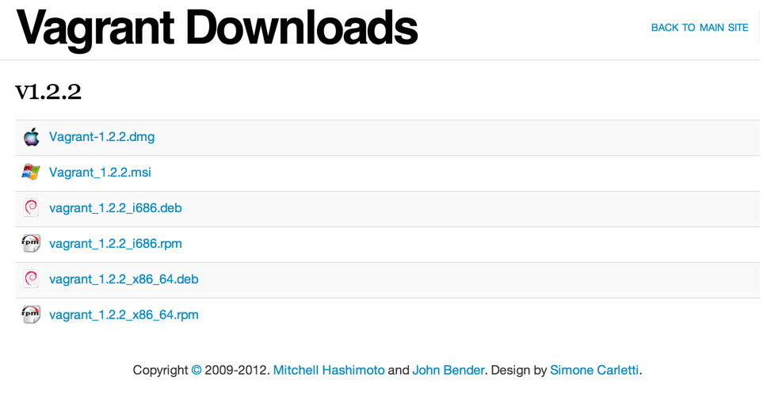
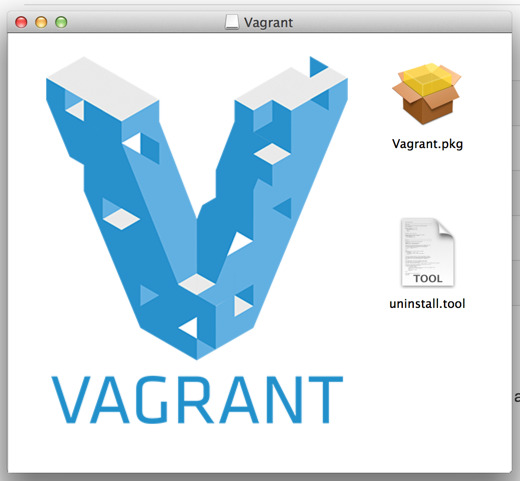
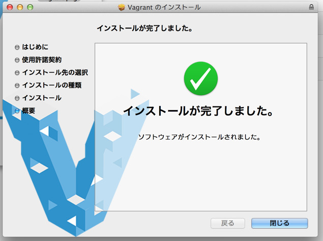
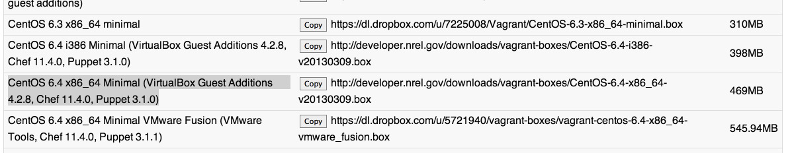

もう最近では、OSの上にOSを動かす仮想環境が当たり前になってきていますが、そのソフトウェアの1つに **VirtualBox** というものがあります。

**Vagrant** は、元々この VirtualBox を CUI（コマンドライン）でいじれるツールだったのですが、 バージョン1.1以降で VirtualBox 以外のソフトウェアにも対応してくれるようになったため、 今では VirtualBox に限らず使えます。

ちなみに個人としては、Windows に関しては描画の再現性なども考慮して、Mac 上で **VMWare Fusion** （有料）を起動して、その上に Windows7 やら Windows8 やらをインストールして検証用に使っています。（それでもさくさく動く Retina MacBook Pro 最高ですね！）

一方で、サーバ用途に用いられるような、描画の再現性を考えなくてもよいOSについての検証は、VirtualBox を起動して、その上に CentOS などを入れて今後検証していこうかなと考えています。（まだまだこれからです）

このような、後者のサーバ用途に用いるOSの検証で、いちいち VirtualBox（や他のソフトウェア） を GUI から立ち上げて、GUI でぽちぽちとインストールを行って、起動させるような作業を毎回繰り返す場合、Vagrant はかなり役に立ってくれるのではないかと思います。

まずは Vagrant の準備の仕方や考え方などを軽くまとめてみました。

## VirtualBox, Vagrant のインストール

まず、事前に VirtualBox を入れておきます。（Vagrant 1.1 からは必ずしも VirtualBox ではなくてもいいのですが、前述の通り今回はサーバ用途で VirtualBox を使うという前提での準備なので、VirtualBox でやります）

Vagrant の 1.0 も入れたことがあるのですが、こちらは `gem install vagrant` で一発インストールだったのに比べ、1.1以降は専用のパッケージをインストールします。（ちなみに記事書いてる時点の最新は、1.2.2 のようです）

なんか開発速度がめちゃ早いので、あとでこの記事見返したらバージョン古くなってることでしょう。

あとは普通にインストールをしていきます。

はい、インストール完了しました。

    $ which vagrant
    /usr/bin/vagrant

この時点で、vagrant というコマンドが用意されていると思うので、 ここから先は vagrant コマンドとそれに続くサブコマンドで、仮想環境を作って行きます。

ちなみに help は、`vagrant -h` で出ます。

    $ vagrant -h
    Usage: vagrant [-v] [-h] command [<args>]

        -v, --version                    Print the version and exit.
        -h, --help                       Print this help.

    Available subcommands:
         box
         destroy
         halt
         init
         package
         plugin
         provision
         reload
         resume
         ssh
         ssh-config
         status
         suspend
         up

    For help on any individual command run `vagrant COMMAND -h`

## Vagrant でよく使う名前とかコマンドとか

僕もそんなに物理PCのセットアップを数多くやってきているわけではないのですが、 ここから先は物理PCのセットアップの、どの作業に対応しているかを考えながらやった方が イメージがしやすいのではないかと思います。

  1. ボックスを用意する（物理PCにおけるインストールディスクを用意する、に近い）
  2. 仮想マシンのインストール（物理PCにおける物理マシンのインストール、に近い）
  3. インストール後の設定など

こんな感じの流れで進めていきます。

## ボックスを用意する

まずはボックスを追加してやる必要があります。このボックスから仮想マシンを作るため、**例えるならインストールディスクを用意する工程に相当**するのかもしれません。

ボックスを追加するコマンドは `vagrant box add` なので、とりあえず help でもみてみます。

    vagrant box add -h
    Usage: vagrant box add <name> <url> [--provider provider] [-h]

        -f, --force                      Overwrite an existing box if it exists.
            --insecure                   If set, SSL certs will not be validated.
            --provider provider          The provider that backs the box.
        -h, --help                       Print this help

この name というのは、例えるならインストールディスクに名前をつける行為に相当するので、 例えば CensOS のバージョン何々で・・・みたいな名前になるわけで、（あるいはOSやバージョンに紐づいた用途別の名前など）決して**仮想マシンのPC名になるわけではありません。** （僕はここで勘違いをして、変な名前をつけて混乱してました。）

また、url はボックスファイルが公開されている場所に相当します。ボックスファイルは、各OS、ディストリビューション、初期で入ってるアプリケーションごとに色々以下に用意されています。ありがたいですね。

<http://www.vagrantbox.es/>

そもそもこのボックスファイルというのは何なのか、というところなのですが、実はこれ自分で作れます。

[vagrant ユーザよ、その VM は安全なのか? (veewee のすゝめ) &#8211; Hack like a rolling stone][4]

確かにやろうと思えば、不正なプログラムをこっそり入れたボックスファイルを公開して、ってのも全然出来なくない話なので、 相当な信頼性を求められるようなものであれば、こういった自分で作る方法も検討すべきなのですが、 今回はそうではないので vagrantbox.es を利用させていただきます。

また、自分で作る方法を見ればなんとなく予想がつくように、ボックスファイルは配布されている ISO ディスクイメージに 設定ファイルを合わせたようなものにすぎないため、ほぼ公開されているディスクイメージに近いものだと考えてもよさそうです。

### どれを選べばいいの？

この辺は、知らないキーワードがあれば1つずつぐぐりながら調べていくしかないのですが、 今回はサーバ用途の検証に使うので、よくある VPS（Virtual Private Server）構成に近いものを選びます。

  * CentOS の現時点での最新であるバージョン 6.4
  * 64ビット (i386 が32ビット, x86_64 が64ビットで、最近はほぼ全て64ビット）
  * GUI で立ち上げたときの必要な設定は予めやっといてほしい（Guest Additions）
  * 余計なアプリケーションが入ってない最小構成（Minimal）
  * あとでアプリケーションのインストールとかも自動化したい（Chef or Puppet）

と考えると、これが一番適してそうに思えます。

わざわざコピーボタンがついているのは、`vagrant box add` の url のところにコピペするためです。

    $ vagrant box add CentOS_6.4_x86_64_Minimal http://developer.nrel.gov/downloads/vagrant-boxes/CentOS-6.4-x86_64-v20130309.box
    Downloading or copying the box...
    Progress: 9% (Rate: 3033k/s, Estimated time remaining: 0:02:47))

こんな感じで、名前をつけてやりつつ、さっきのURLを指定してボックスを作成し始めると、まずはダウンロードが開始されます。

ちなみに、名前のところに無駄に半角スペースが入っていると、どこが name でどこが url なのかが分からなくなるので、**バックスラッシュで半角スペースの手前をエスケープするとか、そもそも半角スペースやめるとか**しましょう。

ボックスファイルが羅列してあったさっきのページを見てみると分かるように、ボックスファイルはほぼディスクイメージなので重いです。 まったりコーヒーでも飲みながら気長に待ちましょう。

### ボックスファイルが用意出来たかどうかの確認

`vagrant box -h` で help を見てみます。

    $ vagrant box -h
    Usage: vagrant box <command> [<args>]

    Available subcommands:
         add
         list
         remove
         repackage

    For help on any individual command run `vagrant box COMMAND -h`

`list` というサブコマンドがあるので、`vagrant box list` と入力してみます。

    $ vagrant box list
    CentOS_6.4_x86_64_Minimal (virtualbox)

おーー、出来ておりますね。これでボックスは用意できました。

### ちなみにボックスを削除するときは

    $ vagrant box remove -h
    Usage: vagrant box remove <name> <provider>
        -h, --help                       Print this help

サブコマンドとして remove がありますね。name, provider（仮想マシンが動くソフトウェア、ここでは virtualbox）を指定してやればいいようです。

    $ vagrant box remove CentOS 6.4 x86_64 Minimal virtualbox
    Removing box 'CentOS 6.4 x86_64 Minimal' with provider 'virtualbox'...

試しに半角スペースありの名前で作ったボックスファイルを消しました。

### ボックスファイルはいずこへ？

実は、この時点でもうホームディレクトリに .vagrant.d というディレクトリが出来ていて、 その下の boxes ディレクトリにボックスファイルが格納されています。

    $ cd ~/.vagrant.d/boxes/

この下にある virtualbox ディレクトリの中に、実体である box-disk1.vmdk というファイルが用意されているので、 仮想マシンのインストールは、これらを元に行うことになります。

**ちなみに、まだボックスファイルを用意しただけなので、仮想マシンは何にも出来てません。** これも僕が初期に勘違いしてたところで、今はまだインストールディスクを用意しただけにすぎないのですね。

## 仮想マシンのインストール

仮想マシンを作る前に、仮想マシンの置き場所へ移動してからインストール作業を始めた方が良さげです。

さっきのはボックスファイルなので、自動的に .vagrant.d 以下へ格納されますが、仮想マシンは別の場所へ作る必要があります。

    $ mkdir ~/Vagrant
    $ cd ~/Vagrant

僕は ホームディレクトリに Vagrant というディレクトリを区切って、そちらで作業することにします。

### 仮想マシンの設定ファイルを準備する（Vagrantfile）

さてさて、早速 help を漁りましょう。

    $ vagrant -h
    Usage: vagrant [-v] [-h] command [<args>]

        -v, --version                    Print the version and exit.
        -h, --help                       Print this help.

    Available subcommands:
         box
         destroy
         halt
         init
         package
         plugin
         provision
         reload
         resume
         ssh
         ssh-config
         status
         suspend
         up

    For help on any individual command run `vagrant COMMAND -h`

`init` というサブコマンドがあります。これを使ってボックスファイルから仮想マシンをインストールしてみます。まずは help から。

    $ vagrant init -h
    Usage: vagrant init [box-name] [box-url]
        -h, --help                       Print this help

box-name は、オプションになっていますが、先ほどのボックスファイル名を指定します。

    $ vagrant init CentOS_6.4_x86_64_Minimal
    A `Vagrantfile` has been placed in this directory. You are now
    ready to `vagrant up` your first virtual environment! Please read
    the comments in the Vagrantfile as well as documentation on
    `vagrantup.com` for more information on using Vagrant.
    $ ls
    Vagrantfile

`vagrant init [box-name]` を実行すると、同一ディレクトリ内に Vagrantfile なるものが生成されます。 早速これを覗いてみましょう。

    # -*- mode: ruby -*-
    # vi: set ft=ruby :

    Vagrant.configure("2") do |config|
      # All Vagrant configuration is done here. The most common configuration
      # options are documented and commented below. For a complete reference,
      # please see the online documentation at vagrantup.com.

      # Every Vagrant virtual environment requires a box to build off of.
      config.vm.box = "CentOS_6.4_x86_64_Minimal"

      # The url from where the 'config.vm.box' box will be fetched if it
      # doesn't already exist on the user's system.
      # config.vm.box_url = "http://domain.com/path/to/above.box"

      # Create a forwarded port mapping which allows access to a specific port
      # within the machine from a port on the host machine. In the example below,
      # accessing "localhost:8080" will access port 80 on the guest machine.
      # config.vm.network :forwarded_port, guest: 80, host: 8080

      # Create a private network, which allows host-only access to the machine
      # using a specific IP.
      # config.vm.network :private_network, ip: "192.168.33.10"

      # Create a public network, which generally matched to bridged network.
      # Bridged networks make the machine appear as another physical device on
      # your network.
      # config.vm.network :public_network

以下ずらずらとコメント行が続きますが、まずは config.vm.box のところに指定したボックスファイル名が 入っていることが確認できます。

また、コメントから3種類のネットワーク設定が可能であることが分かります。

  1. ポートフォワーディング（ゲストOSの特定ポートを、ゲストOSの別ポートにつなぐ）
  2. プライベートネットワーク
  3. パブリックネットワーク（ブリッジ接続）

このあたりの設定は、仮想環境を作る際に検討すべき、ホストOS（今いじってるOS）とゲストOS（今作ろうとしてるOS）とをどのように接続するかの話になってきます。

コメント状態のまま仮想マシンを立ち上げると、NAT接続で繋がると思うので、この辺は最初はいじらないでおきます。 NAT接続は、ざっくり言うとゲストOSからの通信が、外から見るとあたかもホストOSが通信しているかのように見えます。

それ以外にも、コメントにいろいろ「こんな設定できるよー」と書いてあるので、読みながら試してみるのも良いのではないでしょうか。 VirtualBox の GUI から設定出来ることは、この設定ファイルから設定できるはずです。

## Vagrant up で仮想マシンの電源オン

`vagrant up -h` で help を読んでみます。

    $ vagrant up -h
    Usage:vagrant up [vm-name] [options] [-h]

            --[no-]provision             Enable or disable provisioning
            --provision-with x,y,z       Enable only certain provisioners, by type.
            --[no-]parallel              Enable or disable parallelism if provider supports it.
            --provider provider          Back the machine with a specific provider.
        -h, --help                       Print this help

vm-name がオプションになっていますが、一旦仮想マシンは1つだけにしておくので、 複数作って名前を指定するのはまたの機会にしておきます。

ということで、オプションなしで実行します。

    $ vagrant up
    Bringing machine 'default' up with 'virtualbox' provider...
    [default] Importing base box 'CentOS_6.4_x86_64_Minimal'...
    [default] Matching MAC address for NAT networking...
    [default] Setting the name of the VM...
    [default] Clearing any previously set forwarded ports...
    [default] Fixed port collision for 22 => 2222. Now on port 2201.
    [default] Creating shared folders metadata...
    [default] Clearing any previously set network interfaces...
    [default] Preparing network interfaces based on configuration...
    [default] Forwarding ports...
    [default] -- 22 => 2201 (adapter 1)
    [default] Booting VM...
    [default] Waiting for VM to boot. This can take a few minutes.
    [default] VM booted and ready for use!
    [default] Configuring and enabling network interfaces...
    [default] Mounting shared folders...
    [default] -- /vagrant

実行するとすぐに、**「マシン名は &#8216;default&#8217; にしておいてやったぜ」**という表記が出ます。 Vagrantfile に設定がなかったので &#8216;default&#8217; という仮想マシンを作ろうとしています。

また、ネットワークの設定も特にしていないので、**「ネットワークは &#8216;NAT接続&#8217; にしておいてやったぜ」**という表記が出ます。

さらに、**「ssh の 22番ポートが衝突しちゃうから 2201 で接続できるようにしておいてやったぜ」**という表記も出ています。

**・・・けっこう色々初期設定で便利な感じにやってくれてますね。**

ついでに /vagrant という共有ディレクトリも用意してくれているようです。

### もう立ち上がってるの？？？

実はもう電源オンの状態になっています。コマンドラインなので実感が湧かないかもしれません。

そういうときは、立ち上がっているかどうかを確認する `status` というサブコマンドを使ってみます。

    $ vagrant status
    Current machine states:

    default                  running (virtualbox)

    The VM is running. To stop this VM, you can run `vagrant halt` to
    shut it down forcefully, or you can run `vagrant suspend` to simply
    suspend the virtual machine. In either case, to restart it again,
    simply run `vagrant up`.

&#8216;default&#8217; という仮想マシン（さっき作りました）が、 &#8216;running&#8217; つまり動いていると。

ついでに止めたいときは &#8216;vagrant halt&#8217; と打てばいいよ、と教えてくれています。

まだまだこれだけだと、普通に1台インストールしただけなので良さは体感できないかもしれませんが、 これが**複数台になった場合**や、**ちょっとだけ設定変えて別々にインストール**、みたいな状況だと、 この設定ファイルの利点が出てくるのではないかなーと思います。

とにかくこれでもうインストール完了してます。便利だなー。

## インストール後の設定など

動いているとはいえ、とりあえず接続してログインまではやりたいですよね。

さて、再び help 漁りをしてみます。

    $ vagrant -h
    Usage: vagrant [-v] [-h] command [<args>]

        -v, --version                    Print the version and exit.
        -h, --help                       Print this help.

    Available subcommands:
         box
         destroy
         halt
         init
         package
         plugin
         provision
         reload
         resume
         ssh
         ssh-config
         status
         suspend
         up

この中に、`ssh` と `ssh-config` があります。 ssh でつなぐためには、`vagrant ssh-config` で表示された内容を、ホームディレクトリにある **~/.ssh/config** に入れてやればOKです。

    $ vagrant ssh-config
    Host default
      HostName 127.0.0.1
      User vagrant
      Port 2201
      UserKnownHostsFile /dev/null
      StrictHostKeyChecking no
      PasswordAuthentication no
      IdentityFile "/Users/[your-name]/.vagrant.d/insecure_private_key"
      IdentitiesOnly yes
      LogLevel FATAL

※~/.ssh/config は、複数のSSHの設定を管理するテキストファイルで、各接続先の接続方法やら、鍵ファイルの場所やらを記述しておくことで、接続時にパスワードなど打たずに接続が可能と成ります。（詳しくはグーグル先生にでも・・・）

接続設定を **~/.ssh/config** に追加したら、そのまま `vagrant ssh` を実行してみます。

    $ vagrant ssh
    Welcome to your Vagrant-built virtual machine.
    [vagrant@localhost ~]$

おお〜〜、接続できました。どうやら初期設定で **vagrant** というユーザーを作っているようです。 本当に作った仮想マシンに接続できているか、いくつかコマンド打って確認してみます。

    $ uname -a
    Linux localhost.localdomain 2.6.32-358.el6.x86_64 #1 SMP Fri Feb 22 00:31:26 UTC 2013 x86_64 x86_64 x86_64 GNU/Linux
    $ cat /etc/redhat-release
    CentOS release 6.4 (Final)

うん、間違いなく作った仮想マシンに接続出来ています。

## まとめ

とりあえず仮想マシンのインストール、接続確認までですが、思った以上にめんどくさいところが初期設定として用意されていて、 正直ちょっとわくわくしました。

たぶんコマンドラインで仮想マシンを構築する真価が発揮されるのは、もうちょっとやった先になるとは思いますが、とりあえず1台インストール出来たので、今回はここまでにしたいと思います。

続き: [Vagrant に仮想マシンのスナップショットがとれる sahara というプラグインを入れた][6]

## 参考URL {#ref}

  * [VirtualBox][7]
  * [Vagrant][8]
  * [Vagrant Documentation][9]
  * [Vagrant &#8211; naoyaのはてなダイアリー][10]
  * [Vagrantで簡単仮想マシン構築 | Ryuzee.com][11]
  * [Vagrantbox.es][12]

 [4]: http://tk0miya.hatenablog.com/entry/2013/03/15/115710
 [6]: /archives/1003/
 [7]: https://www.virtualbox.org/
 [8]: http://www.vagrantup.com/
 [9]: http://docs.vagrantup.com/v2
 [10]: http://d.hatena.ne.jp/naoya/20130205/1360062070
 [11]: http://www.ryuzee.com/contents/blog/4292
 [12]: http://www.vagrantbox.es/
