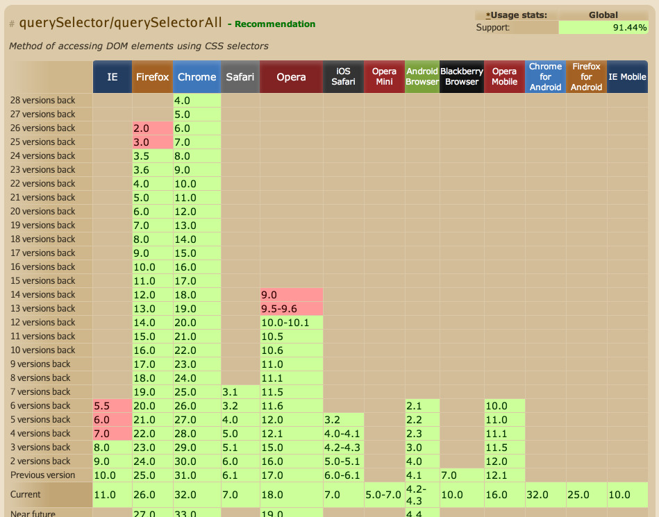
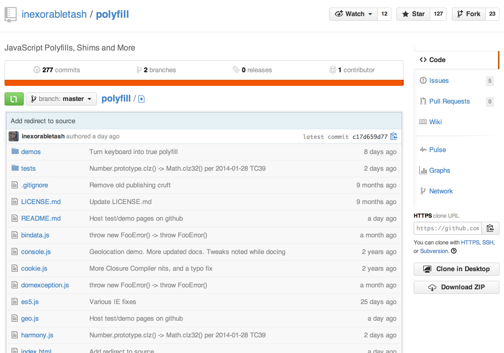
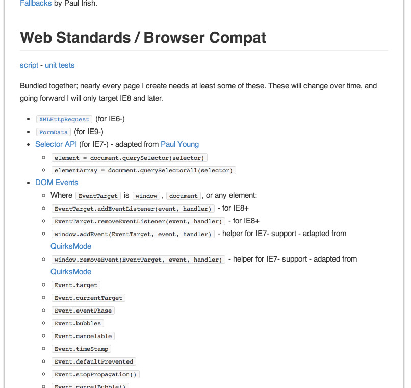

（2024 年追記）古い記事なので誰も見てないと思いますが、現在 polyfills を使うのは危険なのでやめましょう。もはや機能が足りなくて困るケースはないようなので、使う意味もないかと思います。 https://www.itmedia.co.jp/enterprise/articles/2406/29/news057.html （追記終わり）

jQuery というライブラリは非常に便利な JavaScript ライブラリであります。

## jQuery 便利！

いやー、便利ですよね。便利すぎて、JavaScript を書いて HTML 要素を何かしようと思ったときに、無条件で使用してしまうケースもけっこう多いのではないでしょうか。

ただ、知っている人は、jQuery のファイルサイズが若干重いことも知っています。

2014 年 2 月時点での jQuery の最新バージョンでファイルサイズを見てみると、

- jquery-1.11.0.js (277KB)
- jquery-1.11.0.min.js (95KB)
- jquery-2.1.0.js (240KB)
- jquery-2.1.0.min.js (82KB)

IE8 未満をばっさり切った 2.x 系だと、圧縮したもので 82KB あります。IE8 未満も含めた 1.x 系だと、圧縮したもので 95KB もあります。

また、jQuery にはプラグイン機構があるため、ライブラリのファイルに続けて、プラグイン用のファイルをいくつか読み込むことが多いと思います。

ファイルサイズの問題うんぬんもあるのですが、それに加えて**同時リクエスト数の問題**もあります。例えば画像ファイルなどであれば、例えば 6 ファイルなどを同時にリクエストすることが出来ますが、スクリプトのファイルだと、実行順などの問題もあるので、**スクリプトファイルを読み込んでいる最中は他スクリプトがストップしてしまう**ので、あれこれとプラグイン用のファイルを読み込んでいると、いつまでたっても全体の処理が終わらないことになります。

そのあたりの説明は、以下に詳しく載ってます。

<https://developers.google.com/speed/docs/best-practices/rtt?hl=ja&csw=1#CombineExternalJS>

### 「jQuery は甘え」という風潮

便利なライブラリである一方で、安易に使いまくる人に対して、甘えだーという人も一定数居ます。

個人的には、無理に使用を縛らずケースバイケースで普通に使っていくべきだとは思いますが、 ちょっとした処理をしたいときに毎回 「jQuery がないとダメ、何にもできない・・・。」みたいなのも少しずつ改めていくべきだとは思います。

例えば、class=”toggle” がついている要素を取得して何かしたい場合、 jQuery であれば以下のように書きます。

    var toggles = $('.toggle');

ただ、これくらいであれば、jQuery を介さずとも簡単に取得できます。

    var toggles = document.querySelectorAll('.toggle');

どちらもそれほど変わらない記述で class=”toggle” を含む要素を取得できるので、その後の処理によってはわざわざ jQuery を読み込まずとも、素の JavaScript でも問題なかったりしますね。

### クロスブラウザという現実的な問題

・・・という理想郷の話だったわけですが、現実はそう簡単にはいかないケースも多いです。

jQuery が吸収してくれているのは、こういったブラウザ間の JavaScript の実装差異だったりします。

例えば、先ほど書いた document.querySelectorAll の例ですが、 IE8 未満では実はサポートされていません。

<http://caniuse.com/#feat=queryselector>

この例だと、たまたま IE8 以上か IE7 以下かで分けられるので、 IE7 以前なんていいじゃん、というケースも出てくるかもしれませんが、 ブラウザの対応度合いは様々なので、その都度対応しているかどうかを考えて、 この場合はこうして・・・などと毎回考えていくのはあまり本質的ではありませんね。 やりたいことを解決するために時間を使った方が良いと思います。

## jQuery から卒業するための第 1 歩を polyfills から学ぼう

そこで本記事のタイトルです。

**polyfills（ポリフィル）**というのは、数年前から言われている概念なので、 知っている人もいくらかいるのではないかと思いますが、 モダンブラウザで普通に出来て、レガシーブラウザで出来ない機能を、既存の技術で（あるいはそれらの組み合わせで）同等のものを提供する、という手法です。

※ちなみに fallback（フォールバック）は、提供が難しいものに対してそれに近しいもので代替することを指すので、ちょっと違うと思います。

つまり、polyfills を利用して、レガシーブラウザ用に機能が足りてない部分を 補完してやることで、レガシーブラウザの場合にああしてこうして・・・といった部分の 考えるコストを一定低減することが出来ます。

### polyfills を知ることでブラウザの実装の歴史を知る

色んな方が polyfills を公開しています。

まとめられているページがこちら。

<https://github.com/Modernizr/Modernizr/wiki/HTML5-Cross-browser-Polyfills>

たくさんあるのですが、今回読んだのがこちら。

<https://github.com/inexorabletash/polyfill>

こちらでは、例えば JavaScript の仕様である ECMAScript の、 バージョン 5 に相当する ECMAScript5 (ES5) と見比べて、 不足している実装部分を **es5.js** として提供されていたり、 あるいは バイナリデータ（映像、音声など）を効率良く扱うための Typed Array の polyfills が **typedarray.js** として提供されていたりします。

その中で、**Web Standards / Browser** として提供されている polyfills、**web.js** というのがあります。

こちらは、上記に挙げたようなある特定の仕様に対して不足があるかどうか？というよりは、一般的に Web 標準で考えた場合に不足があるかどうか？を元に polyfills がまとめられています。 なので、こちらのコードを追っていくことで**逆にブラウザの実装の歴史が分かるのではないでしょうか。**

・・・ということで、前振りが長かったですが、一言で言うと、**『このリポジトリの web.js というファイルを順に読んでブラウザの実装差異について理解していこう！』**という記事になります。

## polyfills のソースコードリーディングを始めよう

早速 10 行目と 613 行目を抜粋します。

    if ('window' in this && 'document' in this) {
      //（中略）
    }

this は、通常ブラウザで読み込むと global に相当しますので、global に window と document がある場合にのみ処理されます。（要するに処理されます）

次は、18 行目から 21 行目です。簡単なところから始まってて（ブログ書きやすくて）良かったですね。

    //
    // document.head (HTML5)
    //

document.head = document.head || document.getElementsByTagName(&#8216;head&#8217;)[0]; 僕これ知らなかったのですが、HTML5 だと document オブジェクトに head プロパティがあり、 それが HTML 内の head 要素を指すのですね。

対応しているものは、document.head がそのまま使われるのですが、対応してないものは undefined を返すので、|| の後ろが実行されます。

document.getElementsByTagName は、getElementById と同じく 古い IE でも普通に使えます。 読んで字のごとく、要素（複数）をタグ名で取得するってことで、 head 要素を取得してから、それの一番最初のやつを使いますってことですね。

このように論理和（||）を用いて実装の差異を埋めてやることで、polyfills を上手く実現していることが見てとれます。

## まとめ

ちょっと前振りが長かったので一旦切りたいと思います。

このように、polyfills を順に追っていくことで、ブラウザの実装の歴史を知るのもなかなかお手軽で良いのではないでしょうか。

こちらのコードに書かれているような実装差異の吸収の仕方、テクニックを見ていくことで、ついでに自分が書くときにもプラスになるのでは？と思うので、これから順に見ていきたいと思います。

なお、最初の 8 行のコメントにもあるように、

    //----------------------------------------------------------------------
    //
    // Browser Polyfills
    //
    // This assumes ES5 or ES3 + es5.js
    // (polyfill.js is es5.js + web.js for convenience)
    //
    //----------------------------------------------------------------------

正確には polyfill.js 全体が es5.js と web.js の組み合わせで出来ていますが、今回は ES5 に注目して読むよりも、Web Standards な方に注目して見てみたい、という意図があったので、web.js の方を見ています。

なので、このまま読んでいくと、ES5 前提の記述をちらほら見かけます。これは予め es5.js の機能を読み込んでいるためです。次回以降の続きの記事でたぶん出てきますので予めご了承ください。

たぶん続きます。

追記： [続き書きました。](/tech/20140203/)
