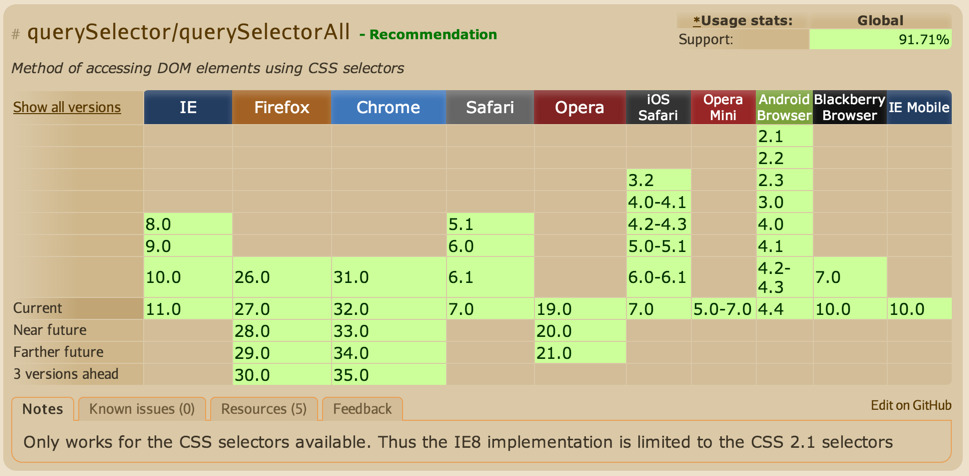
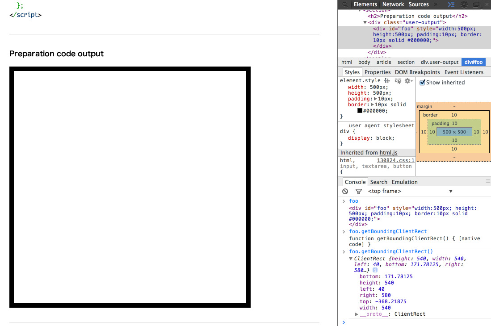

意図せずシリーズ化してしまった、前回からの続き3回目です。

- [jQuery から卒業するための第1歩を polyfills から学ぼう](/tech/20140131/)
- [jQuery から卒業するための第1歩を polyfills から学ぼう – その2](/tech/20140203/)

https://github.com/inexorabletash/polyfill にある web.js をソースコードリーディングしています。 また、es5.js は予め読み込まれている前提となります。


## Selectors API Level 1

**DOM ツリー**に関する polyfills です。

**Selectors API** って何なのー？って思う方もいるかもしれませんが、 例えば jQuery でいう **$(‘.element’)** みたいなアレとほぼ同じです。

大まかに以下の5つに関する polyfills が用意されています。

- querySelectorAll
- querySelector
- getElementsByClassName
- TextRectangle
- DOM Enumerations

### querySelectorAll, querySelector

**querySelectorAll** は、CSS のセレクタ（ .element とか #title とか）を指定して、それに**当てはまる要素全てを取得**できます。

試しに今閲覧しているブラウザで開発者ツールを開き、

```javascript
document.querySelectorAll('.entry-content h2')
```

などと入力してみると、このページの class=”entry-content” と書かれた中にある h2 の要素を一通り取得出来ていることが分かると思います。



この **querySelectorAll / querySelector は IE8 から使えることが出来る**ため、 IE7 以前のブラウザでは一切動作しなくてもいい、というケースにおいては普通に使うことが出来ますね。 （とはいえ、全く動かないのもアレなので、こういった polyfills があるとより親切かと思います）

ただ、単に要素を取得するだけであれば、元々ある他の方法（ getElementById, getElementsByTagName など）を用いれば 同等のものが実現出来ることも容易に想像がつきます。

さて、181〜199行目を抜粋します。（間の空行が上手く表示できなかったので詰めています）

```javascript
if (!document.querySelectorAll) {
  document.querySelectorAll = function (selectors) {
    var style = document.createElement('style'), elements = [], element;
    document.documentElement.firstChild.appendChild(style);
    document._qsa = [];
    style.styleSheet.cssText = selectors + '{x-qsa:expression(document._qsa && document._qsa.push(this))}';
    window.scrollBy(0, 0);
    style.parentNode.removeChild(style);
    while (document._qsa.length) {
      element = document._qsa.shift();
      element.style.removeAttribute('x-qsa');
      elements.push(element);
    }
    document._qsa = null;
    return elements;
  };
}
```

かなり **ハック的な方法** が用いられているので、正直ざっくりとしか理解できていませんが、 普通に polyfills を実現しようとすると速度面でかなり劣ることが分かっているため、 どうにかして IE7 以前でも普通に使えるレベルまでもっていけないか？という試行錯誤の跡になっています。

難しいので特徴だけ軽くまとめてみようかと・・・。

- 本来の document.querySelectorAll と異なり、document._qsa などに一時的に計算結果を保存している（副作用がある）
- CSS 内に JavaScript が書ける Expressions が使われている（IE5 で導入、セキュリティのため IE8 以降では無視される）
- 本来 Expressions を用いるとめちゃめちゃ遅くなるが、要素取得のみに限定して使うことで全体として速くなっている（らしい）

（まあハックなのでこれくらいの理解でいいかなと・・・）

詳しくは以下に掲載されているようです。

http://ajaxian.com/archives/creating-a-queryselector-for-ie-that-runs-at-native-speed

querySelector の方も、All で取得したものの頭のものを持ってくるだけなので省略します。

### getElementsByClassName

**getElementsByClassName** は、**getElementsByTagName** や **getElementById** と同じで 要素をクラス名で取得します。今まで無かったのが不思議ですね。

同じく開発者ツールを開いて、以下のように取得ができます。

`document.getElementsByClassName("entry-content")` （クラス名をそのまま入れるので、頭のドットは不要ですね）

処理の中身である210, 211行目のみ抜粋します。

classNames = String(classNames).replace(/^|s+/g, &#8216;.&#8217;); return document.querySelectorAll(classNames); こちらの処理も querySelector と同じく、**querySelectorAll** を流用して提供されています。 クラス名を受け取って、querySelectorAll に渡してやっているだけですね。

こちら、クラス名の指定が正しくされている時以外は、ひょっとするとエラーになるケースもあるかもしれませんが、 **/^|s+/g** の正規表現で、先頭かもしくはホワイトスペースが1つ以上続く場合、それを . に置き換えるようになっています。

普通に **&#8216;toggle&#8217;** みたいな文字列が指定されれば、 **&#8216;.toggle&#8217;** に置き換えられますし、 **&#8216;aaa, bbb&#8217;** のような文字列であれば、**&#8216;.aaa,.bbb&#8217;** に置き換えられますね。

※これだと、カンマの後にスペースが無いと上手く replace されないっぽいですかね？ （ひょっとすると不完全かもしれません）

### TextRectangle

ざっと流していくだけなら比較的すらすらっと読めるのですが、 このように丁寧に順を追って見ていくと、かなり時間がかかりますね。

次は TextRectangle についてです。 TextRectangle が一体なんなのか、というところから書いてみます。

#### TextRectangle って？

とある要素に対して、「この要素の位置やサイズくださいー」と呼び出すと、以下のようなプロパティが含まれているオブジェクトが返ってきます。

```javascript
{
  bottom: 171.78125,
  height: 540,
  left: 40,
  right: 580,
  top: -368.21875,
  width: 540,
  ...
}
```

実際に、var foo = getElement… などで取得した要素に対して、

    foo.getBoundingClientRect();


のように、「この要素の位置やサイズくださいー」と要素に対して呼び出してやると、 **TextRectangle** オブジェクトが返ってきます。

上記をそのまま試したキャプチャです。



真ん中に黒枠で囲まれた要素が存在していますが、それに対して **getBoundingClientRect()** を呼び出してやると、 その要素が上から何ピクセル、左から何ピクセル、あるいは幅が何ピクセルか、などが一通り分かります。

こんな感じで位置やサイズが取得でき、その返ってくるオブジェクトが **TextRectangle オブジェクト**です。

jQuery の内部でも offset（≒上、左からどんだけずれているか）などの処理で使われているようです。

#### TextRectangle の width, height のみを補完する

ただし、この TextRectangle オブジェクトは、 ブラウザの対応度合いによって不足しているプロパティがあり、IE8 では **width, height が不足**しています。

ということで、長くなりましたが、その不足分の width, height のみを補完するためのコードが216〜221行目に相当します。

```javascript
if ('TextRectangle' in this && !('width' in TextRectangle.prototype)) {
  Object.defineProperties(TextRectangle.prototype, {
    'width': { get: function() { return this.right - this.left; } },
    'height': { get: function() { return this.bottom - this.top; } }
  });
}
```

上記でだいぶ詳しく説明したので、このコードが大まかに何をやっているのかは分かると思いますが、 **Object.defineProperties** だけ触れておこうと思います。

#### Object.defineProperties って？

**Object.defineProperties(obj, props)** は、ECMAScript5 (ES5) に定義されているもので、 IE9 以降からしか使えません。

obj に対して、props のプロパティを上書き（なければそのまま定義）することができます。

詳しくは MDN をご覧いただいた方が良いと思います。（毎回 MDN 見て、で済んでしまう気が・・・）

https://developer.mozilla.org/ja/docs/Web/JavaScript/Reference/Global_Objects/Object/defineProperties

jQuery にも似たような機能が用意されており、**jQuery.extend** で同等のことが実現出来ます。 その公式ページからの抜粋です。

```javascript
var object1 = {
  apple: 0,
  banana: { weight: 52, price: 100 },
  cherry: 97
};
var object2 = {
  banana: { price: 200 },
  durian: 100
};
// Merge object2 into object1
$.extend( object1, object2 );
```

このときに返ってくるオブジェクトは、

```javascript
{
  apple: 0,
  banana: {
    price: 200
  },
  cherry: 97,
  durian: 100
}
```

のようになります。存在しているところは上書きされていますね。

こちらも、詳しくは以下の公式ページに掲載されています。

http://api.jquery.com/jQuery.extend/

### DOM Enumerations

最後は、Node オブジェクト（≒DOM ツリーの構成要素）や DOMException オブジェクト（≒例外処理）に対して、 本来あるべき定数を変数として定義しているだけなのですが、 226行目のみ抜粋してみます。

```javascript
window.Node = window.Node || function Node() { throw TypeError("Illegal constructor"); };
```

グローバルに対して、すでに Node が存在していればそれを使い、 なければ function() { … } を使う、というのは前回までで触れましたが、 その中身では、すぐに例外を投げています。

これは、直接 DOM の要素を new Node() などで作れないようになっており、 DOM ツリーへの要素追加も、document.createElement() を介して要素を生成するようになっているためです。 また、DOM へのアクセスも getElement… や querySelectorAll などからしか出来ないようになっています。

このあたりは HTML を表示しようとした時点で色々勝手にやってくれている部分であり、 ひょっとしたら知る必要はないのかもしれませんが、 とはいえ **window.Node には DOM ツリーを構成する役割があって、少なくとも Node という名前はグローバルで使っているんだ**、 ということくらいは知っておいてもいいのかもしれません。

（※なお、ここで言っている Node というのは、Node.js とは関係しません。あくまで DOM ツリーの構成要素という意味での Node です。）


## まとめ

イベントの方まで行けませんでした・・・。

ブログ記事として書き始めたのを若干後悔しています。しばらく（不定期で）続きます。
