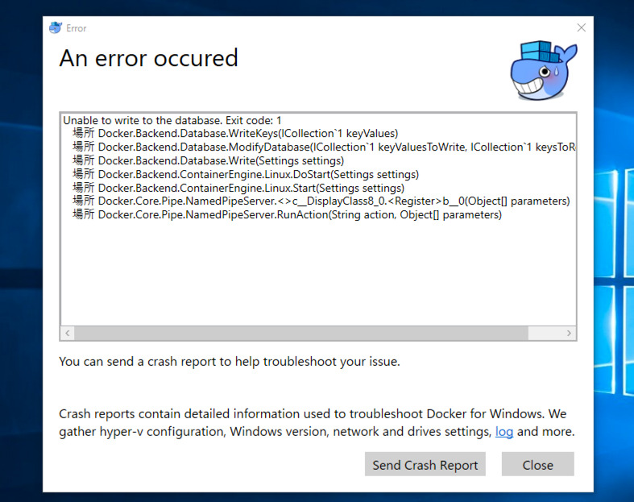
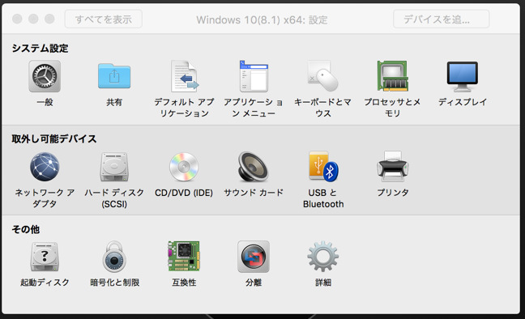
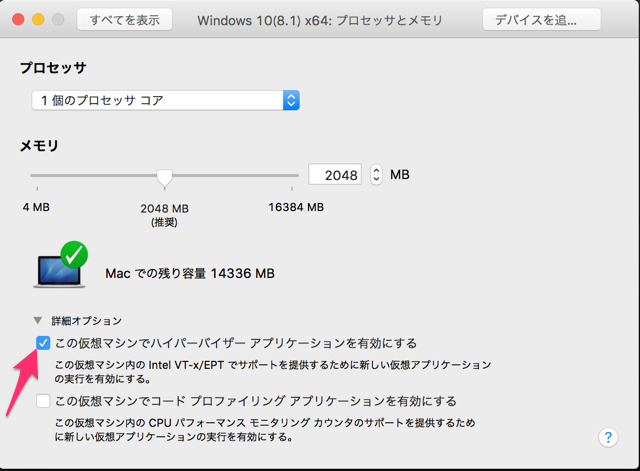
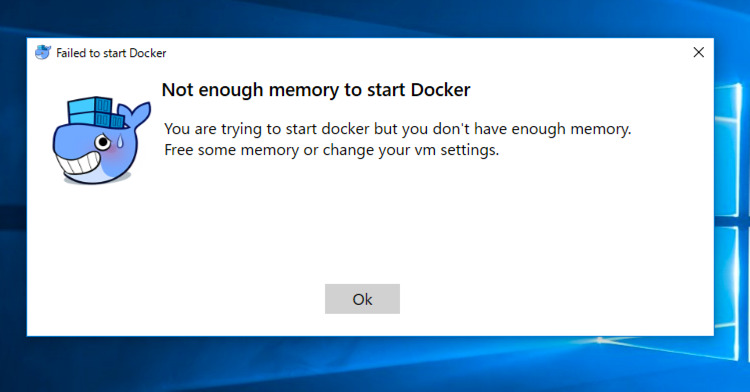
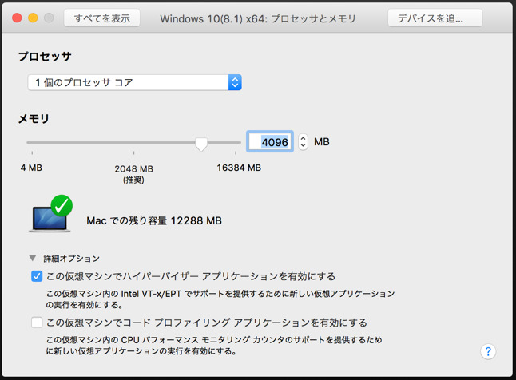
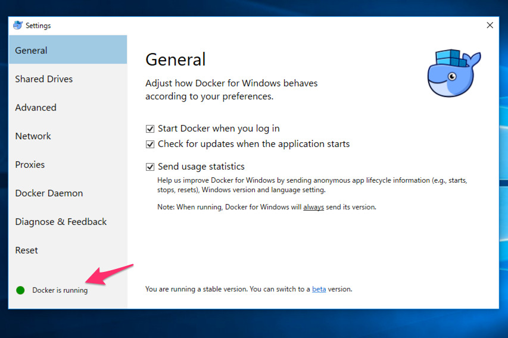

+++
author = "girigiribauer"
categories = ["tech"]
date = "2016-09-29T20:02:24+09:00"
draft = false
tags = ["Docker", "Virtualization"]
title = "MacOS の VMWare Fusion 内で Docker for Windows をインストールする"
aliases = ["/archives/20160929/"]
+++

最初失敗したので、同じところではまるであろう人のためにメモっておきます。
（念のため言っておきますが僕ははまったわけではないです・・・）

そもそも Windows 10 検証用のために VMWare Fusion をインストールしているのですが、
Mac で Docker を使いたいだけなら、
[Docker for Mac](https://docs.docker.com/engine/installation/mac/)を
インストールするだけで問題ありません。
（仮想レイヤーが増えるだけで全くおすすめできない）

僕の場合は、Docker for Windows で検証したいことがあったため、
Windows Update 中に（よくないけど）マシンが空いてたので入れてみようと思い、
インストールしたはいいものの、以下のような画面になりました。

困り顔・・・。（このキャラクターの名前ってあるんですかね？）

## Docker for Mac/Windows の動作の仕組み

仕組みといっても、そこまで詳しいことは書けないのですが、
Docker は前提として **Linux のコンテナ技術を用いているので、
Linux なしに動作させることはできません。**

Docker for Mac/Windows の1つ前のバージョンである Docker Toolbox では、
VirtualBox を利用することで仮想 OS のうすーい Linux を手元に作り、
そこの上に Docker コンテナを作ることで利用できてました。

Docker for Mac/Windows になってもそれは同様で、
ホスト型の VirtualBox を利用する代わりに、
Mac であれば **xhyve** というハイパーバイザー型の仮想化技術を、
Windows であれば **Hyper-V** というハイパーバイザー型の仮想化技術を
それぞれ利用して超うすい Linux を作り、その上で Docker を動作させてます。

そもそも、Docker for Windows の動作要件として、
<https://docs.docker.com/docker-for-windows/> のページに
こんなことが書いてあります。（2016/09/29 時点）

	The Hyper-V package must be enabled for Docker for Windows to work. The Docker for Windows installer will enable it for you, if needed. (This requires a reboot).

ということで、VMWare Fusion で Docker for Windows を利用したい人は、
結局のところ **VMWare Fusion で Hyper-V を有効にしましょう**、
というところに帰着します。

## Docker for Windows のインストール

[VMware Fusion上のWindows10にHyper-Vを構成する。](http://itnews.jp/?p=9332) を
少し参考にしています。

"プロセッサとメモリ" のメニューを選択します。

その中に "この仮想マシンでハイパーバイザー アプリケーションを有効にする" というチェックボックスがあるのでチェックを入れます。

基本的にはこれで完了です。

ただ、仮想 OS の上でさらに仮想環境をいじることになるので、
メモリが足らなくなるケースが出てくるかと思います。

メモリだけは大量に積んであるので、推奨の倍まで増やしてやりました。
たぶん Docker for Windows も、初期設定のままであれば 2048MB のメモリ設定になっているかと思います。

その後再度起動してみて、しばらくすると Docker is running の通知が。

Settings から確認してみると "Docker is running" の文字を確認することができました。

## まとめ

使うからには、最低限どういう原理で動作しているか、くらいは
押さえておいた方がいいかもしれません。
