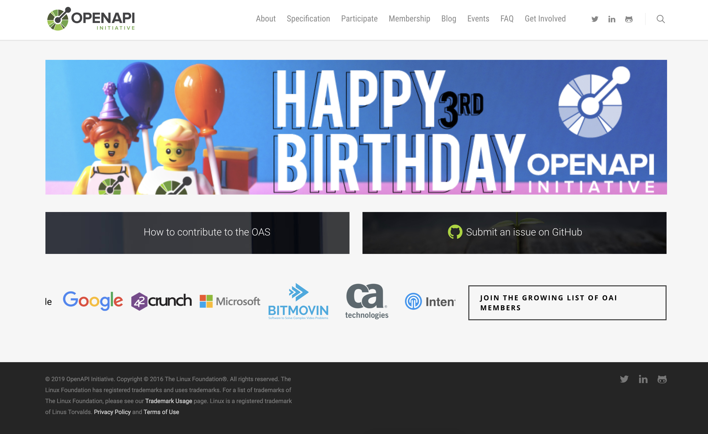
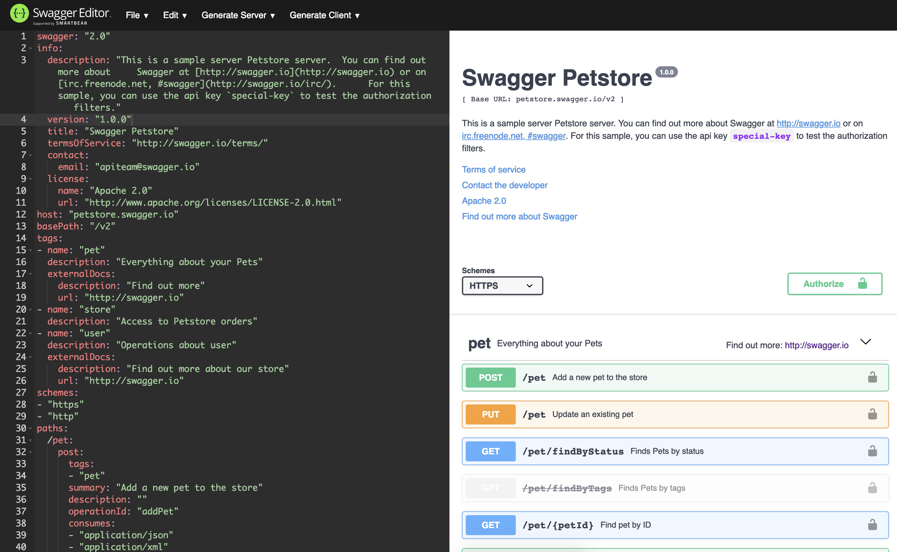
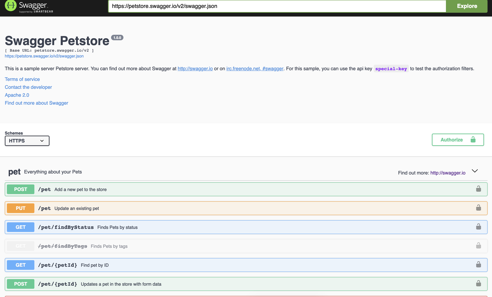
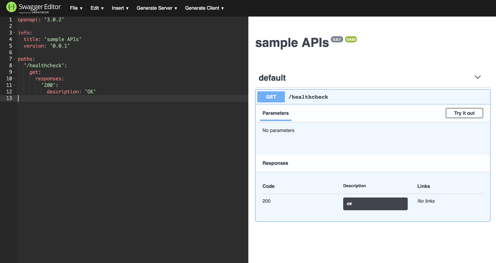
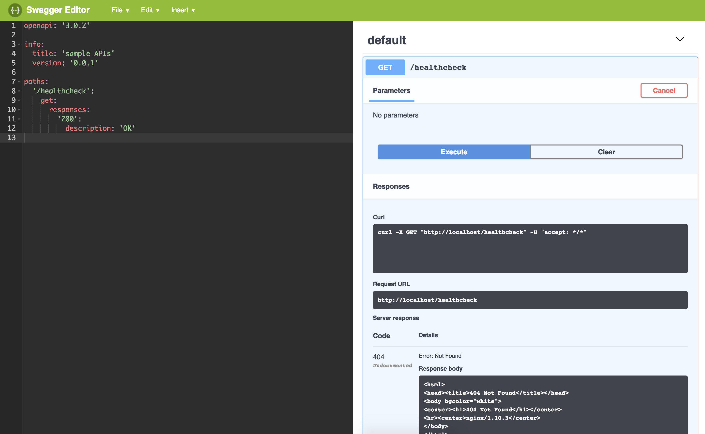
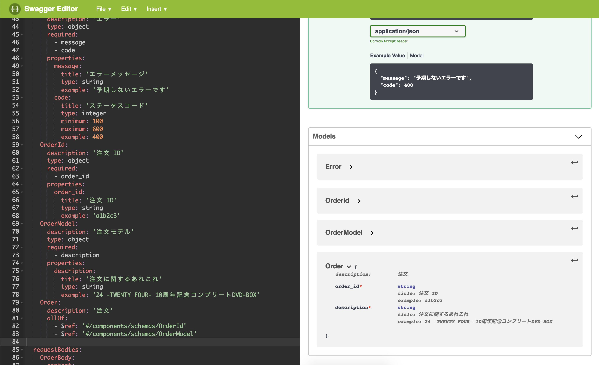

+++
author = "girigiribauer"
categories = ["tech"]
tags = ["API", "OpenAPI"]
draft = false
date = "2019-03-18T08:45:00+09:00"
title = "OpenAPI (Swagger) の基本的なあれこれ"
aliases = ["/archives/20190318/"]
+++

現時点での OpenAPI に関する知識の棚卸しをした方がいいかなと思ったので書きます。


## 前提

- 使い方が 100% 定まっているわけではありません
- 少なくとも OpenAPI を使っていくこと自体は間違ってないという考えで使っています
- GraphQL については触れません


## OpenAPI とは何か？



端的に言うと、 **RESTful API に関するインターフェース定義** です。

一方で、そのインターフェース定義は YAML ファイルもしくは JSON ファイルで表されるため、
**単なる YAML (JSON) ファイル** だということもできると思います。

その仕様に沿って書くことで、周辺ツールであれこれ便利なことができます。

### こんな便利なことができる

- 定義ファイルを元にドキュメントが自動生成できる（むしろ定義ファイル自体がドキュメントとも言える）
- スタブ API の生成ができる、ダミーの API が定義ファイルから作れる
- 周辺ツールとして、 Swagger Editor （定義ファイルの編集）や Swagger UI （API のドキュメントやテスト）がある

などなど・・・。

### OpenAPI は Swagger 3.0

Swagger 3.0 から OpenAPI に名前が変わったため、 OpenAPI 3.0 は Swagger 3.0 でもあります。

もともと他にも API 周りのインターフェース定義ができるルールが存在してたのですが、
Swagger が晴れて標準となったようです。

他には API Blueprint などがあるようですが、僕もそこまで詳しくはありません。

OpenAPI の仕様の、現時点での最新は `3.0.2` です。
仕様書はこちらにあります。

https://github.com/OAI/OpenAPI-Specification/blob/master/versions/3.0.2.md


## OpenAPI で何ができるの？

先に触れたように、周辺ツールを触ってみることで、実感しやすくなると思います。

### Swagger Editor



このような、左側が YAML (JSON) を編集するためのエディタ、
右側がリアルタイムでその定義ファイルをパースしてドキュメンテーションしたり API テストのための UI を提供したりする UI という作りになっているツールです。

http://editor.swagger.io/

こちらにアクセスして YAML(JSON) ファイルを編集されても良いですし、
手元で Docker 経由でコンテナをさくっと立ち上げて、そこ上で作業されても良いかもしれません。

もし手元の 80 番ポートで動かすときは、以下のコマンドで OK です。
（もちろんポートは自分の自由に変えて良いです）

```
docker run -p 80:8080 swaggerapi/swagger-editor
```

http://localhost/ にアクセスすると上記エディタが立ち上がるので、自由に編集できます。

ちなみに、バリデーション機能もついてるので、
YAML(JSON) ファイルに問題がないかを確認しながら書き足していくことが可能です。

### Swagger UI



Swagger UI は先ほどの Swagger Editor の右半分の機能を持ったツールで、
すでに編集された定義ファイルを表示確認する機能に特化しています。

置かれている定義ファイルの URL を指定するテキストボックスがあるので、
そこに公開されている定義ファイルの URL を入れると動作します。

https://petstore.swagger.io/

こちらのページには、すでに JSON ファイルで定義ファイルが書かれているものを読み込み、
表示確認できるようにしたサンプルが掲載されています。
petstore のサンプルのようですが、見てみるとイメージしやすいかもしれません。


## そろそろ OpenAPI 書いてみたいんだけど

最小構成から付け足して見てみようと思います。

### 最小構成

ずばりこれです。

```
openapi: '3.0.2'

info:
  title: 'sample APIs'
  version: '0.0.1'

paths: {}
```

（あなたがこれを読んでいるときは、最新が 3.0.2 でない可能性が高いので、
適宜読み換えるなどしてください）

とまあ、さすがに API の枝が一切生えてないやつで最小と言うのもあれなので、
`/healthcheck` あたりを生やした最小構成のやつも書いてみます。

手元に用意した Swagger Editor に貼り付けて見てみるならこっちの方が良いでしょう。

```
openapi: '3.0.2'

info:
  title: 'sample APIs'
  version: '0.0.1'

paths:
  '/healthcheck':
    get:
      responses:
        '200':
          description: 'OK'
```

これを貼り付けると、以下のような表示がされます。



まだドキュメント書いただけなので何か動いたりはしませんが、
右にある Try it out のボタンを押すと、実際にここからリクエストを投げることができて、
結果もここの上で確認ができます。便利ですねー。

実際に投げる curl のコマンドも表示してくれてます。

```
curl -X GET "http://localhost/healthcheck" -H "accept: */*"
```

実際何も他に設定していないので、 http://localhost/healthcheck に投げても当然そんな API は実装されておらず、
（というかそもそも localhost:80 は今 Swagger Editor が使ってるので API は一切ありません）
おそらく Swagger Editor のコンテナの中で動いているであろう nginx が反応してエラーページ出しちゃってますね。




## OpenAPI のトップレベルのオブジェクト（フィールド）について学ぶ

リクエスト・レスポンスのある API を生やす前に、
仕様書を見ながら一番上のオブジェクト（フィールド）だけは押さえておきます。

でないと途中でどう書けばいいのか悩ましい部分も出てくるかなと思います。

```
openapi: '3.0.2'

info:
  # API に関する情報をまとめる
  title: 'sample APIs'
  version: '0.0.1'

servers:
  # 実際に API が配備されている URL を載せる
  - url: 'http://localhost:8080/'
    description: 'API サーバー'

paths:
  # API エンドポイント
  '/healthcheck':
    get:
      responses:
        '200':
          description: 'OK'

components:
  schemas:
    # 共通モデル

  parameters:
    # GET などで取得範囲を変更するときなどに利用

  requestBodies:
    # 共通で使う POST データ

  responses:
    # 共通のレスポンス定義、 paths の中で利用

tags:
  # API のタグによる分類
```

だいたいこんな感じの構成です。
（もちろん他にも認証周りだったり色々あるのですが、今回は上記範囲で・・・）

### Info Object

https://github.com/OAI/OpenAPI-Specification/blob/master/versions/3.0.2.md#info-object

**API に関する情報をまとめる** オブジェクトです。

API の概要だったりライセンス形式だったり、 API そのものの情報をこちらに書くことができます。

まあ、ここは仕様通りに書けばそんなに困らないところかなと・・・。

### Server Object

https://github.com/OAI/OpenAPI-Specification/blob/master/versions/3.0.2.md#server-object

**実際に API が配備されている URL を載せる** ためのオブジェクトです。

リスト形式で `url`, `description` をそれぞれ複数載せることができるので、
ローカル開発用の API と本番用の API を同時に載せておき、切り替えながらテストする、といった使い方が考えられます。

```
servers:
  # 実際に API が配備されている URL を載せる
  - url: 'http://localhost:8080/'
    description: 'ローカル開発用 API'
  - url: 'http://api.example.com/'
    description: '本番用 API'
```

こちらで設定したサーバは、 Swagger Editor / UI の上の方に出て選ぶことができて、
さっきの Try it out を選ぶときのリクエストの投げ先にすることができます。

### Paths Object

https://github.com/OAI/OpenAPI-Specification/blob/master/versions/3.0.2.md#paths-object

**API エンドポイント** がここに入ります。
いわゆる API のメインコンテンツ部分です。

もう少し掘り下げます。

```
paths:
  '/path/to/endpoint':
    post:
      summary: 'API の概要が入ります'
      requestBody:
        $ref: '#/components/requestBodies/myRequestBody'
      responses:
        '200':
          $ref: '#/components/responses/OK'
        default:
          $ref: '#/components/responses/UnexpectedError'
```

ここに出てくる get や post などは Operation Object と呼ばれ、
この中に以下のようなリクエスト・レスポンスパラメータがそれぞれ定義されます。

- parameters: GET におけるリクエストパラメータ（パスだったりクエリパラメータだったり）
- requestBody: POST などにおけるリクエストパラメータ（`application/x-www-form-urlencoded`, `application/json` など）
- responses: レスポンスパラメータ

https://github.com/OAI/OpenAPI-Specification/blob/master/versions/3.0.2.md#operation-object

ただ、実際にはここにすべての情報を書くのではなく、
上記例のように Components Object の方と連携して定義を書いていく形になると思います。

そうでないと、コピペだらけになって辛い気持ちになるので、
次の項目の Components Object も正しく活用していきましょう。

#### Reference Object の活用について

https://github.com/OAI/OpenAPI-Specification/blob/master/versions/3.0.2.md#reference-object

ちなみに、ちょっと間に挟むのですが、
実際に書いていくときには、 Paths Object の方から Components Object の方に頻繁に参照する書き方をします。

```
$ref: '#/components/schemas/Pet'
```

こちらのように、 `#/` で始まる書き方だと、同じ自分自身の定義ファイルへの参照となり、
`#/components/schemas/` となっていた場合、 Components Object 以下にある Schemas Object への参照となります。

### Components Object

https://github.com/OAI/OpenAPI-Specification/blob/master/versions/3.0.2.md#components-object

文字通り、コンポーネントとして他から再利用されるためのオブジェクトです。
よく使われるものとして以下のものがあります。

- schemas: 共通モデル、モデル同士を入れ子にできる
    - https://github.com/OAI/OpenAPI-Specification/blob/master/versions/3.0.2.md#schema-object
- parameters: GET などで取得範囲を変更するときなどに利用
    - https://github.com/OAI/OpenAPI-Specification/blob/master/versions/3.0.2.md#response-object
- requestBodies: 共通で使う POST データ
    - https://github.com/OAI/OpenAPI-Specification/blob/master/versions/3.0.2.md#request-body-object
- responses: 共通のレスポンス定義、 schemas から読み込んで使ったりもする
    - https://github.com/OAI/OpenAPI-Specification/blob/master/versions/3.0.2.md#response-object

一番基礎となるのが Schema Object になるかと思います。

```
components:
  schemas:
    Login:
      description: 'ログイン'
      type: object
      required:
        - email
        - password
      properties:
        email:
          title: 'メールアドレス'
          type: string
          format: email
          example: 'sample@example.com'
        password:
          title: 'パスワード'
          type: string
          format: password
```

実際こちらにあるのを元にして、何か別のパラメータがくっついたやつを requestBodies で要求したり、
一方で何かの schema に対して ID などが付与されたものを responses で返したりと、
個人的にはこの辺りの **Components Object の再利用をいかに効率よく行うかが OpenAPI でのキモ** になりそうな気がしています。

### Tag Object

https://github.com/OAI/OpenAPI-Specification/blob/master/versions/3.0.2.md#tag-object

最後に Tag Object です。
こちらは API の各種エンドポイントをグルーピングしたり、
適切な概要の文章書いたりと、 API を管理しやすくするためのあれこれです。

実際単なる `name`, `description` のリストだったりします。


## 実際にリクエスト・レスポンスパラメータを書いてみる

上記の最小構成から、リクエスト・レスポンスパラメータのある API を追加で生やしてみようと思います。

ここから先は、僕個人はこんな感じでやってますよーって話なので、
もっとこういうやり方あるよ！みたいなのがあればぜひ教えてください。

```
openapi: '3.0.2'

info:
  title: 'sample APIs'
  version: '0.0.1'

servers:
  - url: 'http://localhost:8080/'
    description: 'ローカル開発用 API'

paths:
  '/path/to/orders':
    get:
      tags:
        - orders
      summary: '注文のリストを返すよ'
      responses:
        '200':
          description: '注文のリストを正しく返しますよー'
          content:
            'application/json':
              schema:
                type: array
                items:
                  $ref: '#/components/schemas/Order'
        default:
          $ref: '#/components/responses/UnexpectedError'
    post:
      tags:
        - orders
      summary: '注文を1件追加するよ'
      requestBody:
        $ref: '#/components/requestBodies/OrderBody'
      responses:
        '200':
          $ref: '#/components/responses/OK'
        default:
          $ref: '#/components/responses/UnexpectedError'

components:
  schemas:
    Error:
      description: 'エラー'
      type: object
      required:
        - message
        - code
      properties:
        message:
          title: 'エラーメッセージ'
          type: string
          example: '予期しないエラーです'
        code:
          title: 'ステータスコード'
          type: integer
          minimum: 100
          maximum: 600
          example: 400
    OrderId:
      description: '注文 ID'
      type: object
      required:
        - order_id
      properties:
        order_id:
          title: '注文 ID'
          type: string
          example: 'a1b2c3'
    OrderModel:
      description: '注文モデル'
      type: object
      required:
        - description
      properties:
        description:
          title: '注文に関するあれこれ'
          type: string
          example: '24 -TWENTY FOUR- 10周年記念コンプリートDVD-BOX'
    Order:
      description: '注文'
      allOf:
        - $ref: '#/components/schemas/OrderId'
        - $ref: '#/components/schemas/OrderModel'

  requestBodies:
    OrderBody:
      content:
        'application/x-www-form-urlencoded':
          schema:
            $ref: '#/components/schemas/OrderId'
        'application/json':
          schema:
            $ref: '#/components/schemas/OrderId'

  responses:
    OK:
      description: 'OK ですよー'
    UnexpectedError:
      description: '予期しないエラーですよー'
      content:
        'application/json':
          schema:
            $ref: '#/components/schemas/Error'

tags:
  - name: orders
    description: '注文機能'
```

実際に手元の Swagger Editor 環境にコピペして確認してみると良いかもです。

この色々削ったサンプルだけでも、100行軽く超えてしまってて、
ちゃんとした中程度の API 書こうとしたら簡単に1,000行超えてしまうのが難点かもしれませんね。
（しかも security だとか、まだ触れてない Object の種類もあったりする・・・）

### 僕が得た知見: $ref をうまく使う

毎回必ず使うような、エラーであったり、単に OK 返すだけだったり、
そういった定型的なリクエスト・レスポンスは、極力 Components Object の方に記述して、
そちらを常に参照するようにしてしまうと良いと思っています。

逆に、注文の一覧を返すレスポンスの定義は、そこにだけしか使わないけど、
一方で注文自体の schema は流用して使える、みたいなケースにおいては、
Paths Object の方にレスポンスをそのまま書いてしまって、
**`type: array` の中身の schema を $ref にしてしまう** 、という考え方も一定使えます。

つまりはこんな感じです。

```
# よく使うレスポンス
      responses:
        '200':
          $ref: '#/components/responses/OK' # response 自体を $ref に

# 1回程度しか出てこないレスポンス
      responses:
        '200':
          description: '注文のリストを正しく返しますよー'
          content:
            'application/json':
              schema:
                type: array
                items:
                  $ref: '#/components/schemas/Order' # schema だけを $ref に
```

Paths の中に具体的に書いてあるかどうかだけみても、
概ねここにしか出てこないんだなーっていうのがよく分かるので読みやすくなると思います。

一方で、すべての Paths のレスポンスを、 `components/responses` 以下に名前つけて入れてしまうと、
それって結局 Paths Object に書いてあることをそのまま単に移動しただけで、
特に読みやすくなっているわけでもなく、効率的になっているわけでもないので、
避けた方が良いかもしれません。

よく出てくるやつだけ、順に `components` 以下に移動して、 $ref にして参照してやると良さげ。

### 僕が得た知見: allOf をうまく使う

$ref をうまく使えるようになってくると、今度はリクエスト・レスポンスで共通の schema にしてすっきりさせたいやつが出てきます。

ただ、 POST でデータを突っ込む前と、
突っ込んだあとに GET でデータ一覧（もちろん id か何かで1つ指定しても良いです）を取得する場合とで、
マッチしないフィールドが出てきます。
例えば以下みたいなやつです。

```
    Order:
      description: '注文'
      type: object
      required:
        - order_id
        - description
      properties:
        order_id:
          title: '注文 ID'
          type: string
          example: 'a1b2c3'
        description:
          title: '注文に関するあれこれ'
          type: string
          example: '24 -TWENTY FOUR- 10周年記念コンプリートDVD-BOX'
```

レスポンスとして上記が返ってくるのはすごくわかるのですが、
一方で新規追加とかでリクエストパラメータとして指定する際に、
必要な項目はユーザーの入力されたものを使うか、あるいは自動的に決まってくる項目になるかと思います。

前者はレスポンスパラメータとも共通なのですが、 **後者の項目（id とか作成日時とか）はまだ存在してません。**

ここで例えば OrderRequest と OrderResponse に分ける、みたいな解決方法を取ってしまうと、
段々と schema がコピペだらけになってきてしまい、そもそも何のために schema を定義してるのか、
よく分からなくなってきて辛くなります。

ここで `allOf` を使います。

```
    OrderId:
      description: '注文 ID'
      type: object
      required:
        - order_id
      properties:
        order_id:
          title: '注文 ID'
          type: string
          example: 'a1b2c3'
    OrderModel:
      description: '注文モデル'
      type: object
      required:
        - description
      properties:
        description:
          title: '注文に関するあれこれ'
          type: string
          example: '24 -TWENTY FOUR- 10周年記念コンプリートDVD-BOX'
    Order:
      description: '注文'
      allOf:
        - $ref: '#/components/schemas/OrderId'
        - $ref: '#/components/schemas/OrderModel'
```

共通部分を、例えば OrderModel としてくくり出してしまい、
レスポンスとして返したいものは Order という名前にしておき、
ここで `allOf` を指定して、リスト形式で中で使われるものを全部列挙します。

そうすると、適切にマージされた schema を利用することができるようになります。



一方で OrderId だけ返すケースもあるかもしれませんね。その場合は OrderId だけ返してやればいいですし、
また GET でリストだけではなく、 URL のパスかクエリに id を指定するケースも考えられそうです。
**適切に分けておくと、リクエスト・レスポンス双方で再利用が捗ると思います。**

このように schema を使用する単位で適切に分けてやり、 `allOf` や他にも `oneOf` など、
適切に combine 用の keyword を使って組み合わせていくと良いと思います。

combine 用の keyword については、この辺が詳しいかも。

https://swagger.io/docs/specification/data-models/oneof-anyof-allof-not/


## 活用方法の知見をもっとみんなで持ち寄ろうぜ！

だいぶ長くなってしまったので、そろそろまとめたいのですが、
**API のインターフェース定義を書いていき、それをフロントエンド・バックエンド双方で活用していく**、
という方向性は間違っていないものの、 **一方でまだまだ OpenAPI を活かしきれていない感が満載** です。

例えば、スタブ API を生成して、フロントエンドから生成されたコードを読み込みつつ、
バックエンドの工程と切り離しながら使ったり、
一方で型情報なども上手いこと出力して、バックエンドの API の実装のテストに上手いこと活用するなど、
この辺頑張れば得られるメリットは大きそうなイメージを持っています。

少なくとも Codegen ( https://github.com/swagger-api/swagger-codegen ) 周りは把握してはいますが、
まだストンと落ちてない感もあり、
schema の型情報の活用はこれからしっかりやっていきたいな、という感じです。

**どなたか強い人〜〜知見をくだされ〜〜！！（できれば https://twitter.com/girigiribauer にメンション付きで・・・！）**


## 参考 URL

- https://github.com/OAI/OpenAPI-Specification/blob/master/versions/3.0.2.md
- https://swagger.io/docs/specification/about/
- https://qiita.com/teinen_qiita/items/e440ca7b1b52ec918f1b
