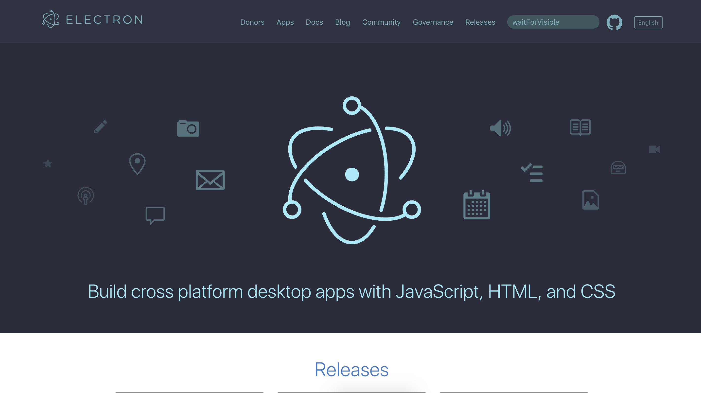
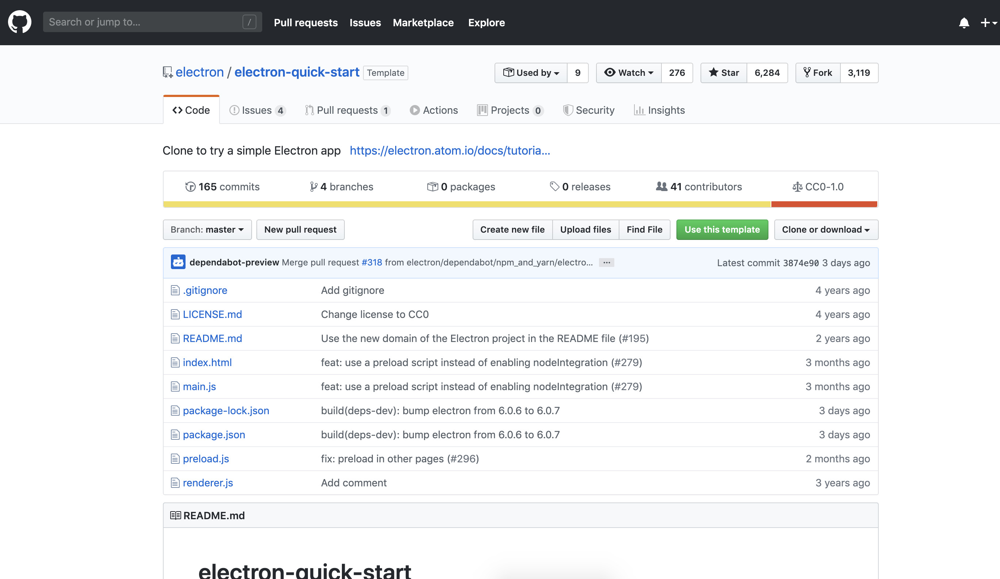
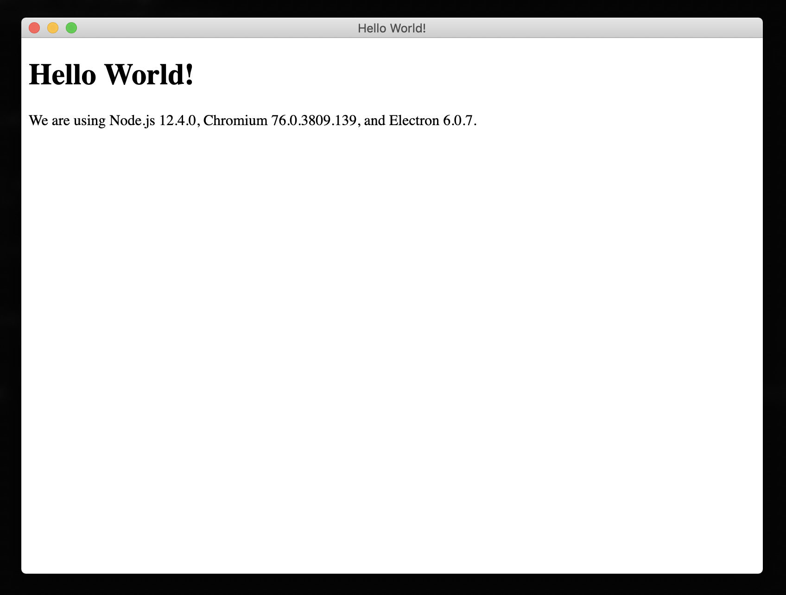
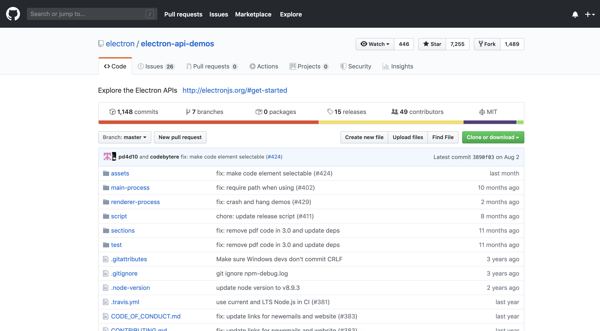
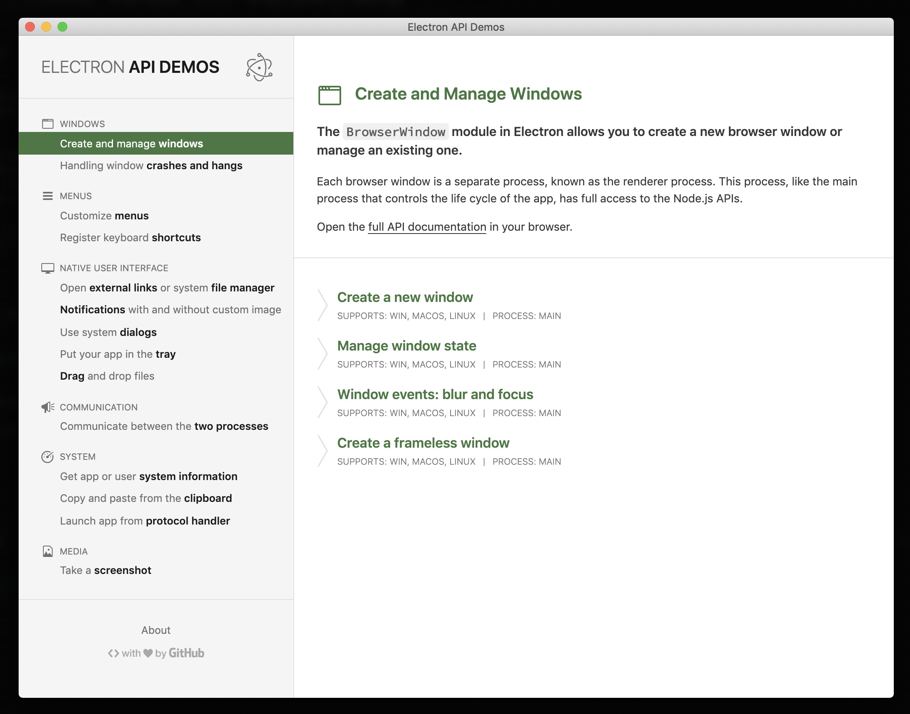
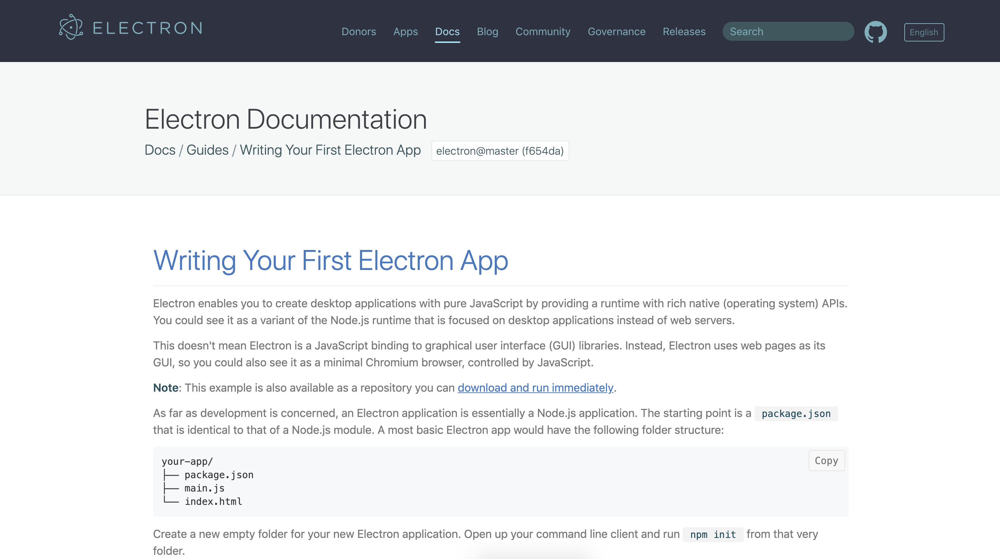
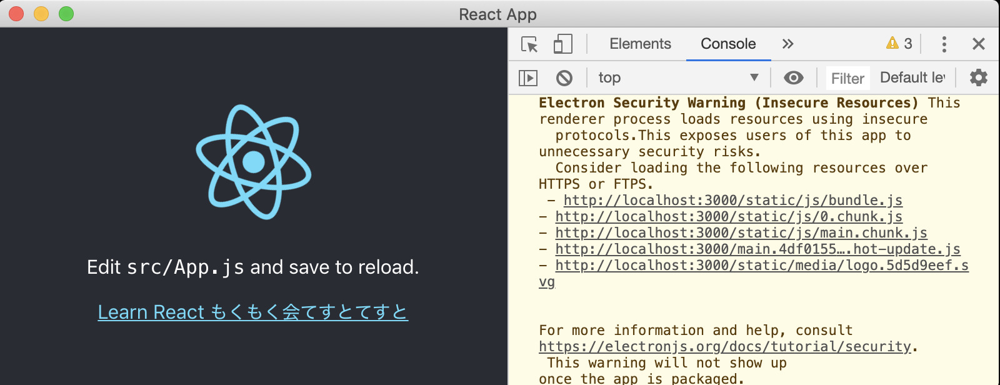

+++
author = "girigiribauer"
categories = ["tech"]
tags = ["Electron"]
draft = false
date = "2019-09-05T23:30:00+09:00"
title = "Electron と Web フロントエンドフレームワークを疎結合で使う"
aliases = ["/archives/20190905/"]
+++

Electron は単体で使ったことがあるのですが、
個人的には、どうも独特というか癖があるなあと思ってまして、
なんというか、どうしても Electron 中心に考えないといけない感じですよね？
（ Electron のプロダクトを作ろう！みたいな感じの）

あと Electron を使ったサンプルが若干時代遅れ感というか、
比較的新しめの Web フロントエンドのフレームワークと組み合わせた場合に、
若干組み合わせづらいなあという印象を持ってます。

もうちょっと疎結合で使いたいんですよね。

既存で例えば React, Angular, Vue.js などですでに作られていて、
後追いで Electron でラッピングしてリリースしたいとかってケースのときに、
**すでにレールに沿って作られたものは、極力そのままで利用しつつ、
疎結合な状態で Electron を導入したいです。**

先日、フロントエンドもくもく会の9月分が開催されたので、せっかくならと思い、
 Electron と Web フロントエンドフレームワークとを疎結合で使う方法を検討してみました。


## Electron ことはじめ



https://electronjs.org/

一通りの機能が API として提供されており、特に scaffolding 的な機能は用意されていないので、
良く言えば使うところだけ小さく使うことができる、
悪く言えばレールがないと言えるかもしれません。

一番最初に触れるであろうサンプルとしては、主に2つほどこちらで確認ができています。

### electron-quick-start





https://github.com/electron/electron-quick-start

公式ページにて `Spin up the Quick Start app to see Electron in action` として紹介されている、
Electron 単体を最小+αの範囲で動かすサンプルです。

おそらく index.html の中から呼び出してる `renderer.js` に、ユーザー独自のコードを書いてね、的な形の構成になっていて、

```html
<!DOCTYPE html>
<html>
  <head>
    <meta charset="UTF-8">
    <title>Hello World!</title>
  </head>
  <body>
    <h1>Hello World!</h1>
    We are using Node.js <span id="node-version"></span>,
    Chromium <span id="chrome-version"></span>,
    and Electron <span id="electron-version"></span>.

    <!-- You can also require other files to run in this process -->
    <script src="./renderer.js"></script>
  </body>
</html>
```

`main.js` では外枠に相当するウィンドウや Electron のアプリのコントロールなどを行っています。

```js
const { app, BrowserWindow } = require('electron')
const path = require('path')

let win

function createWindow () {
  win = new BrowserWindow({
    width: 800,
    height: 600,
    webPreferences: {
      nodeIntegration: true
    }
  })
// 以下略
```

Electron 単体で作るだけなら、これをベースにしていっても全然問題ないですね。

### Electron API Demos app





https://github.com/electron/electron-api-demos

同じく Get started として公式ページにて紹介されている、 API の機能が一通りデモで確認できるよ！的なページです。

ちなみに公式が若干分かりづらいですが、公式の API リファレンスのトップはこちらです。

https://electronjs.org/docs/api

ただ、結構 Electron API 以外の機能を JavaScript にて独自実装しているような作りになっていて、
無駄にエフェクトとかも独自実装されている形になっているので、あまりコード把握には向いてないのかもです。
僕が把握できていないだけなのかもしれませんが、テスティングフレームワーク自体をアプリの構築にも流用してるんですかね？

https://electronjs.org/spectron

要するに Electron API Demos app として作るコンテンツが、 Spectron に依存している形になっていて、
これを強制されるのはちょっとなあ・・・という感じです。

### 結局、最小構成は？

じゃあ結局、最小構成はなんだよ？って話になるじゃないですか。

それを知るには、 https://electronjs.org/docs/tutorial/first-app のページを見るのが一番の早道でした。



要約すると・・・

- `electron` を npm 経由でインストールする
- 起点となる JavaScript ファイルを用意する（ここでは `main.js` ）
- `main.js` から HTML を読み込んで表示する

つまり、パッケージの設計図となる `package.json` 、 Electron のエントリーポイントとなる `main.js` 、 Electron から呼び出される HTML のリソース群、
この3つがあれば良いのでした。


## 疎結合で Electron アプリを作る

ここからが本編です。

疎結合で Electron アプリを作りたいので、既存プロジェクトの構成は極力デフォルトのままで、
左手は添えるだけの精神で Electron を添えるだけの構成で検討していきたいと思います。

例えばこんな感じです。

- メイン: React
    - 以下、フレームワークじゃないというツッコミはなしで・・・
    - こっちは既存のものをそのまま作ってある想定
    - この例ではビルドすると、 `build/` ディレクトリにスタティックなファイルが配置される
    - とにかくビルドコマンドが備わっていて、ビルド済みのものが特定のディレクトリに入るものならなんでも
- サブ: Electron
    - 疎結合にしたい、 `electron/` ディレクトリ以下に新規プロジェクトとして入れる
    - Electron の方からビルド済みのコンテンツを表示、さらに Electron プロジェクトとしてビルドしたい

本来メインの方はなんでもいいはずです。

フロントエンドは最終的にスタティックなコンテンツになるので、プロダクションビルドをすれば特定のディレクトリにスタティックなコンテンツが集約されるはずです。
今回の例ではたまたま React を導入しているので `build/` ディレクトリに最終的に配置されますが、
他にも `dist/` に置かれたり `public/` に置かれたりと、ケースによって異なるはずです。

一方でサブの方は Electron が入ってきます。
同一ディレクトリに入れてしまうと混乱してしまうので、こちらは `electron/` ディレクトリで一段区切って下に配置して、別プロジェクトとして作っていきます。

### メインのプロジェクトの構築

こちらは普通に作ったやつなので、 **1点を除き** 特別な手順は想定していないです。

```
$ create-react-app sample-electron-with-react
$ cd sample-electron-with-react
$ yarn start
# 適当に `src/App.js` いじったり
$ yarn build # => build/ ディレクトリにビルド済みのコンテンツができる
```


この流れ自体は全く変えなくて良いのですが、 **ビルド済みのファイルが相対パスになるカスタマイズだけ行う必要があります。**

この手順だけはメインのプロジェクトの構成次第でやり方が異なる部分になってしまいますが、
今回の例では React を用いているので、 `package.json` に以下の設定を追記するだけで可能です。

```json
  "homepage": ".",
```

https://create-react-app.dev/docs/deployment#serving-the-same-build-from-different-paths

ちなみに Vue.js の場合だと、 `vue.config.js` に以下の設定を追記するようです。

```js
module.exports = {
  publicPath: './'
}
```

https://cli.vuejs.org/config/#publicpath

Angular の場合だと、 `--outputPath=./` をビルド時に指定する形でしょうか？（ご自身でお試しいただけると・・・）

https://angular.io/cli/build

どのフレームワークであれ、ビルド済みのスタティックコンテンツが、相対パスになっていればオッケーです。


### サブのプロジェクトの構築

こちらは Electron です。

```
$ mkdir electron
$ cd electron
$ yarn init # => てきとーにプロジェクト作る、エントリーファイルは main.js にしておく
$ yarn add -D electron
```

ここまでで Electron のパッケージだけが入った、何も動作しないプロジェクトが出来上がっています。

#### package.json をカスタマイズする

package.json の中に `yarn start`, `yarn dev` などで気軽にコマンドが呼べるよう、
`scripts` の項目を増やします。

```json
  "scripts": {
    "start": "electron .",
    "dev": "MODE=dev electron ."
  },
```

まだ何も動作はしませんが、現時点での想定として・・・

- 環境変数の `MODE` が `dev` のときは、 Electron でメイン開発環境用のものをさくっと表示したい
- `MODE=production` あるいは指定なしのときは、 Electron でメイン開発済み・ビルド済みのものをちゃんと表示したい

こんな感じの想定の元、 `yarn start`, `yarn dev` のコマンドをそれぞれ用意しています。
Electron アプリで実行中のとき、環境変数がそれぞれ渡されます。

#### main.js をカスタマイズする

まず Electron Quick Start にあった比較的最小構成に近い `main.js` をそのまま紹介します。

```js
const { app, BrowserWindow } = require('electron')

// Keep a global reference of the window object, if you don't, the window will
// be closed automatically when the JavaScript object is garbage collected.
let win

function createWindow () {
  // Create the browser window.
  win = new BrowserWindow({
    width: 800,
    height: 600,
    webPreferences: {
      nodeIntegration: true
    }
  })

  // and load the index.html of the app.
  win.loadFile('index.html')

  // Open the DevTools.
  win.webContents.openDevTools()

  // Emitted when the window is closed.
  win.on('closed', () => {
    // Dereference the window object, usually you would store windows
    // in an array if your app supports multi windows, this is the time
    // when you should delete the corresponding element.
    win = null
  })
}

// This method will be called when Electron has finished
// initialization and is ready to create browser windows.
// Some APIs can only be used after this event occurs.
app.on('ready', createWindow)

// Quit when all windows are closed.
app.on('window-all-closed', () => {
  // On macOS it is common for applications and their menu bar
  // to stay active until the user quits explicitly with Cmd + Q
  if (process.platform !== 'darwin') {
    app.quit()
  }
})

app.on('activate', () => {
  // On macOS it's common to re-create a window in the app when the
  // dock icon is clicked and there are no other windows open.
  if (win === null) {
    createWindow()
  }
})

// In this file you can include the rest of your app's specific main process
// code. You can also put them in separate files and require them here.
```

やっていることとしてはものすごくシンプルで・・・

1. Electron のパッケージを require
1. `ready`, `activate` のイベントハンドラをそれぞれ定義
    - 800 x 600 の Window を作る
    - 読み込むファイルを指定する
    - `closed` イベントが起きたとき、作ったものを空にする定義
1. `window-all-closed` のイベントハンドラを定義、終了させる

この辺りが最小構成のようですね。

ここまで用意されていれば、 `electron/index.html` を作ってさえいれば、そのコンテンツ内容が表示されると思います。
もちろんこの通りに作ってしまうと、やっていることは Writing Your First Electron App のページとほぼ一緒になります。

```js
  win.loadFile('index.html')
```

ここの index.html を読み込んでいる部分を、環境変数に応じて以下のような読み込み方に変更します。

```js
  if (process.env.MODE === 'dev') {
    win.loadURL('http://localhost:3000/')
  } else {
    win.loadFile(path.join(__dirname, '../build/index.html'))
  }
```

ここでの `win` は、 `BrowserWindow` オブジェクトのインスタンスです。
公式ドキュメントは以下です。

https://electronjs.org/docs/api/browser-window#instance-methods

環境変数で `MODE=dev` のときは、メインの方のプロジェクト（ここでは React ）がまだまだ絶賛開発中なので、
毎回 `yarn build` してスタティックコンテンツにまで落とし込んで、
Electron で読み込み直して・・・な〜んてやってられないわけです。

なので、もう直接開発中のローカルサーバ自体を `win.loadURL` で指定してしまって、
ある程度固まってきてサブの方のプロジェクトで Electron 固有の動作を作っていきたいとなったときに、
`yarn start` して `electron/` ディレクトリから見て一段上の `build/` ディレクトリに入ったスタティックコンテンツを表示させる、
というのが開発環境としては良さげかなと思います。

### 実際に試す

ここまで用意できたら、メインとサブのプロジェクトをそれぞれ手元で動かしてみましょう。

まずメイン。

```
$ yarn start
# => localhost:3000 でローカルサーバが動作中とします
```

そしてサブ。

```
# 別ターミナルで
$ cd electron
$ yarn dev
# => ウィンドウが立ち上がって、ローカルサーバの中身が表示
```



この状態で、メインのローカルサーバが立ち上がりつつも、それをサブの Electron アプリの中身として表示できています。

ちなみに、 **Electron でサーバ上のコンテンツをそのまま表示した場合には、だいぶセキュリティ的にアレ** になると思いますので、
あくまで自分が作っているコンテンツをローカルサーバで表示したときのみに留めた方が良いかと思います。

さらにメイン。

```
$ yarn build
```

さらにサブ。

```
$ yarn start
```

こうすると、ちゃんとビルド済みのもの（ `electron/` ディレクトリから見て `../build/index.html` コンテンツ）を表示します。


### まとめ

疎結合な Electron アプリの特徴としては以下があると思います。

- 画面遷移などはメインの SPA などに完全に任せてしまい、サブの Electron は index.html を表示することに注力する
- 固有の機能はサブの Electron アプリの方に任せる
- 開発中はメインで使っているローカルサーバを活用すると早い

実際これが正しいかどうかまでは分かりませんが、
公式で Electron をメインで使う方法よりは、既存プロジェクトのものを Electron アプリ化しやすくなったのかなと思います。

また、まだ全然やれてませんが以下が課題かなと思います。

- 疎結合で作ったはいいものの、 Electron 固有の機能をメインからどうやって呼び出すか？
- 外部への通信が、 HTTP から file プロトコルになった場合にどうなるか？（場合によっては Electron の中でローカルサーバ立てる？？）


## 参考 URL

- https://electronjs.org
- https://electronjs.org/docs/api
- https://github.com/electron/electron-quick-start
- https://github.com/electron/electron-api-demos
- https://medium.com/@brockhoff/using-electron-with-react-the-basics-e93f9761f86f
- https://www.codementor.io/randyfindley/how-to-build-an-electron-app-using-create-react-app-and-electron-builder-ss1k0sfer
