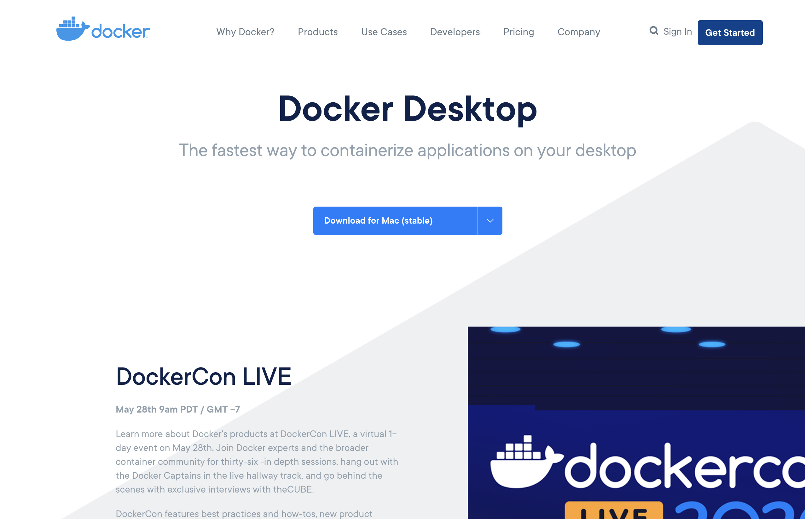
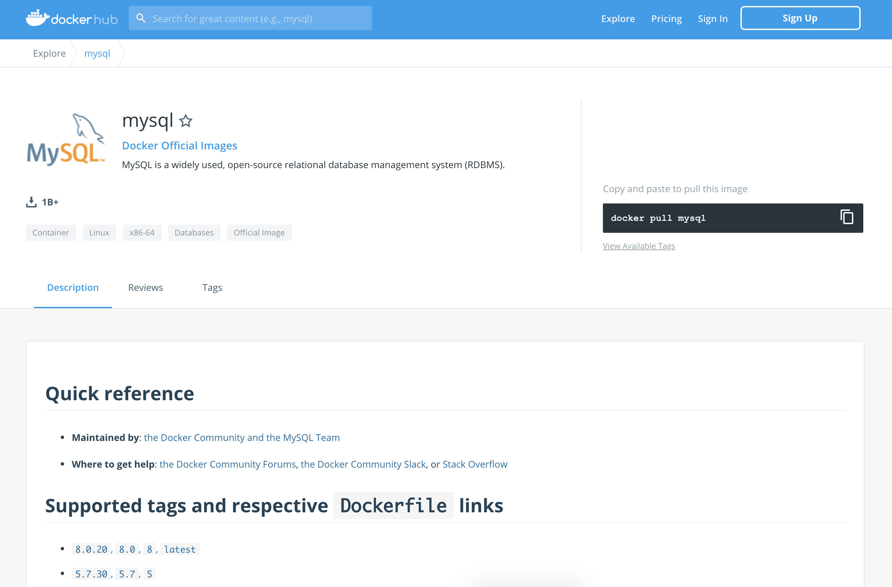
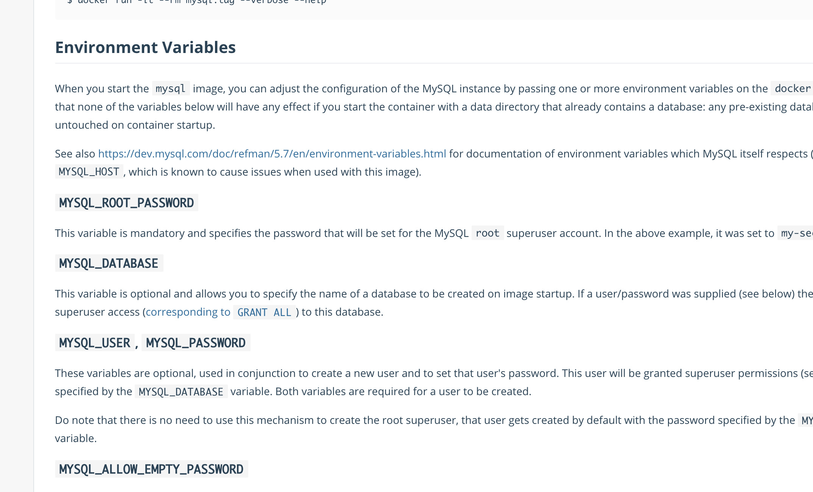
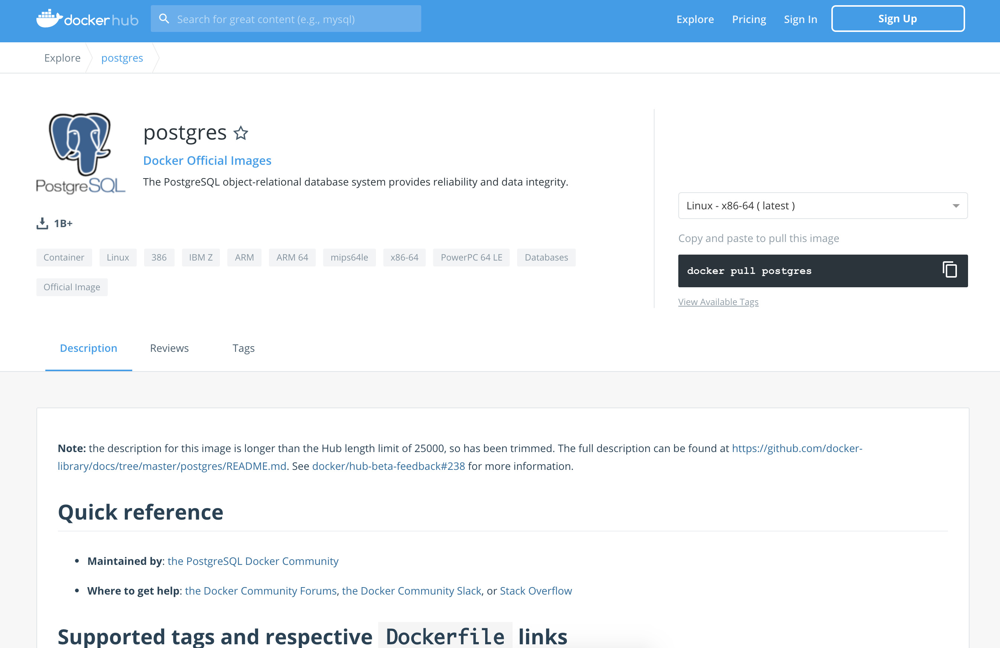
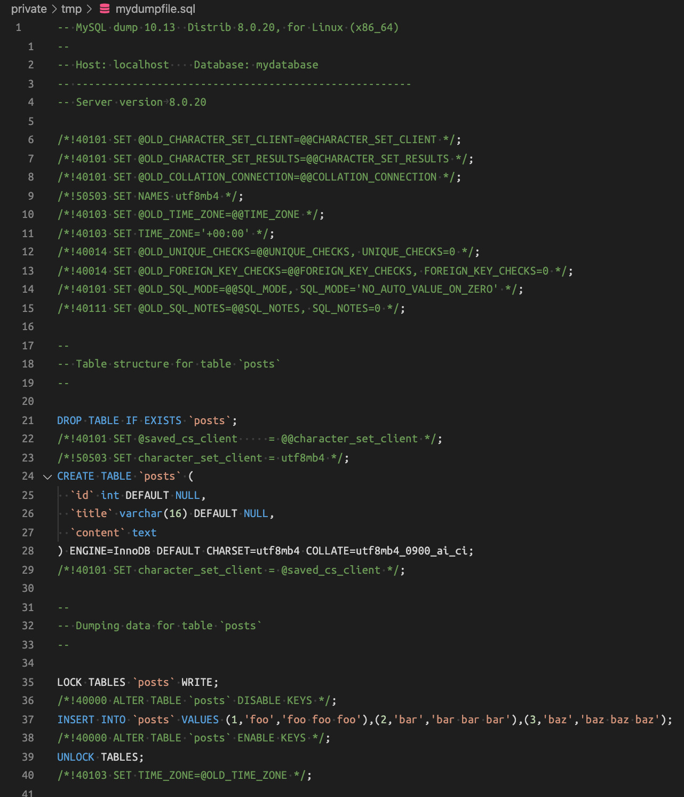
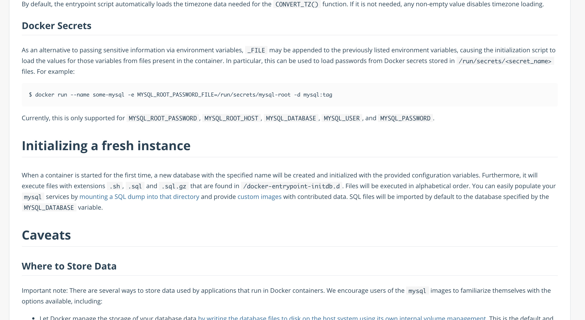

+++
title = "本番DBの複製を Docker を用いてローカルに爆速で構築したい"
date = "2020-07-13T11:00:00+0900"
lastmod = ""
draft = false
tags = ["Docker", "CLI", "Database", "MySQL", "PostgreSQL"]
+++

手元に **本番環境のデータベースと同等のもの** が欲しくなるとき、ありますよね？

そんなとき、以下のようなことしちゃってませんか？

- 本番環境がすでにあって、それを直接触って修正しちゃってる
- 良くないと思いつつも、トラブルが起きてから本番環境へ直接対処しちゃってる
- だいぶ構成が異なるけど XAMPP / MAMP あたりを雑に使ってて、いざ本番に持って行ったらうまく動かない

などなど・・・

本番環境においてトラブルを極力減らすためにも、
**手元に本番環境と同等の環境を作るのは超大事** だと思います。

手元にデータベースを用意して、快適に開発 or 制作していきましょう！


## 実はコンテナベースですぐ作れる

実は、 **コンテナベース（Docker）でさくっと作れる** んですよね。


ですが意外と知らない人も多く、情報もそこまでまとまってないように感じたので、
改めてまとめ直してみようと思います。

ちなみに Docker に関しては、
めっちゃ頑張って書いた分かりやすい（と自分では思っている・・・）記事があるんですけど、
**あんまり読んでもらえてないみたいでちょっと寂しさ・・・。**
Docker 知らない人は読むといいですよ。

- [Docker 再入門2018 - コンテナ編](https://girigiribauer.com/tech/20180205/)
- [Docker 再入門2018 - コマンド編](https://girigiribauer.com/tech/20180206/)
- [Docker 再入門2018 - エコシステム編](https://girigiribauer.com/tech/20180207/)
- [Docker 再入門2018 - 実践編](https://girigiribauer.com/tech/20180208/)

以下の手順で進めていきます。

1. 下準備
1. MySQL で空のデータベースコンテナを作る
1. MySQL で空のデータベースコンテナにアクセスしてみる
1. PostgreSQL でコンテナ作ったりアクセスしてみたり
1. 管理しやすさのため、 Docker Compose でコマンドを書き換える
1. 初期データの用意をする（本番環境から持ってくる）
1. 初期データを投入してみる

上の Docker 記事で触れたような内容も一部重複して出てくるかもしれませんが、
この記事だけさらっと読んでできるようにまとめておきたいと思います。

ちなみに当方 MacOS なので、 MacOS ベースの説明になりますが、
適宜 Windows なり Linux なりで手順ごとに同一になる方法でやってもらえれば問題ないかと。


## 下準備

必要なものは以下の通りです。

- Docker (Docker Desktop)

まず Docker インストールしましょう。



https://www.docker.com/products/docker-desktop

以前まではどこかしらにアカウント作成してログインしてからでないと、
Docker for Mac や Docker for Windows がダウンロードできなかったのですが、
今は誰でもこちらからダウンロードできます。

### そもそも Docker ってなんなの？

頑張って書いたやつなので、
ぜひとも [こちら（Docker 再入門2018 - コンテナ編）](https://girigiribauer.com/tech/20180205/) を読んでいただきたいところではありますが、
誤解を恐れず言ってしまえば、 **超小さい Linux マシン** と考えてしまっても差し支えないでしょう。

超小さい Linux マシンを、手元でどんどん起動しちゃいます。
そのための環境構築を今しています。

### インストールできたかどうかの確認

適当にターミナル（いわゆる黒い画面）を開いて、以下のように入力します。
（ `$` は入力待ちを表しています）

```
$ docker

Usage:  docker [OPTIONS] COMMAND

A self-sufficient runtime for containers

Options:
      --config string      Location of client config files (default "/Users/y/.docker")
  -c, --context string     Name of the context to use to connect to the daemon (overrides DOCKER_HOST env var and default context set with "docker context use")
  -D, --debug              Enable debug mode
（中略）

Commands:
  attach      Attach local standard input, output, and error streams to a running container
  build       Build an image from a Dockerfile
  commit      Create a new image from a container's changes
（中略）

Run 'docker COMMAND --help' for more information on a command.
```

使い方の説明文がずらずら表示されていれば、
**Docker のインストールが完了** していると思ってもらって大丈夫です。

### （おまけ）ついでに tmux も導入しておくと吉！

必須じゃないですが、手元で Docker コンテナ立ち上げつつ、
別のターミナルで別の操作をする、みたいなのが少し出てきたりはするので、
**tmux を導入** しておくのをおすすめします！
もちろん無くても大丈夫！

[ターミナル（黒い画面）を分割して使う tmux 超入門](https://girigiribauer.com/tech/20200427/)

これ導入するだけで、黒い画面が身近に感じられるかもしれません。


## MySQL で空のデータベースコンテナを作る

まず手元に空のデータベースコンテナを作ります。

これは、手元に **MySQL をインストールしてローカルでサーバを起動することと同じ** です。

Docker の良いところは、 **環境をコンテナ内に閉じ込める** ところにあるので、
**Docker のインストール以外、手元に別のものをインストールする必要はありません。**

つまり、 MySQL や PostgreSQL をインストールして手元で使いたいのに、
MySQL や PostgreSQL 自体や、その付属ライブラリなどをローカルにインストールしなくて良いのです。
クリーンですね！

### MySQL の Docker イメージのダウンロード、コンテナ作成

まずこちらをみましょう。



https://hub.docker.com/_/mysql

実は、よく使うアプリケーションは事前に用意してくれてたりします。
こんな感じで使います。

```
docker run [Docker Hub の公式イメージ名]
```

もちろん MySQL もみなさんよく使うやつなので、当然用意してくれてます。
それが今見てるページです。

**Docker Hub に用意されているイメージを手元に持ってきて、コンテナとして実行できます。**

すごい！

ちなみに、手元に Docker イメージがない状態から `docker run` をすると、
**数MB単位の Docker イメージをダウンロード** してから、その Docker イメージを元にコンテナを作ります。
（テザリング中の方はお気をつけください・・・）

具体的には、以下のコマンドを実行するだけで、手元で MySQL が動きます。

```
$ docker run --name mydb -d -e MYSQL_ROOT_PASSWORD=mypassword -it mysql
（中略、適当にダウンロードが走る）
9c9c5243a92c742e9f44717bf951968605be702197c5a770fc9a73fe6494bbf6
$
```

まんまコピペでも、 **もうこれだけで MySQL が動いてます。**

すごい世の中だ・・・！

ざっくり説明です。

- `--name=mydb` をつけると、後でその名前でコンテナ指定できる
- `-d` をつけると、バックグラウンドで起動する
- `-e` は環境変数の設定
- MySQL コンテナは `MYSQL_ROOT_PASSWORD` などのパスワードに関する環境変数がないと動かない
- 今回の root パスワードは `mypassword` に設定
- `-it` は（ざっくりいうと）コンテナの中と外の表示をつなぐ
- 詳しくは `docker help run` でオプション見られる

別のターミナルで、 `docker container ls` を入力してみると、
現在動いているコンテナが分かります。

```
% docker container ls
CONTAINER ID        IMAGE               COMMAND                  CREATED             STATUS              PORTS                 NAMES
e77ac7b274c8        mysql               "docker-entrypoint.s…"   7 seconds ago       Up 4 seconds        3306/tcp, 33060/tcp   mydb
```

<a href="resource04.mp4" target="_blank">
    <video width="800" height="439" autoplay muted loop controls>
        <source src="resource04.mp4" type="video/mp4">
    </video>
</a>

- コンテナ名は `mydb` で、 `--name` で指定しなかったらランダムで付けられる
- `docker container rm -f [コンテナ ID]` で削除できる
- これ以上は本質から離れすぎちゃうので各自おぐぐりください


## MySQL で空のデータベースコンテナにアクセスしてみる

さっきコンテナを以下で立ち上げました。

```
docker run --rm --name mydb -d -e MYSQL_ROOT_PASSWORD=mypassword -it mysql
```

さらに続けて以下を入力すると、実際に MySQL に接続できちゃいます！

```
$ docker exec -it mydb mysql -uroot -p
Enter password:
Welcome to the MySQL monitor.  Commands end with ; or \g.
Your MySQL connection id is 8
Server version: 8.0.20 MySQL Community Server - GPL

Copyright (c) 2000, 2020, Oracle and/or its affiliates. All rights reserved.

Oracle is a registered trademark of Oracle Corporation and/or its
affiliates. Other names may be trademarks of their respective
owners.

Type 'help;' or '\h' for help. Type '\c' to clear the current input statement.

mysql>
```

やったー！

試しに `show databases` を入力してみます。

```
mysql> show databases;
+--------------------+
| Database           |
+--------------------+
| information_schema |
| mysql              |
| performance_schema |
| sys                |
+--------------------+
4 rows in set (0.02 sec)

mysql>
```

<a href="resource05.mp4" target="_blank">
    <video width="800" height="439" autoplay muted loop controls>
        <source src="resource05.mp4" type="video/mp4">
    </video>
</a>

動いてますね！

こんな感じで手元に MySQL をインストールせずとも、
MySQL が動いちゃってることが分かります！

ちなみに **Ctrl+D で終了** です！

### 他にも設定できちゃう

先の例では `MYSQL_ROOT_PASSWORD` の環境変数しか出てきてませんでしたが、
他にもあれこれ用意されています！



https://hub.docker.com/_/mysql

改めてこちらの Environment Variables を確認してみてください。

例えばよく使うのが・・・

- `MYSQL_DATABASE` データベース名
- `MYSQL_USER` ユーザー名
- `MYSQL_PASSWORD` パスワード
- `MYSQL_HOST` ホスト名

このあたりでしょうか？

これらの環境変数を設定しておくと、
**データベース名やユーザー名などが、事前にこの通りの名前でセットアップされてる状態** となります。


## PostgreSQL でコンテナ作ったりアクセスしてみたり

ここからは PostgreSQL のターンです。



https://hub.docker.com/_/postgres

・・・といっても **原理は先ほどと全く同じ** で、
**指定する Docker イメージが異なるだけ** なので、
コマンドだけ紹介しちゃいます。

あっさっきのデータベースコンテナが存在してるかもなので、
名前だけは `mydb2` に変えておきましょうかね。

```
docker run --name mydb2 -d -e POSTGRES_PASSWORD=mypassword -it postgres
```

<a href="resource08.mp4" target="_blank">
    <video width="800" height="439" autoplay muted loop controls>
        <source src="resource08.mp4" type="video/mp4">
    </video>
</a>

`docker run` で postgres の Docker イメージをダウンロードしつつ、コンテナ作成しています。

さっきと同じですね！

```
docker exec -it mydb2 psql -U postgres
```

<a href="resource09.mp4" target="_blank">
    <video width="800" height="439" autoplay muted loop controls>
        <source src="resource09.mp4" type="video/mp4">
    </video>
</a>

`docker exec` で `psql` コマンドを実行して PostgreSQL のデータベースに接続し、
`\l` でデータベース一覧を表示しています。

こちらもさっきと同じです！


## 管理しやすさのため、 Docker Compose でコマンドを書き換える

ここまでで、手元に（ Docker 以外）何もインストールせずに、
MySQL や PostgreSQL の空のデータベースを作ったり接続したりができました。

わーすごい。

ただ、毎回コマンドを入力するのも辛いので、
**設定ファイル** に置き換えて、もっと **シンプルなコマンドで呼べるように** しておきましょう。

ここで出てくるのが **Docker Compose** です！

```yml
version: "3"
services:
  mysql:
    image: "mysql"
    environment:
      - MYSQL_DATABASE=mydatabase
      - MYSQL_USER=myuser
      - MYSQL_PASSWORD=mypassword
      - MYSQL_ROOT_PASSWORD=mypassword
```

上記のような `docker-compose.yml` ファイルを作りましょう。

細かな説明は今回省きますが、 **概ねさっき入力したコマンドと等価です。**

`docker-compose.yml` のあるディレクトリ上で
`docker-compose up` を入力するだけで同様にイメージがダウンロードされ、コンテナが作成されます。
楽ちん！

<a href="resource10.mp4" target="_blank">
    <video width="800" height="439" autoplay muted loop controls>
        <source src="resource10.mp4" type="video/mp4">
    </video>
</a>

さっきと少しだけルールが違う箇所として、以下あたりが挙げられます。

- Docker Compose で立ち上げたコンテナは、名前の先頭にディレクトリ名がつく
- 勝手にネットワークの設定や名前解決などを行ってくれる

はい、ここまでで Docker Compose ベースで空のデータベースコンテナの立ち上げができるようになりました！

わーお手軽！

ちなみに終了するときは `docker-compose down` です。


## 初期データの用意をする（本番環境から持ってくる）

空のデータベースを手元に作っただけだと、
本番環境のデータベースを模したことにはなりませんね。

本番環境と同じ、あるいはそれを類似したローカル用のデータが入っていないといけません。
そこで、本番環境から実際のデータを取ってくるとしましょう。
**キーワードは dump （バックアップ）です。**

- `mysqldump` MySQL のデータベースの dump を取るコマンド
- `pg_dump` PostgreSQL のデータベースの dump を取るコマンド
- dump は単に手元に複製を作るだけなので（移動ではない）、本番用のデータベースには影響しない

実際に本番環境で dump コマンドを入力するまでは、
色んなケース（レンタルサーバ、クラウドなど）が考えられるので、
一概にこの手順で、とは言い辛いです。

レンタルサーバであれば、
ひょっとすると GUI で dump ファイルを取得できる機能が用意されているかもしれませんね。

ここでは **dump コマンド** のみ、軽く紹介しておきます。

### MySQL の場合は `mysqldump`

仮に root ユーザーで接続し、 root パスワードが `mypassword` 、データベース名が `mydatabase` としましょう。

`mysqldump [options] db_name [tbl_name ...]` の形で dump できます。

ただ、このまま実行してしまうと、 **標準出力にずらずら出てしまう** だけなので、
ファイルに書き込み（リダイレクト）します。

```
$ mysqldump -u root -p mydatabase > mydumpfile.sql
Enter password:
$
```

これで手元に `mydumpfile.sql` という dump ファイルができているはずです。
こんな感じのファイルです。



もし対象が Docker コンテナだった場合は、少し手順が複雑になります。

```
$ docker exec [container_name] mysqldump -u root -p[password] mydatabase > mydumpfile.sql
mysqldump: [Warning] Using a password on the command line interface can be insecure.
$
```

- `-p` オプションの後にパスワード付きは本来よろしくないが、対話的に行うと余計な出力まで dump ファイルに含まれてしまう
- 同様の理由で `-it` オプションも外す
- 必要に応じて `history` コマンドでパスワードを含むコマンド履歴を削除しておくと良いかも

コンテナで動いているものに対して、コマンド実行したいときには、
一定 **コンテナ周りの知識を必要とします。**

きっと本番環境がコンテナベースで動いているケースだと、
それなりに詳しい人が関わっているはずなので、その方に聞くのもありかもしれません。
（ということで、話が複雑になるので、掘り下げるのはやめておきます・・・）

なお `mysqldump` コマンドについては、公式に詳しく掲載されています。

https://dev.mysql.com/doc/refman/5.7/en/mysqldump.html

### PostgreSQL の場合は `pg_dump`

こちらも仮に root ユーザーで接続し、 root パスワードが `mypassword` 、データベース名が `mydatabase` としましょう。

`pg_dump [dbname] > [dumpfile]` の形で dump できます。

```
pg_dump -U postgres mydatabase > mydumpfile.sql
```

一般的な dump の方法を軽く紹介はしてますが、
実際はどんな方法でも良いので **手元に dump ファイルがある状態であれば OK** です。

なお `pg_dump` コマンドについても、公式に詳しく掲載されています。

https://www.postgresql.org/docs/12/backup-dump.html


## 初期データを投入してみる

さて、今までは下ごしらえ、 **ここからが本編** です。
MySQL と PostgreSQL とで、だいたい手順が同じであることが分かってきたと思いますので、
ここから先は MySQL の方法のみ紹介していきますね。

必要な材料は以下です。

- Docker が動く環境
- `docker-compose.yml` が手元にあり、空のデータベースコンテナが動く
- 本番環境から持ってきた dump ファイル

揃っているでしょうか？

今まで本番DBからデータ持ってくるけいのことをやったことない人は、
**ぼーっと眺めて納得するだけでなくて、実際に手を動かすことを強くお勧め** します。

### docker-compose.yml ファイルのアップデート

さて、初期データを投入するために、少しだけ `docker-compose.yml` ファイルをアップデートします。

```yml
version: "3"
services:
  mysql:
    image: "mysql"
    environment:
      - MYSQL_DATABASE=mydatabase
      - MYSQL_USER=myuser
      - MYSQL_PASSWORD=mypassword
      - MYSQL_ROOT_PASSWORD=mypassword
    volumes:
      - "storage:/var/lib/mysql"
      - "./initdb/:/docker-entrypoint-initdb.d"

volumes:
  storage:
```

最低限しか追加してませんが、ポイントは以下です。

- データベースコンテナ内の `/docker-entrypoint-initdb.d` ディレクトリのパスを手元に **マウント** する
    - 今回は手元に `initdb` というディレクトリを作ります
- データベースコンテナの起動・終了で編集内容が戻らないよう、 **データの永続化**
    - データ本体がコンテナ内の `/var/lib/mysql` にあるので、 Docker のボリュームに紐付け
    - PostgreSQL の場合は `/var/lib/postgresql/data`

ちなみに、 `docker-entrypoint-initdb.d` ってなんなの？って話ですが、
実は最初の方に見た Docker Hub の方にもちゃんと説明がされています。

**Initializing a fresh instance** の項目です。



https://hub.docker.com/_/mysql

大事なポイントだけ抜粋しますね。

> Furthermore, it will execute files with extensions .sh, .sql and .sql.gz that are found in /docker-entrypoint-initdb.d. Files will be executed in alphabetical order.

- `.sh`, `.sql`, `.sql.gz` の拡張子のファイルが `/docker-entrypoint-initdb.d/` 内にあれば（初回）実行される
- **アルファベット順** に実行される

ファイルが1つしかなければ、そのまま放り込んでおけば良いですが、
順に実行、反映させたいのなら、アルファベット順になるように名前つけてあげれば OK です。

今回は、本番環境のデータベースをそのまま手元に持ってきたいだけなので、実行順はあまり考えなくても大丈夫です。

### 初期データを読み込まれるように配置する

ちなみに dump したファイルは今回このような感じです。
（関係ないコメントは適宜省略してます）

```sql
-- MySQL dump 10.13  Distrib 8.0.20, for Linux (x86_64)

--
-- Table structure for table `posts`
--

DROP TABLE IF EXISTS `posts`;
CREATE TABLE `posts` (
  `id` int DEFAULT NULL,
  `title` varchar(16) DEFAULT NULL,
  `content` text
) ENGINE=InnoDB DEFAULT CHARSET=utf8mb4 COLLATE=utf8mb4_0900_ai_ci;

--
-- Dumping data for table `posts`
--

LOCK TABLES `posts` WRITE;
INSERT INTO `posts` VALUES (1,'foo','foo foo foo'),(2,'bar','bar bar bar'),(3,'baz','baz baz baz');
UNLOCK TABLES;
-- Dump completed on 2020-07-11  8:01:34
```

内容は雑ですが、 `posts` テーブルとそのデータ3件分（ `foo`, `bar`, `baz` ）が入っていることがわかると思います。

準備できたら、先ほど用意した dump ファイルを、
`docker-compose.yml` と同じ階層にある `initdb` ディレクトリの中に放り込みましょう。

もしさっき作った Docker Compose のデータベースが存在しているのなら、
`docker-compose down -v` で一度 **ボリュームごと削除** しておくと混乱しなくて良いかもです。

放り込んでから改めて `docker-compose up` をすると、初期データを読み込んだ状態でデータベースが立ち上がります！

<a href="resource13.mp4" target="_blank">
    <video width="800" height="439" autoplay muted loop controls>
        <source src="resource13.mp4" type="video/mp4">
    </video>
</a>

データベース、立ち上がってますね。

その後、 `tmp_mysql_1` という名前で作られたデータベースコンテナに対して、
試しに接続してみて、 `show tables` で **テーブルが作られていることを確認できました！**

やったー！


## まとめ

- 手元に同一とみなせるデータベース環境を作り、手元できちんとテストするの超大事
- Docker をはじめとしたコンテナ技術を有効に使おう

この前本番環境を「こわいこわい」言いながら触りつつも、
かたくなに手元に環境を構築しない人たちをみかけて、
**なんで手元にちゃんと環境作ってテストしないんだろう？**
と疑問に思ったのがこの記事を書くきっかけです。

もっと気軽に手元に同じ環境を作っていくといいですよね。

読んでて、 Docker 部分がよく分からないなあ・・・と思った方は、
繰り返しになりますが是非とも Docker の記事を順に読んでみてください。
おすすめします。

- [Docker 再入門2018 - コンテナ編](https://girigiribauer.com/tech/20180205/)
- [Docker 再入門2018 - コマンド編](https://girigiribauer.com/tech/20180206/)
- [Docker 再入門2018 - エコシステム編](https://girigiribauer.com/tech/20180207/)
- [Docker 再入門2018 - 実践編](https://girigiribauer.com/tech/20180208/)


## 参考 URL {#refs}

- https://www.docker.com/products/docker-desktop
- https://dev.mysql.com/doc/refman/5.7/en/mysqldump.html
- https://www.postgresql.org/docs/12/backup-dump.html
