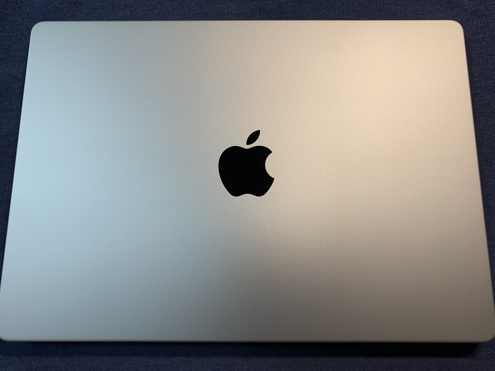
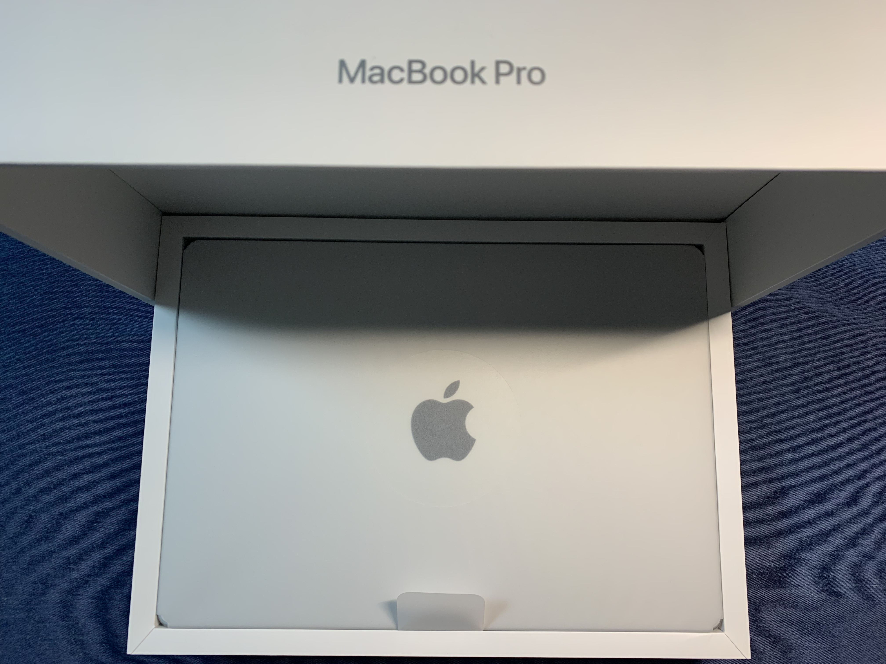
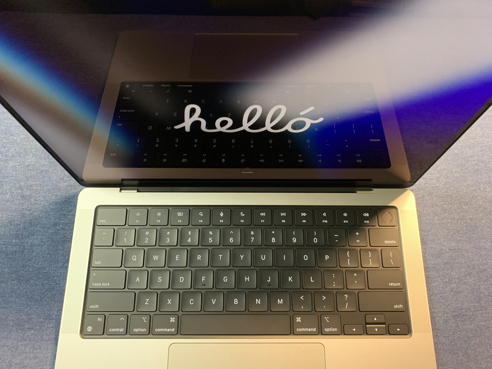

+++
title = "年始セットアップメモ（2022年）"
description = "2022年の年始セットアップメモです。 MacBook Pro 2021 14インチ購入時、特にデータの移行をせずにクリーンインストールの状態から行なっています。"
date = "2022-01-03T21:00:00+0900"
lastmod = "2022-01-04T21:00:00+0900"
draft = false
tags = ["Setup", "Install"]
ogimage = "resource03.jpg"
+++

もしかすると、 **毎年新年にセットアップするといいかも？** と思いはじめてきました。

じゃじゃーん :tada:

**買いました！ :tada: :tada:**

M1Mac を年末に購入したため、
どちらにしろセットアップはやらないといけなかったのですが、
やっていくうちに **年始にセットアップすると思った以上にメリットがあるなあ** と思うようになりました。

例えば以下とか。

- 永続化すべきものがちゃんと出来ているかどうかのチェックになる
- 古い設定が残って悪さするのを定期的にリセットできる
- メイン PC にトラブルがあっても、仕事ができるまでの復旧が早くなる
    - TwentyFour だと荷物捨てるシーンはよくある
- **ミニ式年遷宮** することで、 **新年新たな気持ちで迎えられる :bamboo:**

最後のは気持ちの問題ですが、
古いものをばっさり行って新たな気持ちで新年迎えるのはけっこう清々しくて良いです。

なので来年やるかどうかは分からないまでも、とりあえず今年分のメモくらいはやっておきましょう。
ということでメモメモ。

## メニュー

そんなにしっかり書き込んで記事に残す必要もないので、あくまで自分向けに **『こんなこと設定しました』** というメモを残せればいいかなと思います。

### 最低限ブラウジングできるまで

ここではパスワードマネージャをインストールして、
**ブラウザ経由でログインして使うサービスが使えるところまで** とします。

- OS のセットアップ
    - 概ね流れのままに設定
    - **言語は英語** にして、普段から英語に慣れる
- Dock から不要なもの削除（全部）
- System Preferences
    - Dock が邪魔しないよう極力小さく
    - ショートカット設定
        - **極力いじらない方針**
        - F1〜F12キーはそのまま入力できるように（物理キー最高〜）
        - `Shift + Ctrl + H` でウィンドウ左スクロール
            - 本当は `fn + H` にしたい・・・
        - `Shift + Ctrl + L` でウィンドウ右スクロール
            - 本当は `fn + L` にしたい・・・
        - Spotlight と Input Sources のキー入れ替え
            - 本当はカスタマイズしたくないけど、ここは止むを得ない
            - 日本語圏なので Input Method の方が優先度高い
    - スリープキーは `Ctrl-Cmd-Q` で代用
        - 以前は Touch Bar でスリープキーを一番右に指定
        - スリープキー自体の割り当てはないので、 **ロックをかけるショートカットを覚える**
    - firewall の設定
- 各種ブラウザインストール
    - Google Chrome
    - Firefox
- 1password に依存している Dropbox インストール
    - Dropbox は削除可能なので、次までに依存しないようにしたい・・・
    - 1password が利用している代替ストレージは iCloud あたり？
- 1password インストール
- feedly のアカウント移行 **（今回のみ）**
    - ユーザーの整理をする必要があったので再設定
    - OPML 形式でインポートエクスポート
- Chrome の設定 **（今回のみ）**
    - 本来は同期されるので不要、今回のみ再設定
    - よく使うショートカットをブックマークバーにアイコンだけ登録
- Google Chrome 拡張機能インストール **（今回のみ）**
    - ここも同様に再設定
    - Empty New Tab Page
        - 画面共有したときに余計なものが映らないようにする
    - Toggl Track
        - 時間計測する
    - Lighthouse
        - Web ページの分析用、すぐ使うわけではないけどいずれ必要になるのでこのタイミングで
    - DeepL Translate
        - UI を英語にしたり読む記事を英語にする分、日本語に翻訳しやすくしておく

### 最低限の仕事ができるまで（作業・コミュニケーションなど）

最低限連絡ついたり仕事ができたりする状態に早めにしておくと安心ですよね。

ということで、最低限の仕事ができるまでを一旦の目標とします。

- Slack インストール
    - 各種ワークスペースへのログインし直し
- Zoom インストール
- Teams インストール
- ターミナルインストール
    - iTerm2 を使っていたが、このタイミングで **Alacritty** に乗り換えてみる
    - https://github.com/alacritty/alacritty
    - ターミナルとターミナルマルチプレクサが分離できていれば、ターミナルは比較的なんでも可
- ターミナル設定
    - https://github.com/girigiribauer/dotfiles を clone
        - 中身はだいぶ古いので、見直しが必要・・・
    - シンボリックリンク張り替え
        - （以下概要のみ）
        - zsh 周り（シェル）
        - tmux 周り（ターミナルマルチプレクサ）
        - ssh 周り
    - `.ssh/` 内のパーミッション設定
        - `id_rsa` は 0600 にしないと後で弾かれる
    - Homebrew インストール
        - （以下概要のみ）
        - oh-my-zsh
        - tmux
        - fzf
        - tig
    - Alacritty の YAML 設定ファイルを最低限書く
- 仕事用のリポジトリを手元にクローン
- VSCode インストール
    - `code` コマンドで立ち上がるよう設定

ここまでで最低限、チャットツールでやりとりができ、エディタ開いて少し修正してコミット、程度のことができるようになりました。

**わーい :clap:**

あとおまけでブログも書けるようにしておきつつ、 `brew install imagemagick` して、手元で `mogrify` コマンドを叩けるようにしておきました。
画像の一括処理とかが手元のコマンドでできてすごく便利で、ここの記事の画像もこれで処理しちゃってます。

（TODO: この前後編集中です）

### ブログ投稿できるまで

ブログ投稿を、 Go 製のスタティックサイトジェネレータである Hugo を利用して行なっています。

- Homebrew 追加インストール
    - hugo （スタティックサイトジェネレータ）
        - https://gohugo.io/
        - ただしブログのテンプレートはぐちゃぐちゃなので見直す
    - imagemagick （ブログ作成時の画像変換用）
        - https://imagemagick.org/
        - 画像が多いときは `mogrify` コマンドを使う
    - ffmpeg （ブログ作成時の動画変換用）
        - https://www.ffmpeg.org/
        - `ffmpeg -i src.mov dst.mp4` だけで変換できる
- KeyCastr インストール
    - https://github.com/keycastr/keycastr
    - キー操作を可視化したい（画面共有時、動画化など）
    - KeyCastr のキャプチャ ON/OFF のキーバインドを `Shift+Opt+Cmd+0` あたりに（滅多に入力しない）

この辺まで入れれば、以下のように **動画キャプチャをブログに持ってくるまでの敷居がめちゃめちゃ低く** なります。

<a href="resource.mp4" target="_blank">
    <video width="710" height="467" autoplay muted loop controls>
        <source src="resource04.mp4" type="video/mp4">
    </video>
</a>

この辺は別記事にまとめてもいいかもしれませんね。

### パフォーマンス発揮できるまで

前項目まででは以前通り仕事ができるとは言い難いので、足りない項目を順次セットアップしていきます。

ここから先はやりながらの方が抜け漏れ気付きやすいと思うので、仕事と平行してセットアップしていきます。

- zsh で vi-mode indicator が表示されてない状態だったのを修正 **（今回のみ）**
    - https://github.com/ohmyzsh/ohmyzsh/tree/master/plugins/vi-mode
    - 上記の環境変数追加
- TripMode3 インストール
    - https://tripmode.ch/
    - 外のネット環境で Docker イメージとかダウンロードして死ぬ、などを避ける
    - でも今はそれほど必要と感じてないかも
- VSCode の拡張機能インストール
    - （以下概要のみ）
    - vscodevim
    - その他仕事で使いそうなシンタックスハイライト系
- VSCode / vscodevim 設定
    - https://github.com/VSCodeVim/Vim#mac
    - 公式にあるようにキー押しっぱなし時の挙動を修正する必要あり
    - `$ defaults write com.microsoft.VSCode ApplePressAndHoldEnabled -bool false         # For VS Code`
- VSCode の設定 **（今回のみ）**
- Xcode インストール
    - テザリングでやったら一撃死なので注意
- Homebrew 追加インストール
    - massren （CLI のファイル一括リネーム）
