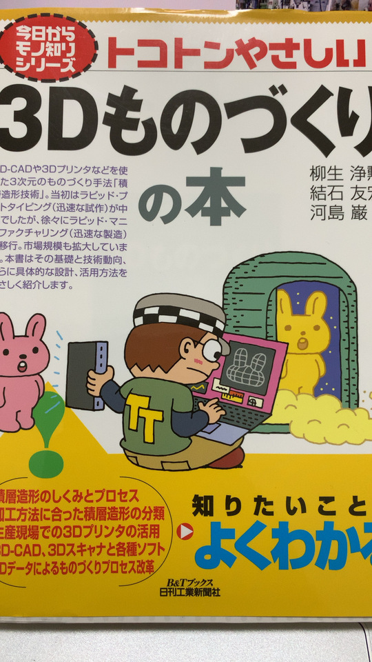
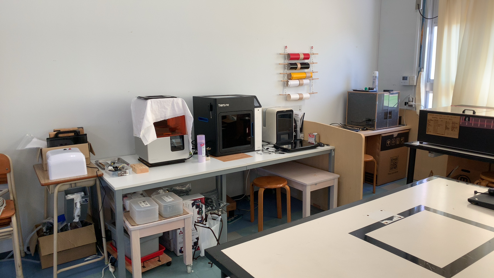
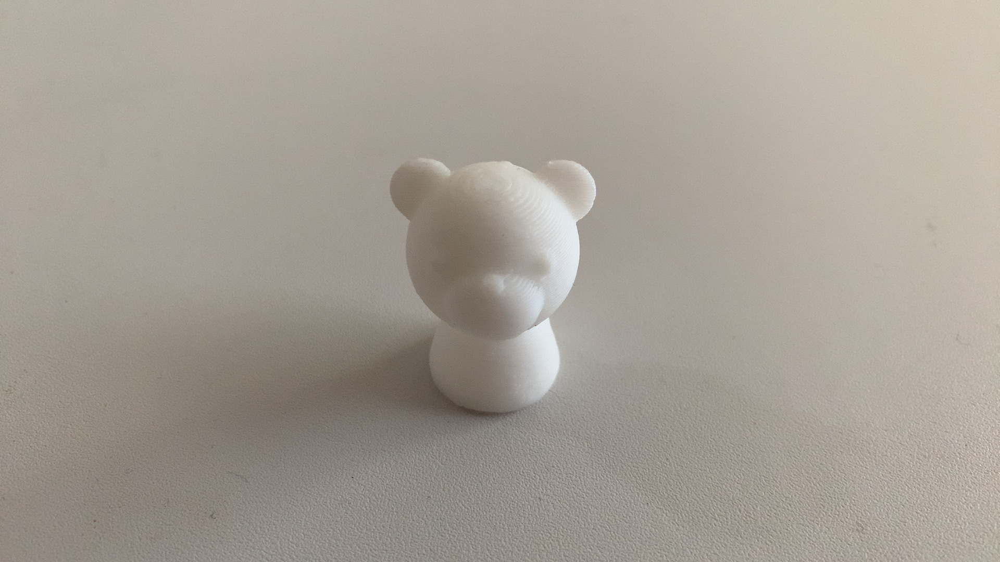

+++
title = "3Dものづくり始めました"
description = "いまどき個人ブログなんて誰もみないだろうから、3Dものづくりの作業ログとして使わせてもらおうの巻"
date = "2022-10-01T19:00:00+0900"
#lastmod = "2022-10-01T19:00:00+0900"
draft = false
tags = ["Fab"]
+++

2022年も10月になったというのに、今年のブログ2件目とな・・・？

## 3Dものづくり始めました

身の回りのちょっとした部品を、自分で作れるようになったら嬉しいなあ、と日々思いつつ、
結局調べるだけで手を動かしてきませんでした。

そういうの良くない！ということで、
重い腰を上げてそろそろ3Dものづくりを始めていこうと思います。

仕事につながるかどうかは完全に切り離して、
**『自分の身の回りをちょっとだけ便利にする』** をテーマにやっていこうと思います。

## 予習

わざわざ自分で3Dプリンターを買わずとも、
日本各地に **ファブ施設** なるものが数多く存在しているので、
そこで初回の講習を受けてざっくり使い方を学べば基本オーケーです。

なんですが、それに参加する前に前提知識としてあった方が理解が進むんじゃなかろうかと思い、
2冊ほど本を買って予習しました。

（1冊はダメっぽかったのですが）
以下の本は3Dものづくりのチュートリアルとして、全貌を速習することができて結構良かったです。

[トコトンやさしい3Dものづくりの本 (今日からモノ知りシリーズ)][1]

### そもそも知らなかったことまとめ

- 造形方式が7種類もある、層を重ねていくのはそのうちの1種類
- 材料もいろいろある、樹脂だけじゃなく金属使ってるところもある
- 3Dモデル以外の部分で、作ってる最中に倒れないように **サポート（サポート材）** で補強するものも出力される
- 3Dモデルの一般的なデータ形式は **STL ファイル** で、単なる三角形の集合データでしかない
    - これは3Dプリンタに依存せず、汎用的に使えるただの3Dデータ
- 3Dプリンタでどう動かして3Dモデルを出力するかを定義するのが **Gコード**
- Gコードは3Dプリンタごとに異なり、3Dモデルを入力として3Dプリンタ側でGコードに変換してくれる
    - X軸ここまで動かして、Y軸ここまで動かして・・・みたいなやつ

こんなもんかな。

## 講習を受ける

一通り読み終えたところで、近くのファブ施設にて予約を取り、初回講習を受けました。

2回目以降は定額料金に加えて、材料使った分を支払えば良い、とのことです。
（たぶんファブ施設ごとにルールや料金は違うので、聞いてみると良いです）

この真ん中のやつを使わせてもらいました。

### 当日聞いたことまとめ

- 3Dモデルを作るオーサリングソフトと、印刷するオーサリングソフトは別もの
    - 前者は3Dモデルのデータ作成用
    - 後者は3Dモデルの印刷時操作用（後述）、こっちは3Dプリンタごとに用意されてるっぽい
- 3Dモデルを作るオーサリングソフトは、概ね **Fusion360** が使われているらしい
    - ツールの講習もそのツールの使い方だそう
    - Windows / Mac 両方ある
- AFINIA H800+ という3Dプリンタを使わせてもらった
    - 印刷時における3Dモデルの操作は、これ系列のオーサリングツールを使う
    - 今回は AfiniaStudio がそれに相当する
    - 印刷プレビューすると、 **かかる時間と使用材料のグラム数が表示されて便利**
    - ちなみに素材はABS樹脂のみでやっているそう
- キャリブレーション（位置合わせ）の前に必ず初期化をする必要があった
    - 他の3Dプリンタでも同様の操作かどうかまでは知らない
    - 逆にキャリブレーションは設定済みなのでいじらなくて良い
- **台座とノズルを一定温度以上温めてから** でないと、実際の3Dプリントが始まらない
    - 温度差があると、プリントしたものが反って剥がれやすくなったりするそう
    - プリント前に暖気運転しておく方法もある、とのこと
- **積層ピッチ（1層あたりの厚み）は、 0.2mm** でだいたいオーケー
    - 0.3mm など他の厚みで印刷されたものも見せてもらったが、そこまで違いは感じられない
- 3Dモデルの印刷時にも、3Dモデルを操作しておいた方がいいケースがある
    - 縦に長いものは、印刷時に **横に倒しておいた方が早く仕上がる** （積層なので）
    - 横方向になだらかな曲面になっていて、 **等高線のように模様が出てしまう** （積層なので）場合は、逆に立てると面が綺麗になる
- 3Dモデルの大きさは、3Dモデル自身が持っているので、3Dモデル編集用のオーサリングツールで編集できるが、印刷時にも編集可能
    - 3Dモデルの印刷時操作用のオーサリングソフト（AfiniaStudio）で、スケールの設定などもできた
    - プレビューして思ったより時間かかるなあ、というときに、少し小さくするのも可能

こういうのは覚えてるうちに書いておかないとね。

他にも細かな話はあれこれあったものの、だいたいこんな感じかなと。

### 講習で3Dプリントしたもの

15分ちょい（温める時間込み）でできたのがこれ。

くまー。

けっこう硬いです。（少なくとも手ではつぶれないレベル）

## 次のステップ

たぶんこんなところかなと。

- 外に公開されているデータを実際にダウンロードし、3Dプリントしてみる
    - すぐ使えそうなものをとりあえず印刷してみたい
- 3Dモデルを作るためのオーサリングソフトである Fusion360 に慣れる
- バネやモーターなどの動力がなくても、カチッとはめられるような構造を考える
    - 2つ以上の部品を作って着脱したい
    - ABS樹脂でどれだけ弾力があるのか試したい

不定期で続きます。

 [1]: https://www.amazon.co.jp/dp/4526077216
