+++
title = "3Dものづくり(2) - Fusion 360 をいじり倒す"
description = "3Dプリンターで出力するデータは Fusion 360 で作るのが一般的と聞いたので"
date = "2022-11-17T21:00:00+0900"
lastmod = "2022-11-19T21:00:00+0900"
draft = false
tags = ["Fab", "Fusion360"]
+++

前回の続きです。

[3Dものづくり始めました](/tech/20221001/) ※11/19 リンク先間違ってたのを修正

## 前回のまとめ

- 3Dプリンターの初回講習を受けて、目の前でプリントしてみた
- 3Dモデルを作るのは **Fusion 360** が一般的と聞いた
    - 異論は認める
- 次は Fusion 360 を学ぶターン！

ということで、あれから暇を見つけては **Fusion 360** をいじり倒してました。

だいぶ慣れてきたのでここらでログを残しておきます。

## Fusion 360 を学ぶ

速習するには、やはり本があったほうがいいよねーということで、
色々調べてみたところ、
**『Fusion 360 マスターズガイド ベーシック編』** という本が超定番っぽかったので、これを1冊読んで学ぶことに。

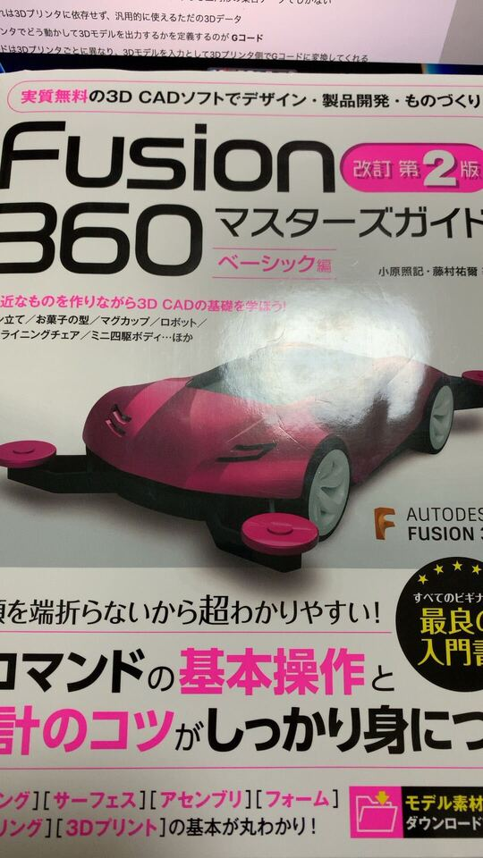

[Fusion 360 マスターズガイド ベーシック編][1]

### 使う前に知らなかったことまとめ

こういうのは覚えているうちに書いておかないとね、慣れきってからじゃなかなか列挙できません。

- Fusion 360 は **概ねオンライン前提** のアプリケーション
    - オンラインじゃないと保存できない形式もある
    - 3Dプリンターで使う **STL 形式もオンラインじゃないと出力できない**
- 3Dモデリングを行える CAD （キャド）ツールだけじゃなかった
    - 3D空間でシミュレーションや組み立てなども行える
    - 3Dプリンタ関係なさそうだけど、色塗ってプレビューとかもやれるっぽい
- 実質無料とかって書いてあるサイト多いけど、ちゃんと条件ある
    - **個人で非商用利用なら無料** 、のプラン（3年間）がある
    - https://www.autodesk.co.jp/products/fusion-360/personal

インストール型なのにオンライン前提ってのが少し気になりますが、
（あと欲を言うと起動がちょい遅いのも気になる・・・）
まあこのレベルのツールを無料で使わせてもらえるのはすごいことです。感謝感謝。

## 3Dものづくり（ダイジェスト）

ここからはダイジェストでお送りします。

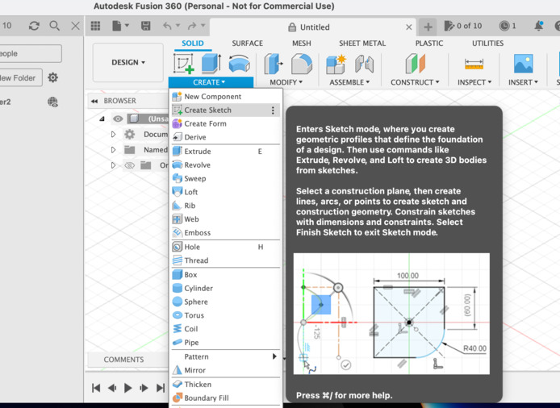

英語 UI でやってます。スケッチを作成。

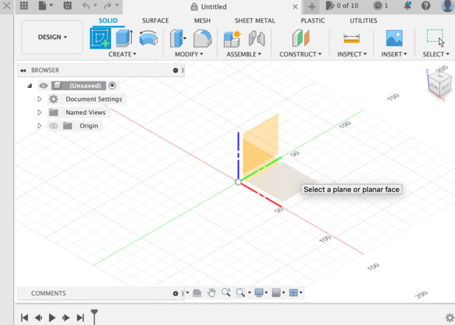

平面を決めて・・・

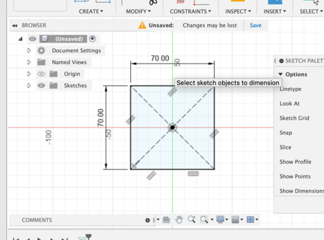

図形を作ります。

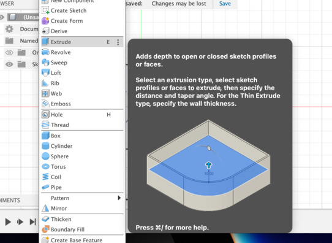

図形を作ったら押し出します。 Extrude!

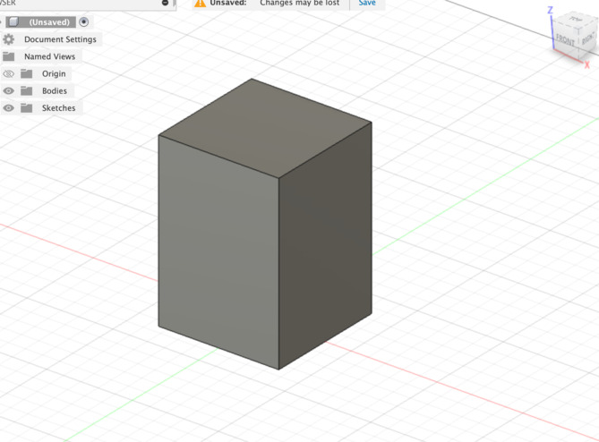

立方体の出来上がり！

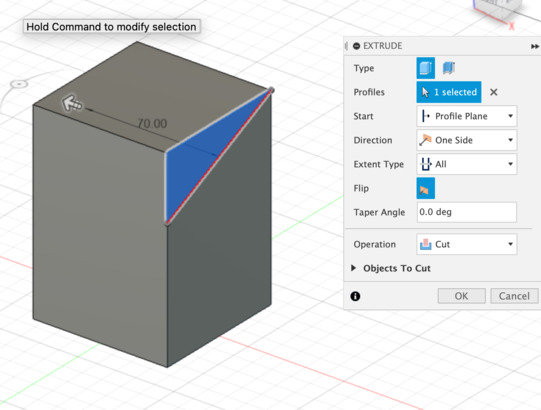

同様にスケッチで三角形を作り・・・

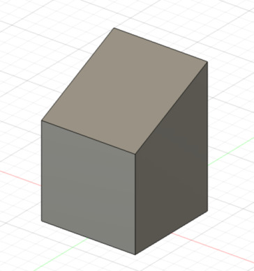

今度は押し出しつつカットすることで斜めに切り取ります。

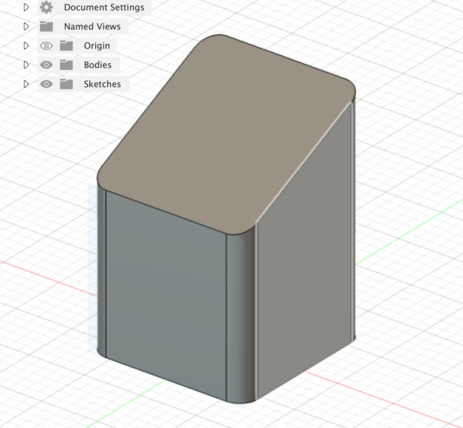

角丸（フィレット）に！

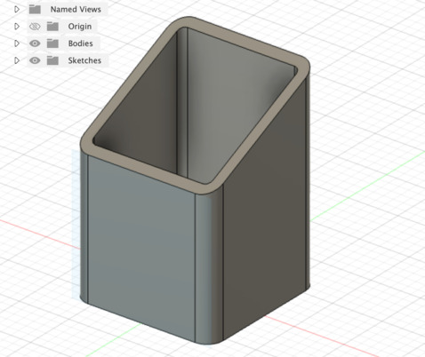

シェルで中をくり抜く！

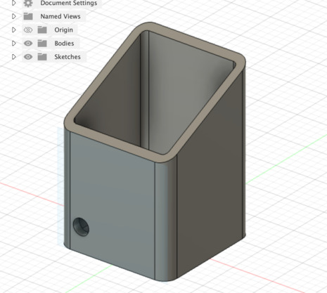

円をスケッチして中身くり抜いて・・・

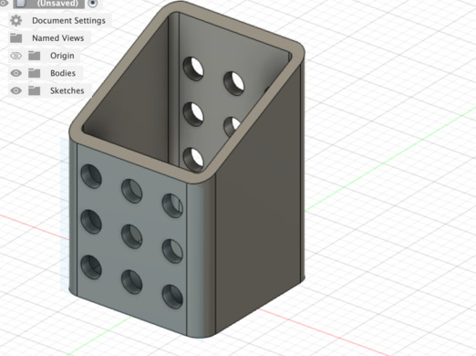

長方形型のパターンで穴を上下左右に複製！

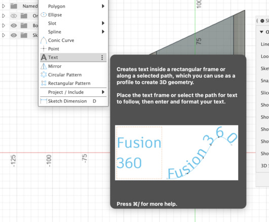

最後にテキストを埋め込んで

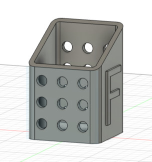

ペン立ての完成！ ﾊﾞﾊﾞｰﾝ :raised_hands:

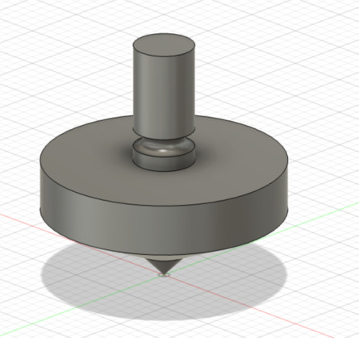

同様にコマも作っていきます。

スケッチで回転軸ベースに図形を作り、今度は回転（revolve）させて立体物を作ります。

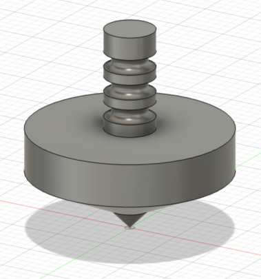

あとは手で持つところを削って、他も削って・・・

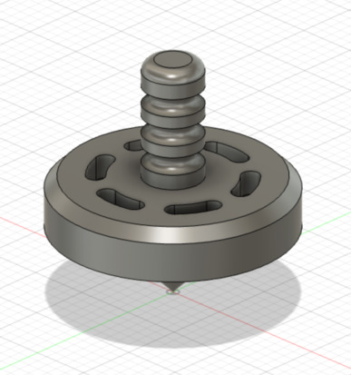

コマの完成！ :confetti_ball:

## Fusion 360 を触ってみてわかったこと

- **スケッチで図形を作り、図形を元に立体物を作る** 、が基本工程
- スケッチ寸法で、明示的に寸法を定義できるし、 **完全拘束** の状態にできる
- ゴールの立体物から、どういう立体物を **足し算引き算して手順を作っていくかが肝** っぽい

ざっくりあげるとだいたいこんなところでしょうか？

### スケッチで図形を作り、図形を元に立体物を作る

これは『Fusion 360 マスターズガイド ベーシック編』をチュートリアル通りに進めることで徐々に見えてきました。

基本的に立体物を作るアクションは、平面に対するアクションなんですよね。
なので、先に **スケッチで図形を作る** 必要があるようです。

これちょっと例外あるかもなんですけど、
球体とかを直接作るメニューも用意されてて、こっちでもいいのかなーとも思うんですけど、
球体でも結局半円を作ってそれを回転軸で回転させれば球になるので、
やはり基本は **図形を元に立体物を作る** 、って流れなんだと思います。

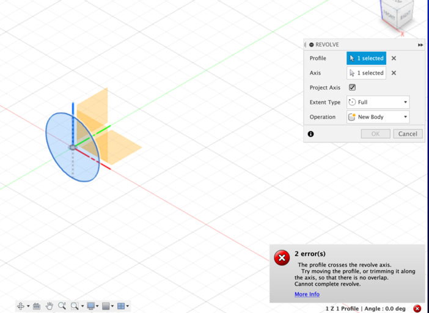

ちなみに正円を作ってからそれを回転させたら、エラー表示が出てうまくいきませんでした。

たぶんこれは回転軸の両サイドに図形があるので、他と被っちゃってるよー的なエラーだと思われます。（誰か詳しい人いたら教えて）
半円にしたら上手くいったのでたぶん合ってるとは思います。

### スケッチの完全拘束

要するに曖昧なところがなく **サイズがすべて必要十分に決まっている状態** ですね。 **黒で表示** されます。

これを意識してやっておくと、一部サイズを変更したときにうまいことなんとかしてくれたりするので良いとのこと。

ちゃんと **スケッチ寸法** でサイズを定義しながら進めていれば、まあまあ大丈夫そうな気はします。

## 次のステップ

とりあえずチュートリアルは序盤の必要そうな部分だけ速読して、
あとは手を動かしながら足りないところを戻って読む、みたいなスタイルで進めていってます。

これはチュートリアルの手順通りにやってるときは気づかなかったのですが、
自分で印刷したいものを作ろうとしたときにようやく問題として気づきました。

ゴールの立体物から、どういう立体物を **足し算引き算して手順を作っていくかが肝** みたいですね。

- 立方体を作ってから分割する？
- 図形として分割しておいてからそれぞれ立方体にする？

みたいな手順が試行錯誤してみないと見えてこなさそうだなーと思いました。

まあこの辺は次回、実際にプリントしたものとセットでブログにでもメモっておきましょうかね。（もう施設利用の予約済みです）

あっ不定期です。

[1]: https://www.amazon.co.jp/dp/4800712548
