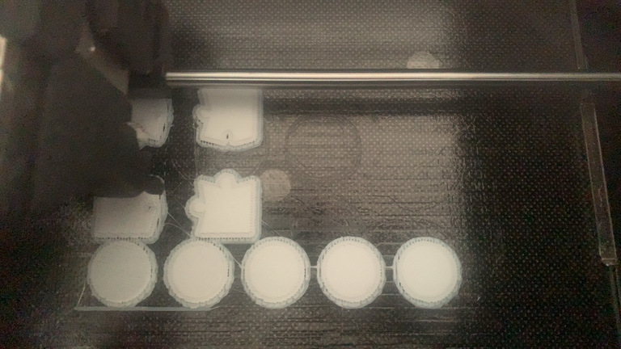
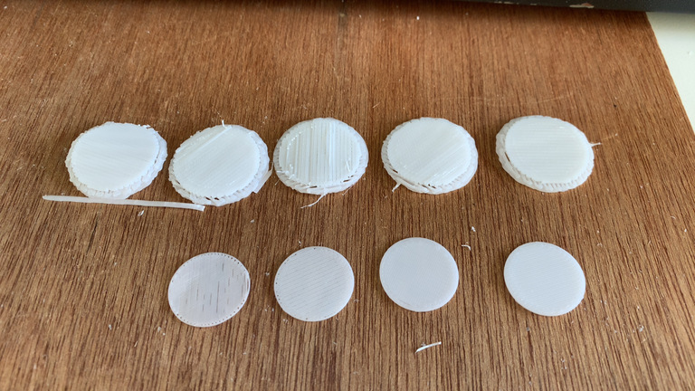

+++
title = "3Dものづくり(3) - 検証用データを印刷してみた！"
description = "Fusion 360 で自ら作ったデータを実際に印刷してみたらとんでもないことになったの巻"
date = "2022-11-20T19:30:00+0900"
lastmod = "2022-11-21T06:00:00+0900"
draft = false
tags = ["Fab", "Fusion360"]
+++

さらに続きます。前回まではこちら。

- [3Dものづくり始めました](/tech/20221001/)
- [3Dものづくり(2) - Fusion 360 をいじり倒す](/tech/20221117/)

## 前回のまとめ

- Fusion 360 で3Dプリンターのモデルのデータを作る
- 『Fusion 360 マスターズガイド ベーシック編』を順にやればツールの使い方は概ね分かる
- 自分の作りたいものは手順を想像できるようにならないと難しい

とりあえず3Dプリントしてみないことにはなんともならないので、
どれくらい使えるものが出来るのか？を実際に検証してみたいと思います。

## 検証したいポイント

以下です。

- **初回3Dプリントできるかの検証**
    - **Chapter3 のコマ** をそのままプリント
    - 初回はまずこれだけでプリントしてみる
- **寸法通りにプリントするとどうなるのか？の検証**
    - **2x2のパズルのピース**
    - 厚みはほどよい数mm程度に
- **カチッとはまる機構の検証**
    - でこぼこのパーツをサイズ違いで、 **でこぼこが両サイドについたもの** を2つセットで作る
    - ぼこの方は出っ張りをスムーズに入れる導線の溝を作る
    - 余白 0mm, 0.1mm あたり
- **強度の検証（平面）**
    - **コイン型で中がつまった厚みの異なるもの** を作り、割れるか試す
    - 0.2mm, 0.4mm, 0.6mm, 0.8mm, 1mm の5種類
- **強度の検証（球体）**
    - **中が空洞の球体** を作り、人間の力で割れるか試す
    - 0.2mm, 0.4mm, 0.6mm, 0.8mm, 1mm の5種類

今回は作りたいものというよりは、検証したいポイントを先に考えて、
それにあったものを選定してます。

合計5つですが、最初の1つで初回3Dプリントを試しつつ、
次の1回で他4つをまとめてプリントしたいなーと思ってます。

## 3Dものづくり（ダイジェスト）

今回もモデルを作るところはダイジェストで。

立方体を作ってから、上の面をパズルっぽく分割。

うまく出来てる・・・！

移動して切り離し〜。

4分割して〜

上の面の角を取ったら完成！ :tada:

次はでこぼこが両サイドについたもの。
でっぱり部分をカチっとはめたい。

こんな感じででっぱり部分をスムーズに通す溝も作る。

でっぱりが直径 4mm に対して、溝は 3mm でいけるやろ〜と思ったが・・・

出来上がったデータを見て、それなりに厚みがあって入らない可能性もあるので、
念の為溝を 3.5mm にしたものも用意しておくことに。（ビビり）

コイン型のデータは簡単。ただの円柱ですね。

0.2mm から 1.0mm まで用意。

空洞の球体は、どこかしらに穴が開いてないとモデル上でも実際でも、
空洞かどうかが判断できないので、一部分に穴開け。

これも 0.2mm から 1.0mm まで用意。

## データを持ち込んで実際に3Dプリント！

さてさて、ここからは3Dプリンターのある施設にデータを持ち込んで、
実際に印刷していきます！

### コマのみ印刷

まずはコマだけで3Dプリントし始めましたが、
**3g で14分かかる** と出ています。

なるほどー？意外とかかるもんだなあ。

最初 **暖機運転** が必要だからなのかも？しれません。
（いや、その時間は含まれてない可能性もあるけど）

で、14分後にできたのがこちら！

おお〜〜〜！

手前に出ているヒモみたいなのは、おそらく土台に固定させるためのサポート材かもですね。

サポート材を分離したのがこちら。

たしかにコマっぽいです！

出来上がった3Dプリントコマを見てみましょう。

ぱっと見はできてる雰囲気あります。

ただ、細部を見てみると結構雑で、
一番下接地部分（一番大事なところ）がなんだか潰れてしまってます。

手で持つ部分も場所によって少し歪んでたりしてますね。

一応回りはしましたが、あまり綺麗に回ってない・・・。 :thinking_face:

### その他4データを印刷してみるが・・・？

さて、予定通り今度は残り4データを一通りまとめて印刷してみます！

と思って全部読み込んでみたら・・・

なんと **108g 、7.9時間** もかかると書いてあるじゃないですか・・・！

ひゃああああ・・・！！！

そんなにかかるのか・・・！これはちょっと予想の範囲を超えてました。

一通りやって長くなっても2時間くらいかなあと思って予約してたので、
当然全部3Dプリントできるはずはありません。

カチッとはまる機構だけだとどうなるか試してみたところ、
それでも2.9時間かかる計算になってしまいました。

### 方針立て直し

うーん・・・。 :thinking_face:

これでも大きい方なのかなあ。厳しい・・・。

しょうがないので、 **最小のグラム数で最大の検証効果が得られる組み合わせ** を考えて、
**2x2のパズルピース（薄いので）とコイン型の厚みの異なるものの2種類だけで印刷** することに。

ただ、それでも45分もかかるので、
これから先は印刷するやり方を色々考える必要がありそうです。

ちなみに受付のお姉さんに聞いたところ、
利用している方は朝にデータを持ち込んでそのまま印刷・放置して、
夕方とかに取りに来るそうです。

なるほどそうじゃないと無理だわこれ。

### パズルピースとコイン型のみ印刷

3Dプリントされていく様を見るのは中々面白いです。

ミルフィーユみたいだ・・・。

ということで3Dプリント完了！

おお〜ぱっと見上手くできているように見えますが・・・？

パズルの方はいい感じですね・・・！

データで見るよりも、パズルをはめる部分が小さいような気もします。

まあこんなもんなのかな。

コイン型の方もサポート材をはがしてみます。

うんうん、厚みの異なる4枚のコインができてますね！

4枚？

あれ？

0.2mm のコインどこいった？

・・・・・・。

どうやら **薄すぎて印刷できなかった** ようです。

積層ピッチが確か 0.2mm とかでしたっけ？
要するに1層あたりの厚みの境界をどうやら超えてしまったらしく、
層としてアウトプットされなかったようです。うえーん。 :cry:

さて、ぱっと見それっぽくパズルピースに仕上がってます。

パズルできるかな・・・？

なんと！

**パズルピースがハマらず、パズルできない・・・！！**

ずこー

問題はこれ、 **エッジが丸くなってる** せいですね。

データを作る際に鋭角の部分が尖りすぎていると、
**先の細長いところが再現できず、丸くなってしまう** ようです。

今回そこまで考えてデータ作ってたわけではないので、
いやむしろそういった問題がちゃんとこのタイミングで表に出てきてくれて良かったです。

これなんとか磨いてハマるようにならないかなー？
今後の課題ですね。

コイン型の方はどうでしょうか？

もうなんか割れるかどうかの検証以前に、 0.2mm のやつは出力されてませんからね。

無は割りようがないです。

0.4mm の最薄の方も、結局見たところ1層分しか3Dプリントされてないっぽくて、
簡単に2つに割れてしまいそうです。

向こう側もうっすら透けて見えるくらいの薄さですね。

やはり **1mm くらいの厚みがあって、ようやくモノとして扱える** 感じがします。

## 実際に3Dプリントしてみてわかったこと

今回実際に3Dプリントしてみて、失敗の方が多かったですけど、
それ以上に相当学びがありました。

忘れないうちにまとめておきます。

- **90度よりも小さい鋭角は再現しづらく、エッジが丸くなりがち**
    - あとでやすりなどで削る前提だが、必ずしもやすりで磨けるとは限らない
- **思った以上に3Dプリンターは印刷に時間がかかる**
    - 精度を上げればその分さらに時間がかかる
    - グラム数が多くなれば当然時間がかかる
    - 小さくて精度が求められないものに向いている・・・？（そんなもんあるのか？）

一旦ここまでかあ。

検証は進んだけど、思ったよりもネガティブな結果が多かったです。

今回3Dプリントできてないものもまだあるからなあ。
大筋の結論はあまり変わらない気がするけど、
カチッとはまる機構は実際にカチッとはまるのかどうか試してみたくはありますね。

## 次のステップ

どうしますかねえ？
続きの検証はしたいけど、時間かかるし・・・。

- カチッとはまる機構の検証はしたい
- もしかしたら DMM の3Dプリンターサービスとか使えるかも？
    - データだけ送って完成物を送ってくれるなら、あまり時間気にしなくても良さそう？
- 小さい・かつ精度があまり求められないものを探す？
    - あるのか・・・？

ちょっと迷い気味です。有識者見てたらアドバイス欲しいです。 :pray:

あっ不定期で続きます。

## 追記: やすりでエッジを磨いたらパズルがぴったりはまったよ

:v:
