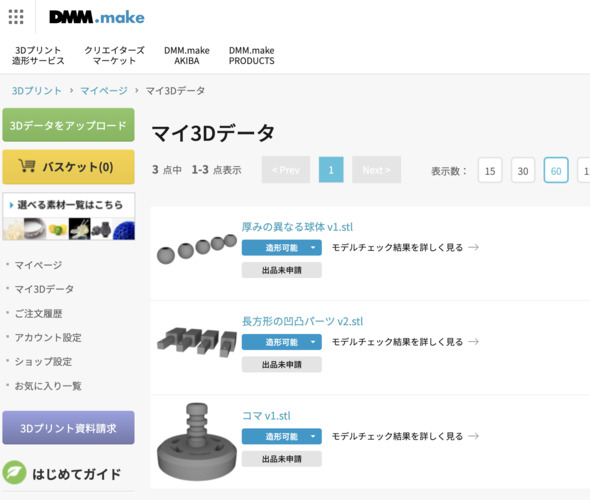

+++
title = "3Dものづくり(4) - カチッとはまる機構の検証"
description = "カチッとはまりはしなかったものの、検証としては良い学びがあったの巻"
date = "2022-12-03T07:50:00+0900"
lastmod = "2022-12-03T07:50:00+0900"
draft = false
tags = ["Fab", "Fusion360"]
+++

すごい、不定期と言いつつ続いてる。

- [3Dものづくり始めました](/tech/20221001/)
- [3Dものづくり(2) - Fusion 360 をいじり倒す](/tech/20221117/)
- [3Dものづくり(3) - 検証用データを印刷してみた！](/tech/20221120/)

## 前回のまとめ

- 90度よりも小さい鋭角は再現しづらく、エッジが丸くなりがち
- 思った以上に3Dプリンターは印刷に時間がかかる
- DMM の3Dプリントサービス使ったらどうなるのか試してみたい

ということで、データをファブ施設に持っていって自分でプリントしたものの、
思った以上に時間がかかって厳しかったので、
今度は **データ丸投げで完成品を送ってくれるサービス** を利用したらどうなのか、
試してみました。

## DMM の3Dプリント出力サービス

https://make.dmm.com/print/

公式の表記揺れが多少あって正式名称わからないのですが、3Dプリントサービスと呼ぶことにします。

データだけ送ると、向こうで3Dプリントを勝手にやってくれて送付までしてくれるというありがたいサービスです。なんか近未来感。

- データのアップロード
- モデルのチェック
- 支払いして待つ

みたいな手順でしょうか？

早速アップロードしてみます。

アップロードすると、なんだか自動でデータに問題がないかのチェックが走ります。

ものの数十秒程度でモデルのチェックが終わり、サイズやお値段などを見ることができます。

前回印刷できなかった凹凸パーツくん。

これだけで7〜8時間かかっちゃうって言われちゃあ、
さすがに検証も「うっ」と気が引けてしまうものですが、
全部リモートで勝手にやってくれるんだから楽ですね。

金額が見えてくる前に素材を選ぶことができるようです。

ナイロン、アクリル、レジン、など幅広い素材が用意されていて、
当然お値段も違います。

まあこの辺はちょっとモデルごとに選んでみないと、
金額感わからないですよね〜。

素材・ナイロンナチュラルで選んでみると・・・

**4,864円！！**

（わっ思ってたよりもするけど、相場感が全然分からないから高いのか安いのか分からん・・・！）

素材・ナイロンナチュラル（磨き）に変更してみたら・・・

**7,538円！！！**

わーー！！

ちょっとしたパーツのお値段を考えてたから、思った以上に想像してた金額との落差が大きいです。

## ちょっと作戦を練る

さすがに検証用途のためだけのパーツでこの金額はちょっと払いづらいので、
少し作戦を練りました。

- 前回までで強度は 2mm あれば十分確保できる
    - 現在の凹の方の厚みは 5mm くらいある？過剰では？
- 凸の方の長さもそんなに長くなくて良いのでは？
    - 10mm あれば十分検証には耐えられる
    - 凸の方を短くすれば、必然的に凹の方も短くなる
- パズルピースの検証から、エッジの問題さえなければサイズはピッタリ作っても問題なさそう
    - 微妙なサイズ違いを4パターン作ったが、1つに絞って良さそう

ということで、サイズを見直してモデルを作り直し、材料費を削る（ケチる）ことで、
トータルのお値段を安くしようじゃないかという作戦に出ました。

### モデリング

それぞれ上から、横から見たモデルです。

なんとなく見たら分かるかと思いますが、これで 10mm の凹凸になってます。

また、出っ張り部分を押し込む側は 2mm で結構硬くなっててあまり曲がらないと思うので、
出っ張り部分を極力小さくして、気持ち出っ張りがあるくらいに留めました。

### 再見積もり

お値段出してみたところ・・・

**1,342円・・・！全然違う・・・！**

これなら2つ頼んでもさっきの額よりも十分低い！

まあ世間で売ってる量産パーツの値段と比較したら、断然まだこっちのが高いんですけど、
それは企業の努力によって成し遂げられているものだと解釈しよう。そうしよう。

### 支払いして待つ

支払いしてそわそわしつつ待っていたところ、
先に作成前にメールが届きました。

> ご注文いただいた商品に関してですが、造形段階の最終確認を行った所、
> 厚みが薄い箇所が複数あり造形段階で破損する可能性がございますが問題ございませんでしょうか。
> 通常のナイロンのディティールの高さ/深さ/幅は0.5mm必要です。

すごい・・・。
**ここまで丁寧にプリント前に指摘したりしてくれるとは・・・！**

ちょっとこれは予想外でした。

しかも添付ファイルの画像付きで。

やー、ここまで丁寧にサポートしてくれるのなら、
なんというかこのお値段は納得というか、なんか初心者にはありがたいですね。

とはいえ、通常であれば直すところを、今回はその辺含めて検証なので、
このままお願いすることにしました。

> 今回検証を兼ねておりますので、
> 実際どの程度再現可能なのか見てみるのも目的だったりします。
> そのため、うまく再現できなケースや
> 破損してしまったケースなど、
> すべて許容できますのでこのままお願いしたく思います。

（タイポってた）

### 届くまでの時系列

- 11/21 21:04 注文受付
- 11/22 11:48 仕上がり確認メール
- 11/22 12:24 破損了承で再度注文受付
- 11/22 12:30 注文完了
- 11/25 17:22 製作開始メール
- 11/28 12:33 発送準備完了メール
- 11/28 16:39 発送完了メール
- 11/29 17:24 配達（ただし不在）

意外に早かったように思いますが、どうでしょう？

というか、同時にパズルピースも実は頼んでたりしたのですが、
こっちはまだ製作中っぽいです。

パズルピースのが先に来ると思ってたけど、
どうやら素材によって違いあるようです。
パズルピースの話はまた次回書きます。

## 届いたもの

**届いたぞー！！！ :tada:**

ちゃんとクッションで包装されててお仕事が丁寧でございます。

わー！前回時間なくて作れなかった凹凸パーツが目の前に！

なんかこれだけでも嬉しいですね・・・！

おおぉー、おおぉー？

なんか

出っ張りが小さくないですかね・・・？

そうかあ、これは **高さが足りなさすぎた** せいで、積層を重ねることができず、
意図した出っ張りにすることができなかった、ということですね・・・。

まあしょうがない。悪いのは自分です。（了承済み）

凹部分はすごく綺麗にできてます。

出っ張りが弱かったのでカチッとまではいかないまでも、
**スーッ、ピタッ** くらいには上手くはまってくれるんじゃないでしょうか・・・！

さて、合体・・・！

**うおー！凹凸がはまらん・・・！！！**

**なるほどー！？！？**

これは笑いが止まらんですね・・・！！

なるほどはまらないかあ！！

### 検証した気づき

・・・

ということで、見事にはまらなかったのですが、
色々試すうちに興味深いことが見えてきます。

縦ははまらないけど横ははまるんです。

このタイミングでなぜパズルがあんなにすーっと綺麗にはまったかの謎が解けてきました。

つまりはこういうことです。
（雑絵描いてみた）

xy軸方向は精度が出る、z軸方向は精度が出ない、と文字に起こすと分かりづらいですね。

つまりはこの図のように、xy軸方向はヘッドやら土台やらが動いて素材の厚み踏まえてピッタリな位置に造形してくれるんですが、z軸方向については積層してる関係上、どうしても **積層ピッチ（積層1つ分）の範囲でずれが起きてしまう** んですね。

積層ピッチはだいたい 0.2mm くらいがいいんじゃない？と以前利用したファブスペースの方がおっしゃられていたので、おそらくこれも 0.2mm の範囲で誤差が起きていて、その分厚みが増してはまらなくなっているのではないかなと。

多分合ってる気がします。有識者の方が見てたら是非とも意見欲しいところです。

### 分かったところでやすりで削る

なぜそうなったのか？は見えてきましたが、
どうそれを解消するかはもうやすりで磨いて削るしかありません。

めちゃめちゃ磨いて粉出しまくりです。

こんだけ削りました。

さすがに人力でやると平面のまま削っていくのは難しく、
もう歪みが出てきてしまってますね。

まあしょうがない。

最後に削りまくってようやく凹凸がはまったパーツの勇士をご覧ください。

## 実際に DMM さんに依頼してみて分かったこと

- すごく丁寧にやりとりしてくれるので、 **初心者におすすめ**
    - **印刷後におかしくなるそうな箇所を事前に指摘してくれる**
    - 問題の起きにくい3Dモデルの作り方を肌感でつかむと良さげ
- データのチェックなども踏まえるとお値段はまあ妥当？
    - 量産パーツよりも高いのは当たり前
    - モデルを工夫して素材を使う量を減らすとお値段も安くなる
- 印刷に時間のかかるものでも、 **注文完了さえしてしまえばあとは待つだけ**

こっちはこっちで体験としてはすごく良いですね。

ファブスペースに行って自ら印刷する場合と比べて、 **頼んで放置すればいつの間にかできて届けてくれる** ところはやはり一番のメリットです。

## 凹凸パーツを作ってみて分かったこと

- **xy軸方向は精度高め、z軸方向は精度低め**
    - 積層ピッチの分 0.2mm くらいはz軸の誤差があるかも？と考えておく
- 印刷してから綺麗にやすりで削り取るのは至難の業
    - 本来削るべきではない部分まで削ってしまった・・・

## 次のステップ

とりあえずもう1つのパズルピースを印刷依頼してるので、
そちらが届き次第残りを書きます。（結構かかってるけど、素材を変えたせいだろうか・・・？）

予告をしておきながら不定期で続きます。
