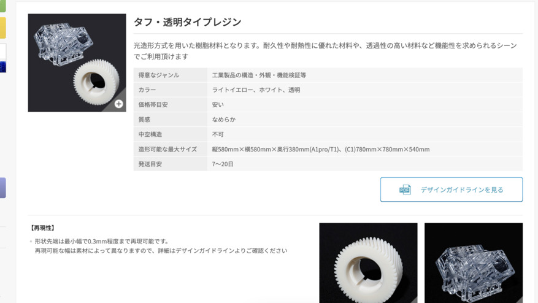
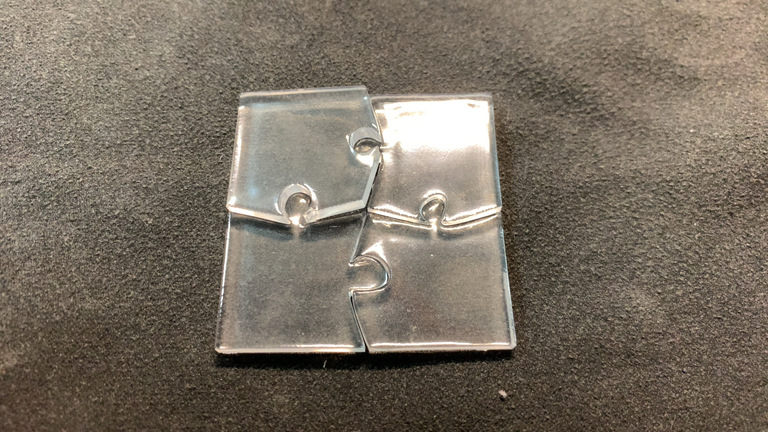

+++
title = "3Dものづくり(5) - 別の素材だったらどうなるの（透明レジン）"
description = "透明な素材を選んだら、本当に透明なパーツができあがったの巻"
date = "2022-12-16T07:00:00+0900"
# lastmod = "2022-12-16T07:00:00+0900"
draft = false
tags = ["Fab", "Fusion360"]
+++

前回2種類のモデルを3Dプリントサービスに投げたうちの、残りの1種類です。

- [3Dものづくり始めました](/tech/20221001/)
- [3Dものづくり(2) - Fusion 360 をいじり倒す](/tech/20221117/)
- [3Dものづくり(3) - 検証用データを印刷してみた！](/tech/20221120/)
- [3Dものづくり(4) - カチッとはまる機構の検証](/tech/20221203/)

記事がどんどん長くなりがちだったので、もっと短めを心がけたい！

## 引き続き3Dプリントサービスを利用してみる

https://make.dmm.com/print/

今回の検証ポイントは以下です。

- 同じパーツを違う素材で作るとどうなるか？
- 違う造形方法を使うと精度はどうなるのか？

この辺りまでがだいたい分かっていれば、
もう実際に作っていくのにそれほど困ることはないんじゃないかと思います。

前回は『素材・ナイロンナチュラル』で選んでみましたが、
今回は別の素材を選びます。

**光造形方式** で **透明レジン** です。

気になりますね・・・！

積層じゃないので、層になる側がどうなるのか、みたいなことは考えなくて良くなりそうです。

透明レジンを選んでみましたが、お値段も比較的現実的なものになってそうです。
（もちろん大きなものにすればそれなりに増えるでしょうが）

では早速これでポチっと！

・・・

1日も経たないうちにメールで連絡が！

> 造形段階の最終確認を行った所、
> 厚みが小さい箇所が複数あり再現性が落ち、破損する可能性があることが確認できました。
> ご了承を頂ける場合は造形可能です。
> このまま造形を進めても問題ないでしょうか。
> キャンセルも承ってございます。
>
> お手数ですが添付画像をご確認ください。（単位はmmです）

おお〜相変わらずちゃんと指摘してくれるすごいサービスだ・・・。

ただ前回と同様、その辺踏まえた検証を今回行いたいので、
破損了承でそのまま作ってもらうことに。

## プリント依頼してから実際に届くまで

前回のカチッとはまる機構のものと比べると、そこそこ時間かかりました。

- 11/22 プリント依頼
- 11/22 確認メールが届く
- 11/22 破損了承でメール返信
- 11/22 ご注文完了メールが届く（確定）
- 11/23 製作開始メール
- 12/13 発送準備完了メール
- 12/13 発送完了メール
- 12/14 配達（ただし前回と同じく受け取り失敗）

うーん、なぜだろう？

- 透明レジンを頼む人が多い？
- 透明レジンは単に時間がかかる・・・？

ただ、発送目安がもともと7〜20日って書いてあるので、別にそこから大きく逸れているわけではないんですよね。
ちょうど20日くらい？

それに検証用なので全然急いでないですし、全く問題ないです。

おお〜〜〜！ **透明パズルピースきたー！**

前回と同じく丁寧に段ボール＆クッションに包まれて送られてきました。

おお〜すごい、ちゃんとパズルピースになってますよ・・・！

ナイロンと比べてどうでしょうか？

- 透明！（見たまんまだけど）
- 先がちゃんと尖っているように見える
- サイズは見た感じナイロンと全く同じに見える

なんと・・・！

予想はしてましたが、 **やはりはまらない・・・！**

だが、全部がぜんぜんはまらないわけでもなく、
一番滑らかな曲線のピースの穴には、ちゃんとすぽっと入っています。

他の穴も強く押し込めば入らなくはなさそうなところも・・・。

ただ、結局やすりで削らないと無理そうなので、頑張って削ることに。

おお・・・、 **やすりで削ると白くなってしまう・・・！**

そして、なんとか透明レジンのパズルピースもはまるようになりました。

ナイロンのものとサイズは同じなので、交互にはめることも可能です。

うぇーい 🤗

## 透明レジンでパズルピースを作ってみて分かったこと

まとめておかないとね！

- **全体的な精度は透明レジン（光造形）の方が高そう**
    - サイズぴったりに作ると、透明レジンは本当にぴったりになってくれそうなイメージ
    - サイズぴったりだからこそ、パズルピースがはまりづらかったのかも？（余白必要？）
    - はまらない部分はどこを磨けばはまるのかが分かりづらい
- プリントに時間かかった
    - 外部サービス利用のため、理由は不明
- エッジは相変わらず問題になりそうだけど、意外ととんがっていた
    - とはいえ、やはり **鋭角部分は事前にモデルから排除しておいた方が良さそう**
- 透明なものが出来上がってくると、 **純粋に嬉しい**

こんなところですかね？
（有識者の方で知ってたら教えてほしい・・・）

## 次のステップ

初期の検証のターンは概ね区切りがついた感じがしますね。

まだまだ試して確認したい部分はありますが、
ここから先は実際に必要なものを作りながら確認していく方が良さそうです。

次のステップなたぶんこんな感じでしょうか？

- **生活に必要なパーツ** を作る
- **突っ張り棒のずれを支える台** とか作りたい
    - 置くスペースが独特なので、市販でなんとかしづらい
    - 選択直後の服のハンガーを一時的にひっかける突っ張り棒が数センチずれてる
    - 精度があまり求められないので、一番最初に作るのには良さそう
- 音楽プレーヤーの **電源ボタンが出っ張っていて、カバンの中で勝手に電源入ってしまう** のなんとかしたい
    - 電源ボタンにフィットするカバーを作りたい
    - カバンに入れた時は押せないが、指では押せるものを外側につける
- **デジタルノギス** （測定器具）が必要かも？
    - 前者の数センチの台なら不要、後者は必要そう

そろそろ現実を補完・拡張していきたい。

不定期で続きます。不定期でね。
