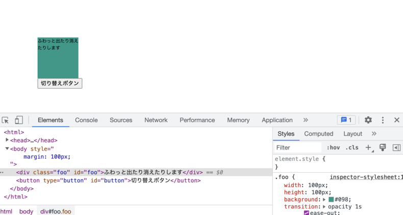
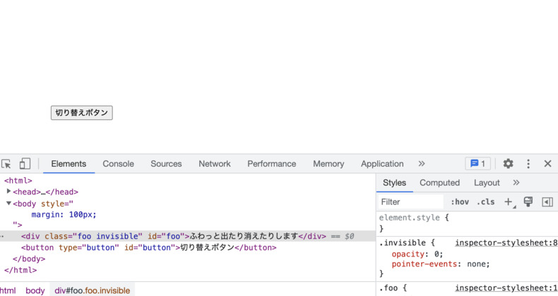
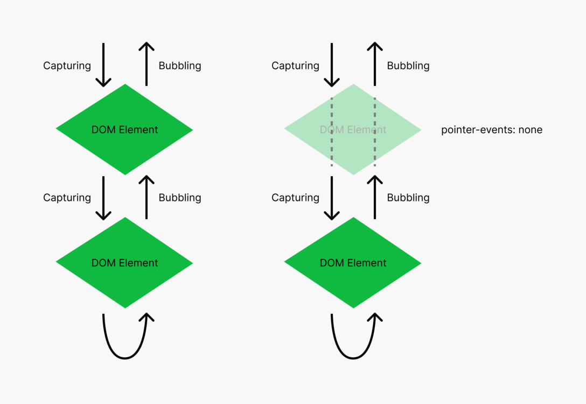
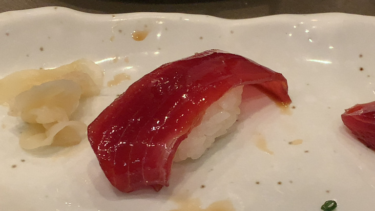

+++
title = "DOM 要素の表示・非表示を雑に切り替える方法"
description = "今年の疑問、今年のうちに・・・と思ってネットの海に解き放っておきます"
date = "2022-12-19T08:00:00+0900"
lastmod = "2022-12-21T08:00:00+0900"
draft = false
tags = ["HTML", "DOM", "CSS", "JavaScript"]
+++

事前に注意書きとして残しておきますが、
この記事は料理に例えるなら **カップ麺を作るときにこうするとすげー簡単に美味くなる！** 程度の、
人によっては料理とすら言えないような内容です。

ただ、お腹が減っていて雑に飯食べたいときは誰しもあるでしょうし、
同様に **雑に作ってて、手間をかけずに DOM 要素の表示・非表示をふわっと切り替えたい** 、
みたいなこともあると思います。

そんなときに知っていると有用な記事です。

興味ない方は読むのをやめて **回らないお寿司** でも食べててください。


## きっかけ

きっかけは名古屋で行われている **『フロントエンドもくもく会』** に参加していたときのことです。

ちなみに運用ルールこんな感じの会です。

- **スクリーンを活用** して、誰かが必ず何かを写している状態をできるだけ保つ
- 写したものに対してどんどん質問していいし、逆に写した人が聞いても OK
- **ただし、必ず解決するとは限らない :hugging_face:**

僕が写しているターンのときに、ふと疑問に思ったことを聞いたわけです。

それが **その場で解消されず** に少し後になって自己解決したのですが、
結局自己解決したあと、何もアクション取ることもなく、
頭の片隅に残ったまま年を越そうとしていたので、
今年の疑問、今年のうちに・・・と思ってネットの海に解き放っておこうと思った次第です。


## DOM 要素をふわっと出したり消したりするのは意外と面倒

そう、面倒なんです。

解決方法を書く前に、何が問題だと思っているのかを共有します。

- **アニメーションで** 表示・非表示を **気軽に切り替える方法** がない？
- **一瞬で** 表示・非表示を切り替えるだけなら **簡単**
    - `display: none` をつけたり消したりすれば OK
    - CSS だけでもやろうと思えばできる（起点は JavaScript 側で持ちたいが・・・）
- ライブラリをガッツリ導入するような **気軽じゃない方法** ならば存在する
    - 表示し始めのタイミングでクラス付与、表示し終わりのタイミングでクラス付与
    - 消え始めのタイミングでクラス付与、消え終わりのタイミングでクラス付与
    - 消え終わりに `display: none` をつけることができれば、まあできることはわかる
- 気軽にやるなら **CSS Transitions** を使いたい、 **間の変化は勝手にやってほしい**
    - 例: `transition: opacity 1s ease-out`
    - ある意味 **宣言的** であるとも言える（変化のさせ方だけ記述して、変化中の数値は知らなくていい）
- `display: none` をつけた瞬間に **DOM ツリーからいなくなる問題**
    - これの時間差コントロールを無理やりやってるのが上記ライブラリ群
    - CSS Transitions で変化時間を定義しつつ、終わるタイミングで JavaScript から `display: none` を与えるのは **2重管理になる** ？
    - `transitionend` イベントを監視すればできるのはわかるが複雑になる
- CSS Animations で `display: none` を含めると話が複雑になる
    - アニメーションの向きとか考慮する必要が出てくる？

みたいな感じで表示・非表示を雑に切り替えたいという話を投げかけたのですが、
その場では解消されず、もやもやしてたのでした。

（その時はここまで言語化はできてなかったかもですが・・・）


## イベントターゲットから消してしまえばいいじゃない

ある時別件やってるときに `pointer-events: none` を使ってて気づいたんですよ。

「ああ、 **イベントターゲットから消してしまえばいいじゃない** 」と。

ここからは HTML/CSS/JavaScript のサンプルを見てもらった方が話が早いので、
以下コードを貼り付けておきます。

```html
<div class="foo" id="foo">ふわっと出たり消えたりします</div>
<button type="button" id="button">切り替えボタン</button>
```

```css
.foo {
    width: 100px;
    height: 100px;
    /**
     * 超どうでもいいけど僕がいつもダミー要素で使う色
     * 右からの連続数値で打ちやすく、かつ単体で使うとダミーとわかる色
     */
    background: #098;
    transition: opacity 1s ease-out;
}
.invisible {
    opacity: 0;
    pointer-events: none; /* <= 今回の肝 */
}
```

```javascript
window.addEventListener('DOMContentLoaded', (event) => {
    document.querySelector('#button').addEventListener('click', () => {
        // 外側はなんでもいい
        // とにかくクラス名の着脱ができてさえいれば OK
        document.querySelector('#foo').classList.toggle('invisible');
    });
});
```

といった感じで、 **コードは超シンプル** です。

特徴としては

- 事前に `transition` プロパティを指定しておく（CSS Transition ならばそう）
- `.invisible` クラスの付与で `pointer-events: none` が付与される

くらいでしょうか。



このふわっと出てる状態から・・・



ボタンを押すたびにふわっと消えたり、またふわっと出たりします。

以下キャプチャ動画。

<a href="resource03.mp4" target="_blank">
    <video width="678" height="568" autoplay muted loop controls>
        <source src="resource03.mp4" type="video/mp4">
    </video>
</a>

これの肝が `pointer-events: none` で、 `.invisible` クラスを付与された瞬間に、
見た目上は見えてるけど、クリックとか一切できない、消えてるのと同じような状態になります。

文字通り **ポインターイベントの管理対象から外してしまう** んですね。

- JavaScript からは、単にクラス付与を切り替えているだけ
- CSS からは、消え始めているときに `pointer-events: none` が指定されているので、完全に消えてるのと同じ扱いになる
- HTML からは、消えていても HTML 要素としては残り続けている
    - 強いて言うならこれがデメリット
    - 細部の表示・非表示で使い、不要になったら DOM をすべて消しておく、くらいが良いかも
- **消えているとき、下の要素は普通にクリックできる**

本当に見えない要素の下がクリックできるかどうかは、 body 要素あたりにクリックイベントでも仕込んでみて、自分で試してみてください。

### イベントターゲットとは

https://www.w3.org/TR/DOM-Level-3-Events/#event-flow

こっちの方が分かりやすい図になってるので、詳しくはそっち見てもらえれば良いんですけども。



ポインター（マウスとかのポインティングデバイス）のイベントは、
このように **DOM ツリーを上から下から行ったり来たり** しています。

この DOM ツリーから完全に存在を消してしまうのが `display: none` で、
ここのツリーから見えなくしてしまうと、
フォーカス当てたり表示コントロールしたりが難しくなっちゃうんですよね。

今回の `pointer-events: none` は、ポインター関連のイベントだけスルーさせちゃおう、というやつです。

そのため、 DOM ツリーとして存在はしてるけど、
`opacity` を徐々に減らしていく最中でもその要素はクリックできませんし、
下にクリックイベントのある要素があれば、すり抜けて下の要素が反応します。

再び表示させたいときもクラス消して `pointer-events: none` の指定をなくすだけで再びクリックできるようになります。

### pointer-events の多用は危険、かも？

CSS で気軽に `pointer-events: none` が指定できちゃうので、
多用すると JavaScript 側で見た時に一切問題ないのになぜかイベント発火しない→実は CSS 側に `pointer-events: none` が指定してあった・・・みたいなことが容易に起こりうるので注意が必要だと思います。

（JavaScript しか知らなくて CSS のこと全然知りません、みたいな人だとここで詰む可能性もありますね。 **ちゃんと HTML/CSS/JavaScript はセットで学びましょう。** ）

ただ、今回のように雑にふわっと表示・非表示を切り替えたい、みたいなときには、
**ものすごく簡単に指定できる** ので、雑に飯食べたい、カップ麺食べたい人向けにはとてもいいんじゃないでしょうか？

ちなみに僕は回らないお寿司もカップ麺も両方好きですよ。


## 追記: pointer-events の代わりに visibility も使える

https://twitter.com/_tsmd/status/1604633124343672832 より。

<blockquote class="twitter-tweet"><p lang="ja" dir="ltr">要素のボックスがその場に残り続けてよいのなら、visibility: hidden で消すと良いですよー。opacity と同様、transition できるプロパティです</p>&mdash; そめ (@_tsmd) <a href="https://twitter.com/_tsmd/status/1604633124343672832?ref_src=twsrc%5Etfw">December 19, 2022</a></blockquote> <script async src="https://platform.twitter.com/widgets.js" charset="utf-8"></script>

`pointer-events: none` の代わりに `visibility: hidden` も使えるよ、とのこと。
早速試してみます。

```html
<div class="foo" id="foo">ふわっと出たり消えたりします</div>
<button type="button" id="button">切り替えボタン</button>
```

```css
.foo {
    width: 100px;
    height: 100px;
    background: #098;
    transition: opacity 1s ease-out;
}
.invisible {
    opacity: 0;
    visibility: hidden; /* <= これも使える？ */
}
```

```javascript
window.addEventListener('DOMContentLoaded', (event) => {
    document.querySelector('#button').addEventListener('click', () => {
        // 外側はなんでもいい
        // とにかくクラス名の着脱ができてさえいれば OK
        document.querySelector('#foo').classList.toggle('invisible');
    });
});
```

<a href="resource06.mp4" target="_blank">
    <video width="1160" height="888" autoplay muted loop controls>
        <source src="resource06.mp4" type="video/mp4">
    </video>
</a>

おや、できない・・・？
消えるときは一瞬で消えちゃいますね。 `visibility: hidden` が効いているといえばそうなのですが。

transition に `visibility` も加えるのでしょうか？
同時に指定してみます。

```css
/**
 * 差分のみ抜粋
 */
.foo {
    transition: opacity 1s ease-out, visibility 1s ease-out;
}
```

<a href="resource07.mp4" target="_blank">
    <video width="1160" height="888" autoplay muted loop controls>
        <source src="resource07.mp4" type="video/mp4">
    </video>
</a>

おっ今度はできた・・・？ :thinking_face:

ただ、なぜ `opacity` と `visibility` をセットで transition で指定するとこうなるのか？は謎ですね。

### セットで CSS Transition を使う謎

具体的に `opacity` と `visibility` を組み合わせるとこういう挙動になる、
みたいなことが直接言及されている仕様のページは見つけられなかったのですが、
（仕様に書いてあることを組み合わせるだけで自明なので、わざわざ具体的なこのケースは書いてないってことなんだろうか・・・？ :thinking_face: ）
過去にいくつか言及されてる記事は見つけました。

- https://www.taccgl.org/blog/css-transition-visibility.html
- https://greywyvern.com/?post=337

（2011年、2015年あたりの記事だけど、結局これらの記事内でも、組み合わせるとなぜオッケーなのかまでは書いてない気がする・・・。）

ちなみに `visibility` を使う方法でも、雑に切り替えるという点では全然許容範囲かなと個人的には思います。

`visibility` を transition に加えることで、そんな劇的に行数が増えたわけでもないですし、
意図も `visibility: hidden` の方が伝わりやすそうですし。

ただ、なぜそうなるのか、だけがストンと落ちてない気持ち悪さだけは少し残っています・・・。なぜ・・・。

（ 12/21 追記ここまでです。）


## まとめ

- `pointer-events: none` は便利なのでさっと使えると良いが、多用には気を付ける
- 回らないお寿司もカップ麺もどっちも美味しい



今年もお疲れさまでした。また来年もよろしくお願いします。


## 参考 URL {#refs}

- https://www.w3.org/TR/DOM-Level-3-Events/
- https://www.w3.org/TR/SVG2/interact.html#PointerEventsProp
- https://www.taccgl.org/blog/css-transition-visibility.html
- https://greywyvern.com/?post=337
