+++
title = "3Dものづくり(6) - 突っ張り棒の設置台を作る・前編"
description = "ここからは実践あるのみなので、自分ならではの問題をどんどん解消していくぞ！の巻"
date = "2023-01-09T09:30:00+0900"
# lastmod = "2023-01-09T09:30:00+0900"
draft = false
tags = ["Fab", "Fusion360"]
+++

2023年、あけましておめでとうございます。今年もよろしくお願いします。

- [3Dものづくり始めました](/tech/20221001/)
- [3Dものづくり(2) - Fusion 360 をいじり倒す](/tech/20221117/)
- [3Dものづくり(3) - 検証用データを印刷してみた！](/tech/20221120/)
- [3Dものづくり(4) - カチッとはまる機構の検証](/tech/20221203/)
- [3Dものづくり(5) - 別の素材だったらどうなるの（透明レジン）](/tech/20221216/)

## 実践のターン！

3Dものづくり、面白いですね・・・！
不定期といいつつ、 **謎の高頻度** で続いてます。

残りは実践編として、活用できるものを1つ2つ作っていく予定（不定期）です。

検証はもう十分やってこれていて、どういうときにどう作ればいいのかは見えてきたので、
今回は **誤差が全然許容できる現実の物体と組み合わせるパーツ** を作ってみて、
**実際の生活で活用する** ところまでやってみようと思います。

実践のターン！

### 突っ張り棒がずれる問題

たぶん写真を見てもらったら一発でわかると思うので、こちらをご覧ください。

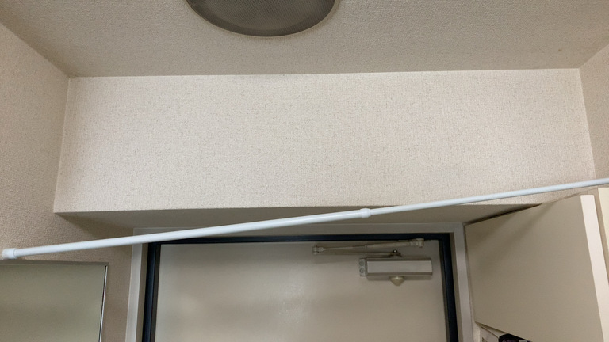

突っ張り棒なんだから突っ張ればいいじゃん、という意見もあるかと思いますが、
この突っ張り棒、洗濯したものを一時的にハンガーにかける用のもので、
衣類って軽そうに見えて意外と重いんですよね。

そうすると、だんだんと服の重みで・・・

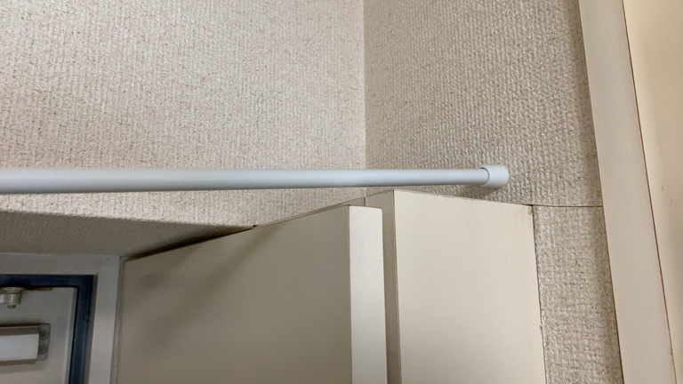

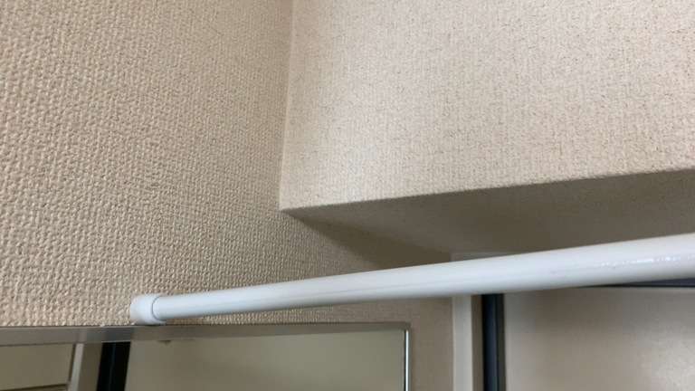

このように **突っ張り棒がずれていってしまう** んですよね。

これを昨年ずっとなんとかしたいと思ってました。

### 突っ張り棒の設置台を作ることで問題解決したい

今回の **問題は突っ張り棒の片方がずれること** 、
それに対する **解決方法が3Dプリンターで突っ張り棒の設置台を作ること** です。

正直3Dプリンターを使わずとも、何かしら手でこねて乾燥などして固められるものがあれば、
今回の問題は同様に解決できそうな気もします。

ですが、今後精度が求められるパーツを作ることも見越して、最初の練習を兼ねて3Dプリンターで作ってみたいと思います。

## ノギス（デジタルノギス）を買ってみた

今回は雑に定規で測ってしまえばどうとでもなりそうな気もしますが、
同様に現実の物体と組み合わせるパーツを作る際に、
どうやら **ノギス** という測定器を使うのが一般的なようです。

そこまで高くなかったので、
数値がデジタル表示される **デジタルノギス** の方を1台買ってみました。

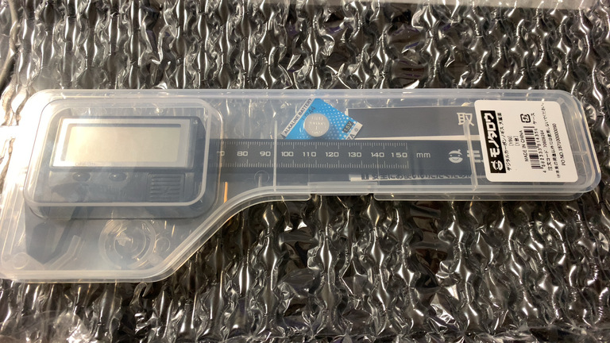

ばばーん！そこまでお高くはないです。
配送料とかを除くと 1,859 円でした。

### デジタルノギスでできることまとめ

- モノの厚さ、内側の距離を測る
- モノとモノの間の距離を測る
- 段差などの厚みを測る

あたりでしょうか？たぶん正式名称あるんでしょうけど、
わからないのでやってみながら見ていった方が良いでしょう。

### 実測

測ります。

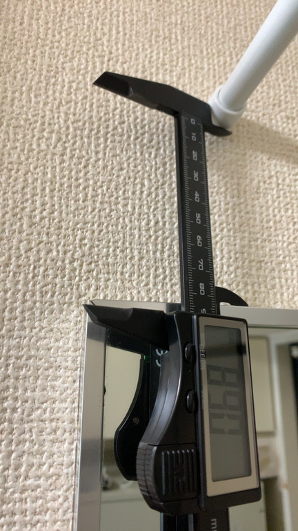

まずは高さ。 89.0mm で意外と距離ある。

突っ張り棒が 1mm ずれてても使い勝手に変わりはないので、多少ずれても問題なし。

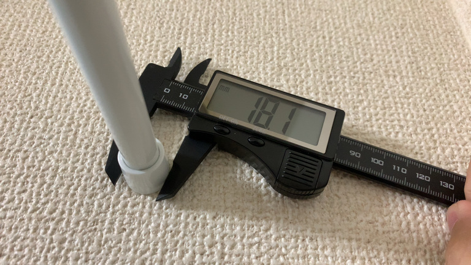

突っ張り棒の直径、 18.1mm 。

これよりも小さくなると支えがはまらないので、余裕をもって作りたいところ。

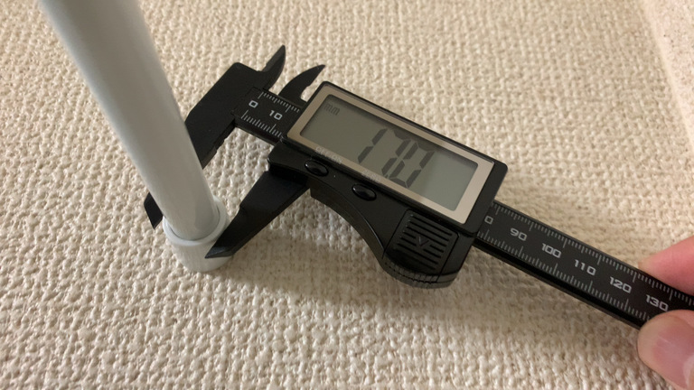

直径が内側に向けて小さくなっていたので、一番小さなところも測定、 17.0mm 。

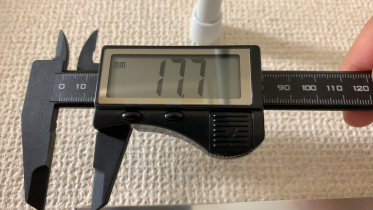

突っ張り棒の左右の出っ張り部分の厚み、 17.7mm 。

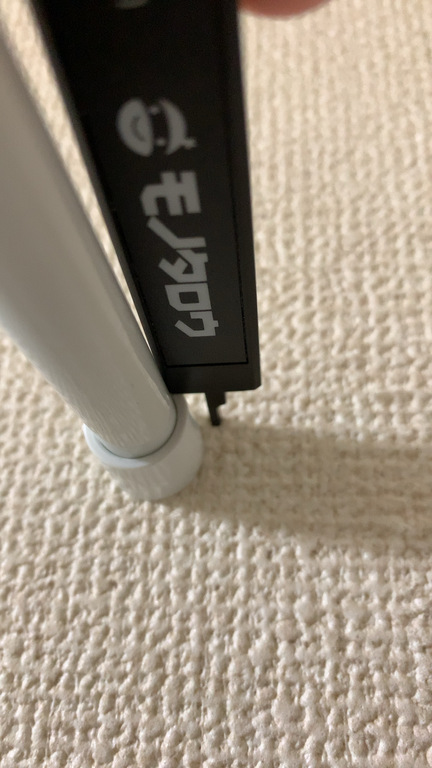

ちなみに段差の厚みはしっぽ部分にある **デプスバー** で測ります。

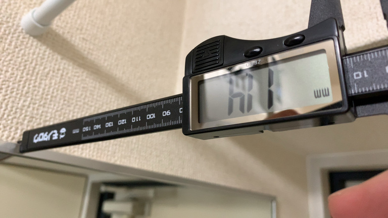

最後に設置場所になる土台の厚み、 11.4mm 。

突っ張り棒の出っ張り部分の厚みよりも、土台の厚みの方が小さいので、
こっちに合わせる形で作ることになりそう。

### 実測した結果

数値まとめ。

- 高さ: 89.0mm
- 出っ張り棒・出っ張り部分の直径（一番大きい箇所）: 18.1mm
- 出っ張り棒・出っ張り部分の直径（一番小さい箇所）: 17.0mm
- 出っ張り棒・出っ張り部分の厚み: 17.7mm
- 土台の厚み: 11.4mm

測ってみると意外に高さありますねえ。

これまでの検証で、あまり大きいとプリント時間が長くかかってしまうんですよね。

最低限の強度を保ちつつも、極力素材を使わない形が望ましそうです。

## 数値をもとにモデリング

ここから先はダイジェストです。

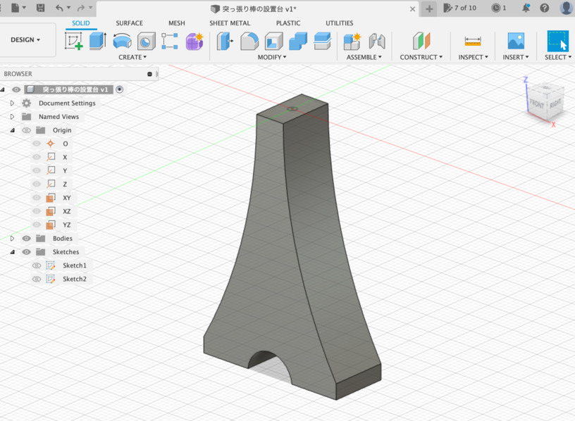

タワーみたいなのを作って前後に Exclude!

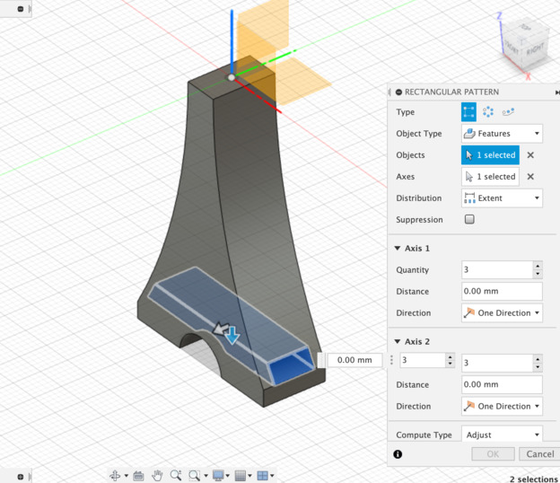

中身できるだけすっかすかにするために、横方向からカットしつつ Exclude!

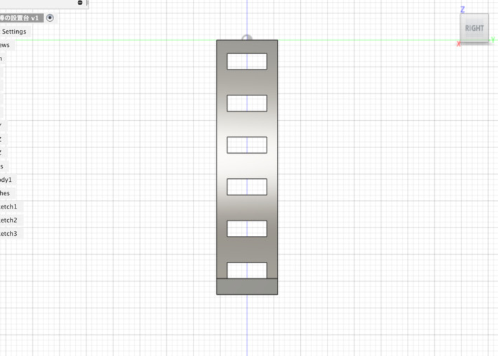

ここでパターンを使って、上方向に繰り返しちゃう。

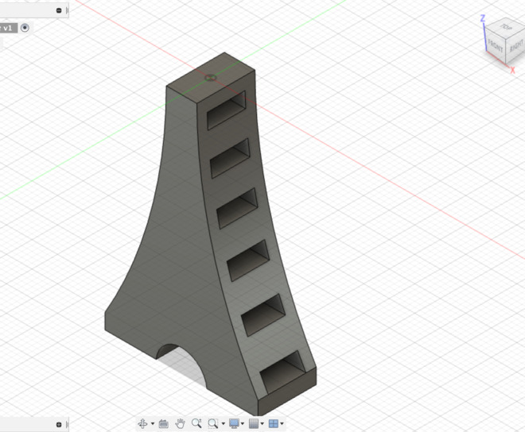

と、こうなる。

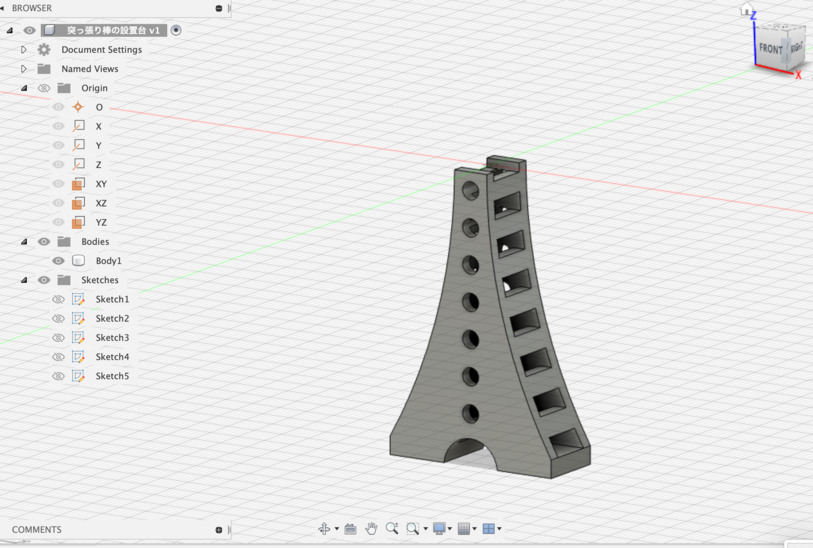

内部に小さいタワーみたいな図形を作り、さらにくり抜く。

ついでにおまけとして、正面が全部平面なので、丸でくり抜く。

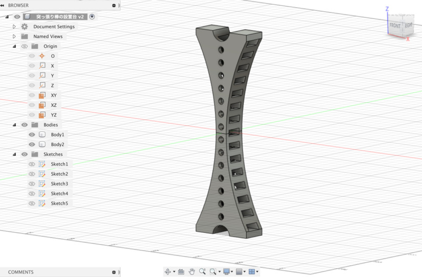

最後にコピーして反転！

できたー！ 🤗

### モデリングまとめ

- できるだけ素材を使わない ≒ プリントに時間をかけない
- 強度を保てるぎりぎりを狙う（目安として 2mm の厚みがあれば人力で壊せないはず）
- 基本的に突っ張るのを支えるだけなので、添える程度でずれなければ OK
- 鋭角は作らない（尖りそうな部分は角を落とす）
- シンメトリーだとかっこよいかも？

正直なところ、ちょっと横幅がせまくて倒れるかも？と思わなくもないけど、
**ダメなら失敗踏まえてまた作り直せば良い** ので、まずはこれで作ってみよう。

あとモデリングの先の話だけど、縦のまま3Dプリントするとサポート材が間に入ること間違いなしなので、
**横に寝かせてからプリント** した方がいいかもしれないね。

## 後編に続く

後編も不定期で書いていきます。不定期でね。
