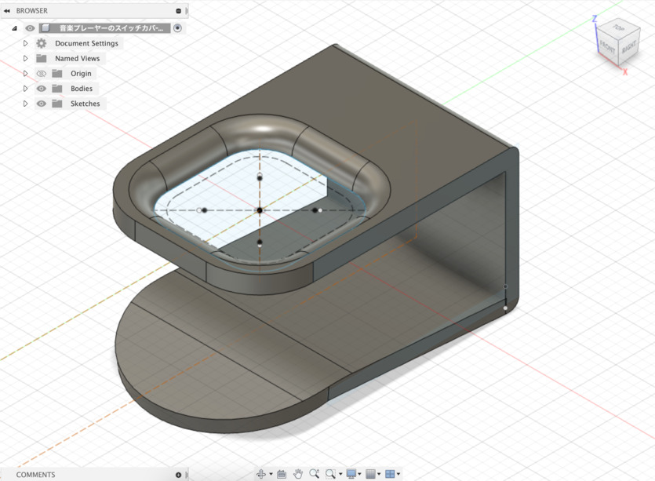

+++
title = "3Dものづくり(7) - 音楽プレーヤーのスイッチカバーを作る・前編"
description = "電源ボタンが出っ張っているせいで勝手に電源入っちゃうのをなんとかしたいの巻"
date = "2023-01-18T08:00:00+0900"
# lastmod = "2023-01-18T00:00:00+0900"
draft = false
tags = ["Fab", "Fusion360"]
+++

前回の突っ張り棒の設置台と並行して、
実は別のものも作っておりましたので、そちらもメモ。

- [3Dものづくり始めました](/tech/20221001/)
- [3Dものづくり(2) - Fusion 360 をいじり倒す](/tech/20221117/)
- [3Dものづくり(3) - 検証用データを印刷してみた！](/tech/20221120/)
- [3Dものづくり(4) - カチッとはまる機構の検証](/tech/20221203/)
- [3Dものづくり(5) - 別の素材だったらどうなるの（透明レジン）](/tech/20221216/)
- [3Dものづくり(6) - 突っ張り棒の設置台を作る・前編](/tech/20230109/)

## 音楽プレーヤーの電源が勝手に ON になっちゃう問題

こちらも現物を見てもらった方が話が早いので、まずはこちらをご覧ください。

ざっくり音楽プレーヤーと呼んじゃってますが、
正確には **Bluetooth の通信機** です。
（以下正確じゃないけどこれを音楽プレーヤーと呼びます）

以前、首にかけるタイプの音楽プレーヤーの無線機器を使っていたのですが、
色々不満があり（話が大きく逸れるのでカット）、
スマートフォンとの通信機能だけを持ち、
有線ケーブルをそこに指すという運用にして概ね満足しておりました。

ただ、そこにも **弱点** があり・・・

そう、 **電源ボタンが出っ張っているのです。**

これにより何が起きるのかというと、

<a href="resource03.mp4" target="_blank">
    <video width="854" height="480" autoplay muted loop controls>
        <source src="resource03.mp4" type="video/mp4">
    </video>
</a>

**鞄の中に入れておくと、結構な頻度で電源が入った状態・音楽が再生された状態になってしまう** のですね。

これはよくない、よくないと思いつつ早幾年・・・。

こういうところで、補助パーツを作るのがものづくりなのではないか？ということで、
電源ボタンのスイッチカバーを何かしら作ってみようと思います。

（なお、これも形状によってはカバーじゃないかもですが、便宜上スイッチカバーと呼びます）

## まずは実測

前回に引き続き、今回も **デジタルノギス** を使ってまずは測っていきます。

電源ボタン付近に何らかカバーをつけることまではほぼ確定してるので、
形状はまだ未定なまでも、とりあえず実測だけしていきます。

横幅の一番出っ張ってるところ、 32.8mm 。

ただし音量ボタンの出っ張りは除く。
（電源ボタン含むと 33.2mm だったけど多分使わない）

高さ、 57.9mm 。

奥行き、 11.4mm 。

電源ボタンの幅、 12.2mm 。

電源ボタンの高さも 12.2mm 。

いやーデジタルノギス便利ですね。こんなとこ定規じゃ測れないでしょ。

ついでに電源ボタン込みの奥行きは 11.8mm でした。

つまり奥行き 11.4mm との差分を取ると、 電源ボタンの厚みは 0.4mm っぽいです。

電源ボタンと上部までの距離、  11.5mm 。

デプスバー、地味に便利・・・。

最後に、使うかどうか分からんけど、
角丸になってるので、外側のレール部分の厚みもついでに測っておきます。

11.4mm に対して 9.1mm ですね。なるほど。

### 実測した結果

数値まとめ。

- 幅: 32.8mm
- 高さ: 57.9mm
- 奥行き: 11.4mm
- 電源ボタンの幅: 12.2mm
- 電源ボタンの高さ: 12.2mm
- 電源ボタンの出っ張りの奥行き: 0.4mm
- 電源ボタンと上部との距離: 11.5mm

こんなとこですかね？

対象の音楽プレーヤーがそんなに大きくはないので、
スイッチカバーもそこまで大きくはならなさそうです。

## 形状を考えてモデリングする

ここまでやって、大きく2パターンかなと思いました。

1. **電源ボタンを左右に囲うようにカバーを巻く（バンド型）**
2. 電源ボタンの上に囲うような形で挟む（クリップ型）

バンドのようにぐるっと巻いて固定することで安定するのではないかなと思い、
最初に 1. の形を考えました。

ですが、再びこちらを見てほしいです。

音量ボタンが右側についてまして、その高さが微妙に電源ボタンと異なっており、
若干下に長い形なんですよね。

そうなると、左右にカバーを巻く形にすると、電源ボタンを活かしつつ巻くことになるので、
けっこう **造形がめんどくさくなりそうな予感** です。

1. 電源ボタンを左右に囲うようにカバーを巻く（バンド型）
2. **電源ボタンの上に囲うような形で挟む（クリップ型）**

そこで 2. なんですが、 1. に比べて **巻くことがやりづらい = 固定できないのがデメリット** なんですよね。

ただ、上方向はボタンやケーブルが何もなくスペースが空いており、なんとか活用したいところです。

そこであれこれ考えて、 **素材のしなりを利用してクリップのように留めてしまえば良いのでは？** とひとアイデア思いつきます。

たぶん今までの検証の通りなら、 **厚みを 1〜1.5mm 程度にすると、壊れはしないがある程度の柔軟性も残ってる** 、くらいの強度になるはずなので、その辺を実践で試してみるのも面白そうです。

ダメなら作り直せばいいしね。でぃーあーいわーい 🤗

### クリップ型のスイッチカバーをモデリング

ここから先はダイジェストでお届け！

まずは実際に押す部分から。

実際の穴の補助線引きつつ、スイッチカバーのサイズ感を探ってみる。

こんなもんじゃあ〜 🤗

丸くなってないと押しづらいからね。

本体との距離を指定しつつ、徐々に立体的に・・・

横から見るとこんな感じ。まずはサイズ通りに。

この先どうするか迷ったけど、クリップ風だとなんか外に出っ張ってる部分あるよね。

てきとーに角度つけてそれっぽく。

うぇーい 🤗

ただ余白がなさすぎてクリップにならないっぽいので、
上部に少しずらすことに。ちょっとだけ延伸。

全体的に延伸して、実際のサイズの補助線も引いておきます。

ここでぐいっと！ぐいっと曲げる・・・！

クリップ部分の厚みが 1.5mm なので、計算通りならほどよくしなって留まる感じになるのでは？？？

音楽プレーヤーを囲う部分は、ほどよく角丸にしておきます。

おお〜それっぽい。

あとはクリップで実際に本体に留める部分が尖っていると、傷がつきやすそうだったので、
設置面もほどよく角丸にしておくことに。

**かんせーい！ 🤗**

いい感じにできたんじゃないかなと！

**作る前にどういう方向性で作るか考える** ところ、意外に大事そうな気がしますね。
今回はクリップ型にしたらいいんじゃないか、みたいなところは中々に良いアイデアだった気がします。

## 後編に続く

スイッチカバー後編も不定期で書いていきます。不定期ですよ？
