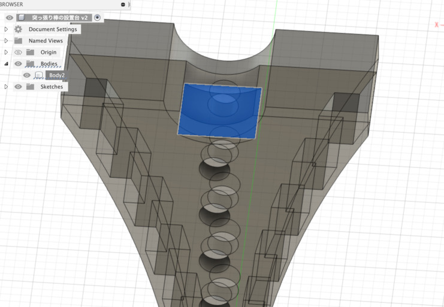

+++
title = "3Dものづくり(8) - 突っ張り棒の設置台を作る・後編"
description = "実際に設置台として使えるのか、試してみたの巻"
date = "2023-01-24T08:30:00+0900"
# lastmod = "2023-01-24T08:30:00+0900"
draft = false
tags = ["Fab", "Fusion360"]
+++

前々回の [突っ張り棒の設置台を作る・前編](/tech/20230109/) からの続きで、
実際にプリントするターンです。

- [3Dものづくり始めました](/tech/20221001/)
- [3Dものづくり(2) - Fusion 360 をいじり倒す](/tech/20221117/)
- [3Dものづくり(3) - 検証用データを印刷してみた！](/tech/20221120/)
- [3Dものづくり(4) - カチッとはまる機構の検証](/tech/20221203/)
- [3Dものづくり(5) - 別の素材だったらどうなるの（透明レジン）](/tech/20221216/)
- [3Dものづくり(6) - 突っ張り棒の設置台を作る・前編](/tech/20230109/)
- [3Dものづくり(7) - 音楽プレーヤーのスイッチカバーを作る・前編](/tech/20230118/)

## モデルの微調整

あの後、プリントするとしたら気になる箇所がいくつかあったので、
プリント前に微調整だけしておきました。

見てもらうとわかるように、
突っ張り棒の支える箇所の少し奥に削りきれなかった支えがありました。

突っ張り棒の設置には全く影響がなく、
サポート材が内部に作られた際にサポート材が取り出しにくくなる場所にあったので、
これは取っておきたいですね。

これも Extrude （押し出し）で行けちゃうんですねー。

押し出し万能説。

はい！
上から見た時、向こう側が見えるようになりました 🤗

これでサポート材も取り出しやすいはずです。

あとは多少鋭角になってそうなところがあるかもなので、
一応軽く角丸にしておきました。

これは見た目分からんレベルかもですが、まあ適当でいいや。

## 印刷！

ここからは実際に印刷していきます！ 🤗

印刷プレビューしてみたところ、約15g・80分ちょいの時間がかかるようです。

ってことは **1gあたり5〜6分** が目安ってことですかね？
もちろん形状にも左右されるんでしょうけども。

印刷中！

すごい、スケルトンみたいですね・・・。

そしてドーン！

仕上がりました！！

いいですねえ。強度もばっちりそうです。

さてさて、サポート材を除去していきましょう。

・・・。

・・・・・・。

**サポート材の除去が難しすぎる・・・！！**

特に内部が無理！無理ゲーすぎる・・・！

・・・。

しばらくサポート材と格闘した結果・・・。

**「もうこのままでいっか」** と持ち帰ることに。

---

そして持って帰って設置台を設置！

じゃじゃーん 🤗

DIY だ！！

**どうやら**

**いい感じに**

**やったったぞ！**

でもよくよく見てみると、なんか明らかに円のサイズがマッチしてないんですけど？

これもしかして **半径と直径を間違えた** やつか・・・？

（ぱっと見半分くらいのサイズになってそうなのでたぶんそう）

あはははは :smile:

まあ成立してるからおっけおっけw

ほらほらー

めっちゃしなってるけどちゃんと突っ張り棒を支えてくれてます。

**役割を果たすの超大事。**

## 突っ張り棒の設置台を作ってみたまとめ

- サポート材の取り出しやすさを踏まえた形状、意外と大事
- 印刷する前に、サイズがあってるかちゃんと確かめる（雑にやりすぎた・・・）
- 形がどうあれ、作ったものが役に立っていればオッケー

もっと中身空洞にしてくり抜きやすくしつつ、
丸い橋渡しくらいを縦に並べるくらいがちょうど良かったのかもしれないですね。

まあでも役に立ってるので結果オッケーです！

完！
