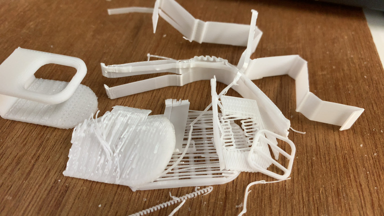
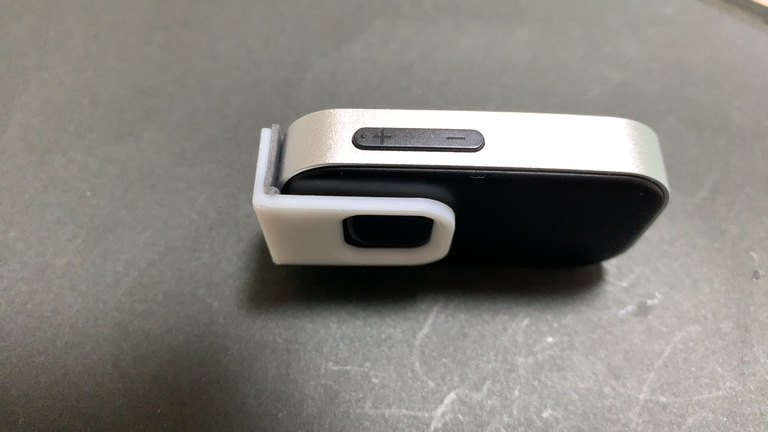

+++
title = "3Dものづくり(9) - 音楽プレーヤーのスイッチカバーを作る・後編"
description = "スイッチカバーの方もプリントしてみたの巻"
date = "2023-01-28T06:00:00+0900"
# lastmod = "2023-01-28T06:00:00+0900"
draft = false
tags = ["Fab", "Fusion360"]
+++

前々回の [音楽プレーヤーのスイッチカバーを作る・前編](/tech/20230118/) からの続きで、
こちらも実際にプリントするターンです。

- [3Dものづくり始めました](/tech/20221001/)
- [3Dものづくり(2) - Fusion 360 をいじり倒す](/tech/20221117/)
- [3Dものづくり(3) - 検証用データを印刷してみた！](/tech/20221120/)
- [3Dものづくり(4) - カチッとはまる機構の検証](/tech/20221203/)
- [3Dものづくり(5) - 別の素材だったらどうなるの（透明レジン）](/tech/20221216/)
- [3Dものづくり(6) - 突っ張り棒の設置台を作る・前編](/tech/20230109/)
- [3Dものづくり(7) - 音楽プレーヤーのスイッチカバーを作る・前編](/tech/20230118/)
- [3Dものづくり(8) - 突っ張り棒の設置台を作る・後編](/tech/20230124/)

すごい続いてる。不定期なのに。

## 印刷！

では早速印刷します！

印刷プレビューしてみます。
だいたい6g、時間はたぶん30分くらいだったかな？

そして印刷完了！

おおー出来上がっておりますね！

なんか見た目便座っぽいですね・・・。

これはもしかしたら立てて印刷するのが正解だったのかも・・・？

半分くらい気づいてはいたものの、ボタンを押す角丸のところをあまり傾けてやりたくなかったというか、
そこが精度でなくなっちゃうとボタンを押す際の角丸っぽさが微妙になるのが嫌だったんですよね。

まあなのでしょうがないと。

そしてサポート材を除去します。

前回の突っ張り棒の設置台よりは外しやすくて問題ないです。

むしろ本体を割らないように丁寧に除去しなくては。

できたー 🤗

やはりというか、角度つけた方はあまり綺麗に出てないですね。
層が見えちゃってるというか。

でもまあヨシ！

**うぇーい 🤗**

で、想定通りしなってはいるんですが、
**予想を超えてしなりすぎてる** んですよね。
両橋をつまむと容易にくっついてしまうレベルだ。

そのせいか、けっこう緩くなってしまっているというか。

あまり裏側から固定されてる感がないというか・・・。

<a href="resource08.mp4" target="_blank">
    <video width="854" height="480" autoplay muted loop controls>
        <source src="resource08.mp4" type="video/mp4">
    </video>
</a>

これ見てもらったら分かるかもですね。

ゆるゆるです・・・。

ということで一工夫考えました。

**両面テープで止めてしまおう！**

うん、それがいい。

**ぴったりー！ 🤗**

いいねいいね！

よし、一旦止めたのを外そう。

・・・。

**パキッ！**

**！？！？**

思った以上に両面テープが強すぎて、
今度は裏側部分が割れてしまった！ :sob:

ショック・・・！

一日もたなかった・・・！ :sob: :sob: :sob:

そうかあ。

1.5mm じゃあやはり割れちゃうかあ。

力がかかりそうな角の部分をもう少し丸めて力を分散させるとか、
割れないための施策を考えないとだな・・・。

とはいえ、まてよ？

これ割れたところで、 **今の状態で全然使えるレベル** なのでは？

そう、役割を果たせれば形はなんでもいいのです。

<a href="resource13.mp4" target="_blank">
    <video width="854" height="480" autoplay muted loop controls>
        <source src="resource13.mp4" type="video/mp4">
    </video>
</a>

ほらー！ちゃんと **スイッチカバーの役割を果たしてる** じゃないー！

しばらくこれで使うのは全然ありなんじゃないかなと！

R（丸みの度合い）が微妙に異なるところとか、
気になるところを挙げ出したらキリがないけど、
音楽プレーヤーのスイッチカバーは一旦これで完成です！

無理やり完成したことにしました！

## 音楽プレーヤーのスイッチカバーを作ってみたまとめ

- 思った以上にしなるので、やはり強度的に厚さ 2mm は確保したい
- しならせるところは直角じゃなく角丸にして力を分散させたい
- とりあえず作ってどんどん使っていこー！

一旦完成なんですけど、もし落ち着いて改めてちゃんと作り直したいとなったら、
今度は塗装もセットでやるのもいいのかもしれないですね。
（塗装も全然やったことない）

### おまけ: プリントの精度について

ここだけメモっておこうかな。

今回のように初回プロトタイプ的に作ってみよう、というものなら問題ないのですが、
ちゃんと使っていこうというものがこんなギザギザだと、
ちょっと精度がよろしくないのかな？とも思います。

けっこう見た目にも分かるし、触ってて積層部分がよく分かるんですよね。

利用させてもらってる3Dプリンターがちょっと古いせいなのか、
設定で積層ピッチを見直せば済むだけの話なのか・・・。

積層ピッチの設定見直しは **2倍4倍と時間がかかってしまう** 話になるので、
今度何か3Dプリントしたいときに、どの方法を取るべきかがちょっと悩ましいですね。

もしかすると、安めのやつを自分で1台買って、
精度出るようにカスタマイズして行った方がトータルで安上がりになる可能性すらありますね・・・。

この辺有識者の人とか見てたらぜひともご意見ほしいところです。

---

ということで一旦完！ 🤗

気が向いたらまた不定期で書くかもです！
