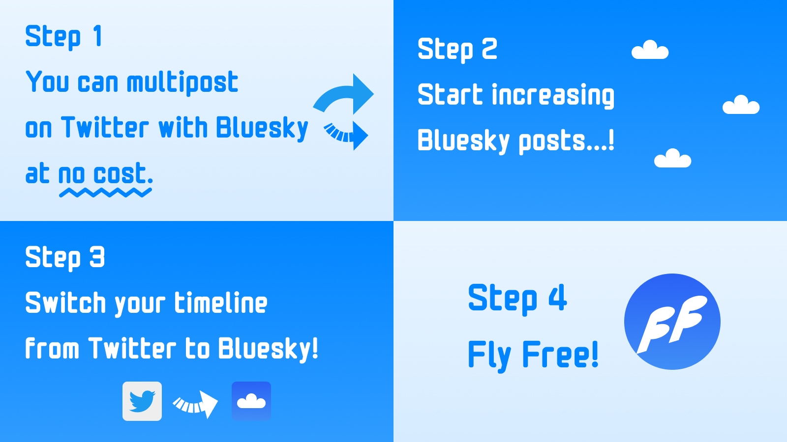

+++
title = "Twitter と Bluesky にマルチポストできるツールを作ってみた"
description = "SNS の檻から逃れて自由に飛ぶためのツールを拡張機能で作ってみましたというお話"
date = "2023-10-24T08:00:00+0900"
# lastmod = "2023-10-24T08:00:00+0900"
draft = false
tags = ["BrowserExtension", "plasmo", "FlyFree", "SNS"]
+++

超お久しぶりです！

お久しぶりとか言ってるうちに **Twitter が無くなってしまいましたね。わお！ :hugging_face:**

SNS に関連したツールを作ってみたので、今日はその紹介記事です！

## ねんがんの Bluesky アカウントをてにいれたぞ

2023 年の 3 月か 4 月ごろだったでしょうか。

ようやく **Bluesky のアカウント** を手に入れました！わーい :raised_hands:

さてどうやって活用しようかと考えていたのですが、とりあえず **両方に投稿** してみて、色々考えてみようという考えに至りました。

- 同じ投稿を **Twitter と Bluesky** に投稿
- 画像付きの投稿も極力同じように投げる
- 一旦手動でやってみる

両方に同じ内容を投稿して、全く違和感なく Bluesky の方が使えるのなら、もはや Bluesky で良いわけです。

### 同時投稿をしてからの気づき

気付いたことを書き出してみます。

- **同時投稿はめんどい**
  - 超めんどい :pleading_face:
- 僕が同時投稿したいときは、大まかに 2 通り
  - 仕事をしながら仕事に関連した調べごとを流すとき
  - 外に出ているときに思ったことや見たものを流すとき

#### 仕事をしながら仕事に関連した調べごとを流すとき

- よく使う技術だったり、調べてみて意外と知らなかったこととか
- 大部分が PC からの投稿
- URL を含むのでリンクカード、たまに画像のシェア

#### 外に出ているときに思ったことや見たものを流すとき

- 大部分がスマートフォンからの投稿
- 画像とテキストが中心

#### いずれにしても同時投稿はめんどい

**同じ情報を複数の SNS に流すのはとにかくめんどいです :pleading_face:**

そして 7 月ごろになり、本格的に **Twitter が壊れ始めた** のをみて、

> なぜわざわざ手間をかけてまで Twitter にも投げているのだろう？
>
> もはや Bluesky だけでいいのでは・・・？

と思うようになり、それから Twitter における本格的な投稿はやめてしまったのでした。

（実はこのタイミングで今の原形的なツールは作ってたんですが、 Twitter を見に行かなくなってしまい、同時投稿のツールを作る理由も無くなって少し放置気味になっていたのは別の話）

## SNS の檻に閉じ込められる

同時投稿を試してる間に、同じように Bluesky と Twitter の両方を活用してる人を何人か見かけたのですが、大半の人は Twitter に再び戻ってしまい、 Bluesky を **休眠アカウントのように保持しているだけ** 、という状態になってしまっていました。

まあ、誰がどの SNS にどれだけ投稿するか？なんて、それこそ **その人の自由** なので、僕を含む **外野がとやかく言うことではない** のですが、それにしても **人はなぜ Twitter から逃れられないのでしょうか？**

その頃から少しまじめに考え始めました。

### Twitter に戻ってしまう理由

- あの人の投稿は Twitter でしか見られないから
- Bluesky の知り合いを見ても、アカウントはあるのに投稿してないから
- 投稿に対する反応が気になりすぎてやめられない

こんなところでしょうか？

そう！まさしく [ネットワーク効果](https://girigiribauer.com/biz/20200130/#%E3%83%97%E3%83%A9%E3%83%83%E3%83%88%E3%83%95%E3%82%A9%E3%83%BC%E3%83%9E%E3%83%BC%E3%81%AF%E6%A6%82%E3%81%AD%E5%AE%8C%E5%85%A8%E7%8B%AC%E5%8D%A0%E3%81%AB%E8%BF%91%E3%81%84) ！なんて恐ろしい子・・・！

## ネットワーク効果から抜け出すには？

Bluesky でよくアカウント数が議論にされるんですけど、重要なのは **アカウント数よりも投稿数・投稿量** だと思うんですよね。
SNS における **存在というのは投稿と同義** であり、投稿していなければ存在していないのと等しいわけです。

つまり、アカウントはあるけど、投稿してないから存在してないのと同じ、存在してないから見に行かないわけです。

道理ですね :thinking_face:

ではネットワーク効果から抜け出すにはどうすれば良いのでしょうか？とある 1 つの **巨大 SNS のネットワーク効果を打破するには、別のネットワークを強化すれば良い** のです :hugging_face:

そう、パン :bread: が無ければケーキ :cake: を食べればいいじゃない！ :face_savoring_food:

せめて PC 使ってるときに、 **仕事をしながら仕事に関連した調べごとを Bluesky にもコストゼロで流すことができれば** 、もっと Bluesky においてもその人の存在が認識され、 Bluesky が活用されやすくなるのかもしれないと、そう考えました。

### SNS の檻から逃れる方法

上記で触れたネットワーク効果、つまりは SNS の檻から逃れる方法を画像 1 枚でまとめると以下です。

1. いつも Twitter に投稿しているように Bluesky にも **ついでにノーコストで投稿** できるようにする
   - **ノーコスト** ってところが超大事
   - PC だけで割り切って作る（≒ 拡張機能）
2. 使うと Bluesky の投稿数が増え始める
   - **投稿は存在と同義** なので、実際に Bluesky にいる人が増えるように見える
   - 休眠アカウントが息を吹き返し始める
3. そのうち **Bluesky の方がメインでも良くね？** となる
   - 同じ情報が Twitter と Bluesky に流れてるのなら、どっち見てもいいじゃん
   - もう Twitter 見たくないニャン・・・ :cat:
   - SNS ごとに蛇口をつけて流量をコントロールするイメージ
4. SNS の檻から逃れて **自由に空を飛べる** ようになる :feather: :feather:
   - Twitter に軸足を置き続けてもいいし、 Bluesky に軸足移しても良し

という思想を元に作られたツールなので、 **FlyFree** という名前にしました。

こんな感じで（僕の場合は） Twitter に一時停止させつつ、 Bluesky にだけ投稿してます。

両方に投稿するとこんな感じにそれぞれの投稿結果（Success / Error）が表示されます。

---

ということで、ぜひとも使ってみてください！ **感想お待ちしてます！**

- https://chrome.google.com/webstore/detail/flyfree/mjlfkhenobdjdonefhdbpigopndgeogm
- https://github.com/girigiribauer/fly-free

あっ感想は Twitter の方じゃなく Bluesky の方でお願いしますね :pray:

https://bsky.app/profile/girigiribauer.bsky.social （もう Twitter の方見たくないニャン :cat: ）

## おまけ

作りがいろいろ雑でごめんなさい。というか拡張機能周りがまだよく分かってません。 :pleading_face:

- エラーハンドリングが雑
- DOM 周りの処理が雑
- テストが少ない
- plasmo （拡張のフレームワーク）は便利な反面、クセがある
- 拡張 (Chrome Web Store) の公開フローがいまいちよく分かってない
  - リジェクト疲れた :pleading_face:
  - これってリポジトリをそのまま公開とか無理なんだっけ・・・？
  - 毎回 zip で渡すのめんどいのだが？ CI/CD は？
- タイッツーも対応していきたい
  - API が足りない :pleading_face:

**少しずつアップデート** かけていくつもりではいるので、長い目で見てもらえればと思います。（気が向いたらお手伝いもしてくれたら嬉しいです）

このツールの実装面については、長くなっちゃうのでまた改めて書きたいと思います！
