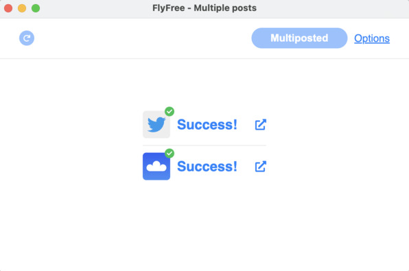
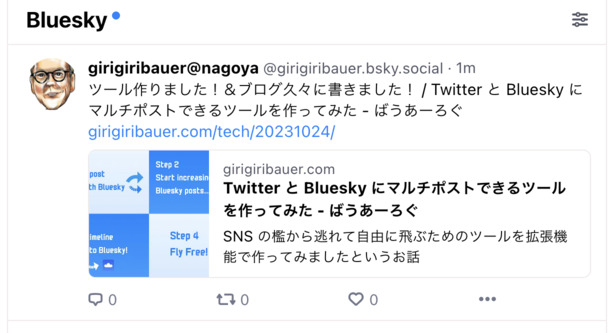

+++
title = "Twitter API を使わずに Twitter と Bluesky に投稿する裏技"
description = "マルチポストツール FlyFree における良い発想を得た話とそれに沿って作った実装のお話"
date = "2023-10-30T08:00:00+0900"
# lastmod = "2023-10-30T08:00:00+0900"
draft = false
tags = ["BrowserExtension", "plasmo", "FlyFree", "SNS", "plasmo"]
+++

**Twitter が来年出会い系サービス** になっちゃうらしいですね。 **わおわお 🤗**

[前回](/tech/20231024/) は [FlyFree](https://chrome.google.com/webstore/detail/flyfree/mjlfkhenobdjdonefhdbpigopndgeogm) というツールの紹介の話しかできなかったので、今回はその続きの発想と実装の話を書いていこうと思います。

ちなみに前回記事を書いた後は、 FlyFree を使ってマルチポストできています。やったぁ 🤗

FlyFree を使って両方にポストすると・・・

こんな感じでリンクカード付きで（og:image があれば）両方にポストされます！

まだ使ってない人は（特に Twitter に出戻っちゃった人は）ゼロコストで Bluesky に投げられるので試しに使ってみてね 🤗

ちなみに FlyFree 公開直前に **Twitter 側の description がなくなってしまい** 、リアルに「なにもしてないのに壊れました」になりました :pleading_face: どゆことなの・・・ :pleading_face: :pleading_face:

## Twitter がなくなっちゃった、わお 🤗

2023 年 7 月前後で起きた Twitter 事変（勝手に命名）ですが、閲覧量の制限とか、 API の大部分の有料化？とか、色んな制限がかかるようになりました。

もはや API は叩けない前提で考えていく必要があるのです。

### API がなければブラウザ上で動かせばいいじゃない

思想の話は [前回記事](/tech/20231024/) を参照してもらうとして、さて実際に Twitter に投稿するついでに Bluesky にもゼロコストで投稿させるにはどうすれば良いでしょうか？

色々考えていたのですが、 **拡張機能でスクリプトを流し込める** ことに気づくのでした 👼

そう、 Twitter API がなければ `https://twitter.com` 上で投稿するついでに、そのまま **Bluesky 側の API を叩いて投稿** させたら良いのです。

### なるほど良い発想だ 💡

ということで、その発想を元に拡張機能を作り始めました。

ですが・・・

- 拡張機能のフレームワーク plasmo を利用して（後述）だいぶスムーズに作れてきた
- 2023 年 8 月にかけて、どんどん Twitter がひどくなってきた
- 開発者当人が **もう Twitter を見たくないニャン :cat:**

### からの〜開発停止 😇

そう。もう見るのが辛くなってしまったのです。

もはや Twitter を見なくなってしまい、 Bluesky に完全に移動した僕にとって、こんなツールを開発していく動機など微塵もなかったのでした。チーン 😇

## `twitter.com` がダメなら `/intent/tweet` に投げればいいじゃない

わざわざ見に行かないというのもそうですが、それに目をつむって開発していったとしても、自分が使わないツールの動作確認のために、わざわざ毎回 Twitter へチェックしに行くのも辛いわけです。

- **Twitter のタイムラインを見たくないニャン :cat:**
- 自分はもう Twitter がなくても全然困らないけど、困ってる人がまだいそう

そこで開発停止しつつももやもやしていた際に、 **再び良い発想が舞い降ります 👼 👼**

そうだ、これがあった・・・！

`https://twitter.com/intent/tweet` の **クエリパラメータにタイトルと URL** を乗っけるやつ！
昔カスタムされたツイートボタンとか作るときによく使ったわあ 🤗

そう、これなら **Twitter の邪悪なタイムラインを一切開かずに投稿だけさせる** ことが可能なのです。

さらに、 SNS ごとに ON / OFF のボタンをつけておけば、もはや Twitter にも投稿しなくなった僕にも使えるツールになるに違いない！

これなら開発者当人でも許容できそう！ => **開発再開 :raised_hands:**

## 実は Twitter に手動で投稿していた・・・！？

そう、ここまで読んでもうお気づきかと思いますが、 **FlyFree は、実は Twitter API など叩いておらず、ただただ Twitter UI に手動で投稿していただけ** だったのです・・・！

**「つまり、きみはただ Twitter UI に普通に書いていただけだったんだよ！！」**

そう、普通に書いていただけ。

Bluesky だけに投稿していたそこのあなたも、実は Twitter UI に入力していて、 **最後の最後に Twitter に投稿してないだけ** だったのです。

なんという **悪魔的寸止め！ 😈** なんという **悪魔的発想！ 😈**

## Twitter UI を改造する拡張機能を作る

価値のあるものを作るためには、ベースにある **筋の通った思想** とそれを **スマートに解決するための良い発想** が必要なのです。材料は揃った 🤗

ということで、気を取り直して実装の話です。

仕様をまとめるとこんな感じです。

- Twitter UI に入力したものを再取得する
  - 内部では `Draft` （草稿情報）という名前
  - スクリプトを流し込めはするものの、既存の DOM アクセスは愚直にやるしかない
  - アップロードされた **画像の取得** 、 URL が自動展開された **リンクカード** に対応する
- SNS ごとに投稿可能条件が異なるので、 `Draft` を元に **投稿可能か判定** できるようにする
  - 例: Bluesky は 1 文字あたりのバイト数によらず 300 文字
  - 例: Twitter はマルチバイト文字だけで最大 280 文字っぽい
- （偽装された）投稿ボタンが押されたら、 `Draft` を `Post` （投稿情報）に変換する
  - アップロードされた画像やリンクカードの画像を実際に取得する
  - 既存のクリックイベントとキーボードイベントは全部キャンセルさせる
- Twitter UI を使っている関係上、 Twitter とそれ以外の SNS とで処理を分ける
  - Twitter へ投稿したいときはそのまま裏にある投稿ボタンを押させる（ただし最後）
  - Bluesky へ投稿したいときは `Post` を元に API を叩く
  - クロスドメインになるので拡張機能の Service Worker (`background.js`) 側で行う
- SNS ごとにすべて投稿した結果を、投稿後の結果画面として提供する
  - Bluesky だけなら実際に投稿してるわけじゃないので画面遷移は挟まない（楽）
  - Twitter への投稿も含む場合は、画面遷移の影響を避けるため一時的に投稿状態をストレージに避難させて、再び復帰させる
- 不要な Twitter UI を完全に見えないように全体的に消す or 上書きする
  - **僕が毎日快適に使うために重要**
  - 初期ローディングアイコンも上書きする
  - ページタイトルも非同期で書き変わるので `Mutation Observer` で監視して変わったら上書きし直し
  - エックス？知らない子ですね 🤔

だいたいこんなところでしょうか？

詳しくは https://github.com/girigiribauer/fly-free にある通りなので、そちらをご覧ください。ちなみに僕の英語学習の促進のため、全員にシンプルな英語を使ってね、と縛っています 😏

## 拡張機能フレームワーク plasmo を使ってみる

Bluesky にアカウント作成した直後、 [Sky Follower Bridge](https://github.com/kawamataryo/sky-follower-bridge) という Twitter 上で同じ名前のフォロワー・フォロイーを探せる拡張機能を使わせてもらっていて（すごく便利でした！ありがとうございます :pray: ）、そこで初めて **plasmo というフレームワーク** を知りました。

### plasmo の特徴

https://www.plasmo.com/

- 拡張機能の開発で各種 UI ライブラリを活用できる
  - 現時点で React, Svelte, Vue あたりが使える、とのこと
  - ただし当然使えるのは流し込んだコンポーネントと `options.html` の画面のみ
- `manifest.json` に書く代わりに `package.json` に必要権限を書いておけば、後はビルドコマンドで変換できる
  - 開発用の拡張機能は、勝手にアイコンをグレースケール化してくれるので間違えにくい
  - zip 化も `plasmo build --zip` で 1 発だった
- Chrome 以外の環境にもビルドできそう
  - まだ試してないけど、可能なら Firefox 向けにも用意したい
  - https://docs.plasmo.com/framework/workflows/build#with-a-specific-target

こんな感じでしょうか？中々に便利そうです 🤗

あとはドキュメントを読んでみてください。 https://docs.plasmo.com/

### フレームワークの使い方よりも、拡張機能の仕様・ルールを押さえることが重要

plasmo のドキュメントもそうですが、それよりも拡張機能そのもののドキュメントをしっかり読んだ方が、結果的に plasmo の使い方もすんなり分かってくるんじゃないかと思います。

- **公式ドキュメントを読もう** （いつもブログの結び文になるやつ）
  - https://developer.chrome.com/docs/extensions/mv3/
  - まずサンプルとして紹介されている 3 つの拡張機能に沿って読むと概要が掴みやすい
  - 現在のものは V3 と呼ばれ、権限などが整理されより厳格になっている
  - バックエンド相当で動くものは Service Worker が担当している
- 拡張機能のファイルごとの役割分担を理解するまでが肝かも・・・？
  - `content.js`
    - DOM にアクセスできる、流し込まれたスクリプトに相当
    - 流し込みのタイミングは `run_at` で（一応）指定できる
    - https://github.com/PlasmoHQ/plasmo/blob/main/core/parcel-transformer-manifest/src/schema.ts#L183-L186
    - 拡張機能のリソースに限定的にアクセスできる（ `chrome.runtime`, `chrome.storage` など）
  - `background.js`
    - バックエンド相当で DOM にはアクセスできない代わりに Cross Origin を突破できる
    - 例: `twitter.com` 上で `bsky.social` に対して API 投げる
  - `options.js`
    - 設定を変更したり保存したりするのによく使われる
    - 拡張機能の URL で提供されるので、拡張機能内のリソースにそのままアクセスできる

### やってみて上手くいかなかったところ

上手くいかなかったところのメモです。

気になるところがあれば、あるいはこの後でスッキリ解消できたら、必要に応じて深掘りして別途記事にするかもです。

- 最初、なぜか修正しても反映されず 1 つ 2 つ前のものが表示されて混乱した
  - 気づくのに結構かかって無駄な時間を消費した
  - 全部クリアにしたいときは `build/`, `.plasmo/` ディレクトリを全部消してからビルドし直してる
- plasmo では React ベースの開発が可能だが、思想が異なるものを混ぜたら複雑になってかえって混乱する
  - `content.js` と `options.js` だけで使うものに限った方が良さげ
  - `content.js` 側では React 的に（非同期を極力使わずに、今あるかどうかをそのまま即時返答する）すぐ返すが、 `background.js` 側では非同期で返す作りになる
- 苦肉の策でモデルを frontend 用、 backend 用にそれぞれ分けた（が良くないと思っている）
- `content.js` では `CSS Modules` が使えたが、スクリプトとスタイルの流し込みの関係上、1 つにまとめたスタイルファイルを生成する必要があった
  - https://docs.plasmo.com/framework/content-scripts-ui/styling#css-modules
  - `getStyle()` を export すると、埋め込み時にそれが勝手に呼ばれる
  - ただし子コンポーネントで使っている `CSS Modules` までは解決してくれない
  - `content.js` の `getStyle()` 内ですべての子コンポーネントのスタイルファイルを連結して出力させた
- `run_at` で流し込みのタイミングが指定できるはずが、どうもそれが正しく動いてない環境があるらしい・・・？
  - https://github.com/girigiribauer/fly-free/issues/17
  - リリース直後に SNS のアイコンが出ないと苦情が出てしまう :cry:
  - どのタイミングでも（ロード中でもロード完了してても）正しく動くような作りにしておくことが望ましい
- Chrome Web Store の審査の流れがよく分かっておらず、審査の再提出時にバージョン変更できなかった
  - **初回審査の提出直後に Git 側でタグ打ってしまい、ずれが生じてしまった :cry:**
  - iOS アプリの時は提出ごとにリビジョン繰り上げてたけど、それができない :pleading_face:

初回審査は、毎日 Google 神に祈りを捧げる日々でした :pray: :pray: :pray:

現時点では、 **雑だけど概ね自分で困らずに使えてるレベル** のものなので、これからテスト拡充するなどしてもっとクオリティ上げていかないといけません。ゆるゆると頑張ります！ :muscle:

## まとめ

Twitter はもうないので **この投稿画面もいつなくなるか分かりません。**

そういった意味で **いつ壊れるか分からない時限爆弾ツール :bomb:** でもあります。

マルチポストツールと謳ってはいますが、あくまで **マルチポストは手段であって目的ではありません。** 本当にやりたいことは **Twitter に縛られずに自由に羽ばたくこと** なので、今のうちからみんなで FlyFree を使って移行先を見繕っていきましょう！ 🤗

両方アカウント持ってるけど Twitter にしかほとんど投稿してない、って方に勧めてあげてください！ :pray:

- https://chrome.google.com/webstore/detail/flyfree/mjlfkhenobdjdonefhdbpigopndgeogm
- https://github.com/girigiribauer/fly-free

**[タイッツー](https://taittsuu.com/) へは API が用意され次第対応していく予定です！**

ちなみにタイッツーのアカウントはこっち（アイコンが意外と良いのでデフォルトのまま使ってます） https://taittsuu.com/users/girigiribauer

### おまけ

**『FlyFree』** という名前の次点候補に **『ノアの方舟』** という候補があったのですが、あまりにも露骨すぎてどこかから怒られると思ったのでやめました :zany_face:
