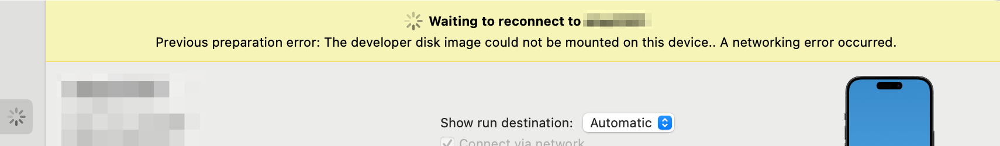
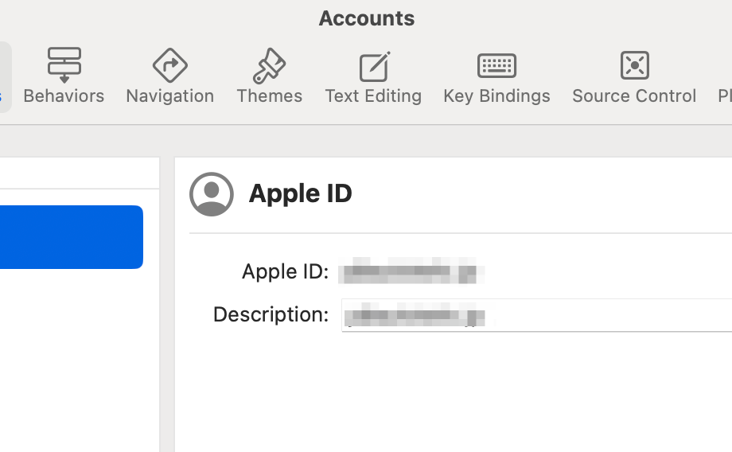

+++
title = "メモ: テザリングしながら iOS で実機ビルドはできなかった"
description = "テザリングをオフって有線で繋いでおけば大丈夫でしたというメモ、あるいはテザリングした状態で有線を繋がない状態ならば実機ビルドが可能というメモ"
date = "2023-11-26T13:00:00+0900"
lastmod = "2024-04-09T11:30:00+0900"
draft = false
tags = ["Xcode"]
+++

もはやタイトルと説明文の通りなんですが、いつからか分からないものの、テザリングをオンにしながら Xcode を立ち上げると、実機が認識されません。

テザリングをオフにして、 Wi-Fi 同一ネットワークか優先でつなぐかしておくと、実機が認識されます。

ただ、誤解のないよう言っておくと、昨今 Xcode で階発用端末として認識される手順はめっちゃ簡単になっています。

1. 端末の方でデベロッパーモードを ON にして再起動する（正確には再起動直後に ON にする）
2. 有線または無線で同一ネットワークにつなぐ

マジでこれだけで感動しています！ 😂

繋げたらあとは勝手にやってくれるので、昔の端末を登録してうんぬんの作業から比較すると雲泥の差があります。超楽チンです。 🤗

## どうやらテザリングで Mac を繋いでいると、同一ネットワークと認識されないらしい

同一ネットワークと認識されないと、以下のエラーメッセージが出ます。

エラーメッセージでググる人もいるでしょうから、エラーメッセージも載せておきます。


> no eligible devices connected to 'My Mac'

対象デバイスがないらしいです。

---


> Browsing on the local area network for xxx
>
> Ensure the device is unlocked and attached with a cable or associated with the same local area network as this Mac.
> The device must be opted into Developer Mode to connect wirelessly.

ロックを解除しろ、同一ネットワークにつなげ、デベロッパーモードにしろ、くらいしか言われてません :pleading_face:

## まとめ

たぶん賢い人はググってタイトルを見た瞬間に、なるほどと言って解決することでしょう。完。

## 2024/01/24 追記

今日初めて気づいたのですが、実はテザリングしながら実機ビルドする方法が見つかりまして、 **有線に繋ぎさえしなければ、無線で実機ビルドまでいけた** のでした。なんと・・・！

いつも PC 経由で充電しながらテザリングもやっていたので、先にテザリングで繋いでから、有線して充電する（先に有線で繋ぐと、接続したときだけテザリング状態になり、後で困る）という流れで接続をしていたんですよね。

なので、 **テザリングの無線だけで実機ビルドが出来ることに気づきませんでした・・・！** なんと便利な時代に 🤗

## 2024/04/09 再追記

なんと、そこまでで終わらなかったんですねえ :pleading_face:

2〜3 月でちらほら実機デバイスが認識されない問題が再発していて、
つい昨日、とうとう全く繋がらなくなったのでした。

具体的には、以下を交互に表示しつつ・・・



```
Waiting to reconnect to xxx
```


```
Preparing xxx
```

最終的にこの表示になってしまうのでした。


```
xxx needs to be prepared for development
```

これはいかんと思って、まずはアップデートを一通り行ってみました。（以下 4/8 時点の最新）

- iOS 17.4.1,
- Mac sonoma 14.4.1
- Xcode 15.3

これで以下のケースで試してみてもダメでした。

- Developer Mode の OFF および ON
- Mac および iPhone の再起動
- Xcode 上における署名作成の自動化のチェック OFF および ON
- Xcode 上の Devices 画面からの Unpair Device や Connect などの操作
- テザリング OFF で有線のみで接続
- テザリング ON で無線・無線それぞれで接続

さすがにダメだと思って Apple 神の Apple Developer Program Support に上記情報を一通り投げて問い合わせ。もうこれでダメなら詰むわと思いつつもメール投稿。

（1 日後）

返ってきたメールがこちら。

> 当部署は、アカウントの管理とアプリケーション配信についての一般的なサポート窓口となっており、残念ながら今回いただいたご質問に関する詳細な情報を持ち合わせておりません。直接お力になることができず大変心苦しいのですが（以下略）

:pleading_face: :pleading_face: :pleading_face:

詰んだ。 :pleading_face:

はー、この先どうすんだ、となって、 Xcode の Apple アカウント周りを見てみると、
そういえばログアウトやログインボタンがどこにもないな？となります。



ダメ元でこれのログアウト・ログインを試してみたいと思い、どこにあるか探してみたら、
OS 側にしかなかったので、そちらでログアウト・ログインを試すと・・・


```
Copying shared cache symbols from xxx (xx% completed)
```

おおおおおっ？？ なんか初期にやってくれそうなことをやってくれてる？

（数分後）

やったー！ **デバイス認識きたー！ :tada: :tada: :tada:**

なるほどね、あれこれ再起動やログインし直しはやったけど、 Xcode 側に残ってた Apple ID のログインし直しは漏れてたわあ。

もしかしてずっとログインしっぱなしだったから、これまでアップデートの積み重ねで挙動がおかしくなってきたんですかね？その可能性は大いにありそう。

ともかく、これで問題解消しました！もし同じように端末認識されない方の参考になれば幸いです。完。
