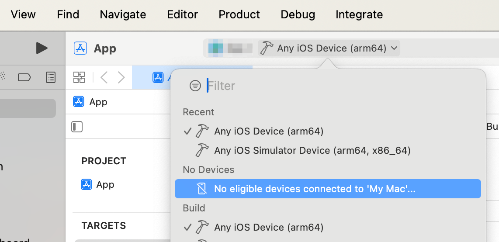
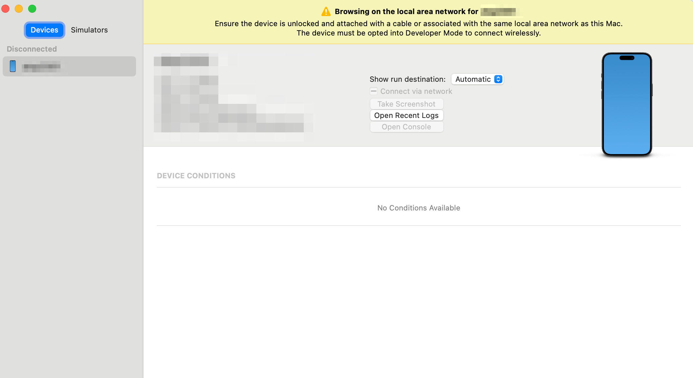

+++
title = "メモ: テザリングしながら iOS で実機ビルドはできなかった"
description = "テザリングをオフって有線で繋いでおけば大丈夫でしたというメモ"
date = "2023-11-26T13:00:00+0900"
# lastmod = "2023-11-26T13:00:00+0900"
draft = false
tags = ["BrowserExtension", "plasmo", "FlyFree", "SNS", "plasmo"]
+++

もはやタイトルと説明文の通りなんですが、いつからか分からないものの、テザリングをオンにしながら Xcode を立ち上げると、実機が認識されません。

テザリングをオフにして、 Wi-Fi 同一ネットワークか優先でつなぐかしておくと、実機が認識されます。

ただ、誤解のないよう言っておくと、昨今 Xcode で階発用端末として認識される手順はめっちゃ簡単になっています。

1. 端末の方でデベロッパーモードを ON にして再起動する（正確には再起動直後に ON にする）
2. 有線または無線で同一ネットワークにつなぐ

マジでこれだけで感動しています！ :face_with_tears_of_joy:

繋げたらあとは勝手にやってくれるので、昔の端末を登録してうんぬんの作業から比較すると雲泥の差があります。超楽チンです。 :hugging_face:

## どうやらテザリングで Mac を繋いでいると、同一ネットワークと認識されないらしい

同一ネットワークと認識されないと、以下のエラーメッセージが出ます。

エラーメッセージでググる人もいるでしょうから、エラーメッセージも載せておきます。

> no eligible devices connected to 'My Mac'

対象デバイスがないらしいです。

---

> Browsing on the local area network for xxx
>
> Ensure the device is unlocked and attached with a cable or associated with the same local area network as this Mac.
> The device must be opted into Developer Mode to connect wirelessly.

ロックを解除しろ、同一ネットワークにつなげ、デベロッパーモードにしろ、くらいしか言われてません :pleading_face:

## まとめ

たぶん賢い人はググってタイトルを見た瞬間に、なるほどと言って解決することでしょう。完。
