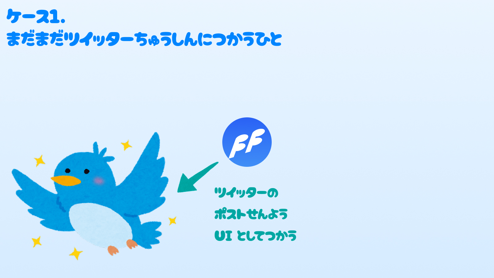
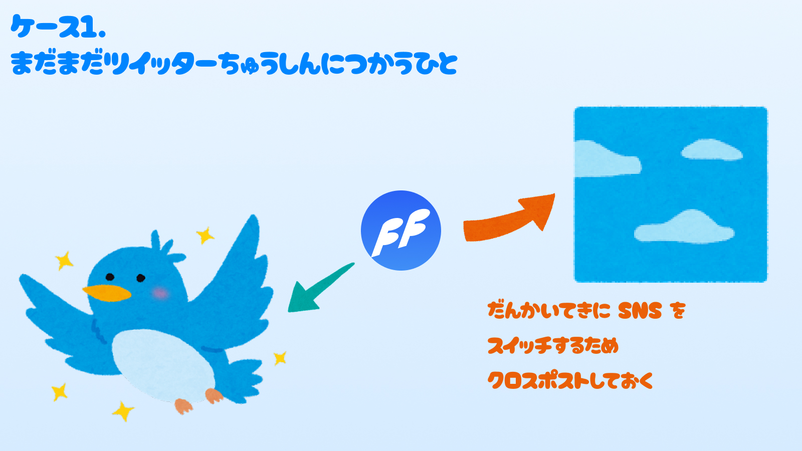
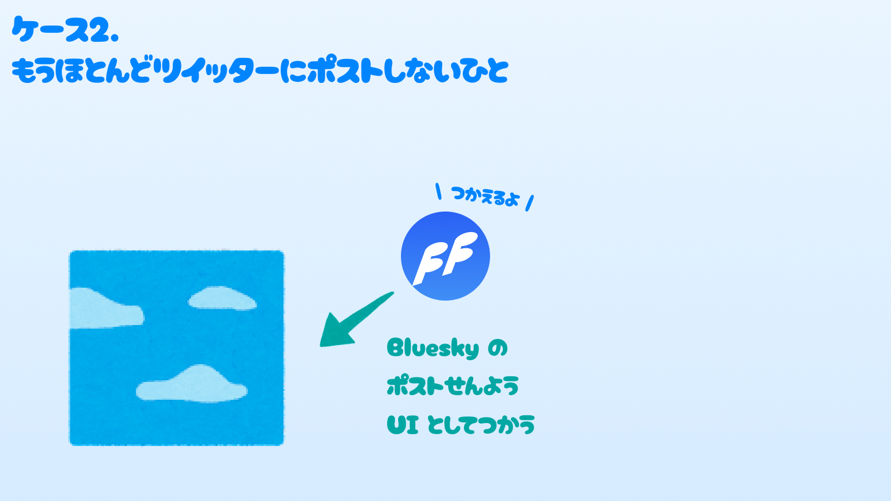
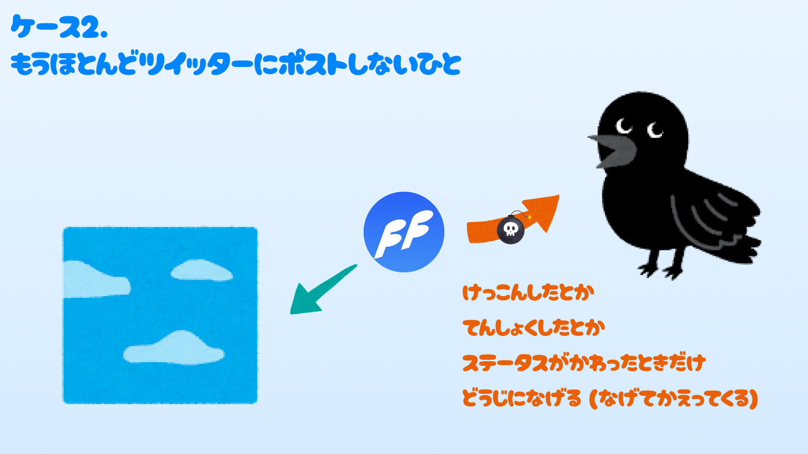

+++
title = "SNS を段階的に移行しよう！"
description = "それぞれのポスト専用 UI として FlyFree を活用するのだ"
date = "2023-12-06T08:00:00+0900"
# lastmod = "2023-12-06T08:00:00+0900"
draft = false
tags = ["Bluesky", "Twitter", "FlyFree", "SNS"]
+++

[Bluesky Advent Calendar 2023](https://adventar.org/calendars/9443) の 6 日目の記事です。

Bluesky 界隈には、元々知り合いはそんなに多くない中移動してきたので、
そんな中ちょいちょい絡んでくれるみなさん！ありがとうございます！ :hugging_face: girigiribauer です！ :smiley:

直接会うと「思ってたより怖くないんですね」っていつも言われます。 **本当に怖くないです！ 気軽にどんどん誘ってね！**

また、まだはじめましての方もこれからどんどん仲良くしてくれたら嬉しいです！ :hugging_face: :hugging_face:

## ざつ絵を描きました

最近 FlyFree という、投稿専用の拡張機能ツールを作りました！ちゃんとアップデートしていくのでどうか今後ともよろしくお願いします！

さて、言いたいことを **4 枚のざつ絵 with いらすとやさん** にしてきました。今日言いたいことはこれだけです！

### ケース 1.まだまだツイッターちゅうしんにつかうひと

ツイッターに出戻っちゃった人には、こういう選択肢もあるよ！ってぜひとも紹介してあげてほしい！

また苦しんでそうな人にも是非ともおすすめしてあげてみてください！

### ケース 2.もうほとんどツイッターにポストしないひと

**おすすめの使い方はこっちです！ :hugging_face:**

Bluesky にだけ投稿するのも普通にできるので、 **ときどき手榴弾投げたい人** にはおすすめです！

#### 色々直してるので長い目で見てほしい :pray: :pray: :pray:

他タスクの隙間時間で雑に作ったものなので、重くなったなどの報告を受けたり、 og:image を拾いきれずに画像が空になるケースなど、まだまだ改善の多い拡張機能ですが、このままじゃダメだと思って、現在根本から再設計中なので、少し長い目で見て使えそうなら使ってもらえると嬉しいです。 :pray:

## まとめ

このツールで、段階的に SNS を移行できるようになると、呪縛から逃れたくても逃れられない一部の人がハッピーになれると思うので、積極的におすすめしていきたいです！

なお、 4 枚目の絵は以下よりインスピレーションを受けました。ありがとうございました。

> X を手放さず、ほかの SNS を使ってる人たちは、X を野戦地として、サッと手榴弾だけ投げて、ブルースカイ、スレッズ、マストドンの、それぞれの宿営地に帰っていく、という使い方が定着しつつある気がする

https://bsky.app/profile/masumura17.bsky.social/post/3kelvfcewav2t

**SNS はこわいのう :pleading_face:**
