+++
title = "figma でフォントサイズやエフェクトがリサイズ対応出来なかったのが悩みだった"
description = "スケールツールを使えば全部解決！というお話"
date = "2023-12-26T09:00:00+0900"
# lastmod = "2023-12-26T09:00:00+0900"
draft = false
tags = ["figma"]
+++

単に僕が今までその機能を知らずにずっと困っていて、つい最近それに気づいて **全てが解決した** というだけの話です。

## figma design は便利

最近はとても仲良くできている実感があります。

ただ、仲良くなればなるほど、なぜここだけこうなっていないのだろう？と思う部分が逆に目立つようになってきました。

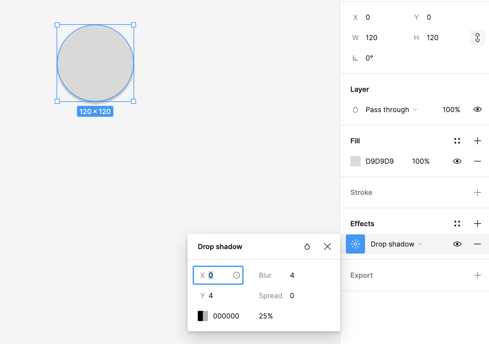

例えば Effects で Drop shadow を指定してみるとします。

この状態で、拡大縮小するとどうなるでしょう？

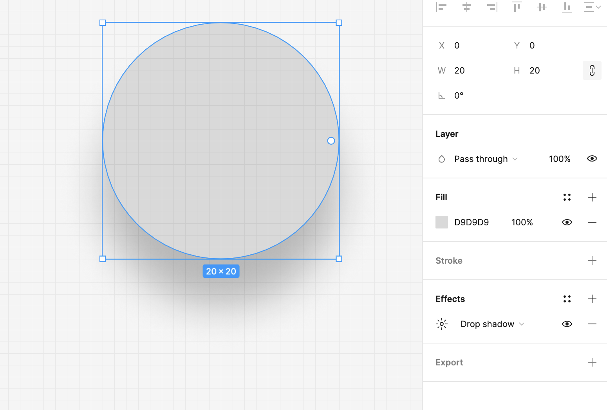

そう。 **Effects までは拡大縮小に追従してくれない** のです。 :pleading_face:

あるいは別の例。

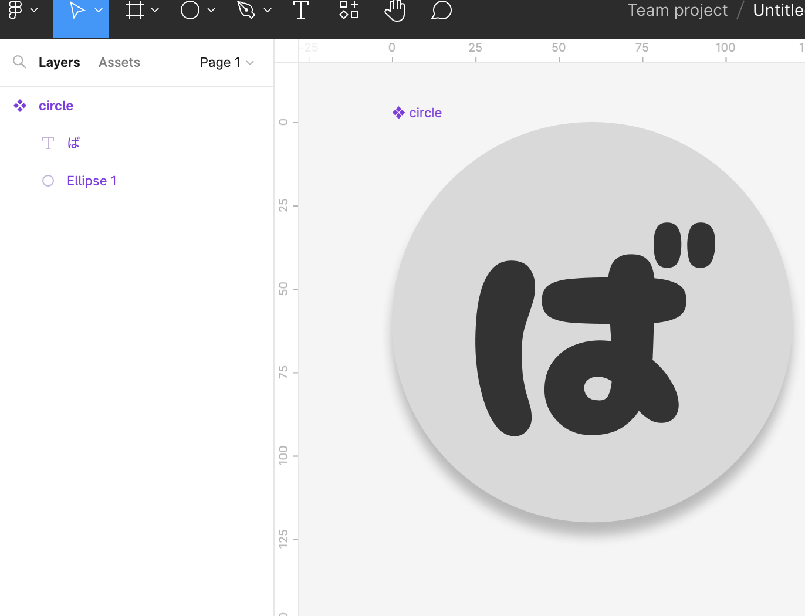

円中央に文字を指定してみます。

なんでもいいんですが、とりあえず『ば』にします。

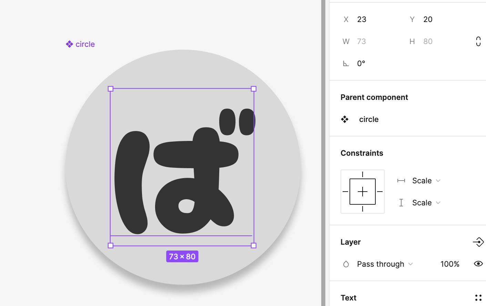

Constraints （制約という意味）をそれぞれ Scale にして、拡大縮小時に追従するように指定してみます。

そこで拡大縮小してみると・・・？

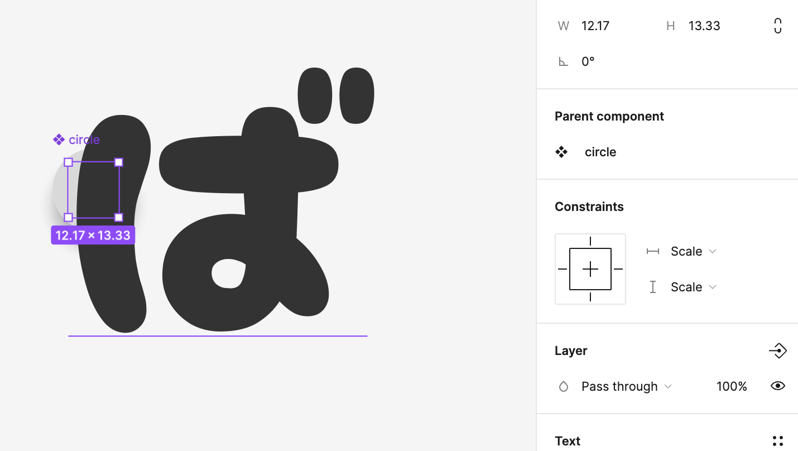

そう！フォントサイズのボックス自体は追従してくれるのですが、 **文字自体は拡大縮小に対応してません。**

これは文字の方に別途フォントサイズなる数値が存在しており、そちらまでは変わってないからなんですね。

じゃあどうするかというと・・・

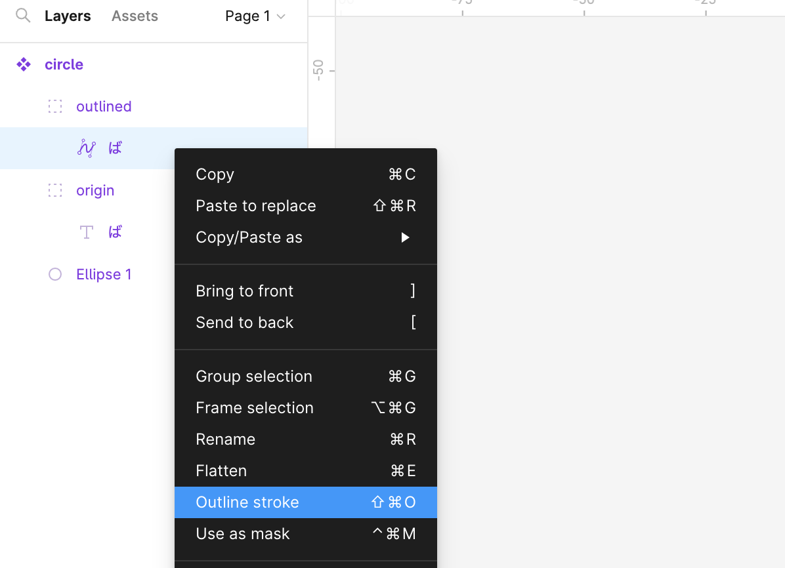

よく使われるのが、別のレイヤーを用意して、そちらをアウトライン化しておく、という手が常套手段としてありますね。

ただ、ご存知の通り、文字情報ではなく、ただのシェイプデータの情報になってしまうので、当然文字の変更をするときは、残しておいたオリジナルの方を再び修正してアウトライン化するといった、なんだかもやっとする修正方法を取る必要が出てきます。 :pleading_face:

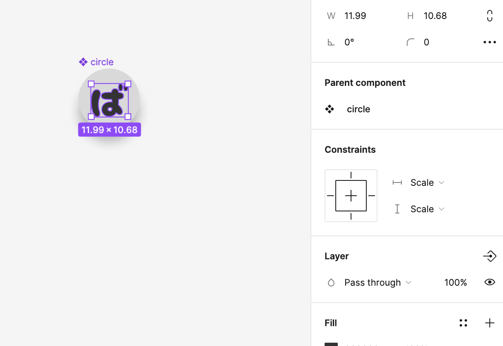

うーん・・・。せっかく文字情報として保持できてるものを、わざわざバラさないといけないのはとてももやもやしますね。 😩

## スケールツール、なるものがあった！

Photoshop などの Adobe からのキーボードショートカットの流れで、なんとなく `V` キーを押すとニュートラルポジションに戻れる、みたいな感覚は元々持っていたのですが、これは本来 `Move` ツールを呼び出すものなんですよね。

で、つい最近以下を読んで知ったのですが、なんと、この **`Move` ツールの下に `Scale` ツールなるものが存在していた** のです・・・！

https://help.figma.com/hc/en-us/articles/360040451453-Resize-layers-with-the-scale-tool

な、なんだってー！？（色々略）

もう、スケールツールの機能については、リンク先の最初にあるアニメーション GIF を見れば一発でわかります。

`V` キーで `Move` ツールに切り替えるのと同様に、 `K` キーで `Scale` ツールに一時的に切り替えます。

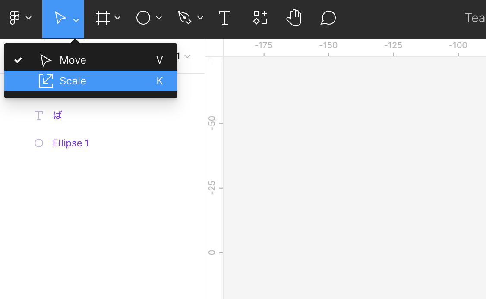

そう、こんなところに隠れていたのです。 :ninja:

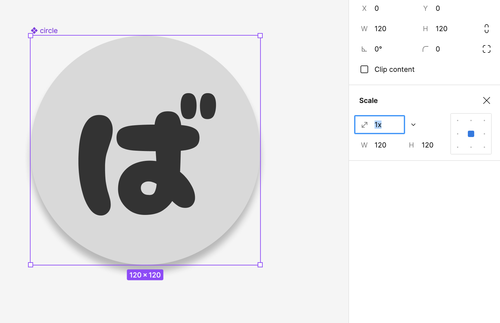

スケールツールで選択すると、現時点を拡大率 1 としたときの拡大縮小したい拡大率か、あるいは拡大縮小したい幅 or 高さのどちらかを入力するパレットが表示されます。

また、拡大縮小する際の基準点も必要に応じて選択できますね。

ではやってみます。

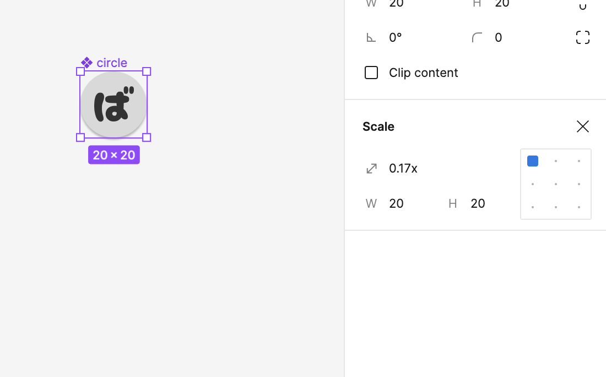

**おおっ！綺麗にスケールできました！！ 🥰**

エフェクト周りはどうなっているでしょうか？

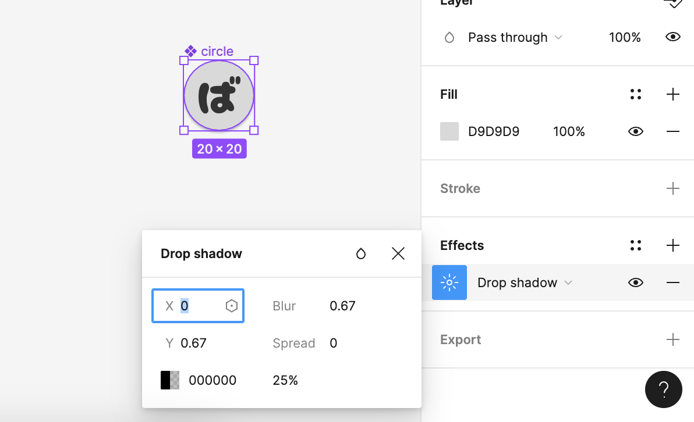

先ほどのスケールツールによって、内部にあるエフェクトが自動計算されていて、拡大縮小の比率分を掛けた分だけリサイズされていました。

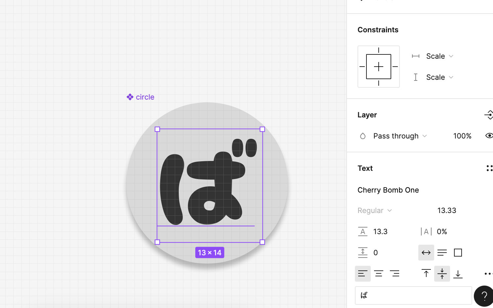

フォントサイズの方も、自動計算されていて、同様にリサイズされていました。

これだ！これが欲しかったんだ・・・！ 🤗

## まとめ

**公式ドキュメントを（隅から隅まで）読もう。**

## 参考 URL {#refs}

- https://help.figma.com/hc/en-us/articles/360040451453-Resize-layers-with-the-scale-tool
