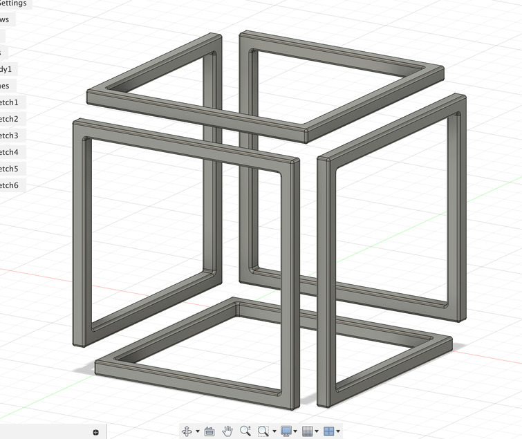

+++
title = "Infinity Table を作ろう！"
description = "Infinity Table を作るとともに、3Dプリンターのテスト印刷をしてみるの巻"
date = "2024-04-21T09:00:00+0900"
# lastmod = "2024-04-21T09:00:00+0900"
draft = false
tags = ["Fab", "Fusion360"]
+++

前に検証ついでに作った、『突っ張り棒の設置台』と『音楽プレーヤーのスイッチカバー』は、未熟なりによくできていて、今でも普通に活用できています。

期間がだいぶ空いてしまいましたが、
3D プリンター環境が（周りの変化により）だいぶ改善してきたので、
今回はその施設にある 3D プリンターを試し刷りしてみようと思います！

## 施設を借りるには初回講習を受けなくてはいけない

そして、初回講習を受けるのに、なんと半年以上もかかってしまいました :pleading_face: :pleading_face: :pleading_face:

いやあ、なかなかタイミング合わずで・・・。

1 か月に 1 回しか講習が開かれず、しかも常にその施設の近くにいるわけではないため、
かなり参加難易度が高かったです。
途中 1 回参加できるチャンスがあったんですが、フォームから申し込むのが一足遅かったらしく、
定員オーバーで残念ながら参加できず :pleading_face:

その割に、いざ講習受けて施設予約してみようとカレンダーを見たら、
なぜかほとんど誰も使ってないんですよねえ。
どゆことなの？？ :thinking_face:

## 検証+α で止まってた前回のリハビリついでに何か作る

何がいいかなあと考えていたところ、 SNS に **Infinity Table という不思議な形のテーブル** が流れてきたのを見て、これなら Fusion 360 でスケッチして押し出すだけで作れそうだなーと思い、ためしに作ってみることにしました。

そう、こんな形の奇妙なやつです。

作り始めて気づいたんですが、これ共通の頂点がほとんどないんですよね。

なので、一見浮いてそうに見えるけど、辿ってみると結局繋がってるという不思議な形。

で、前回の検証で 2mm あれば一旦強度は問題ない！ということだったので（自分のブログ見た）、
今回は厚み 3mm にして、1 辺の最大を 50mm にして、余白を 2mm にしてみました。

まとめると・・・

- 1 面だけで見ると 1 辺 50mm の正方形
- 厚みは 3mm で、内側は 50 - 3 - 3 = 44mm になる
- 底部分は、1 辺だけが 5mm ずつの空白になってる (A)
- 底視点で、空白部分の手前から上方向にそれぞれ 1 辺が伸びる
- 横視点で、上方向に 1 辺が伸びたものを、 A と同じような形で別の場所に空白を作る

みたいな感じで繰り返していくと作れました。
頂点がずれるので作ってると訳が分からなくなってきます w

## スライサーで見てみる

さて今回は Prusa MK4 という機種を使います。

事前にインストールしておいたスライサーで表示してみます。

いい感じですね。ちなみにそれぞれのプリンターごとにスライサーは用意されていて、
stl ファイルを Gcode に変換してくれます。

この辺はだいぶ分かってきましたね。 stl ファイルが形のファイルで、 Gcode が動きのファイルです。

後者はプリンターごとに違ってて当然なので、プリンターごとに異なる Gcode を吐き出すスライサーツールも、プリンターごとに違ってて当然ですね。

サポート材も込みで実際に印刷するとどれくらいのフィラメントを使い、どれくらいの時間がかかるのか？を実際にシミュレーションしてくれるので、施設予約の際に重宝します。

## 印刷！

ここからはダイジェストで。

なんかエラー出てますが、とりあえず印刷してあとで調べます。

温め終わって始まりました！

おおー！

できました！

途中フィラメントの糸みたいなのが増え始めてきたときは、
本当にできるのかな？とちょっと思いましたが、
無事できたみたいです。

ただ、上部分はほとんど宙に浮いている構造なので、
サポート材が思ったよりも多いです :pleading_face:

サポート材取るの下手くそ太郎です :pleading_face: :pleading_face: :pleading_face:

施設予約の制限もあったので、一旦雑にサポート材が取れたくらいで妥協しました。

でも、まあ形にはなっていますよ？

すごい！ :tada:

当初心配していた強度も、ほらご覧の通り、
伸び縮みするくらいには全く問題のない強度になっています！ :+1:

いいですねえ :smiley:

成功しつつ課題も見えてきたのが一番学びがあって良いです！

## Infinity Table を作ってみたまとめ

- 作ろうと思ってから Fusion 360 で形を作って、実際に印刷するまでが早かった
  - 形は難解だけど、3D プリンター初心者・初級者がプリントするのに向いてそう
  - 最初はスライサーにちょっと手間取ったけど、概念わかってたからすぐ慣れた
- 設計は問題なし
  - 3mm の厚みがあれば、大きく力を加えない限り折れたりはしなさそう
  - 角を丸くしたりの処理もグッド
- 3D プリンターの設定は検討の余地あり
  - クオリティを求めるなら、もっとゆっくり丁寧に印刷した方が良さげ？
  - 今回ほとんどデフォルト値でやってみたが、細かな作品だとちょっと雑さがある
- 施設利用する際は台を冷ましたりサポート材を外したりする時間も考慮しておく
  - 現地ではあまり時間が確保できなさそうなので、家でサポート材を外す
  - ニッパーを購入しておくと良さげ

テーブルの天板がないので、実際のところテーブルか？って言われるとちょっと怪しいですが、
チョイスした印刷対象が今回はすごく良かったです。

ちなみに

> A filament speficied in the G-code is either not loaded or wrong type.

という警告はこれから調べて、必要に応じて追記したりしなかったりしてみます。
フィラメントの指定がスライサー上のものと実際の 3D プリンター上とで異なっているとかそんな感じでしょうか？
