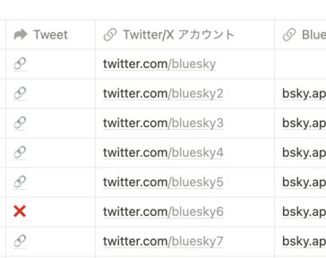
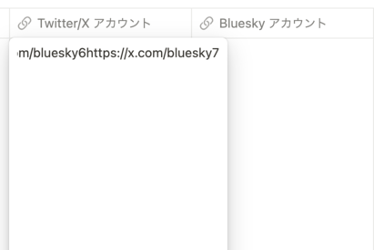
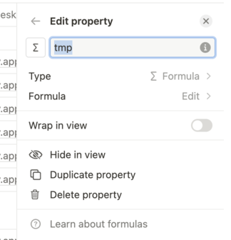
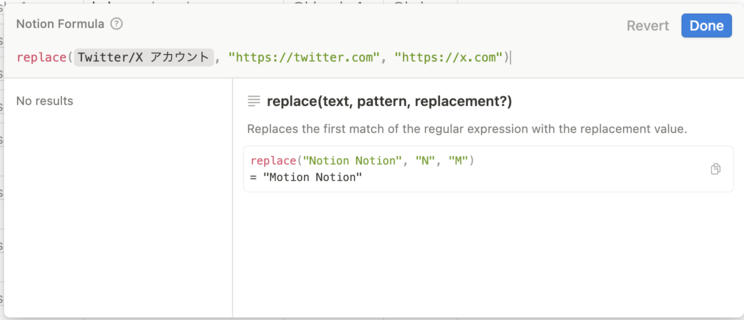
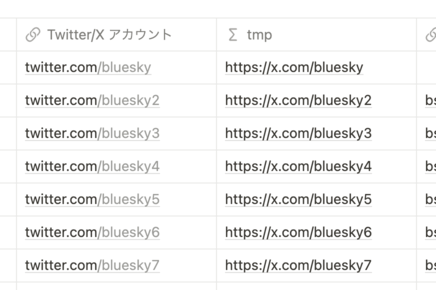
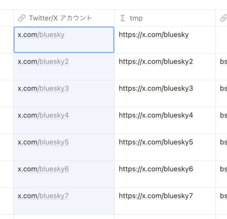

+++
title = "Notion で一括置換する方法"
description = "ぐぐっても Notion で一括置換の方法が見つからなかったので独自に編み出した方法です"
date = "2024-06-07T09:00:00+0900"
# lastmod = "2024-06-07T09:00:00+0900"
draft = false
tags = ["Notion"]
+++

まず注意書きとして、現時点（2023 年 5 月末）で Notion 上で一括置換できる方法はありませんでした。

- Notion 上からのブロックやデータベースに対する一括置換する操作
- 同一列の複数セルをコピーし、一時的にテキストエディタで編集して元に戻す操作

上記は無理でした :cry:

また、 Notion AI という別料金プランを導入して、 AI にお願いするなどの方法もあるらしいのですが、本来用意されているであろう超基本操作である一括置換のためだけに Notion AI を導入するというのはさすがに抵抗がありました。

ということで、お読みいただいている時点でも Notion で一括置換がなくて困ったよう :cry: という方にとっては参考になるかもしれません。

## Notion 上で擬似的に一括置換する方法

現時点でもできることとして、 **Notion 上で複数セルをコピペするのは可能** です。

Notion の外（テキストエディタなど）に持っていって、それを戻すと、1 つのセルごとに改行込みの全部のデータがそれぞれのセルに挿入されてしまいますが（なんでなの・・・）、 Notion の外に持っていかずに Notion 上でコピペが完結するなら可能です。これを利用した **Notion で一括置換する方法を今回編み出した** のでメモしておきます。

さて、今回の Notion の一括置換の題材ですが、 https://bluesky-official-accounts.notion.site/Bluesky-d6244af0d4164febb40f91bc2649a3e1 （Bluesky 公式アカウント移行まとめ）のページ上で、 URL 登録時に `https://twitter.com` から始まる URL を書いてね、とあったんですが、どうやら最近本格的に `https://x.com` にリダイレクトされるようになったらしく、色々なところで不都合が起きつつあったので、どこかで一括置換しないといけないなあと思っていたところでした。

例えばこんなデータベースです。



> 同一列の複数セルをコピーし、一時的にテキストエディタで編集して元に戻す操作

ついでに失敗例も載せておきます。エディタで編集して再びペーストして持ってくると、先ほども書いたように、各セルにコピー元の改行込みのものがそれぞれコピーされます。



なんで一括置換という超基本操作がこんなにできないの・・・ :cry:

### 1. 一時的な formula プロパティを作る

まず一時的なプロパティを用意します。ここでは `tmp` とでもしておきます。



プロパティの種類を **formula （関数）** にします。

で、 formula の編集についてですが、ここに関しては **何を何に一括置換したいか？によって大きく異なる部分** なので、詳細は割愛しますが、最終的に一括置換した後になるよう、上手いこと formula を用意します。



記事の最後の方に、おまけとして他にこんな formula 用意しました、みたいなのも載せておきます。今回は `https://twitter.com` を `https://x.com` に変えたいだけなので、シンプルに `replace()` を使うだけです。単純です。

作ったプロパティを横並びにしたのがこちら。



これで材料は揃いました。

### 2. 列を選択してコピペする

Notion の外に持ち出さなければコピペ可能なので、置換後の列を置換前の列にコピペするのは理論上うまくいくはずです。

やってみましょう。



**うまくいきました！ :tada:**

**発想の勝利！完！**

## おまけ: formula を工夫すると面白いこともできる

せっかく https://bluesky-official-accounts.notion.site/Bluesky-d6244af0d4164febb40f91bc2649a3e1 上に作った X(Twitter) 向けのシェアボタンを作ったのに、どうやら誰にも使われてないみたいです :cry:

実はここにも formula を使っていて、 **Bluesky 公式アカウント移行まとめ** のステータス移行具合によってシェア文言を変えるようになっています。（なっているのに、 Bluesky 上で公式アカウント来て欲しいと毎回言ってる人が、これを使ってシェアしてくれないのはなんでなの・・・）

```
ifs(
	not prop("公開"),
	"❌",
	empty(prop("Bluesky アカウント")),
	link("🔗", lets(
		name, join(split(prop("名前"), " "), "%20"),
		text, join([name, "さんに青空公式アカウントを作ってほしい！"], ""),
		hashtags, "青空公式アカウント",
		url, "https://bluesky-official-accounts.notion.site/Bluesky-d6244af0d4164febb40f91bc2649a3e1",
		"https://x.com/intent/post?text=" + text + "&url=" + url + "&hashtags=" + hashtags
	)),
	prop("ステータス") == "未移行（未確認）",
	link("🔗", lets(
		name, join(split(prop("名前"), " "), "%20"),
		text, join([name, "さんの青空公式アカウントが本人なのか知りたい！"], ""),
		hashtags, "青空公式アカウント",
		url, "https://bluesky-official-accounts.notion.site/Bluesky-d6244af0d4164febb40f91bc2649a3e1",
		"https://x.com/intent/post?text=" + text + "&url=" + url + "&hashtags=" + hashtags
	)),
	prop("ステータス") == "アカウント作成済",
	link("🔗", lets(
		name, join(split(prop("名前"), " "), "%20"),
		text, join([name, "さんにもっと青空で投稿してほしい！"], ""),
		hashtags, "青空公式アカウント",
		url, "https://bluesky-official-accounts.notion.site/Bluesky-d6244af0d4164febb40f91bc2649a3e1",
		"https://x.com/intent/post?text=" + text + "&url=" + url + "&hashtags=" + hashtags
	)),
	prop("ステータス") == "両方運用中",
	link("🔗", lets(
		name, join(split(prop("名前"), " "), "%20"),
		text, join([name, "さんは青空でも投稿されています！🦋"], ""),
		hashtags, "青空公式アカウント",
		url, "https://bluesky-official-accounts.notion.site/Bluesky-d6244af0d4164febb40f91bc2649a3e1",
		"https://x.com/intent/post?text=" + text + "&url=" + url + "&hashtags=" + hashtags
	)),
	link("🔗", lets(
		name, join(split(prop("名前"), " "), "%20"),
		text, join([name, "さんは青空に完全移行しています！卒業おめでとう🎉"], ""),
		hashtags, "青空公式アカウント",
		url, "https://bluesky-official-accounts.notion.site/Bluesky-d6244af0d4164febb40f91bc2649a3e1",
		"https://x.com/intent/post?text=" + text + "&url=" + url + "&hashtags=" + hashtags
	))
)
```

https://www.notion.so/help/formula-syntax を見るとそれぞれの関数をどう使えばいいかわかりますし、編集時にもマニュアル出てくるので、それを読みながらも書くことが可能です。

ざっくりまとめるとこんな感じです。

- `if` と `ifs` の違いは、後者は複数渡すことができる
  - いずれも一番最後の引数はどれにも当てはまらない、いわゆる `else` に相当
  - `ifs` は条件と処理を複数渡せるので、引数の数が 3 とか 5 などの奇数になる
- 元々半角スペースが入ってるせいでうまくいかないデータを、無理やり `split` `join` で切り貼りしてる
- `let`, `lets` で一時的に名前をつけておくと、全体として短くなる
  - 前者と後者は複数渡せるかどうかの違い（ `if`, `ifs` の関係と同じ）
- 適宜改行を入れておいて読みやすくしておく

せっかく作ったので、ぜひともこれを使って **Bluesky に公式アカウントを招いてみてね！**

https://bluesky-official-accounts.notion.site/Bluesky-d6244af0d4164febb40f91bc2649a3e1
