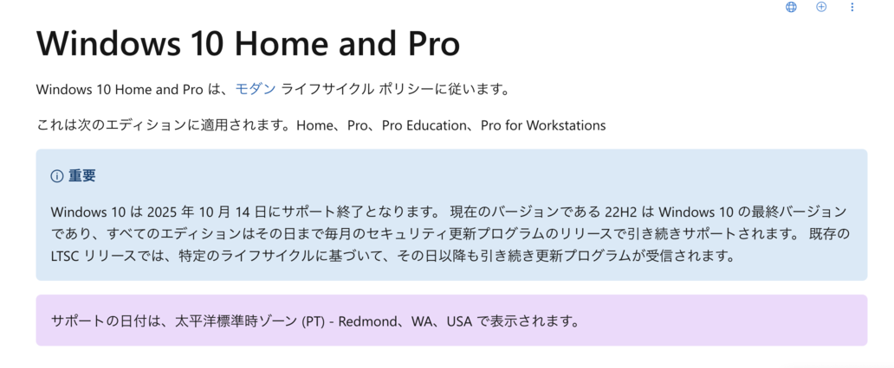
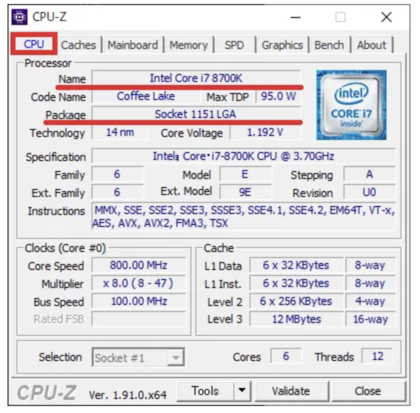
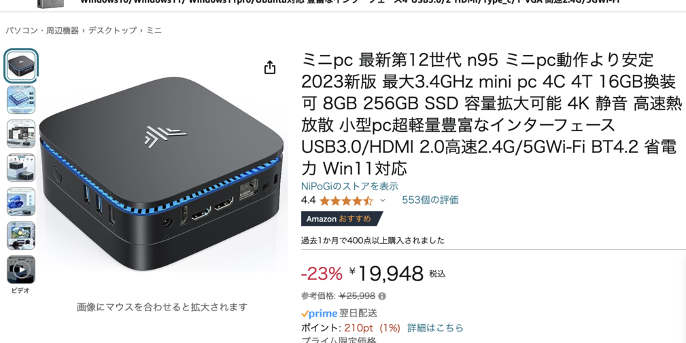

+++
title = "Windows 11 のことを調べ出したら CPU/GPU のことを全然理解できてなかったことが分かった話"
description = "読んでも何も得るもののない、ただの CPU/GPU の調べごとメモです"
date = "2024-06-29T17:30:00+0900"
# lastmod = "2024-06-29T17:30:00+0900"
draft = false
tags = ["Computer", "GPU"]
+++

あまりにも理解できてなかった部分が大きかったので、自分用にメモだけしておこうと思います。

## Windows 10 のサポートが 2025 年に切れる

きっかけはこれでした。

**2025/10/14 にサポート切れちゃう** なと思って、手元にある Windows PC をあれこれ調べてみると、どうやら **Windows 11 に対応してない** ようなんです :pleading_face:

- Windows 11 に対応しているのは、概ね 2018 年以降に発売された PC
- 対応してる CPU 一覧
  - https://learn.microsoft.com/ja-jp/windows-hardware/design/minimum/supported/windows-11-supported-intel-processors
  - この中に入っている CPU ならオッケーらしい
  - たぶんこれが 2018 年あたり以降に発売されたものと概ね一致するらしい

## まず自身の使っている CPU/GPU が何なのかを詳しく調べる

一応 PC をメインに扱う仕事はしてるものの、そこまでハード方面に詳しいわけではなく、
**まず CPU/GPU がどれを使っているのか？** から調べないとダメなんですよね。

それを調べないと、リストに含まれてるのか、サポート対象に含まれているのかどうかが正しく判断できません。

Windows のシステムメニューあたりからあれこれ調べれば分かりそうな気はします（実際見た）が、調べていくとこういう時に使える便利ツールがあるとのこと。

https://www.dospara.co.jp/5info/cts_str_bto_btocpu.html

ここで紹介されていた **CPU-Z** を入れて詳しく見てみたところ、以下のスペックでした。

- Processor
  - Name: `Intel Core i3 4170`
  - Package: `Socket 1150 LGA`
- Motherboard
  - Manufacture: `ASUSTeK COMPUTER INC.`
  - Model: `H81M-C`
  - Bus Specs: `PCI-Express 2.0 (5.0 GT/s)`

Processor というところが CPU (Central Processing Unit) ですね！

正直これがどれほどのものなのかは分かりませんが、プライベート用途で利用してる範囲では全く困ってないレベルでした。

と、ここまで調べてようやく自分が以前ドスパラで組み立ててもらったものを購入したことをうっすら思い出すのでした :pleading_face:

スペック的にだいぶ前ですね・・・。

## CPU 交換を検討してみた

CPU をサポートしているものに交換できるのなら、引き続き同じ PC を使いつつも Windows 11 にアップデートできるのではないか？と思い、次は **CPU 交換** について調べてみました。

- 上記の `Socket 110 LGA` という部分がマザーボードのソケット？型番？らしい
- 以下の一覧を見て交換できそうな番号をチョイスしてみる
  - https://ja.wikipedia.org/wiki/LGA1150
  - https://www.bestgate.net/cpu/spec/socket-lga1150/

CPU は番号が増えれば基本的にスペックが上になるようなんですが、これを順番に照らし合わせてみたところ・・・

- Intel Core i7 4700/5700 番台 (Haswell/Broadwell)
  - `i7-` から始まるもので 4xxx, 5xxx 番台のものはなし
- Intel Core i5 4000/5600 番台 (Haswell/Broadwell)
  - `i5-` から始まるもので 4xxx, 5xxx 番台のものはなし
- Intel Core i3 4000 番台 (Haswell)
  - `i3-` から始まるもので 4xxx 番台のものはなし
- Pentium G3000 番台 (Haswell)
  - G3xxx 番台のものはなし
- Intel Celeron G1800 番台 (Haswell)
  - G1xx 番台のものはなし
- Xeon E3 1200 番台 v3/v4 (Haswell/Broadwell)
  - なし

なんと、 **どれも当てはまらないことが判明** します。なぜ :cry:

ここまできて、選択肢は以下に限られてきました。

- マザーボードごと交換する（難易度激高）
  - もはや別 PC にするのとほぼ同義では？
  - 今度は CPU だけじゃなく、すべての構成要素との互換性をチェックする必要がある
  - やりたくない
- 売却し、すでに Windows 11 が入っている PC に買い換える
  - いわゆる **金で解決する** という方法

ということで、前者はもう現実的ではなくなってきたので、
買い替えの方向で検討し直すのでした :pray:

## ミニ PC が最近流行りらしい

で、最近の PC を色々調べ始めたのですが、どうやらそこそこのスペックなのに超小型のミニ PC が色々と出てきているらしいです。

あくまで例ですが、こういう手乗りレベルで普通に動くミニ PC があるのなら、もうこういうのでいいなあと思うようになり、スペック比較をしてみたのでした。

ただ、お値段的には **2〜3 万円の低価格ミニ PC** と、**10 万円前後の比較的高価格なミニ PC** に大きく分かれるっぽく、その値段のポイントが GPU にあることが調べて分かってきました。

### GPU の歴史の振り返り

あまり適当なことを言うと怒られちゃいますが、ざっくり僕の理解はこんな感じです。

1. **最初は CPU だけ** だったが、グラフィカルに表示したい需要が出てきた
2. **行列計算が得意な GPU** を用意したことで、グラフィカルに表示したい需要に答えられるようになった
3. 2010 年代後半ぐらいから **AI** に計算リソースを割きたい需要が出てきた
4. **AI には同じく行列計算が得意な GPU を割り当てた** ことで、 AI 需要に応えられるようになった
5. もはや CPU と GPU を分ける意味もなくなってきたので統合されたチップを作るところも出てきた
   - Mac の Apple Silicon とかは両方兼ねてるっぽい
6. **ChatGPT** が出てきて AI の需要が爆発した
7. GPU 自体に **AI の機能を引き出す機能** が付き始めた
   - アップスケーリングとかフレーム補間とか
   - NVIDIA: https://3dnchu.com/archives/videoslowmo-ai-nvidia/
   - AMD: https://www.gamespark.jp/article/2024/01/12/137469.html

GPU の需要は分かるんですけど、なぜここまで NVIDIA の株価がどんどん上がってるんだろう？と思ってはいたのですが、この一番最後の AI の機能を引き出すってところまで理解しきれてなかったからかもしれません。

現在の GPU のシェアは **NVIDIA** が 8 割超えてて、残りが概ね **AMD** みたいな感じになっているようです。（インテルは CPU では頑張っていたものの、 GPU ではあまり頑張れてないみたいですね）

そう考えると、 AI を使って GPU レベルでパフォーマンスを引き出せていて、かつその GPU のシェアをほとんど持っているとなると、そりゃそうですよね〜という理解ができました。まだ体感したことがないのですが、これがあるとないとでは、大きく PC の体験も異なってくるんじゃないでしょうか？知らんけど 🤗

## AI PC を体験してみるのも良いかも？

取り留めのない形になってしまいましたが、手持ちの PC で Windows 11 に対応しているか調べ始めてみたら、 GPU が出来ることの可能性がすごく広がってきてることがわかってきて、思わぬ学びがありました。

結局どの PC を買うかまでは決めていませんが、 **ある程度最近の GPU が積まれている PC を買ってみて、 GPU と AI の機能を体験してみるのも良いのかもしれません。**

ということでまとめ。

- Windows 10 サポート切れのタイミングで大きく PC 入れ替えのタイミングかも
- AI PC は、 PC 内部でサービスとして AI が使えるという意味ではなく、 GPU の力を AI で引き出す的な意味だった（ので騙されないようにしたい）

---

ちなみに売却した PC のお値段は 900 円でした :pleading_face:
