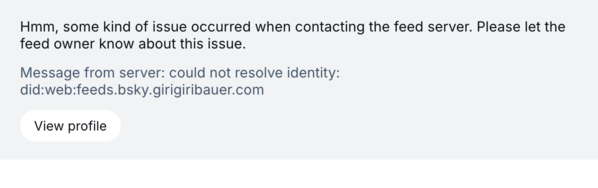
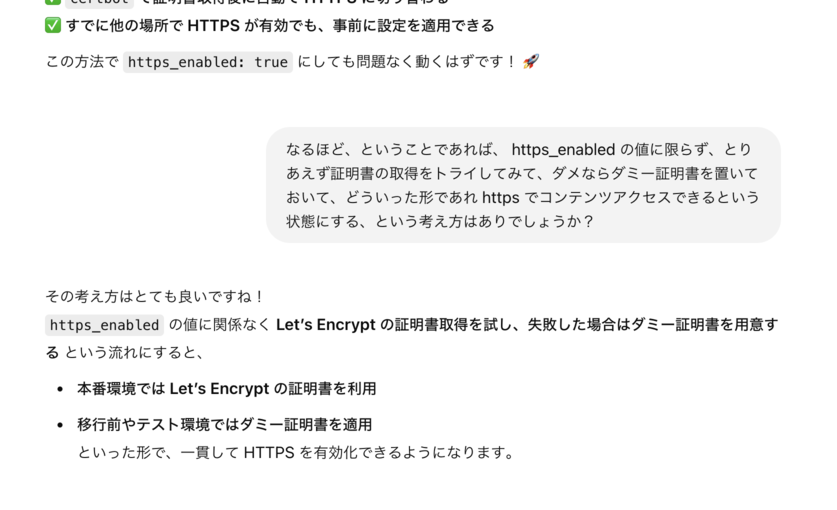
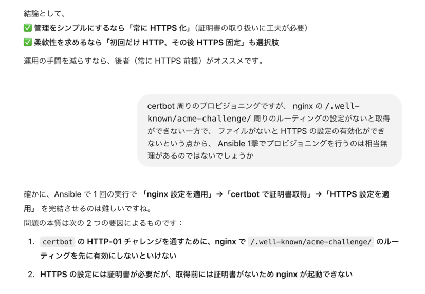
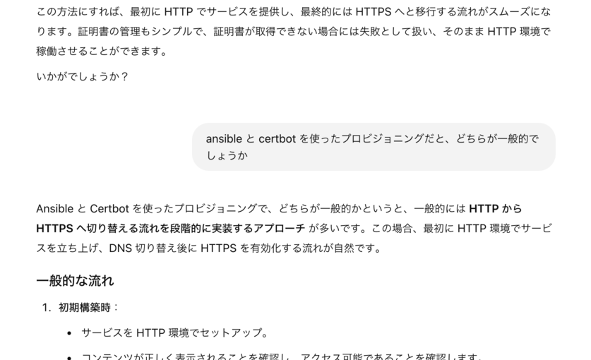
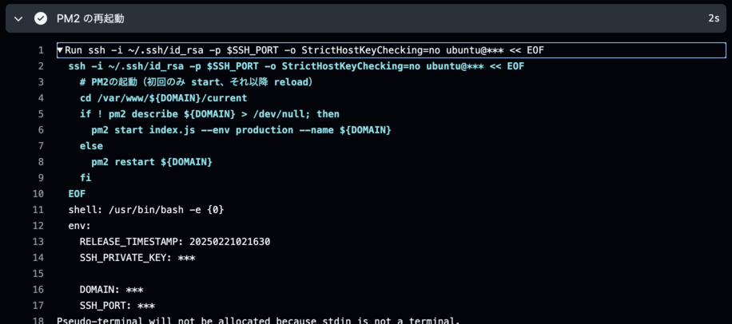
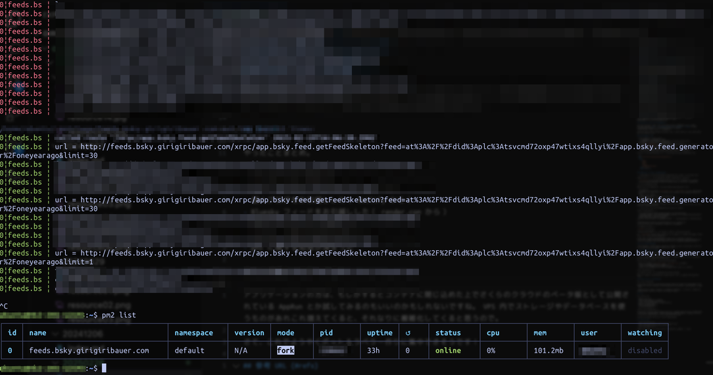

+++
title = "2025年にもなって VPS を再び借りましたのメモ"
description = "なぜ再び借りようと思ったのかは絶対に忘れてしまうのでお気持ち残しておこう"
date = "2025-02-22T09:00:00+0900"
# lastmod = "2025-02-22T09:00:00+0900"
draft = false
tags = ["Ansible", "nginx", "HTTPS", "VPS"]
+++

ただのメモ書きですが、なぜ再び借りようと思ったのかは絶対に忘れてしまうのでお気持ち残しておこう、と思いました。

## きっかけは Bluesky フィード

**Bluesky のフィードとラベラー作りをそろそろやりたいなー** と思って、おすすめされた render.com 上でまずはフィードを作ってたんですけど、 **どうも挙動が怪しい** と。



（時々発生して、時間が経つとすぐ解消するやつ。当然 `could not resolve identity` なんてことはない。）

WebService の Starter プランでお金払ってるのに、どうも時々停止している疑惑がある。ただし再現性もない。（実際こっちが悪い可能性も十二分にある）調べているうちに、以下のことをあれこれ考えるようになりました。

- マネージドサービスだと、中でどうなってるのかの確認が難しい
- render.com だと WebService 単位でお金がかかり、複数立てるのは大変
- かといって異なるものを同じ WebService 上でルーティングさせつつ動かすの、ちょっと気持ち悪い
- ホスティングの都合でアプリケーションのコードの束ね方が変わるのも気持ち悪い
- 以前 VPS を借りていてクラウドに全面移行してしまったが、 **やっぱり自由にいじれる環境が恋しかった**

みたいなことを色々考えて、別で自由に触れる環境が欲しいなと思うようになりました。
（まあクラウドでも仮想サーバー立てるのと同じじゃん、と言われるとそうなんですが）

## さくらの VPS か？さくらのクラウドか？

選定する段階でも色々と考えました。

- さくらのレンタルサーバー
  - 自分で面倒みなくていい領域が大部分なので楽
  - その分自由度は他よりも少ない
  - Static Site だけなら問題ないけど、 Node がちょっと怪しいかも？
- さくらの VPS
  - 以前借りてたので使い勝手が良いことは知ってる
  - セキュリティ対策や環境構築を一定頑張らないといけない
  - **圧倒的に安い（正義）**
- さくらのクラウド
  - 以前からあるのは知ってたし、 **昨今強いエンジニアさんが大量に転職してて将来性はありそう**
  - VPS に比べてちょっと割高（というか VPS がコスパ良すぎ）
  - 管理画面 UI はまだまだダメ

さくらのレンタルサーバーもそんなに悪くないんですよね。
以前お仕事でお手伝いしたところなんかは、ダウンタイムなしのシンボリックリンク貼り替えで動くシステムを自前で用意したりと、パッケージインストールの制限に目をつぶれば比較的使えそうなイメージです。

さくらのクラウドの将来性と金銭面というところで天秤にかけて迷ってたところはありますが、
そんな中以下の記事をみかけます。

https://manual.sakura.ad.jp/cloud/server/vps-migration.html

> 「さくらの VPS」からのマイグレーション
>
> コントロールパネルから「さくらの VPS」のディスクイメージをコピーしたアーカイブを作成することができます。 アーカイブよりサーバを作成することで、「さくらの VPS」からの移行が可能です。

なるほど、 **マイグレーション** という手があるのか・・・！

だったら本当に必要になった段階でさくらのクラウドのサーバー（VM）に移行すれば良くて、
今の段階であればまだ VPS でやるのもありかも？と思ったので、
最終的にさくらの VPS を借りることにしました。

### どうせやるなら個人ブログもお引越ししたい

この個人ブログも、結局のところ Static Site で無料の Netlify に置いてあるだけだったので、
VPS の環境を整えて、 **Static Site の置き場を Ansible で 1 発ポンで作れるように** すれば、
自分の環境内でも無料で（≒ 追加費用かからずに）置きたい放題じゃん、
と思い立ち、併せて個人ブログの移設も行うのでした。

さて、ここまでやっていつものことですが、元々やりたかった Bluesky のフィード・ラベラーからはどんどん離れて行ってます・・・。 :pleading_face:

## 環境構築でやりたいこと

- Ansible でインフラ設定をコード化する
  - 以前何度かやってたので、さっと導入できそう
  - 変数化して大事なところは隠してるものの、構成をオープンにするのはさすがにやめた
- デプロイシステムを Capistrano 風な構成にしてみる（後述）
  - 万が一実行時に問題が起きても切り戻しが簡単
- ChatGPT やその他生成 AI に聞きまくりながら環境構築してみる
  - シェルスクリプトがあるなら、対応するプロビジョニングコードはかなりの精度で出てくる
  - certbot の証明書取得周りは実際苦手意識があり、かなり助けられた＆学びになった

全部は載せませんが、こういうやつをまとめた Ansible のプロビジョニングのコードがプライベートリポジトリに置いてあります。どうせシェルスクリプトで定期的に実行し直すわけなので、手順書をコードにして残しておくの大事ですね :smile:

```yml
- name: Web サーバーに必要なパッケージをインストール
  apt:
    name:
      - nginx
      - nodejs
      - npm
      - certbot
      - python3-certbot-nginx
    state: present
    update_cache: yes
```

### Capistrano とは

ちなみに **Capistrano** とは、ざっくり言うとデプロイツールなんですが、確か Ruby 製でしたよね？

少ししか使ったことはないのですが、これの好きなところが **シンボリックリンクを貼り替えることで無停止でデプロイする** 、といったアイデア部分です。（ Capistrano 以前にそういった仕組みに対して名前があったかどうかは知らない・・・）

ディレクトリ構成は以下のような感じです。

- `/path/to/releases/[date...]/`
  - 毎回 push ごとに `release` ディレクトリ以下に日付単位のディレクトリを作る
- `/path/to/current`
  - `release` ディレクトリ以下の最新ディレクトリへのシンボリックリンクを貼る
  - シンボリックリンクの貼り替えは一瞬なので停止しなくて良くなる
- `/path/to/shared`
  - 共有ライブラリなどを置いておく場所（用意はしたけど今回使ってない・・・）

こうすることで、 Web サーバーの設定は `/path/to/current` に対して行っておけばよくて、また問題が起きた際も `/path/to/releases/` 以下に前回のものが配置されているので、シンボリックリンクを貼り替え直せばすぐ戻ります。

実際にはデータベースやストレージなどが絡んできてもうちょっと複雑な話にはなるでしょうが、その辺ガッツリ使わずに自前で用意するなら、これで必要十分です :+1:

### certbot 周りで時間取られてしまった

今回、生成 AI に本当にべったりで環境構築を行いましたが、生成 AI に聞きまくりとはいえ、自分でしっかり方針持たないとダメな部分もあります。

例えば certbot を使った HTTPS 化で、考え方が大きく 2 つあって迷ってたんですよ。

- `https_anebled` みたいな変数を用意して、必要に応じて 80, 443 ポートでの表示設定を出し分ける
- 常に HTTPS 化し、証明書ファイルが常にある状態にして、 nginx の設定を HTTPS 前提にしておく

これ、どっちがいいと思います？



生成 AI からは後者が良いと推奨されました。（まあ分かる。ぱっと見安全そうだし）

- 変数導入する案
  - 少なくともプロビジョニングは `https_enabled: false`, `https_enabled: true` で 2 回実行しないといけない（certbot 取得に nginx の設定が必要、 nginx の有効化に certbot で取得するファイルが必要）
  - テンプレートも複雑化する
  - certbot は作成だけになるので証明書周りはシンプルになる
- 常に HTTPS 化する案
  - テンプレートは HTTPS, 443 ポート前提になるのでシンプルになる
  - プロビジョニングは 1 回で済ませられる
  - certbot 周りがダミー証明書も考慮しなくてはならなくなり、複雑化する

後者のがシンプルになるかな？と思って後者で進めていったところ、見事に certbot 周りのプロビジョニングコードが複雑化してしまいます。

> - certbot 周りがダミー証明書も考慮しなくてはならなくなり、複雑化する

ここをもっと掘り下げると・・・

- まず証明書の有無をチェックしないといけない、無ければ証明書の取得を試みる
- 証明書があったとしても issuer のチェックをして、ダミー（オレオレ）証明書かどうかのチェックをする
- 証明書の取得は失敗する場合を許容する必要がある
- 失敗した場合、ダミー証明書を作る必要がある
- 不完全な証明書が手元にあった状態で取得しようとしてもダメっぽいので、取得前に一旦消す必要もありそう

うええええぇぇぇ、なんでこんなめんどくさいことになってるの :pleading_face:
certbot と Ansible って相性悪いんじゃ・・・？って思ったくらいです。



- HTTPS 前提だと、先に証明書ファイルを作る必要がある（パスを指定して nginx を有効化するため）
- 証明書ファイルを作るには、 `/.well-known/acme-challenge/` 周りのルーティング設定が必要（certbot が一時的にファイルを作って証明書ファイルを作るため）

つまり、デッドロックになっています。 :pleading_face:

改めて生成 AI に聞くと・・・



はい、この辺で段々と生成 AI の言ってることがぶれてきます :smiling_face_with_halo:

結局 `https_enabled` みたいな変数を導入して、初回は HTTP で実行、2 回目以降は HTTPS で実行するというのが一番スムーズに行く方法のようでした。

Ansible Galaxy からいい感じのを探すというのも方法の 1 つだったのかもしれませんが、
上記のように 1 撃でやろうとするとどうしても複雑になってしまう工程を、ブラックボックス化して他から利用するよりは、何やってるか自分で把握できているものを 2 段階で動かす方が良いと思いました。

ちゃんと自分の中で方針をしっかり持とうね！

## 個人ブログお引越し完了！

まあ、もう見ていただいているのでアレなんですが、ようやくこれで https://girigiribauer.com から VPS に設定済みのコンテンツが提供できるようになりました :tada:

```
$ sudo openssl x509 -in /etc/letsencrypt/live/girigiribauer.com/fullchain.pem -noout -issuer
issuer=C = US, O = Let's Encrypt, CN = E5
```

ちゃんと証明書の発行者を見てみると `Let's Encrypt` の文字が確認できます。やったー :raised_hands:

## Bluesky のフィードもお引越ししよう

というか、これでようやく本題に着手することができます。

Static Site と異なる点は以下です。

- nginx の設定ファイルを `site_type: static`, `site_type: node` で出し分ける
- GitHub Action でデプロイ時に pm2 経由で実行する
  - シンボリックリンクで切り替える仕組みはどちらも同じ
- 全体のプロビジョニングで pm2 のプロセスが再起動時に再開するように設定追加しておく

再び生成 AI と対話しながら構築していきましたが、特に pm2 周りは知らない事柄だらけだったので、今回学びが増えました :pray:

### Node アプリケーションを安定させて動かす pm2

https://pm2.keymetrics.io/

**pm2** は、要するに Node だけだと安定しない部分を補うプロセス管理ツールですね。

自分のフィードはそこまで複雑なものではなく、ストレージも使ってないものばかりなので、ビルドした JavaScript ファイルがポンと配置され、それを Node から実行できてさえいれば問題ないです。

ただ、安定性を踏まえて Node のアプリケーションのプロセス管理ツールである pm2 を導入しつつ、 pm2 から JavaScript ファイルを呼ぶ形にしました。



```
- name: PM2 の再起動
  env:
    SSH_PRIVATE_KEY: ${{ secrets.SSH_PRIVATE_KEY }}
    DOMAIN: ${{ secrets.DOMAIN }}
    SSH_PORT: ${{ secrets.VPS_SSH_PORT }}
  run: |
    ssh -i ~/.ssh/id_rsa -p $SSH_PORT -o StrictHostKeyChecking=no ubuntu@${{ secrets.VPS_IP }} << EOF
      # PM2の起動（初回のみ start、それ以降 reload）
      cd /var/www/${DOMAIN}/current
      if ! pm2 describe ${DOMAIN} > /dev/null; then
        pm2 start index.js --env production --name ${DOMAIN}
      else
        pm2 restart ${DOMAIN}
      fi
    EOF
```

GitHub Actions のコードは外から見えちゃってるのでそのまま紹介しますが、 Ansible 側で pm2 のセットアップだけ事前にやっておいて、残りは GitHub Actions 側から必要に応じて `pm2 start` なり `pm2 restart` なりをしています。

ちなみに pm2 には fork mode と cluster mode というのがあって、クラスター化しておくと無停止で `pm2 reload` できるようになるらしいです。 pm2 いいですね :+1:

## Bluesky フィードもお引越し完了！

pm2 で動いているものは `pm2 list` で確認することができます。

一般ユーザーで一通り動くよう設定したので、今回は sudo なしで実行してます。（ sudo 付きだとたぶん root ユーザーになります）



やったー！ :raised_hands:

ようやくこれで render.com から VPS への引越しが無事完了したので、今後は複数のフィードをくっつけてルーティングで出すのも、フィードごとにプロセスを分けて管理するのも、自分のさじ加減で自由にコントロールできますね！

## まとめ

やったことまとめ。

- さくらの VPS を借りた
- 久々に Ansible でプロビジョニングした
- 個人ブログをお引越しした（ Netlify から）
- Bluesky フィードをお引越しした（ render.com から）
- 生成 AI とたくさん対話した
- certbot に関する知見が深まった
- pm2 に関する知見が深まった

自分の城感あって良いですね！ :+1:

アプリケーションの方は、もしかするとコンテナに閉じ込めた上でさくらのクラウドのベータ版として公開されている AppRun とか試してみるのもいいのかもしれないですね。 VPS 内でストレージやデータベースを使うものがあれこれ増えてくると、それなりに複雑化してくると思うので。

さて、これでようやくボット＆ラベラー作りに集中できそうです！

その前に確定申告だけどね！ :smiling_face_with_halo:

---

（追記: 一通りやり終えてから nginx の代わりに Caddy という選択肢があることを知ったのでした）

## 参考 URL {#refs}

- https://vps.sakura.ad.jp/
- https://manual.sakura.ad.jp/cloud/server/vps-migration.html
- https://www.redhat.com/en/ansible-collaborative
- https://ja.wikipedia.org/wiki/Capistrano
- https://pm2.keymetrics.io/
- https://chatgpt.com/

（生成 AI から教えてもらった場合の参考 URL ってこの先どうすればいいんだ・・・？）
