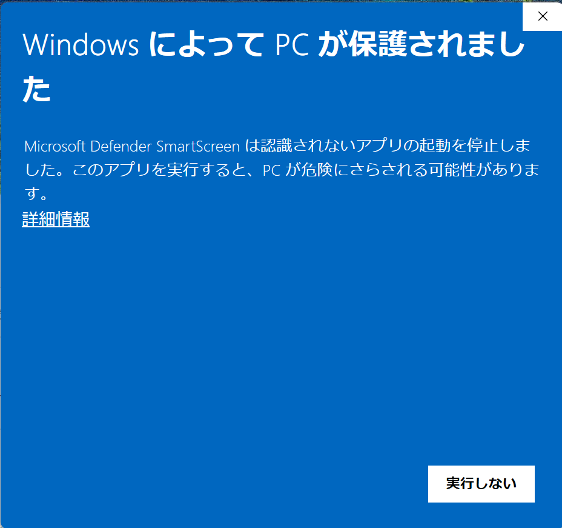
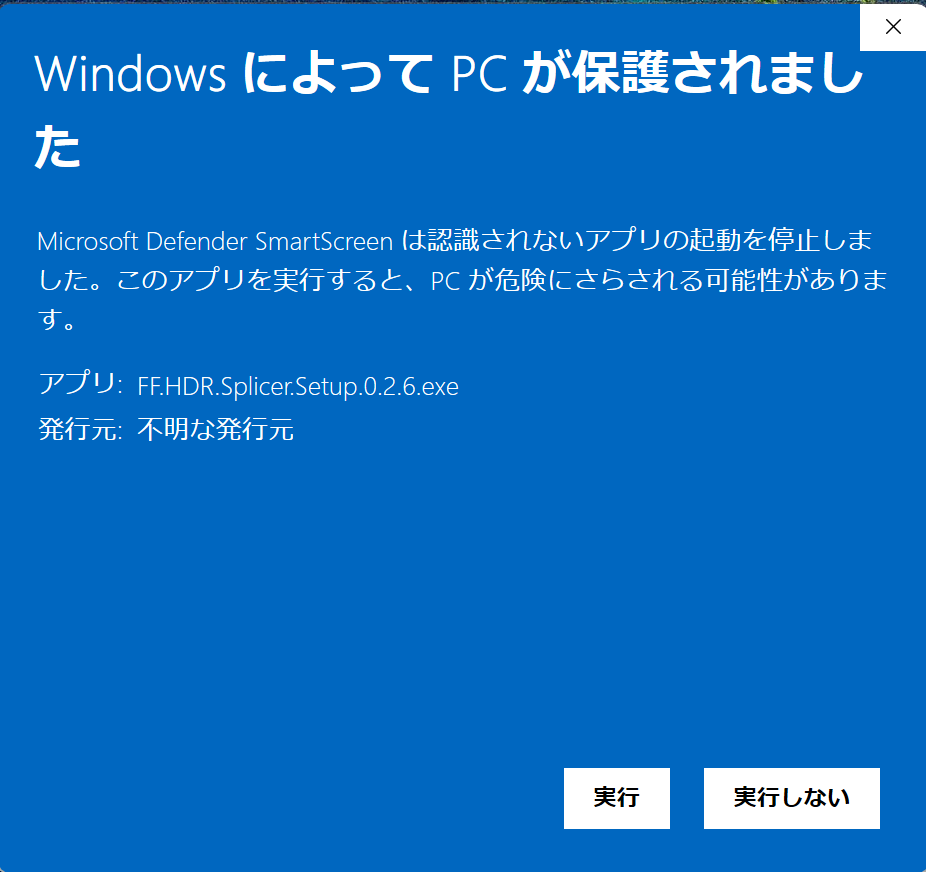
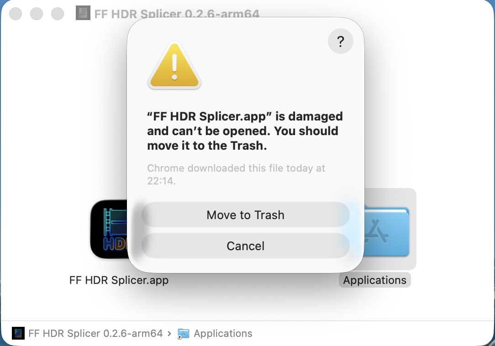

+++
title = "簡単な動画編集のデスクトップアプリを作ってみた"
description = "デスクトップアプリをダウンロードできる形にしてみたけど、署名周りが大変だった話"
date = "2026-01-23T09:00:00+0900"
# lastmod = "2026-01-23T09:00:00+0900"
draft = false
tags = ["NativeApp", "Electron", "Antigravity", "FFmpeg"]
+++

今回からプロダクトページもそれぞれ用意することにしました。
Hugo でカテゴリー相当のものを新たに追加して、作ったものはそちらにまとめていくことにします。（TOPから Products で見られます）

https://girigiribauer.com/products/ff-hdr-splicer/

（なんだかんだで URL が必要になることも多いですし、ちょうど良かったです）

使い方などの概要はそっちに書くとして、作ろうと思った経緯とか詰まったところとかをまとめておこうと思います。

## HDR動画を扱いたかったけど、いい感じの無料アプリがない

ちょっと不思議だったんですけど、以下の要望を満たす動画編集の無料アプリがなかったんですよ。

- HDR動画を扱える
- 動画全体に対してフェードイン・フェードアウトを適用する
- カットしてそれぞれの区画を繋げる
- カットしたそれぞれの区画をクロスフェードで繋げる

これくらいなら、自分の感覚では全然無料の範囲内で出来ていいと思ってたのですが、
いざ探してみると、これが全然なくて。

- HDR動画を扱える
- カットしてそれぞれの区画を繋げる

この2つを満たす動画編集の無料アプリまではあったんですよ。

調べてみると、どうやらHDR動画のフェード関連が難しいらしく、
フェードも含めたHDR動画編集の無料アプリはありませんでした。（自分調べ）

## FFmpeg ならHDR動画のフェードが扱える

で色々調べていくうちに、
FFmpeg をインストールして手元でコマンドを叩けばいけるらしいということが分かります。

```bash
ffmpeg -i input.mp4 \
  -vf "fade=t=in:st=0:d=1,fade=t=out:st=4:d=1" \
  -c:v libx265 -pix_fmt yuv420p10le \
  -c:a copy \
  output.mp4
```

- `fade=t=in:st=0:d=1` : 0 秒から 1 秒かけてフェードイン
- `fade=t=out:st=4:d=1` : 4 秒の位置から 1 秒かけてフェードアウト
- `-pix_fmt yuv420p10le` : HDR でよく使う 10bit 4:2:0 を維持

なるほど？

色空間に配慮さえすれば、HDR動画でもフェードをかけることは比較的簡単にできるみたいです。

とはいえ、実際に見ながらどこで切って何秒フェードをかけて、
みたいなのを脳内で予測してコマンドを打つのはけっこう無理があります。
というか無理。

だったら、動画処理は FFmpeg に基本やらせて、
動画のカットする位置とフェードさせる秒数だけ入力するような、
シンプルな自分用動画編集アプリがあったら嬉しいな、
と思い立ったのが正月三が日でした。

https://bsky.app/profile/girigiribauer.com/post/3mbispalsvk2r

## Agy ちゃん（Antigravity）に基本お任せで開発

他の人が使えるレベルのデスクトップアプリは作ったことがなかったので、
正直どこまでできるか分からなかったのですが、
通称 **Agy ちゃん（Antigravity）** と壁打ちしながら作ることで、
理解を深めつつ作ることができました。

- Electron or Tauri のどちらが良いか？
    - 今回は動画のプレビューがある
    - Tauri のように描画エンジンを内部に持たないものだと、OSごとの差異が大きそう
    - 今回は Electron のが良さそう
- Web （UI）の責務、 FFmpeg の責務を適切に分ける
    - Electron でのプロセス間通信（IPC）のやり方を、壁打ちしながら理解していく
- テストを一通り書いてガードレールを整備する
    - ちゃんと単一責務になるよう、適切に分ける
    - **常に自分が理解できる状態を保つ**

やはり重要なのは **理解** ですね。
自分で書こうが、AIに書いてもらおうが、理解なしではいずれ破綻します。

さて、細かなUIはやはり難しいみたいで、結局デザインだけは自前で Figma で用意して、
それをベースに再現をお願いするという形で実装していきました。


最低限、自分で操作するには問題ないUIになりました。

## どうやって作るか？とどうやって配布するか？は別の話

スマートフォンのネイティブアプリの時にも思ったのですが、
結局のところ Web で作ろうがネイティブで作ろうが、
作ったものを必要に応じて審査に通して配布する、といったフローは、
作る部分の話とは完全に別の話なので、一度経験するのは大事だなあと思いました。

今回もやってみて思ったのですが、思った以上にオープンソースで提供しているアプリに対して、
署名なしでの配布は厳しいです。

### Windows での配布

Electron だと、ビルド時に .exe 形式のインストーラーを作ってくれるようです。

ただ、 Microsoft のデジタル署名（EVコード署名証明書など）を取得していない場合、
「Windows によって PC が保護されました」というウィンドウが出て、
インストールの障害になります。





要するに、 **年間数万円程度のお布施をしていないと、インストールを邪魔するウィンドウが出ます。**

ただ、 Windows の場合はまだ優しくて、
『詳細情報』をクリックしてから『実行』をクリックすればインストールできます。

### macOS での配布

同様に Electron だと、ビルド時に .dmg 形式のインストーラーを作ってくれます。
ここまではいいんです。

Mac だと、 Apple Developer Program に登録して署名をしないと、
インストールの手前で Gatekeeper にブロックされて、
「ファイルが壊れているため開けません。ゴミ箱に入れる必要があります。」
と表示されるようになっています。

（英語なので `"FF HDR Splicer.app" is damaged and can't be opened. You should move it to the Trash.` と表示されていますが、内容は同じです）



要するに、 **年間1万数千円のお布施をしていないと、インストールができません。**

一応回避方法はコマンドラインで用意されていて、
ターミナルを立ち上げた後に

```bash
xattr -rc /Applications/path/to/MyApp.app
```

みたいな感じで拡張属性を剥ぎ取るコマンドを打ってやる必要があります。

一般ユーザー（個人開発用途のアカウント）にここまで求めるのはさすがに厳しい......。

#### Sentinel というもう1つの回避方法

コマンドを打つのと同等のことをアプリでやってくれるのが **Sentinel** というアプリです。

https://github.com/alienator88/Sentinel

壊れていると認識されてしまう .app を、このアプリ内に放り投げてやることで、
正しく起動する形にしてくれるメタアプリです。

いずれにしても、 Mac での配布は署名なしだとかなり厳しいです。

### 結局はお布施

Windows でも Mac でも、結局はお布施が必要なのです。

オープンソースでお金をかけずに配布する、というのは幻想でした。

なので、いつもだったら Web アプリにしてそのまま使えるようにするのですが、
今回は FFmpeg をローカルで動かす必要があって、
Web アプリで WebAssembly なアプローチも検討はしたんですが、
やはり厳しそうなので、このデスクトップアプリの選択肢が一番現実的でした。

ただ、配布には向いてませんね。世の中は厳しい......。

## まとめ

- Agyちゃん優秀
- デスクトップアプリをちゃんとやるならお布施は必須

ちなみに、なぜHDR動画が扱いたかったかの話は、たぶんまた別でブログを書くことになると思います。
